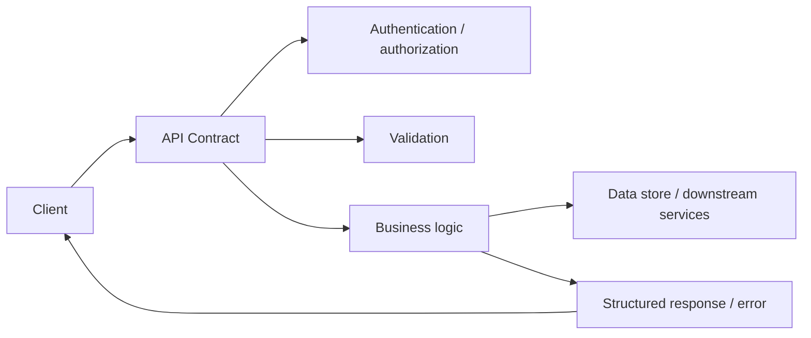
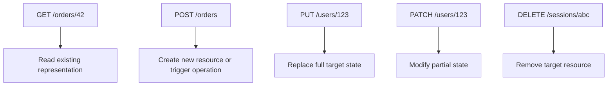
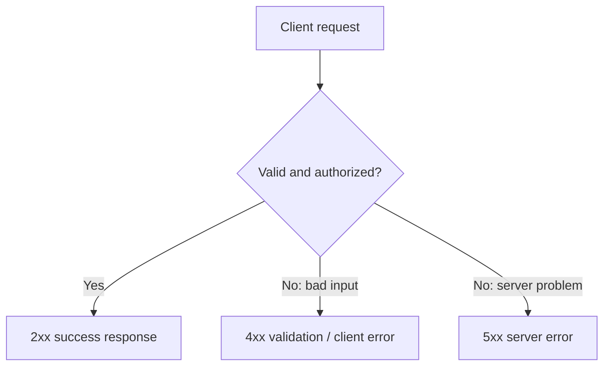
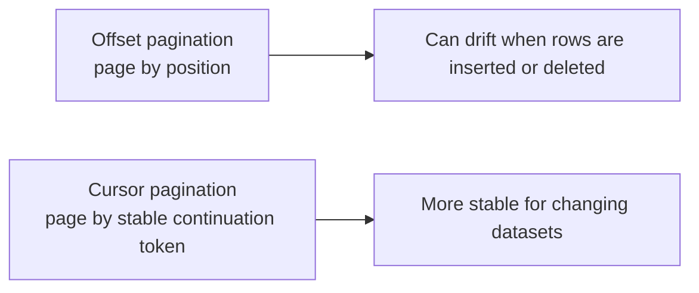

# API Design Basics

## 1. Overview

API design is the practice of defining how software systems expose capabilities and exchange data with clients or other services.

In a mature system, an API is not just a transport wrapper around business logic. It is the contract that defines:

- what operations are possible
- how resources are modeled
- what requests and responses look like
- what errors mean
- what compatibility promises exist over time

That is why API design matters far beyond syntax. A poor API creates friction in every client, leaks backend complexity, makes changes risky, and forces consumers to guess intent. A good API makes the system easier to understand, evolve, secure, and operate.

This page treats API design as a grouped foundation topic. The goal is to build practical intuition for:

- resource-oriented design
- HTTP method semantics
- request and response structure
- status codes and errors
- pagination and filtering
- idempotency and retries
- versioning and backward compatibility

## 2. Why API Design Matters

An API is often the most durable interface in the system.

Databases can be migrated. Internal code can be refactored. Infrastructure can be replaced. But once external clients depend on an API, changing it becomes expensive.

That makes API design a long-term architecture decision, not a short-term implementation detail.

A well-designed API helps with:

- client simplicity
- maintainability
- observability
- backward compatibility
- security boundaries
- scaling and performance decisions

A poorly designed API causes:

- brittle client behavior
- unclear semantics
- duplicated business logic across consumers
- hard-to-debug failures
- accidental breaking changes

## 3. Visual Model

The simplest useful mental model is a client interacting with resources through a stable contract, not directly with backend implementation details.



What to notice:

- the API sits between clients and backend internals
- it does more than forward requests; it validates, applies semantics, and shapes stable responses
- good API design protects clients from backend churn while still exposing useful system behavior

## 4. Resource-Oriented Design

Many APIs are easiest to reason about when modeled around resources rather than arbitrary verbs.

Examples:

- `/users`
- `/orders`
- `/payments`
- `/invoices`

This tends to produce cleaner interfaces because the API reflects domain entities instead of controller-style action names.

### Good Resource Design Usually Means

- nouns over RPC-like verb-heavy paths where possible
- stable identifiers
- clear ownership and relationships
- predictable URL structure

Examples:

- `GET /users/123`
- `POST /orders`
- `PATCH /orders/987`
- `DELETE /sessions/abc`

That does not mean every API must be rigidly REST-shaped, but resource thinking usually produces a cleaner model than exposing backend methods directly.

## 5. HTTP Method Semantics

HTTP methods are not just syntax choices. They communicate intent to clients, proxies, caches, and operators.

### GET

Used to retrieve data.

Properties:

- should not change server state in normal use
- naturally cacheable when responses allow it
- should be safe to repeat

### POST

Used to create resources or trigger operations that do not map cleanly to simple replacement semantics.

Properties:

- often used for creation
- often not naturally idempotent unless explicitly designed to be

### PUT

Used to replace a resource representation or define a full target state.

Properties:

- often naturally idempotent
- useful when the full desired state is known

### PATCH

Used for partial updates.

Properties:

- useful when only part of the resource changes
- semantics should be carefully defined because partial mutation can become ambiguous

### DELETE

Used to remove a resource.

Properties:

- often designed to be idempotent at the API level

## 6. Visual Model: Method Semantics



What to notice:

- the method should tell the reader what kind of state transition is intended
- method choice affects idempotency expectations, caching behavior, and client assumptions
- misuse of methods often creates ambiguous semantics even when the endpoint works

## 7. Request and Response Design

An API request should be explicit about:

- target resource
- operation intent
- authentication context
- validation constraints
- optional versus required fields

A response should be explicit about:

- whether the operation succeeded
- what state now exists
- what metadata matters
- what the client should do next if it failed

### Good Response Design Usually Includes

- clear status code
- structured body
- stable field names
- machine-readable error shape
- pagination metadata when relevant

Example response shape:

```json
{
  "id": "ord_987",
  "status": "confirmed",
  "amount": 1250,
  "currency": "INR"
}
```

The goal is not verbosity for its own sake. The goal is clarity and evolvability.

## 8. Status Codes and Error Design

Status codes are part of the contract. They should help clients distinguish:

- success
- client error
- authorization failure
- missing resource
- conflict
- retryable server failure

Common examples:

- `200 OK`
- `201 Created`
- `202 Accepted`
- `204 No Content`
- `400 Bad Request`
- `401 Unauthorized`
- `403 Forbidden`
- `404 Not Found`
- `409 Conflict`
- `422 Unprocessable Entity`
- `429 Too Many Requests`
- `500 Internal Server Error`
- `503 Service Unavailable`

### Error Responses Should Be Structured

Clients should not have to parse human prose to understand what failed.

A good error response often includes:

- stable error code
- human-readable message
- optional field-level details
- trace or correlation ID where appropriate

Example:

```json
{
  "error": {
    "code": "invalid_payment_method",
    "message": "The selected payment method cannot be used for this order",
    "trace_id": "trc_12345"
  }
}
```

## 9. Visual Model: Error and Success Paths



What to notice:

- the API should help clients distinguish their mistakes from server-side problems
- retries are sensible only for some failures
- clear error structure improves reliability, not just developer ergonomics

## 10. Pagination, Filtering, and Sorting

Large collections should not usually be returned in one unbounded response.

That creates:

- latency spikes
- unpredictable payload size
- memory pressure
- poor user experience

Common API features for collection endpoints:

- pagination
- filtering
- sorting
- field selection

### Pagination Styles

#### Offset Pagination

Example:

- `GET /orders?offset=100&limit=20`

Strengths:

- simple
- easy for small or stable datasets

Costs:

- unstable under concurrent inserts or deletes
- expensive at large offsets in some backends

#### Cursor Pagination

Example:

- `GET /orders?cursor=abc123&limit=20`

Strengths:

- better for large or changing datasets
- more stable under ongoing writes

Costs:

- more complex client and server logic

## 11. Visual Model: Pagination Styles



What to notice:

- offset pagination is easier to start with
- cursor pagination is often better for high-scale or write-heavy collections
- the right choice depends on dataset size and mutation rate

## 12. Idempotency and Retries

APIs must be designed for network uncertainty.

Clients may retry because:

- the response timed out
- the connection dropped
- a proxy retried automatically
- the user repeated the action

If create-style operations are not designed carefully, retries can duplicate side effects.

This is why API design intersects directly with idempotency.

Common approaches:

- natural idempotency through `PUT`-style replacement semantics
- explicit idempotency keys on `POST` operations
- unique request identifiers

If a retry can cause a second payment, second order, or second email, the API contract is incomplete.

## 13. Versioning and Compatibility

APIs change over time. The problem is not avoiding change. The problem is changing without breaking consumers.

### Common Versioning Approaches

- URI versioning such as `/v1/orders`
- header-based versioning
- media-type versioning

Versioning alone does not solve compatibility. Good API evolution also means:

- adding fields in backward-compatible ways
- avoiding unnecessary removals or semantic redefinitions
- making defaults explicit
- documenting deprecation clearly

### Compatibility Mindset

A durable API should assume:

- old clients will exist longer than expected
- some consumers will ignore new fields
- some clients will depend on behavior you did not intend unless the contract is explicit

## 14. Authentication, Authorization, and Safety Boundaries

APIs often sit at security boundaries, so design must also include:

- who is calling
- what they are allowed to do
- what data they are allowed to see

Good API design should make authorization decisions feel consistent and predictable.

Examples:

- resource ownership checks
- tenant isolation
- role-based permissions
- scoped tokens

Security concerns should not be bolted on after the endpoint shape is already fixed.

## 15. Real-World Examples

### Public REST APIs

Stripe, GitHub, and similar public APIs succeed partly because the contract is predictable even when the backend evolves.

Clear resource modeling, stable status codes, consistent pagination, and explicit idempotency behavior let external clients build with confidence instead of reverse-engineering every endpoint separately.

### Internal Platform APIs

Inside a company, teams often expose shared services for identity, billing, notifications, or catalog data.

If those APIs are inconsistent, every consuming team invents custom client behavior. Strong API design reduces that integration tax by making internal services behave like reliable platform products rather than ad hoc HTTP handlers.

### Mobile and Web Backend APIs

Consumer applications often depend on APIs over unreliable networks and across multiple client versions.

That makes backward compatibility, clear error semantics, and careful payload design operational concerns, not just style preferences. A well-designed API keeps old clients working while newer clients adopt richer behavior gradually.

## 16. Common Misconceptions

### "REST Means Good API Design"

Not necessarily.

A poorly modeled REST-like API can still be inconsistent, confusing, and hard to evolve.

### "POST Is Fine for Everything"

It works mechanically, but it destroys semantic clarity if every operation is modeled as an opaque action.

### "Clients Can Just Parse Error Strings"

That is brittle.

Errors need machine-readable structure.

### "Versioning Solves Backward Compatibility"

Not by itself.

Compatibility depends on careful change discipline, not just adding `/v2`.

### "The API Should Mirror the Database"

Usually not.

The API should model consumer-friendly behavior, not leak internal storage shape directly.

## 17. Design Guidance

Design APIs around stable domain concepts and client workflows, not around controllers or storage tables.

Questions worth asking:

- what resource or operation is the client really trying to work with
- what method best expresses the state transition
- what fields are required, optional, or computed
- what errors does the client need to distinguish
- how will this endpoint evolve over time
- what retry behavior is safe
- how should large collections be paginated
- where do authentication and authorization decisions apply

Useful patterns:

- prefer predictable resource structure
- use status codes deliberately
- make errors structured and machine-readable
- design create operations with idempotency in mind
- choose pagination style based on dataset behavior
- evolve APIs conservatively

The best API is the one that makes correct client behavior easy and ambiguous client behavior hard.

## 18. Summary

API design basics are really about contract quality.

A good API is clear in its resource model, honest in its HTTP semantics, structured in its errors, safe under retries, and careful about long-term compatibility.

That is the core tradeoff:

- a quick API can expose functionality fast
- a well-designed API reduces long-term complexity across every client and every future change

Strong systems are easier to use and evolve when their APIs are treated as durable product surfaces, not just request handlers.
