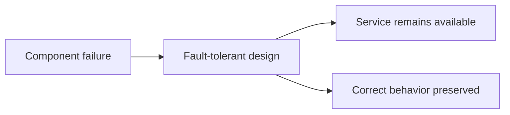
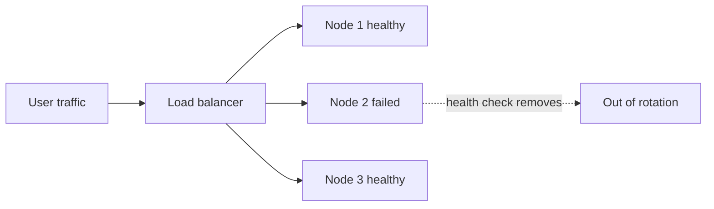

# Availability and Fault Tolerance Basics

## 1. Overview

Availability and fault tolerance are closely related, but they are not the same.

Availability asks:

> Can the system continue serving useful requests?

Fault tolerance asks:

> Can the system keep functioning correctly even when components fail?

These concepts sit at the core of system design because failures are not exceptional in real systems. Machines fail. networks partition. disks corrupt. processes crash. dependencies time out. The system has to be designed around that reality rather than around ideal operation.

## 2. Why This Matters

Many systems work well in happy-path testing but fail badly in production because failure was treated as an edge case.

A system without availability thinking may:

- go fully down when one instance crashes
- overload healthy instances during partial failure
- recover slowly after deployment or dependency issues

A system without fault-tolerance thinking may:

- return incorrect state after failover
- lose recent writes
- create duplicate or conflicting side effects

This is why resilient systems must reason about both continuity and correctness under failure.

## 3. Visual Model

What to notice:

- surviving failure is not just staying up
- the system must remain both reachable and behaviorally safe enough for its purpose

## 4. Availability

Availability is the ability of the system to respond to requests successfully over time.

Operationally, teams often talk about uptime targets such as:

- `99.9%`
- `99.99%`

But useful availability thinking is not just about annual percentages. It also includes:

- how the system behaves during partial outages
- what fraction of requests still succeed
- whether degraded behavior is acceptable

### High Availability Usually Requires

- redundancy
- health detection
- failover
- overload protection
- maintenance without full downtime

## 5. Fault Tolerance

Fault tolerance is the ability of a system to continue functioning despite component failures.

That may include:

- another instance taking over
- retries hiding transient failures
- replicas preserving data durability
- queues absorbing downstream disruption

Fault tolerance is not free. It usually requires:

- extra capacity
- more coordination
- more complexity
- careful failure semantics

## 6. Visual Model: Redundancy and Failover

What to notice:

- availability improves when failure in one node does not remove the whole service
- redundancy alone is not enough; the system also needs detection and traffic shifting

## 7. Common Building Blocks

### Redundancy

More than one instance, node, or copy exists so a single failure does not end service.

### Failover

Traffic or responsibility is moved away from a failed component to a healthy one.

### Replication

Data copies help preserve availability and durability, but replication only helps if consistency and failover rules are safe.

### Health Checks

The system needs a way to decide whether a component should still receive traffic or remain authoritative.

### Graceful Degradation

Some features may be reduced or disabled so the core service remains usable.

Example:

- recommendations unavailable, checkout still works

## 8. Failure Types

Not all failures are the same.

### Crash Failure

A node stops responding.

### Slow Failure

A node is technically alive but too slow to serve usefully.

This is often more dangerous than a clean crash because it creates tail latency and retry amplification.

### Partial Failure

Some components can talk while others cannot.

This is normal in distributed systems.

### Data Failure

The service is reachable, but the data may be stale, lost, or inconsistent.

This is why availability alone is not enough.

## 9. Supporting Mechanisms and Related Ideas

### 9.1 Load Balancing

Availability depends heavily on whether traffic is routed away from unhealthy instances.

### 9.2 Replication

Fault tolerance for stateful systems usually depends on replication, but replication introduces consistency tradeoffs.

### 9.3 Retries and Timeouts

Retries can hide transient faults, but they can also amplify overload if used carelessly.

### 9.4 Circuit Breakers and Load Shedding

These mechanisms stop one failing dependency from destabilizing the whole system.

### 9.5 Disaster Recovery

Fault tolerance at one scope is not the same as disaster recovery.

Local redundancy does not automatically protect against region-wide or operational disasters.

## 10. Real-World Examples

### Multi-AZ Service Deployment

A service deployed across multiple availability zones improves resilience against a single zone failure.

This is a practical combination of availability and fault tolerance: the service remains reachable because traffic can shift away from the failed zone instead of waiting for full recovery in place.

### Database Replicas for Failover

Primary-replica database setups often use replicas not just for reads but also for continuity during failure.

The important detail is that failover improves availability only if promotion, routing, and recovery behavior are well understood. Redundant nodes alone do not guarantee a resilient system.

### CDN and Edge Caching

Serving static assets through a CDN can keep content available even when the origin is degraded.

That is a useful reminder that availability is not only about the primary system being healthy. Sometimes availability improves because the system avoids dependence on the primary path for every request.

## 11. Common Misconceptions

### "High Availability Means Nothing Ever Fails"

Wrong.

It means the system continues serving despite failures, not that failures disappear.

### "Redundancy Automatically Gives Fault Tolerance"

Wrong.

Redundancy without safe failover, health checks, and correct coordination can still fail badly.

### "If the Service Responds, It Is Available"

Not necessarily in any useful sense.

Returning incorrect, stale, or broken behavior may satisfy a superficial liveness check while failing the actual product promise.

### "Fault Tolerance Is Only About Infrastructure"

Wrong.

Application logic, idempotency, retries, and data semantics all matter.

### "More Replicas Always Mean Safer Operation"

Only if the system knows how to manage them correctly.

## 12. Design Guidance

Start by asking what kinds of failure the system must survive and what behavior is acceptable during those failures.

Questions worth asking:

- what happens if one instance dies
- what happens if a dependency becomes slow
- what happens if one zone is unreachable
- what data can be stale and what cannot
- what should degrade first
- how quickly should the system recover
- what blast radius is acceptable

Useful patterns:

- eliminate single points of failure where they matter
- prefer graceful degradation over total failure when possible
- design for slow failure, not just crash failure
- pair redundancy with good traffic management
- validate failover behavior, not just failover existence

A resilient system is not the one with the most redundancy. It is the one whose failure behavior has been designed deliberately.

## 13. Summary

Availability and fault tolerance are foundational because real systems operate under constant partial failure.

Availability is about continuing to serve. Fault tolerance is about continuing to function despite faults. Both depend on redundancy, routing, detection, and safe recovery behavior.

That is the core tradeoff:

- better resilience usually requires more redundancy and coordination
- more redundancy and coordination increase system complexity

Strong systems treat failure as a design input, not a surprise.
