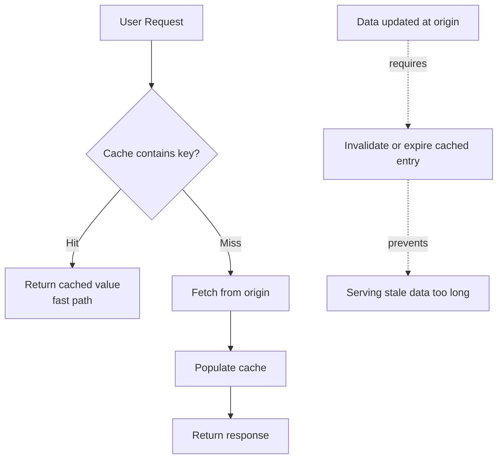
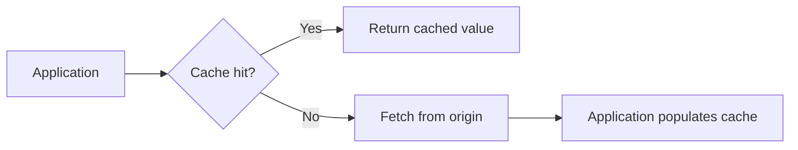
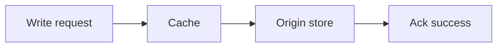
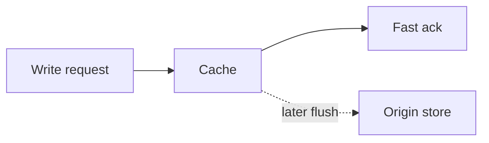

# Caching

## 1. Overview

Caching is the practice of storing data closer to where it is needed so future requests can be served faster and more cheaply.

It is one of the most effective techniques in system design because it can improve latency, reduce load, lower cost, and absorb traffic spikes without changing the fundamental source of truth. A well-placed cache can make a slow system feel fast. A poorly designed cache can make a correct system behave unpredictably.

Caching is powerful precisely because it avoids work:

- avoid repeated database queries
- avoid repeated computation
- avoid repeated network calls
- avoid repeated rendering or object construction

But every cache creates a second copy of data, which means freshness becomes a design decision rather than an automatic property.

## Visual Model

A cache is easiest to reason about as a conditional fast path in front of a slower origin.

This picture captures the two core benefits and one core risk:

- hits avoid repeated expensive work
- misses still depend on the origin and can amplify load if they cluster
- freshness depends on the invalidation or expiry path, not just the read path

## 2. The Core Problem

Most systems have a mismatch between how often data is requested and how expensive it is to produce.

Examples:

- a product page is read thousands of times per minute but updated infrequently
- a recommendation is expensive to compute but cheap to reuse for a short time
- a user profile is fetched repeatedly across many requests
- a database query is correct but too slow to execute on every request

Without caching, the origin system must do the same work again and again.

That causes:

- higher latency
- higher infrastructure cost
- more pressure on databases and downstream services
- lower resilience during spikes

Caching exists to convert repeated expensive work into infrequent expensive work plus many cheap reads.

## 3. Formal Statement

A cache is a storage layer that keeps a temporary copy of data or computation results so future requests can be served more efficiently.

A caching design has to define:

- what is cached
- where it is cached
- how entries are identified
- when entries expire
- how stale data is handled
- how cache population and invalidation work

Caching does not create new truth. It creates a performance-optimized copy of existing truth or derived output.

The value of caching depends on hit rate, access locality, eviction policy, freshness requirements, and failure behavior.

## 4. Key Terms

### 4.1 Cache Hit

A cache hit happens when the requested data is found in the cache and can be served directly.

Hits are the reason caches exist.

### 4.2 Cache Miss

A cache miss happens when the requested data is not present in the cache.

On a miss, the system usually fetches from the origin and may populate the cache for future use.

### 4.3 TTL

TTL stands for time to live.

It defines how long a cached item remains valid before it expires automatically.

TTL is one of the simplest freshness controls in caching systems.

### 4.4 Eviction

Eviction is the removal of items from the cache when space is needed or policies require cleanup.

Common eviction policies include:

- LRU
- LFU
- FIFO
- size-based or cost-based eviction

### 4.5 Invalidation

Invalidation is the process of marking cached data as no longer safe to serve.

This is often harder than storing the data in the first place.

### 4.6 Warm Cache vs Cold Cache

A warm cache already contains useful frequently accessed entries.

A cold cache starts mostly empty and has to build value over time.

Cold starts matter because cache effectiveness is often worst when load is highest, such as after restart or deploy.

### 4.7 Cache Stampede

A cache stampede happens when many requests miss the same key at the same time and all fall back to the origin.

This can overload the backend precisely when the cache is supposed to protect it.

### 4.8 Stale Data

Stale data is cached data that no longer matches the current source of truth.

Not all systems treat staleness as a bug. In many systems, bounded staleness is a deliberate tradeoff for performance and availability.

## 5. What It Really Means

Caching is not just a speed trick. It is a contract about what work the system is allowed to skip and how fresh the answer must be when it does.

When a cache works well:

- latency drops sharply
- backend load becomes manageable
- burst traffic becomes survivable
- user experience becomes more stable

When a cache is poorly designed:

- stale data leaks into user workflows
- invalidation bugs become correctness bugs
- hot keys overwhelm a single cache node
- cache misses create cascading failures on the origin

Caching is therefore a tradeoff between freshness and efficiency, mediated by application semantics.

The real question is not "Should there be a cache?" It is:

- what data can safely be reused
- for how long
- under which failure conditions

## 6. Why the Constraint Exists

Consider a product details API backed by a relational database.

1. A popular product receives thousands of reads per second.
2. The underlying row changes only a few times per hour.
3. Every request still hits the database.
4. Database latency rises and CPU usage spikes.

The system adds a cache in front of the database:

- future reads for that product are served from memory
- database load drops dramatically
- latency improves

But a new problem appears:

1. The product price changes.
2. The cache still holds the old value.
3. Some users see stale data until the cache entry expires or is invalidated.

This is the central caching tradeoff: caching saves work by reusing old answers, which means the system must define when an old answer is still acceptable.

## 7. Main Variants or Modes

### 7.1 Read-Through Cache

In a read-through cache, the application reads from the cache, and the cache fetches from the origin on a miss.

What to notice:

- the application talks to one interface
- cache miss behavior is hidden behind the cache layer

Strengths:

- simple application code
- centralized caching behavior
- good fit when the cache layer can talk to the backing store directly

Costs:

- cache layer becomes more coupled to the data source
- miss handling logic sits inside the cache path

### 7.2 Cache-Aside

In cache-aside, the application checks the cache first and, on a miss, fetches from the origin and populates the cache.

What to notice:

- the application owns both the miss path and the cache population path
- this is flexible, but correctness depends on disciplined application logic

Strengths:

- flexible
- common and easy to adopt
- application has explicit control

Costs:

- more application logic
- easier to get population and invalidation wrong

### 7.3 Write-Through Cache

In write-through caching, writes go to the cache and the cache synchronously updates the backing store.

What to notice:

- the cache remains aligned with writes
- the cache is now part of the write path and its latency matters

Strengths:

- cache stays warm for written data
- cache and store remain aligned more closely

Costs:

- write latency may increase
- cache becomes part of the critical write path

### 7.4 Write-Back / Write-Behind Cache

In write-back caching, writes go to the cache first and are persisted to the backing store later.

What to notice:

- the write path is fast because persistence is deferred
- durability now depends on what happens before the flush completes

Strengths:

- very fast write path
- can absorb bursts efficiently

Costs:

- risk of data loss if the cache fails before persistence
- much more complicated durability semantics

This pattern is powerful but should be used carefully.

### 7.5 Local Cache

A local cache lives inside the application process.

Strengths:

- extremely fast
- no network hop
- good for small hot datasets

Costs:

- each instance has its own copy
- invalidation across instances is hard
- memory usage grows with fleet size

### 7.6 Distributed Cache

A distributed cache is a separate shared caching layer such as Redis or Memcached.

Strengths:

- shared across application instances
- easier centralized capacity management
- supports larger working sets

Costs:

- extra network hop
- separate system to operate
- hot keys can still create uneven pressure

### 7.7 CDN / Edge Cache

An edge cache stores content near end users.

Strengths:

- excellent latency reduction
- offloads origin traffic globally
- especially useful for static assets and cacheable API responses

Costs:

- invalidation can take time
- cache keys and headers have to be managed carefully

## 8. Supporting Mechanisms and Related Ideas

### 8.1 Eviction Policies

When the cache is full, something must be removed.

Common policies:

- LRU: remove least recently used
- LFU: remove least frequently used
- FIFO: remove oldest inserted

The right choice depends on workload locality and object cost.

### 8.2 Cache Invalidation

Invalidation strategies include:

- TTL expiry
- explicit delete on write
- versioned keys
- event-driven invalidation

Invalidation is one of the hardest parts of caching because it connects performance policy to correctness policy.

### 8.3 Negative Caching

Negative caching stores failures or "not found" results for a short time.

This is useful when repeated misses are expensive, but the TTL must be chosen carefully to avoid hiding newly created data for too long.

### 8.4 Stampede Protection

Systems commonly use:

- request coalescing
- per-key locking
- soft TTLs
- stale-while-revalidate

These techniques prevent many requests from hammering the origin simultaneously.

### 8.5 Consistency and Freshness

Caching interacts directly with consistency models.

Questions that matter:

- should a user see their own write immediately
- can two users observe different values
- is stale data acceptable for a few seconds

Caching is often where theoretical consistency tradeoffs become product-visible behavior.

## 9. Real-World Examples

### 9.1 Product Catalog Cache

An e-commerce product catalog is read far more often than it changes.

Why caching works:

- read volume is high
- updates are comparatively infrequent
- small staleness windows are often acceptable

Tradeoff:

- price or stock updates must be invalidated carefully

### 9.2 Session Cache

Applications often cache session state or token metadata.

Why caching works:

- the same data is read repeatedly
- fast access is important on every request

Tradeoff:

- session revocation and expiry become correctness-sensitive invalidation problems

### 9.3 CDN for Media and Static Assets

Static assets are ideal for edge caching.

Why caching works:

- content is reused heavily
- global distribution matters
- origin offload is substantial

Tradeoff:

- content versioning and purge semantics must be handled well

### 9.4 Derived Computation Cache

A recommendation service may cache computed results for a short TTL.

Why caching works:

- computation is expensive
- slight staleness is acceptable

Tradeoff:

- cache keys and invalidation policy must reflect the inputs accurately

## 10. Common Misconceptions

### 10.1 "Caching Only Improves Performance"

Caching improves performance, but it also changes correctness behavior by introducing stale copies.

It is both a performance feature and a data freshness policy.

### 10.2 "Just Add a TTL"

TTL helps, but it is not a full design.

It does not solve:

- stampedes
- hot keys
- read-your-writes expectations
- invalidation after important updates

### 10.3 "A High Hit Rate Means the Cache Design Is Good"

Not always.

A cache can have a high hit rate and still cause serious problems if the wrong data is stale or if hot keys overload specific nodes.

### 10.4 "Local Cache Is Always Better Because It Is Faster"

Local caches are faster, but they are harder to keep consistent across many instances.

Shared caches often trade some latency for better operational control.

### 10.5 "Cache Misses Are Harmless"

Misses are safe only if the origin can absorb them.

Under load, misses can trigger cascading failures, especially when many requests miss together.

## 11. Design Guidance

Start caching from access patterns, not from instinct.

Questions worth asking:

- what data is read repeatedly
- how expensive is it to regenerate
- how stale can it safely be
- what is the expected hit rate
- what invalidates the data
- what happens during a cold start
- what happens if the cache disappears entirely

Prefer local caches when:

- data is very hot and small
- per-instance reuse is high
- cross-instance consistency is not critical

Prefer distributed caches when:

- many instances need shared reuse
- the working set is larger
- centralized invalidation is useful

Prefer edge caches when:

- content is globally distributed
- the same response is reused across many users

Useful patterns:

- cache immutable or versioned data aggressively
- use explicit invalidation for correctness-sensitive objects
- protect the origin from stampedes
- design for cache loss rather than assuming the cache is always warm

The right cache strategy is the one that accelerates the system without quietly becoming a second unreliable source of truth.

## 12. Reusable Takeaways

- Caching stores reusable data closer to where it is needed.
- Every cache trades freshness for speed and load reduction.
- The hardest part of caching is invalidation and stale-data policy.
- High hit rate is useful, but correctness and failure behavior matter just as much.
- Local, distributed, and edge caches solve different performance problems.
- Cache stampedes and hot keys are normal operational concerns.
- A cache should make the origin safer, not turn it into a hidden failure dependency.

## 13. Summary

Caching is one of the most effective ways to improve latency and scalability because it avoids repeating expensive work.

Its power comes from reuse, and its risk comes from reuse as well. The moment the system serves an older answer on purpose, it needs clear rules about freshness, invalidation, and fallback behavior.

That is the essential tradeoff:

- caching saves work
- caching also creates stale copies

A strong caching design makes that tradeoff explicit and keeps the system fast without making it unpredictable.
