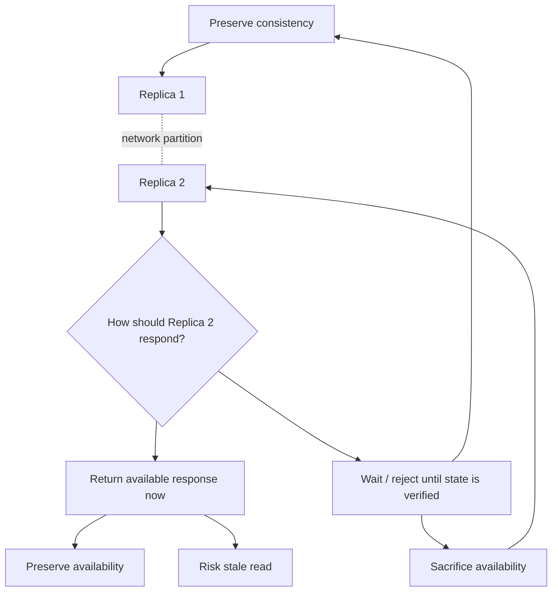
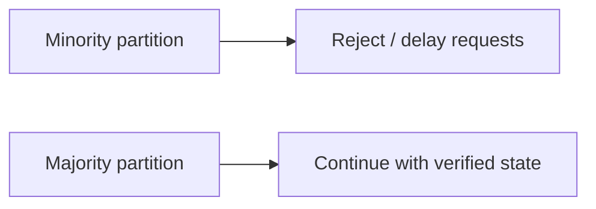
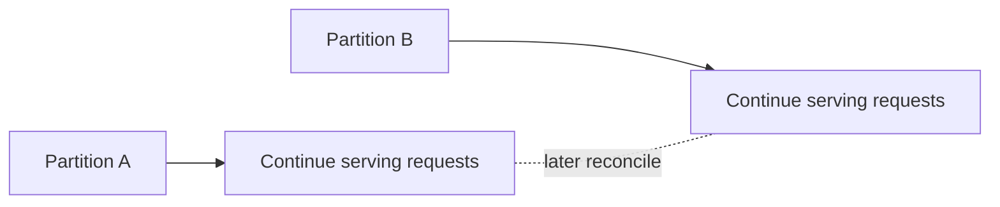

# CAP Theorem

## 1. Overview

CAP theorem explains a fundamental constraint in distributed systems: when a network partition happens, a system cannot guarantee both strong consistency and availability for all requests.

This idea is widely referenced because it forces an important design decision:

> When replicas cannot reliably communicate, should the system preserve correctness or preserve responsiveness?

That is the real value of CAP. It is not a slogan about choosing any two letters. It is a model for reasoning about failure behavior in distributed systems.

## Visual Model

The simplest way to understand CAP is to visualize a partition splitting replicas while clients continue sending requests.

During the partition:

- the system is forced into an explicit decision, not an abstract theorem
- one branch preserves responsiveness at the cost of freshness
- the other preserves correctness at the cost of answering every request

## 2. The Core Problem

A distributed system runs across multiple machines connected by a network. That network can:

- delay messages
- drop messages
- reorder messages
- duplicate messages
- temporarily isolate one group of nodes from another

Once data is replicated across nodes, the system has to decide what to do when communication breaks down. If one replica accepts a write and another replica cannot verify whether that write happened, the system cannot simultaneously guarantee that every response is both correct and immediately available.

This is the setting where CAP applies.

## 3. Formal Statement

In the presence of a network partition, a distributed data system must choose between:

- **Consistency (C)**: Every read returns the most recent write or an error.
- **Availability (A)**: Every request to a non-failing node receives a non-error response.
- **Partition Tolerance (P)**: The system continues operating despite communication failures between parts of the system.

The important phrase is **in the presence of a network partition**.

Without a partition, many systems can provide both strong consistency and high availability. CAP becomes relevant when the network stops behaving like a reliable link between replicas.

## 4. Key Terms

### 4.1 Consistency

Consistency in CAP specifically refers to **linearizability**.

That means:

- once a write is acknowledged, every later read must return that write or a newer value
- all clients observe operations as if they happened in a single global order

Example:

1. Client A writes `x = 10`.
2. The system acknowledges the write.
3. Client B reads `x`.

If the system is CAP-consistent, Client B must see `10` or something newer. If it sees `9`, the system is not consistent in the CAP sense.

This is narrower than the general use of the word "consistency" in database discussions, where it may refer to constraints, invariants, or valid state transitions.

### 4.2 Availability

Availability in CAP means every request sent to a healthy node gets a response.

Important details:

- the response cannot be an indefinite wait
- the response cannot be a refusal caused by the system being unable to safely decide
- the response may still be stale

That last point matters. A system can be available and still return out-of-date data.

This is also different from the operational use of the term "availability," where teams often mean uptime targets such as `99.9%` or `99.99%`.

### 4.3 Partition Tolerance

A partition happens when some nodes cannot communicate with others, even though the nodes themselves may still be running.

Examples:

- one availability zone loses connectivity to another
- a rack is isolated because of a switch failure
- packet loss is high enough that quorum messages no longer arrive in time
- an inter-region link becomes unavailable

In practice, if a system is distributed across multiple machines, partitions are not optional. They are a fact of operating over a network.

## 5. What CAP Really Means

The common shorthand "pick two out of three" is not precise enough.

What CAP actually means is:

- if no partition exists, a system may provide both consistency and availability
- once a partition occurs, the system must sacrifice one of them for at least some requests

That is why the practical tradeoff is usually:

- **CP**: preserve consistency, sacrifice availability during partitions
- **AP**: preserve availability, sacrifice strong consistency during partitions

Partition tolerance is not usually something a distributed system chooses to avoid. If the system spans machines, it must be designed with partitions in mind.

## 6. Why Both Cannot Be Guaranteed During a Partition

Consider two replicas, `R1` and `R2`, both storing the same key.

- a network partition isolates `R1` from `R2`
- Client A sends a write to `R1`: `balance = 100`
- Client B sends a read to `R2`

At that point, `R2` has two options:

1. Return a response immediately.
2. Refuse or delay the response until it can confirm the latest value.

If `R2` responds immediately, it may return stale data. That preserves availability but breaks consistency.

If `R2` refuses to answer until it can coordinate with `R1`, it preserves consistency but sacrifices availability.

This is the central tradeoff CAP describes.

## 7. System Behavior Under CAP

### 7.1 CP Systems

A CP system prefers consistency over availability during a partition.

What to notice:

- only the partition that can still prove authority continues normally
- the other side gives up availability to avoid serving unsafe answers

Typical behavior:

- reads or writes may fail if the node cannot prove it has the latest state
- the system often relies on a leader or quorum
- minority partitions stop serving some operations

Representative examples:

- ZooKeeper
- etcd
- HBase metadata coordination
- relational databases configured with strict synchronous replication behavior

When this model is useful:

- stale reads are unacceptable
- conflicting writes are unacceptable
- the data controls money, identity, coordination, scheduling, or security

Typical use cases:

- leader election
- distributed locks
- metadata stores
- payment ledgers
- inventory systems where overselling must be prevented

### 7.2 AP Systems

A system that prioritizes availability over strong consistency during a partition continues serving requests even when replicas cannot coordinate.

What to notice:

- both sides keep responding during the split
- the cost is divergence that must be repaired or merged later

Typical behavior:

- every reachable replica continues accepting reads or writes
- replicas may temporarily diverge
- conflicts are resolved later using timestamps, merge rules, version vectors, or application logic

Representative examples:

- Cassandra with appropriate consistency settings
- Dynamo-style key-value stores
- Riak
- DNS

When this model is useful:

- the system must keep accepting traffic despite network splits
- temporary inconsistency is acceptable
- business value depends more on responsiveness than immediate global agreement

Typical use cases:

- shopping carts
- social feeds
- event collection
- metrics ingestion
- user preference updates where merge or overwrite behavior is acceptable

### 7.3 What About CA

True CA is mostly meaningful only when partitions are not part of the model, such as:

- a single-node system
- a simplified discussion that ignores network failure
- a system that behaves well only while communication remains healthy

A replicated distributed system cannot realistically guarantee both consistency and availability under partition.

## 8. Supporting Mechanisms and Related Ideas

### 8.1 Quorums

Many distributed databases use quorum reads and writes.

Let:

- `N` = total number of replicas
- `W` = number of replicas that must acknowledge a write
- `R` = number of replicas that must participate in a read

If `R + W > N`, reads and writes overlap, which helps preserve strong consistency for successful operations.

Example:

- `N = 3`
- `W = 2`
- `R = 2`

Every successful read intersects with every successful write at at least one replica.

But quorum does not remove the CAP tradeoff. During a partition:

- if only one replica is reachable, `W = 2` cannot be satisfied
- the system must either reject the operation or relax the rule and risk stale or conflicting state

Quorums help define behavior. They do not eliminate the underlying constraint.

### 8.2 Replication Lag

Replication lag is not identical to a network partition, but it often creates similar user-visible behavior.

Example:

- a primary accepts a write
- a replica has not applied it yet
- a client reads from the replica and sees stale data

This creates practical design questions:

- should reads be served from replicas if they may lag
- should reads be routed to a leader
- should a read block until the replica catches up

CAP is specifically about partitions, but real systems often face equivalent tradeoffs because of delay, lag, and timing uncertainty.

### 8.3 PACELC

CAP explains what happens during partitions, but it does not describe normal-state tradeoffs.

PACELC extends the model:

- **If there is a Partition (P)**, choose **Availability (A)** or **Consistency (C)**
- **Else (E)**, choose between **Latency (L)** and **Consistency (C)**

This is useful because most systems spend most of their time outside hard partitions. In day-to-day operation, many systems are deciding between:

- lower latency from local or asynchronous replicas
- stronger consistency from coordinated reads and writes

PACELC is often a more useful lens for practical architecture work.

## 9. Real-World Examples

### 9.1 Banking Ledger

A banking ledger usually needs CP behavior.

Reason:

- stale balances can enable double spending
- conflicting debits are unacceptable
- it is better to reject or delay a request than to commit incorrect financial state

Design implication:

- use leader-based or quorum-based coordination
- reject writes when quorum is unavailable
- prioritize correctness, auditability, and reconciliation discipline

### 9.2 Shopping Cart

A shopping cart can often tolerate AP behavior.

Reason:

- temporary disagreement between replicas is usually survivable
- losing write availability during traffic spikes can be more damaging than temporary inconsistency

Design implication:

- allow writes in multiple partitions
- merge state later
- use conflict resolution that preserves user intent, such as item-set union

### 9.3 Coordination Systems

Systems like ZooKeeper and etcd are designed with CP behavior because they support:

- leader election
- locks
- membership
- configuration coordination

If coordination data becomes inconsistent, the wider platform can corrupt itself through split-brain behavior.

### 9.4 DNS

DNS is an AP-leaning system.

- responses may be stale because of caching and propagation delay
- the system remains broadly available

That is an appropriate tradeoff for name resolution on the internet.

## 10. Common Misconceptions

### 10.1 "Pick Any Two"

This is the most common oversimplification.

More accurate statement:

- in the absence of partitions, a system can often provide both consistency and availability
- during a partition, it must trade one off

### 10.2 "Partition Tolerance Is Optional"

Once a system is distributed across machines, partition tolerance is part of the operating reality. The only real choice is how the system behaves when the network becomes unreliable.

### 10.3 "Eventual Consistency Means No Consistency"

Eventual consistency is still a consistency model.

It means:

- if updates stop, replicas eventually converge
- before convergence, clients may observe stale or conflicting data

This is weaker than linearizability, but it is not the absence of rules.

### 10.4 "Availability Means Zero Downtime"

CAP availability is about per-request behavior during failure conditions. It is not the same thing as an uptime SLA or a broad reliability statement.

## 11. Design Guidance

CAP becomes useful when it shapes system boundaries and failure policies.

Questions worth asking:

- what data absolutely cannot be stale
- which operations must never be acknowledged twice or out of order
- which failure mode is safer: stale reads, rejected writes, delayed responses, or later reconciliation
- can the business tolerate divergence that is repaired later
- what is the blast radius if inconsistent data is served

A single product often needs different answers for different subsystems:

- payments ledger: CP
- product catalog: AP or tunable
- user session cache: AP
- feature flag control plane: CP
- analytics pipeline: AP

The useful design pattern is not to force one global answer, but to choose guarantees that match the failure tolerance of each domain.

## 12. Reusable Takeaways

- CAP is a theorem about tradeoffs during network partitions.
- The real practical choice is usually CP versus AP.
- Strong consistency is expensive because it requires coordination.
- High availability during partitions usually means accepting stale or conflicting state temporarily.
- The right model depends on the business impact of being wrong versus being unavailable.

## 13. Summary

CAP theorem matters because distributed systems cannot always be correct, responsive, and partition-resilient at the same time.

When the network becomes unreliable, the system has to reveal its priorities:

- preserve correctness and reject some requests
- preserve responsiveness and reconcile later

Understanding that tradeoff is the starting point for designing reliable distributed systems.
