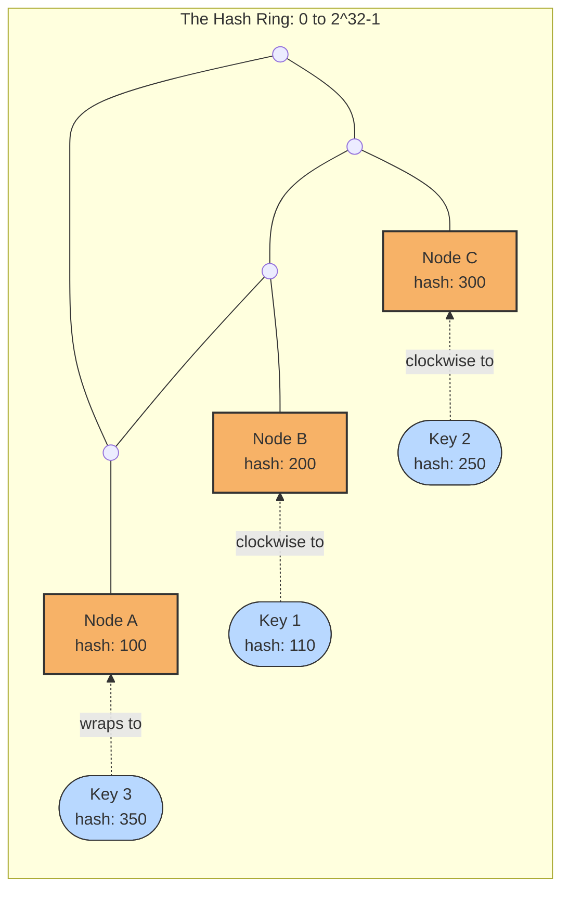
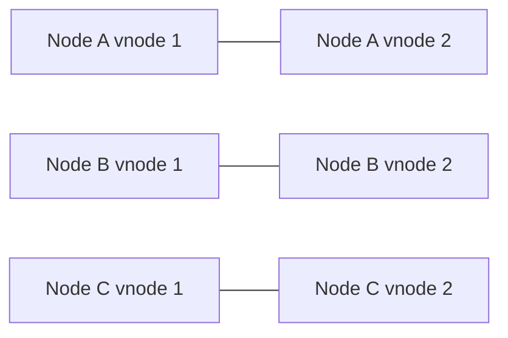

# Consistent Hashing

## 1. Overview

Consistent hashing is a distribution technique used to map keys to nodes in a way that minimizes remapping when nodes are added or removed.

This matters because many distributed systems need to answer a routing question repeatedly:

> Given a key, which node should own or serve it?

That question shows up in caches, sharded databases, distributed key-value stores, and service routing layers. A naive hashing strategy can distribute keys evenly when the node set is stable, but it often behaves badly when the cluster changes. Consistent hashing exists to make distribution resilient to membership changes.

Its value is not just mathematical neatness. It is operational stability. When capacity changes, a system using consistent hashing can move only a fraction of keys instead of forcing a full reshuffle.

## Visual Model

The hash ring mental model is the easiest way to understand consistent hashing.

In the diagram below:

- nodes are placed on a logical ring
- keys are also hashed onto the same ring
- each key belongs to the first node encountered while moving clockwise

You can read the ring clockwise:

- `Key 1` lands after `Node A`, so it moves clockwise to `Node B`
- `Key 2` lands after `Node B`, so it moves clockwise to `Node C`
- `Key 3` lands after `Node C`, so it wraps around the ring to `Node A`

If a new node is inserted between `Node B` and `Node C`, only the keys in that slice of the ring move. The rest of the keyspace keeps the same ownership.

## 2. The Core Problem

Suppose a system distributes keys using a simple formula:

- `node = hash(key) % N`

This works as long as the number of nodes, `N`, stays fixed.

Now imagine adding one new node:

- old cluster size: `N = 4`
- new cluster size: `N = 5`

The formula changes for almost every key. That means:

- cache ownership changes for most entries
- shard routing changes for most data
- hot working sets are invalidated
- large amounts of data may need to move

This is the core problem. A distribution function that looks perfectly reasonable in a static cluster becomes extremely disruptive in a dynamic one.

Distributed systems change membership all the time because:

- nodes fail
- capacity is added
- maintenance happens
- autoscaling events occur

A practical routing strategy needs to handle those changes without remapping nearly the entire keyspace.

## 3. Formal Statement

Consistent hashing is a key-to-node assignment strategy in which both keys and nodes are mapped onto the same logical hash space, often visualized as a ring, so that when the set of nodes changes, only a limited subset of keys needs to be reassigned.

A consistent hashing design has to define:

- how the hash space is represented
- how nodes are placed in that space
- how keys are mapped to nodes
- how replicas are chosen
- how skew is reduced
- how node joins and leaves are handled

The main property of consistent hashing is not perfect balance. It is minimal disruption under membership change.

## 4. Key Terms

### 4.1 Hash Function

A hash function maps input values such as keys or node identifiers into a numeric space.

For consistent hashing, the important property is stable, reasonably uniform distribution.

### 4.2 Hash Ring

The hash ring is the logical circular space onto which nodes and keys are placed.

Even though the term "ring" is used, this is usually just a conceptual way to model wraparound in the hash space.

### 4.3 Token

A token is a position on the ring assigned to a node.

Some systems assign one token per node. Others assign many virtual positions.

### 4.4 Virtual Nodes

Virtual nodes, or vnodes, are multiple logical positions assigned to the same physical node.

They improve balance by spreading each physical node across the ring rather than giving it one large continuous segment.

### 4.5 Ownership Range

Each node owns a range of hash values on the ring.

A key belongs to the first node encountered while moving clockwise from the key's hash position.

### 4.6 Rebalancing

Rebalancing is the redistribution of ownership when nodes join, leave, or fail.

In consistent hashing, rebalancing typically affects only the ranges adjacent to the changed nodes.

### 4.7 Replication Factor

Replication factor defines how many distinct nodes should store a copy of a key.

In ring-based systems, replicas are often chosen by continuing clockwise to the next eligible nodes.

### 4.8 Hot Key

A hot key is a key receiving disproportionate traffic.

Consistent hashing distributes keys, but it does not magically solve skew caused by one extremely popular key.

## 5. What It Really Means

Consistent hashing is a stability tool for distributed ownership.

It is useful when:

- the system needs to route by key
- the node set changes over time
- moving all keys on every change would be too expensive

Its main benefit is this:

- adding or removing a node should not force the entire system to forget where everything lives

That matters operationally because large remaps cause:

- cold caches
- data movement spikes
- latency cliffs
- bursty backend load
- long recovery times

Consistent hashing reduces that churn. It does not eliminate all imbalance or all migration work, but it makes change more localized and therefore more manageable.

## 6. Why the Constraint Exists

Consider a distributed cache with four nodes using `hash(key) % N`.

1. The cluster handles millions of active keys.
2. One more node is added to absorb traffic.
3. The value of `N` changes from `4` to `5`.
4. Most keys now map to different nodes.

The result:

- cache hit rate collapses temporarily
- backends are flooded with origin requests
- latency rises sharply
- the added node helps eventually, but only after major disruption

Now consider a consistent hashing design.

1. Nodes are placed on a ring.
2. A new node joins at one position.
3. Only the keys in the range immediately affected by that position move.

The result:

- only a fraction of the keyspace is reassigned
- most cache ownership remains stable
- the system absorbs the change with much less churn

This is the central reason consistent hashing exists.

## 7. Main Variants or Modes

### 7.1 Basic Ring-Based Consistent Hashing

The classic model places each node once on the ring.

How it behaves:

- hash the key
- move clockwise on the ring
- assign the key to the first node encountered

Strengths:

- simple conceptually
- limited remapping on membership change

Costs:

- can be uneven if node placements are sparse
- one node may own a disproportionately large range

### 7.2 Consistent Hashing with Virtual Nodes

This is the most common practical improvement.

What to notice:

- one physical node owns several small ranges instead of one large range
- this usually smooths balance and makes rebalancing less lumpy

How it behaves:

- each physical node is assigned many positions on the ring
- ownership is spread across many smaller ranges

Strengths:

- better balance
- smoother rebalancing
- easier heterogeneous capacity weighting

Costs:

- more metadata
- more complexity in ownership calculation

### 7.3 Weighted Consistent Hashing

Weighted variants assign more tokens or range share to stronger nodes.

Strengths:

- supports clusters with unequal node capacity
- avoids forcing all machines to appear identical

Costs:

- requires good capacity modeling
- mistakes create skew or underutilization

### 7.4 Rendezvous Hashing

Rendezvous hashing is a related technique where each key is scored against all nodes and assigned to the highest-scoring one.

Strengths:

- elegant formulation
- no ring required
- good minimal-remapping behavior

Costs:

- naive evaluation can be more expensive because all nodes may be considered

It is not the same algorithm as ring-based consistent hashing, but it solves a similar distribution problem and is often compared with it.

## 8. Supporting Mechanisms and Related Ideas

### 8.1 Replication

Distributed systems rarely want only one owner per key.

Consistent hashing is often paired with replication by assigning the primary owner first and then choosing additional owners from subsequent positions on the ring.

### 8.2 Partitioning and Sharding

Consistent hashing is one way to implement sharding.

It is especially useful when:

- the number of nodes changes often
- a metadata-free or low-metadata routing model is desirable

### 8.3 Hot Keys and Load Skew

Consistent hashing distributes keys, not necessarily traffic.

If one key is dramatically hotter than others, the owning node can still become overloaded.

Typical mitigations:

- replicate hot keys
- use request-level fan-out for special cases
- split or cache hot items separately

### 8.4 Failure Recovery

When a node fails, consistent hashing reassigns its ranges to neighboring ownership positions.

This limits disruption, but the successor nodes must still absorb:

- extra traffic
- cache warming
- recovery or repair work

### 8.5 Membership Management

Consistent hashing assumes the system knows which nodes are currently present.

That usually requires:

- service discovery
- cluster membership protocols
- failure detection

Without accurate membership, routing correctness degrades quickly.

## 9. Real-World Examples

### 9.1 Distributed Cache Cluster

Caches often use consistent hashing so that adding or removing nodes does not invalidate most of the working set.

Why it works:

- key-based routing is natural
- cache churn must be minimized
- node membership changes over time

Tradeoff:

- hot keys still need separate handling

### 9.2 Dynamo-Style Datastores

Leaderless datastores often use ring-based partitioning with tokens.

Why it works:

- keys can be distributed across many nodes
- replication can be defined relative to ring position
- node joins and leaves are manageable

Tradeoff:

- repair, replication, and token balance become central operational concerns

### 9.3 Service Request Routing

Some systems route related sessions, tenants, or resources to stable backends using hashing-based strategies.

Why it works:

- preserves locality
- reduces central metadata needs

Tradeoff:

- skew remains possible
- capacity changes still require controlled rebalancing

## 10. Common Misconceptions

### 10.1 "Consistent Hashing Guarantees Perfect Balance"

It does not.

Its main promise is limited remapping under change, not exact uniformity.

### 10.2 "Consistent Hashing Solves Hot Keys"

It does not.

If traffic is concentrated on one key or one small subset of keys, the owning nodes can still become hot.

### 10.3 "Virtual Nodes Are Optional Decoration"

They are often essential in real systems.

Without them, balance can be poor and node additions can create uneven ownership ranges.

### 10.4 "Simple Modulo Hashing Is Equivalent"

It is equivalent only while cluster size never changes.

The moment `N` changes, modulo hashing causes large-scale remapping.

### 10.5 "Consistent Hashing Removes the Need for Rebalancing"

It reduces the scope of rebalancing. It does not eliminate operational movement, repair, or warming work.

## 11. Design Guidance

Use consistent hashing when key-based routing must survive cluster change with minimal disruption.

Questions worth asking:

- how often do nodes join or leave
- is minimizing remapping important
- is the workload key-uniform or skewed
- do nodes have equal capacity
- how will replication be chosen
- how will membership be tracked
- what happens to hot keys

Prefer virtual nodes when:

- balance matters
- node capacity differs
- the ring would otherwise be too coarse

Prefer simpler static partitioning when:

- the node set is stable
- explicit directory-based placement is acceptable
- minimal remapping is not a major concern

Useful patterns:

- pair consistent hashing with replication and health-aware membership
- monitor ownership skew, not just node count
- treat hot-key handling as a separate design problem
- add nodes gradually when warming large caches or datasets

The right use of consistent hashing is not "hash everything and forget it." It is to make change cheaper while still managing the realities of skew and recovery.

## 12. Reusable Takeaways

- Consistent hashing maps keys to nodes with limited remapping when membership changes.
- Its biggest advantage is operational stability, not perfect balance.
- Virtual nodes usually improve distribution and rebalancing behavior.
- It is widely useful for caches, sharded stores, and other key-routed systems.
- Hot keys remain a separate problem even with a good hashing strategy.
- Modulo hashing is simple but highly disruptive when cluster size changes.
- Consistent hashing works best when paired with solid membership management and replication rules.

## 13. Summary

Consistent hashing is a practical answer to a common distributed systems problem: how to keep key ownership stable while the cluster changes.

It works by making routing depend on relative positions in a hash space rather than a simple modulo over node count. That keeps most keys where they already are when nodes join or leave.

That is the central tradeoff:

- consistent hashing reduces remapping and disruption
- consistent hashing still requires careful handling of skew, replication, and membership

Its real value is not that it distributes keys once. It is that it lets distribution remain workable as the system evolves.
