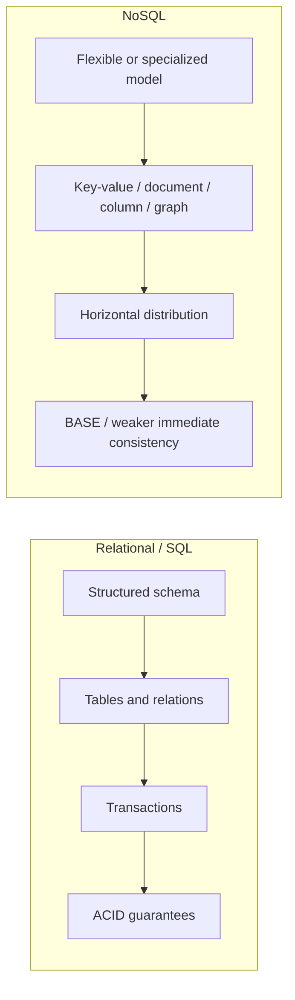
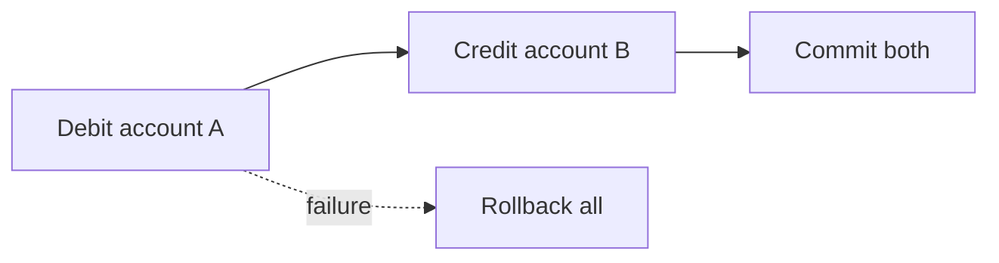
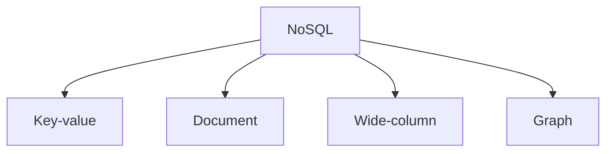

# Database Fundamentals

## 1. Overview

Database fundamentals are about one core question:

> How should a system store, retrieve, protect, and scale data under real application load?

That question leads quickly to the major database families, their guarantees, and their tradeoffs. In practical system design, the first useful distinction is not "which brand of database should be used," but "what kind of data behavior is required." Some workloads need strong transactional correctness. Others need flexible schemas, very high write throughput, or massive horizontal scale. Some need all three in different parts of the same system.

This page treats database fundamentals as a grouped foundation topic rather than one isolated concept. The goal is to build a clear mental model for:

- what SQL systems are optimizing for
- what ACID actually guarantees
- what NoSQL systems are optimizing for
- what BASE means in practice
- when one model is a better fit than another

## 2. Why Databases Matter

Every application eventually becomes a data system.

The application may start with simple questions:

- where should user records live
- how should orders be stored
- how can multiple requests update the same data safely
- how can old data still be found quickly

As the system grows, those questions become harder:

- more concurrent users
- more writes
- more services reading and updating the same entities
- more need for durability, reporting, and recovery

A database is not just a persistence layer. It is the system's contract for:

- durability
- queryability
- concurrency behavior
- data modeling
- correctness under failure

That is why database choices affect architecture far beyond the storage tier itself.

## 3. Visual Model

The simplest mental model is to contrast transactional relational systems with distributed, scale-oriented NoSQL systems.

The point is not that one side is "modern" and the other is "legacy."

- SQL systems optimize for structure, transactions, and strong correctness patterns
- NoSQL systems often optimize for scale, flexibility, availability, or workload specialization
- many real architectures use both because different parts of the product need different data behavior

## 4. Relational Databases and SQL

Relational databases store data in tables with defined schemas and explicit relationships between entities.

Core characteristics:

- structured schema
- rows and columns
- foreign keys and constraints
- declarative querying through SQL
- strong transactional semantics in many common deployments

Why they are powerful:

- data shape is explicit
- joins allow related data to be queried together
- constraints help preserve invariants
- transactions make multi-step updates safer

Typical strengths:

- financial systems
- order management
- inventory
- user/account systems
- business applications with well-defined relationships

Typical costs:

- schema changes require more discipline
- horizontal write scaling is harder
- global distribution with strong consistency gets expensive

### SQL as a Language

SQL is not just a query syntax. It is an abstraction for:

- selecting data
- joining related entities
- filtering and aggregating records
- inserting and updating state
- expressing transactions and constraints

That declarative model matters because it lets the database engine optimize query execution while preserving structured semantics.

## 5. ACID and Transaction Guarantees

ACID is the standard shorthand for the properties many relational systems aim to provide for transactions.

### Atomicity

Atomicity means a transaction happens all at once or not at all.

What to notice:

- partial completion is not considered success
- either the full business action commits or the system reverts it

If a money transfer requires:

1. debit account A
2. credit account B

Atomicity means the system should not leave the data in a state where only one half is committed.

### Consistency

Consistency in ACID means a transaction takes the database from one valid state to another valid state, assuming constraints and invariants are correctly defined.

Examples:

- foreign key rules remain valid
- uniqueness constraints remain valid
- account balances do not violate declared rules

This is different from the distributed-systems meaning of consistency used in CAP and consistency models.

### Isolation

Isolation means concurrent transactions should not interfere in ways that produce invalid or surprising intermediate states.

Isolation is not one fixed level. Databases may offer:

- read committed
- repeatable read
- serializable

Higher isolation is usually safer but more expensive.

### Durability

Durability means once a transaction is committed, it should survive crashes or restarts according to the system's durability model.

This typically depends on:

- write-ahead logs
- fsync or equivalent persistence
- replication or backup strategy

## 6. NoSQL Databases

NoSQL is an umbrella term, not one single data model.

It usually refers to systems that move away from traditional relational structure in order to optimize for one or more of the following:

- horizontal scale
- flexible schemas
- very high write throughput
- simpler key-based access
- specialized relationship or traversal workloads

Common NoSQL categories:

What to notice:

- NoSQL is not one thing
- the category matters because each model optimizes different access patterns

### Key-Value Stores

Data is stored as key to value mappings.

Best for:

- fast lookups
- caches
- session storage
- simple object retrieval

### Document Databases

Data is stored as semi-structured documents, often JSON-like.

Best for:

- flexible application objects
- rapidly evolving schemas
- content or profile-style records

### Wide-Column Stores

Data is organized for very large-scale distributed access patterns.

Best for:

- massive write throughput
- time-series-like access
- large distributed datasets with predictable query paths

### Graph Databases

Data is modeled as nodes and relationships.

Best for:

- recommendation graphs
- fraud detection
- social relationships
- path traversal workloads

## 7. BASE and Consistency in NoSQL Systems

BASE is commonly used as a contrasting shorthand to ACID, though it should not be treated as a strict universal law for all NoSQL systems.

BASE usually expands to:

- **Basically Available**
- **Soft state**
- **Eventual consistency**

What that implies in practice:

- the system may continue serving requests during some failure conditions
- replicas may temporarily diverge
- the state may change over time as replicas converge
- clients may observe stale or differently ordered data for a period

This does not mean "the data is unreliable." It means the system is optimizing differently.

Typical tradeoff:

- stronger immediate agreement is reduced
- availability and scale under distribution improve

This is useful when:

- temporary divergence is acceptable
- reads are far more frequent than correctness-sensitive updates
- conflict resolution can be handled safely

## 8. SQL vs NoSQL: The Real Tradeoffs

This comparison is often oversimplified into "SQL for structure, NoSQL for scale." That is too shallow to guide architecture.

The deeper differences usually involve:

### Data Shape

- SQL fits structured, relational data well
- NoSQL often fits flexible, nested, or specialized data better

### Query Patterns

- SQL is strong for ad hoc querying and joins
- many NoSQL systems are strongest when access paths are known in advance

### Transactions

- SQL systems often provide stronger transactional semantics out of the box
- NoSQL systems may limit or narrow transactional scope to scale more easily

### Scaling

- SQL systems often scale up first and then out carefully
- NoSQL systems are often built for horizontal scale from the start

### Consistency Behavior

- SQL deployments often emphasize stronger immediate correctness
- many NoSQL systems allow weaker immediate consistency to gain availability or scale

### Operational Model

- SQL systems may offer simpler data integrity semantics
- NoSQL systems may require more application-level responsibility for denormalization, reconciliation, or access planning

## 9. Visual Comparison Table

| Dimension | SQL / Relational | NoSQL |
| --- | --- | --- |
| Data model | Tables and relations | Key-value, document, column, graph |
| Schema | Structured, explicit | Flexible or model-specific |
| Transactions | Often strong and expressive | Varies by system, often narrower |
| Joins | Strong native support | Often limited or avoided |
| Horizontal scale | Harder for strong write scaling | Often designed for it |
| Consistency | Often stronger by default | Often tunable or weaker by default |
| Best fit | Invariant-heavy business systems | Scale-heavy or specialized workloads |

## 10. Where Each Model Fits

### SQL is often the right fit when:

- data relationships are important
- correctness and invariants matter a lot
- transactions span multiple rows or entities
- query flexibility is valuable

Examples:

- payments
- orders
- subscriptions
- ERP and internal business systems

### NoSQL is often the right fit when:

- scale is very high
- schema evolves quickly
- the data model is not naturally relational
- the application can tolerate weaker immediate consistency or narrower transactional scope

Examples:

- user activity feeds
- content metadata
- sessions and caching
- event ingestion
- graph-like recommendation systems

## 11. Real-World Examples

### Banking and Ledger Systems

Financial systems usually care deeply about transactional correctness.

That is why relational databases with strong ACID guarantees remain a common fit for balances, transfers, invoices, and any workflow where partial success is unacceptable and auditability matters.

### Product Catalogs and Content Stores

Large catalogs often contain flexible or evolving schemas across many item types.

Document-oriented NoSQL systems are frequently used here because the shape of the data changes often, read scale is high, and strict cross-record transactions are not always the primary concern.

### Event and Telemetry Pipelines

Logs, clicks, and telemetry streams often arrive at high volume and are written continuously.

Wide-column or key-value systems are often chosen when horizontal write scale, partition-aware access, and operational simplicity at large volume matter more than rich relational joins.

## 12. Common Misconceptions

### "SQL means old and NoSQL means modern"

Wrong.

They solve different problems. Mature systems often use both.

### "NoSQL means no consistency"

Wrong.

NoSQL systems still have consistency models. They are just often different from strongly transactional relational defaults.

### "SQL cannot scale"

Wrong.

SQL systems scale very far with good indexing, replication, partitioning, and workload design. The real question is where scaling becomes operationally or economically painful.

### "ACID means perfectly safe under all distributed conditions"

Wrong.

ACID describes transaction guarantees inside the system's model. Distributed failures, replica lag, and application bugs still matter.

### "You must choose one forever"

Wrong.

Many systems use:

- SQL for transactional core state
- NoSQL for high-scale or specialized workloads
- caching and search systems beside both

## 13. Design Guidance

Choose the database model by starting from the workload and correctness requirements.

Questions worth asking:

- what invariants must never be violated
- what relationships must be queried together
- what consistency guarantees are required
- what is the dominant access path
- what scale is expected for reads and writes
- how often will the schema evolve
- what operational complexity can the team absorb

A good practical pattern:

- keep correctness-critical core state in systems with strong transactional behavior
- use specialized NoSQL systems where access pattern or scale clearly justifies it
- avoid choosing a datastore because of trend language alone

The strongest database architecture is usually not the one with the most technologies. It is the one where each datastore has a clear reason to exist.

## 14. Summary

Database fundamentals are really about understanding data guarantees, access patterns, and scale boundaries.

SQL and relational systems are powerful because they make structure, constraints, and transactions first-class. NoSQL systems are powerful because they make scale, flexibility, and specialized access models first-class.

That is the core tradeoff:

- stronger structure and transactional guarantees usually increase modeling discipline and coordination cost
- more flexible or distributed models usually shift more responsibility to access design, reconciliation, and system architecture

A strong engineer does not ask "SQL or NoSQL?" in the abstract.

The better question is:

> What data behavior does this workload actually need?
