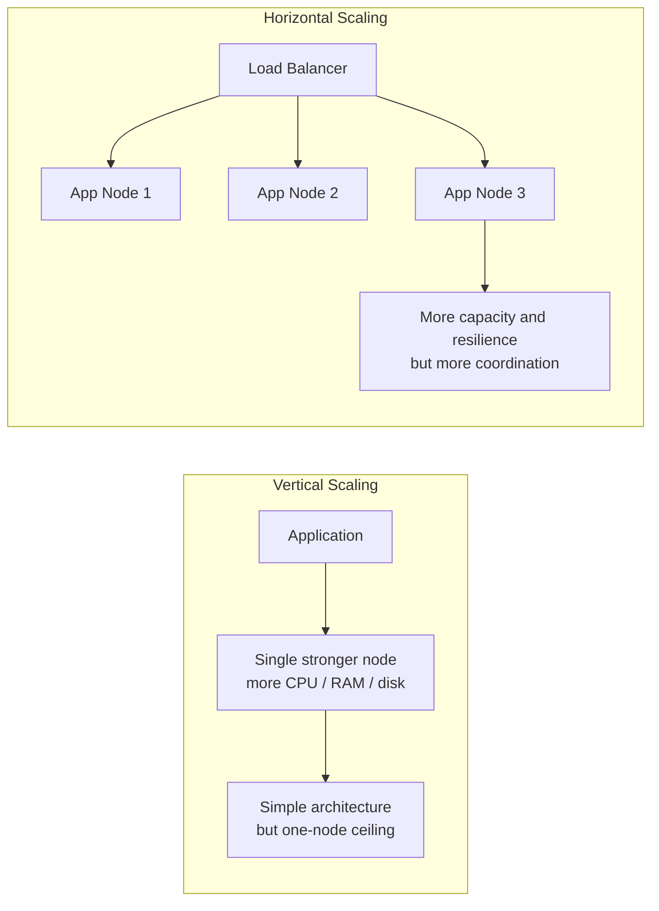

# Horizontal vs Vertical Scaling

## 1. Overview

Scaling is the process of increasing a system's ability to handle more load, more data, or more users. The two most common strategies are vertical scaling and horizontal scaling.

Vertical scaling means making one machine stronger. Horizontal scaling means adding more machines and distributing work across them.

This distinction appears early in system design discussions because it shapes architecture, operations, failure modes, and long-term growth paths. A system that scales vertically may remain simpler for longer. A system that scales horizontally may unlock much larger capacity, but only by accepting distributed-systems complexity.

The choice is not purely technical or purely financial. It is a tradeoff between simplicity and elasticity, between strong local coordination and distributed coordination.

## Visual Model

The difference is easiest to see side by side.

The architectural difference is immediate:

- vertical scaling buys headroom by strengthening one box
- horizontal scaling buys headroom by introducing distribution and coordination
- the tradeoff is not just hardware shape, but where system complexity moves

## 2. The Core Problem

Every machine has limits:

- CPU capacity
- memory capacity
- disk throughput
- network throughput
- connection limits

As demand grows, the system needs more capacity. There are two broad ways to get it.

Option 1:

- replace the current machine with a larger one

Option 2:

- add more machines and spread work across them

These options sound interchangeable at first, but they create very different systems.

A larger machine preserves a simple architecture but has hard ceilings and often higher marginal cost. More machines increase total capacity, but require coordination mechanisms such as load balancing, partitioning, replication, and failure handling.

This is why scaling is not just about adding resources. It is about choosing where complexity should live.

## 3. Formal Statement

Vertical scaling is the practice of increasing the resources of a single node, such as CPU, memory, disk, or network capacity.

Horizontal scaling is the practice of increasing system capacity by adding more nodes and distributing workload or data across them.

A scaling strategy has to define:

- what resource is actually the bottleneck
- whether the workload can be parallelized
- how state is managed across capacity changes
- what failure model is acceptable
- what operational complexity the system can support

Neither vertical nor horizontal scaling is universally better. Each is useful under different workload and architecture conditions.

## 4. Key Terms

### 4.1 Vertical Scaling

Vertical scaling, often called scaling up, means upgrading a node to a larger instance or stronger machine.

Examples:

- more CPU cores
- more RAM
- faster storage
- higher network bandwidth

### 4.2 Horizontal Scaling

Horizontal scaling, often called scaling out, means adding more nodes to share work or data.

Examples:

- more application servers behind a load balancer
- more database shards
- more workers consuming from a queue

### 4.3 Bottleneck

A bottleneck is the resource currently limiting throughput, latency, or capacity.

Scaling only helps if it targets the real bottleneck.

### 4.4 Elasticity

Elasticity is the ability to adjust capacity up or down based on demand.

Horizontal systems often support better elasticity, but only if state and routing are designed for it.

### 4.5 Stateless vs Stateful

Stateless services are easier to scale horizontally because any instance can often handle any request.

Stateful systems can still scale horizontally, but they usually need partitioning, replication, or affinity mechanisms.

### 4.6 Single Point of Failure

A single point of failure is a component whose failure can take down the system.

Vertical scaling preserves more central components, which can simplify design but also concentrate risk.

### 4.7 Scale Ceiling

A scale ceiling is the practical upper limit of a scaling approach.

Vertical scaling often hits hardware or cost ceilings sooner than horizontal scaling.

## 5. What It Really Means

Vertical scaling buys simplicity.

Horizontal scaling buys capacity and resilience.

That is the high-level tradeoff, but the deeper reality is more nuanced.

Vertical scaling keeps:

- one machine image
- one local execution environment
- one local memory space
- simpler debugging and operational reasoning

Horizontal scaling introduces:

- network hops
- coordination protocols
- partial failures
- data distribution
- load balancing
- consistency questions

So the real design question is not "Which is better?" It is:

- how much complexity is worth paying now
- how much headroom is needed later
- where are the system's true bottlenecks

Many strong systems begin with vertical scaling and move horizontally only when the constraints become real.

## 6. Why the Constraint Exists

Consider a web application running on one server.

1. Traffic doubles every few months.
2. CPU usage rises toward saturation.
3. Response latency becomes unstable under load.

The first scaling move may be vertical:

- add more CPU
- add more memory
- move to a larger instance

That is often the fastest path because:

- no routing architecture changes
- no distributed session handling
- no new inter-node coordination

But growth continues.

Eventually:

- the machine size becomes expensive
- failover remains weak
- one node still caps total throughput

At that point, the system may move to horizontal scaling:

- put multiple app servers behind a load balancer
- externalize session state
- replicate or shard the database

This progression is common because vertical scaling delays complexity, while horizontal scaling introduces it in exchange for a higher ceiling.

## 7. Main Variants or Modes

### 7.1 Vertical Scaling

How it behaves:

- increase capacity of a single node
- keep architecture mostly unchanged

Strengths:

- operational simplicity
- easier debugging
- no distributed coordination for that component
- often fastest short-term improvement

Costs:

- hard upper limit
- larger blast radius if the node fails
- often nonlinear cost at higher sizes
- maintenance and failover remain constrained by single-node design

Where it fits:

- early-stage systems
- monoliths with moderate growth
- databases that still fit comfortably on one strong machine

### 7.2 Horizontal Scaling

How it behaves:

- add more nodes
- distribute traffic, work, or data among them

Strengths:

- higher long-term ceiling
- better fault isolation
- better elasticity
- supports regional or workload distribution

Costs:

- more moving parts
- harder observability and debugging
- network and coordination overhead
- requires routing, data distribution, or concurrency controls

Where it fits:

- large web fleets
- distributed datastores
- worker systems
- global services

### 7.3 Hybrid Scaling

Most real systems use both.

Examples:

- scale individual nodes up to a sensible point
- then scale the fleet out

This is often the most practical path because it captures the easy gains of vertical scaling before paying the full complexity cost of horizontal distribution.

## 8. Supporting Mechanisms and Related Ideas

### 8.1 Load Balancing

Horizontal scaling for stateless services usually depends on load balancing.

Without it, extra instances do not translate into usable capacity.

### 8.2 Partitioning and Sharding

Horizontal scaling for large datasets often requires partitioning.

A database cannot scale write capacity across many nodes unless data ownership is split.

### 8.3 Replication

Replication interacts with both strategies.

- vertical scaling may still use replication for availability
- horizontal scaling often replicates each partition or node group for resilience

### 8.4 Stateless Design

Stateless applications are easier to scale horizontally because requests can be routed to any healthy instance.

This is one of the reasons stateless service design is so common in modern backend architectures.

### 8.5 Cost and Operational Complexity

Scaling decisions are constrained by both cloud cost and team maturity.

A theoretically scalable design is not automatically the best choice if the operational overhead is disproportionate to current needs.

## 9. Real-World Examples

### 9.1 Application Server Fleet

Web applications often scale horizontally by adding more stateless application servers behind a load balancer.

Why it works:

- requests can be handled by any instance
- capacity can grow incrementally
- deploys and failures are easier to absorb

Tradeoff:

- sessions and shared state must be externalized

### 9.2 Single Powerful Database Node

Many systems scale a primary database vertically for a long time before sharding.

Why it works:

- application logic stays simple
- transactions remain local
- joins and indexing stay straightforward

Tradeoff:

- one node remains the write ceiling
- failover and cost become more sensitive over time

### 9.3 Background Worker Pool

Queue consumers are often ideal for horizontal scaling.

Why it works:

- work can often be parallelized
- more workers increase throughput

Tradeoff:

- idempotency and concurrency control become important

### 9.4 High-Memory Analytical Node

Some analytical workloads benefit from vertical scaling because keeping data in one large memory space avoids expensive distribution overhead.

Why it works:

- locality is strong
- parallel work happens inside one machine

Tradeoff:

- hardware ceiling remains real

## 10. Common Misconceptions

### 10.1 "Horizontal Scaling Is Always Better"

It is not.

Horizontal scaling offers a higher long-term ceiling, but it also introduces substantial system complexity. For many workloads, vertical scaling is the better near- and mid-term choice.

### 10.2 "Vertical Scaling Does Not Count as Real Scaling"

It absolutely does.

Scaling up is often the fastest, cheapest, and safest way to buy more headroom before architectural limits are reached.

### 10.3 "Just Add More Nodes"

Adding nodes helps only if:

- the workload can be parallelized
- data or traffic can be distributed effectively
- coordination overhead does not dominate

Some bottlenecks do not scale linearly with node count.

### 10.4 "Stateless Services Make Horizontal Scaling Free"

They make it easier, not free.

You still need:

- load balancing
- deployment strategy
- health checking
- observability
- autoscaling policy

### 10.5 "One Strategy Must Be Chosen Forever"

Most real systems use a sequence:

- scale up first
- scale out later
- combine both where useful

This is usually a sign of pragmatic system evolution.

## 11. Design Guidance

Start with the bottleneck and growth expectations, not ideology.

Questions worth asking:

- what resource is saturated first
- can the workload be parallelized
- is the component stateless or stateful
- what is the likely growth rate
- how much operational complexity can the team absorb
- what failure blast radius is acceptable
- where is the current cost curve headed

Prefer vertical scaling when:

- the system is still comfortably within one-node limits
- simplicity is more valuable than theoretical headroom
- strong local transactions or locality matter
- the bottleneck can be relieved by a bigger machine

Prefer horizontal scaling when:

- one node is a real throughput or storage ceiling
- elasticity matters
- failure isolation matters
- the workload can be distributed effectively

Useful patterns:

- scale up first when it meaningfully delays complexity
- design stateless services where possible
- partition stateful systems deliberately rather than accidentally
- combine vertical and horizontal scaling instead of treating them as mutually exclusive

The right scaling strategy is the one that buys the needed capacity with the least harmful complexity at the current stage of the system.

## 12. Reusable Takeaways

- Vertical scaling increases the power of one node; horizontal scaling adds more nodes.
- Vertical scaling preserves simplicity but has harder ceilings.
- Horizontal scaling increases long-term capacity but introduces distributed-systems complexity.
- Stateless workloads are usually easier to scale horizontally than stateful ones.
- Many systems benefit from a hybrid path: scale up first, then scale out.
- The real bottleneck matters more than architectural fashion.
- Scaling decisions should be grounded in workload shape, failure tolerance, and team operational capacity.

## 13. Summary

Horizontal and vertical scaling are two different ways to buy more capacity, and each pushes complexity into a different place.

Vertical scaling keeps the architecture simpler by strengthening one node. Horizontal scaling raises the ceiling by distributing work across many nodes.

That is the core tradeoff:

- scaling up preserves simplicity but eventually runs into ceilings
- scaling out raises capacity and resilience but requires coordination

Strong systems usually use both, but they apply each one deliberately based on the bottleneck they are actually trying to remove.
