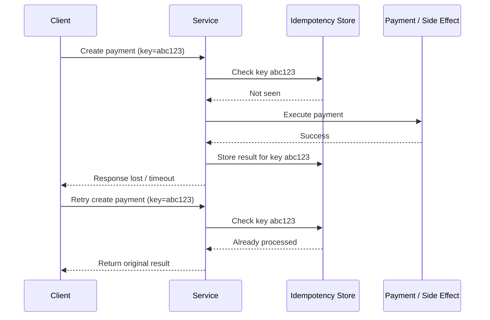
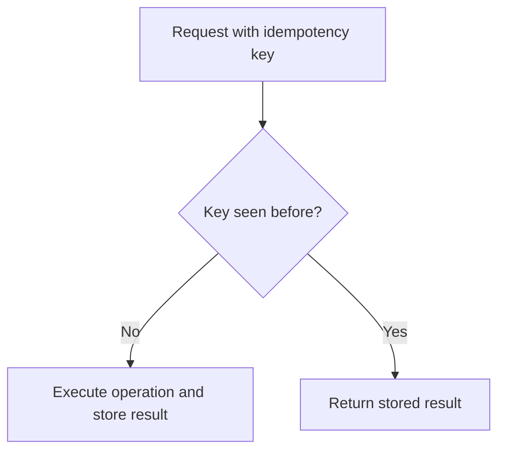

# Idempotency

## 1. Overview

Idempotency is the property that allows the same operation to be applied multiple times without changing the final result beyond the first successful application.

This matters because distributed systems retry constantly. Clients retry after timeouts. Message consumers retry after crashes. Proxies retry after transient failures. Humans retry by pressing the button again because the UI looked stuck. If the system cannot safely handle repeated attempts, ordinary recovery behavior turns into duplicate side effects.

Idempotency is therefore not a niche API detail. It is one of the core tools for making unreliable networks and retried workflows behave predictably.

Without idempotency, failure handling often creates more damage than the original failure.

## Visual Model

Idempotency is easiest to understand through the retry path.

The important engineering point is that the deduplication record sits in front of the second side effect:

- the retry is recognized as the same logical action
- the original result is reused
- the payment is not executed twice

## 2. The Core Problem

Distributed systems cannot reliably distinguish between:

- an operation that never reached the server
- an operation that reached the server but failed before completion
- an operation that completed successfully but whose response was lost

That ambiguity means clients often have only one practical option: retry.

Example:

1. A client sends `POST /payments`.
2. The server processes the payment.
3. The response is lost due to a network timeout.
4. The client does not know whether the payment succeeded.
5. The client retries.

If the operation is not idempotent, the system may now charge the customer twice.

This is the core problem idempotency solves. It turns retries from a correctness risk into a safe recovery mechanism.

## 3. Formal Statement

An operation is idempotent if performing it multiple times with the same intent produces the same externally visible result as performing it once.

In practical system design, idempotency usually requires the system to detect repeated attempts for the same logical action and ensure they do not create duplicate side effects.

An idempotency design has to define:

- what identifies the logical operation
- how duplicate attempts are detected
- how long deduplication state is retained
- what response is returned for repeats
- what side effects are protected

Idempotency does not mean the operation is free, read-only, or internally identical on every attempt. It means the meaningful outcome does not keep changing with repeated application of the same request.

## 4. Key Terms

### 4.1 Retry

A retry is a repeated attempt to perform the same logical operation after uncertainty or failure.

Retries are normal in distributed systems and should be expected rather than treated as rare exceptions.

### 4.2 Side Effect

A side effect is a persistent change caused by an operation.

Examples:

- charging a card
- creating an order
- sending an email
- decrementing inventory

Idempotency matters most when side effects are expensive or irreversible.

### 4.3 Idempotency Key

An idempotency key is a client-provided or system-generated identifier representing one logical operation.

The server uses it to recognize duplicate attempts.

### 4.4 Deduplication Window

The deduplication window is how long the system remembers prior attempts for the same idempotency key.

This window has to be long enough to cover realistic retry patterns and delayed delivery.

### 4.5 At-Least-Once Delivery

At-least-once delivery guarantees that a message or request will be delivered one or more times.

That model strongly depends on idempotent consumers or handlers to avoid duplicate side effects.

### 4.6 Exactly-Once Semantics

Exactly-once semantics is often discussed as a system guarantee, but in practice it usually depends on a combination of:

- deduplication
- transactional boundaries
- idempotent processing

Pure exactly-once delivery across distributed boundaries is far harder than it sounds.

### 4.7 Safe vs Idempotent HTTP Methods

These terms are related but not identical.

- **safe** methods do not change state, such as `GET`
- **idempotent** methods can change state, but repeated application has the same final effect, such as a well-designed `PUT`

## 5. What It Really Means

Idempotency is how systems defend correctness in the presence of uncertainty.

When timeouts, retries, duplicate deliveries, or client confusion happen, idempotency ensures the system can say:

- "this operation has already been applied"
- "do not create the side effect again"

That is why idempotency is deeply connected to reliability. A retry policy without idempotency is often dangerous. A retry policy with idempotency is often essential.

The practical question is not simply whether an API is technically idempotent. The real questions are:

- what is the logical action being protected
- which side effects must never happen twice
- how duplicate intent is recognized
- how long that memory must be retained

Idempotency is therefore both an API design concern and a data-modeling concern.

## 6. Why the Constraint Exists

Consider an order creation workflow.

1. A client submits an order.
2. The service writes the order to the database.
3. The service publishes an event.
4. The HTTP response is lost before reaching the client.
5. The client retries the request.

Without idempotency, the retry may:

- create a second order
- emit a second event
- reserve inventory twice
- send duplicate confirmation messages

With idempotency:

- the retry is recognized as the same logical order attempt
- the system returns the original result or current state
- duplicate side effects are suppressed

This is why idempotency is foundational. Distributed systems must retry, so business operations must survive retries safely.

## 7. Main Variants or Modes

### 7.1 Natural Idempotency

Some operations are naturally idempotent because repeating them converges to the same state.

What to notice:

- repeated state replacement does not create new side effects
- this is the simplest form of idempotency because the operation naturally converges

Examples:

- `PUT /user/123/status = suspended`
- "set feature flag to off"
- "replace profile photo with this version"

Strengths:

- simple semantics
- easier reasoning

Costs:

- only works when the operation is state replacement, not state creation or accumulation

### 7.2 Key-Based Idempotency

Key-based idempotency uses an idempotency key to detect repeated attempts for the same logical action.

What to notice:

- the key becomes the identity of the business action
- the second request is treated as a repeat, not a new command

Common flow:

1. client sends a unique idempotency key
2. server stores the key and result
3. repeated requests with the same key return the stored result instead of re-executing side effects

Strengths:

- works for create-style operations such as payments or orders
- clear and explicit

Costs:

- requires storage and expiry policy
- request equivalence rules must be defined carefully

### 7.3 Upsert-Style Idempotency

Some operations are made idempotent by using upsert semantics keyed by a stable identifier.

Example:

- "create or replace cart for user 42"

Strengths:

- leverages stable resource identity
- often simpler than separate deduplication state

Costs:

- not always suitable for append-only or event-like workflows

### 7.4 Consumer-Side Idempotency

Message consumers often implement idempotency by tracking processed message IDs.

Strengths:

- essential for at-least-once messaging systems
- prevents duplicate downstream effects

Costs:

- requires durable deduplication state
- can grow expensive at high throughput

### 7.5 Commutative or Merge-Friendly Operations

Some systems reduce duplication risk by designing operations that merge safely.

Examples:

- set membership with union semantics
- CRDT-style merges

Strengths:

- resilient in distributed environments

Costs:

- not suitable for many business actions like charging money or shipping goods

## 8. Supporting Mechanisms and Related Ideas

### 8.1 Retries and Timeouts

Retries are only safe if the target operation is idempotent or otherwise duplicate-protected.

Retry policy and idempotency policy should be designed together.

### 8.2 Database Constraints

Unique constraints can enforce parts of idempotency.

Examples:

- unique order reference
- unique payment request ID
- unique message processing record

Constraints are useful, but they are usually only one part of the full design because external side effects may still need protection.

### 8.3 Outbox Pattern

The outbox pattern helps make side effects like event publication line up with database state changes.

This matters because duplicate event emission is often an idempotency problem as much as a messaging problem.

### 8.4 Deduplication Stores

Systems often use a store keyed by idempotency key or message ID.

That store may record:

- request hash
- status
- response payload
- completion timestamp

The design of this store affects correctness, retention cost, and latency.

### 8.5 Sagas and Compensation

When operations span multiple systems, perfect idempotency may not be enough.

Some workflows also need:

- compensating actions
- step-level deduplication
- workflow correlation IDs

This is common in long-running business processes.

## 9. Real-World Examples

### 9.1 Payment API

Payment creation should be idempotent.

Why:

- clients retry on timeout
- duplicate charges are unacceptable

Typical design:

- client sends an idempotency key
- server stores the result under that key
- retries return the original payment outcome

### 9.2 Order Submission

Order submission often needs key-based idempotency.

Why:

- double orders create inventory, billing, and support issues

Tradeoff:

- the system must retain deduplication state long enough to cover retries and delayed requests

### 9.3 Message Consumer

A consumer processing events from a queue may receive the same event more than once.

Why idempotency matters:

- at-least-once delivery is common
- consumer crashes and redelivery are normal

Typical design:

- store processed message IDs
- ignore duplicates

### 9.4 Email Sending Workflow

Email sending is often not naturally idempotent.

Why it matters:

- retries can generate duplicate notifications

Typical mitigation:

- deduplicate by message intent
- store sent records
- suppress duplicate sends within a defined window

## 10. Common Misconceptions

### 10.1 "POST Can Never Be Idempotent"

It can be.

HTTP method semantics and application semantics are related, but a `POST` operation can still be made idempotent with keys and deduplication.

### 10.2 "Idempotent Means Nothing Happens on Retries"

Not necessarily.

The system may still:

- perform lookups
- re-check state
- return the original response

The important property is that duplicate attempts do not create additional meaningful side effects.

### 10.3 "A Unique Constraint Solves Idempotency Completely"

It helps, but it does not automatically protect:

- outbound emails
- event emission
- calls to third-party services
- multi-step workflows

Idempotency has to cover all important side effects, not just one table write.

### 10.4 "Exactly-Once Means We Do Not Need Idempotency"

In practice, exactly-once claims often still rely on deduplication and carefully controlled boundaries.

Idempotency remains one of the most practical defenses against duplicate work.

### 10.5 "Idempotency Is Only Needed for Payments"

Payments are the most obvious example, but many workflows need it:

- order creation
- message processing
- inventory reservation
- provisioning
- notifications

Any operation that may be retried and must not duplicate side effects should be examined through this lens.

## 11. Design Guidance

Design idempotency around business intent, not around transport retries alone.

Questions worth asking:

- what is the logical action being performed
- what would be harmful if it happened twice
- how will duplicate attempts be recognized
- how long can retries or duplicate deliveries arrive later
- what response should the system return for a repeat attempt
- which side effects must be protected together

Prefer natural idempotency when:

- the operation is state replacement or convergence-based

Prefer key-based idempotency when:

- the operation creates something new
- retries are likely
- duplicate creation is expensive or harmful

Prefer consumer-side deduplication when:

- the system processes messages with at-least-once delivery

Useful patterns:

- require idempotency keys on externally retried create operations
- pair idempotency with unique constraints where possible
- retain deduplication state for a realistic retry window
- define whether the same key with different payloads is rejected or treated as an error
- protect downstream side effects, not just primary database writes

The system is only as idempotent as its most duplicate-sensitive side effect.

## 12. Reusable Takeaways

- Idempotency makes repeated attempts safe for the same logical action.
- It is essential because distributed systems must retry under uncertainty.
- Natural idempotency works well for state replacement; key-based idempotency is common for creation flows.
- Duplicate suppression must cover all important side effects, not just one database write.
- Idempotency keys need retention windows and request-equivalence rules.
- Messaging systems with at-least-once delivery depend heavily on idempotent consumers.
- Retry policy without idempotency is often a correctness bug waiting to happen.

## 13. Summary

Idempotency is the property that lets distributed systems recover from uncertainty without duplicating business effects.

Its purpose is simple but critical: when the network, client, or workflow cannot tell whether an action already happened, the system must still produce a safe result when the action is attempted again.

That is the essential tradeoff:

- retries improve reliability
- retries also risk duplication unless operations are designed to absorb them safely

A strong idempotency design turns repeated attempts from a danger into a normal part of reliable system behavior.
