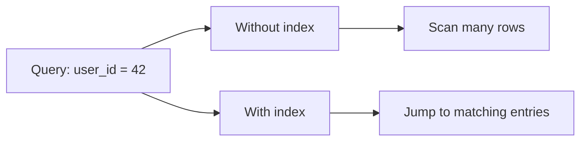
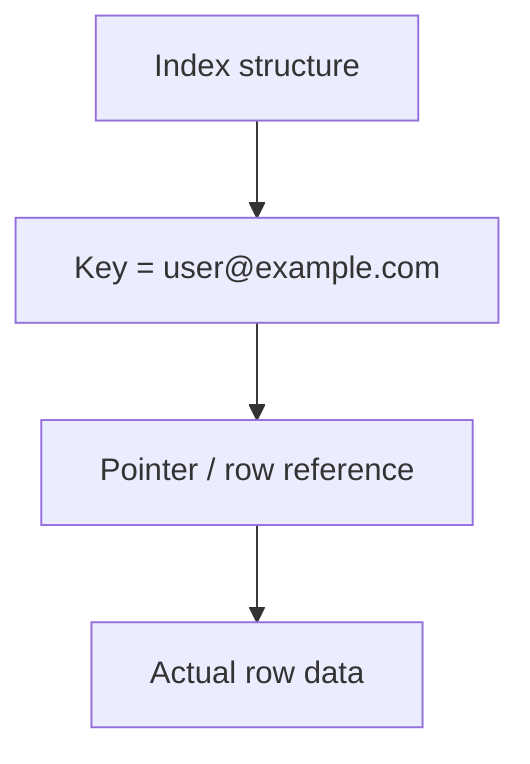

# Indexing Basics

## 1. Overview

Indexes exist to answer one practical question:

> How can a system find the needed data without scanning everything?

That question shows up almost immediately in any non-trivial application. As data grows, lookup cost becomes a dominant performance concern. A database can store millions or billions of records correctly and still be unusable if every query requires touching too much data.

Indexing is the mechanism that trades extra storage and write work for faster reads and more selective access paths. It is one of the highest-leverage topics in system design because query performance, latency, and even data model choices are often shaped by what can be indexed efficiently.

## 2. Why Indexing Matters

Without an index, the system may need to perform a full scan:

- read every row
- inspect every object
- evaluate the predicate repeatedly

That is acceptable for tiny datasets. It becomes expensive quickly as:

- data volume grows
- queries become more selective
- latency budgets tighten
- concurrency increases

Indexing matters because many production systems are bottlenecked less by "too much data stored" and more by "too much data touched per request."

## 3. Visual Model

The simplest useful mental model is a comparison between full scan and indexed lookup.



What to notice:

- the query is the same in both cases
- the difference is how much irrelevant data must be inspected first
- indexing reduces work by creating a faster path to likely matches

## 4. What an Index Is

An index is an auxiliary data structure that helps the database locate rows or records more efficiently based on one or more fields.

At a practical level, an index usually stores:

- indexed key values
- references or pointers to matching rows or records
- structure that makes lookup, range scan, or ordering efficient

An index is not the source of truth. It is a performance structure built on top of the primary data.

## 5. Key Terms

### 5.1 Full Table Scan

A full table scan reads the underlying dataset directly to evaluate a query.

This can be acceptable for:

- very small tables
- low-selectivity queries
- analytical scans that intentionally touch large portions of data

### 5.2 Primary Key Index

A primary key index is built around a record's unique identity.

It usually supports:

- exact lookup
- uniqueness
- stable row identity

### 5.3 Secondary Index

A secondary index is built on fields other than the primary key.

Examples:

- email
- created_at
- status
- tenant_id

These are often essential for real application queries.

### 5.4 Covering Index

A covering index includes enough fields to satisfy a query without fetching the full row separately.

This can reduce I/O significantly.

### 5.5 Composite Index

A composite index uses multiple columns together.

Example:

- `(tenant_id, created_at)`

These are useful when queries depend on more than one field or require sorted retrieval.

### 5.6 Selectivity

Selectivity describes how narrowly a predicate filters data.

An index on a highly selective field is often more useful than an index on a field with only a few repeated values.

### 5.7 Cardinality

Cardinality is the number of distinct values in a field.

Higher-cardinality fields often produce more useful indexes for exact lookups.

## 6. Visual Model: Index Access Path



What to notice:

- the index helps locate the row
- the row itself still lives in the main table or storage structure
- some queries remain two-step: index lookup first, row fetch second

## 7. Common Index Types

### B-Tree Indexes

B-tree style indexes are the default in many relational systems.

They are strong for:

- exact lookups
- range scans
- ordered access
- prefix matching in some cases

### Hash Indexes

Hash indexes are optimized for exact-match lookups.

They are generally poor for:

- range queries
- ordering

### Inverted Indexes

Inverted indexes map terms to documents or records.

They are useful for:

- search
- text retrieval
- keyword matching

### Bitmap Indexes

Bitmap indexes are useful in some analytical contexts, especially where values have low cardinality.

They are less common in transactional application discussions, but still important in warehousing and analytics.

## 8. Composite and Covering Indexes

Not all useful queries are single-column lookups.

### Composite Index Example

```mermaid
flowchart LR
    Q[tenant_id = 7 AND created_at DESC] --> IDX[(tenant_id, created_at) index]
    IDX --> FAST[Efficient filtered + ordered scan]
```

What to notice:

- column order matters
- the same fields in a different order may serve different queries badly

### Covering Index Example


What to notice:

- the database may avoid touching the main row storage
- this can reduce I/O substantially for hot queries

## 9. Index Tradeoffs

Indexes are powerful, but they are not free.

Every index usually adds:

- storage cost
- write amplification
- maintenance overhead on insert, update, and delete
- operational complexity in schema design

This is the central tradeoff:

- more indexes improve read paths
- more indexes make writes heavier and the schema harder to reason about

## 10. Query Shape Matters More Than Theory

Indexes only help when they align with actual access patterns.

Good indexing starts with questions like:

- what are the most common filters
- what fields are used for sorting
- what queries are latency-sensitive
- which lookups are exact-match versus range-based
- do reads usually need only a small subset of fields

An index that is theoretically valid but never used is just write overhead and storage cost.

## 11. Supporting Mechanisms and Related Ideas

### 11.1 Data Modeling

Indexing and schema design are tightly linked.

Bad modeling can create query patterns that need too many indexes or expensive joins.

### 11.2 Partitioning

In distributed systems, indexes may be:

- local to each shard
- global across shards

That decision has major performance and operational implications.

### 11.3 Write Amplification

Every additional index means more structures that must change on write.

This is why write-heavy systems often require stricter index discipline than read-heavy systems.

### 11.4 Query Planning

Databases often choose execution plans based on statistics and estimated cost.

An index may exist and still not be used if the planner thinks another path is cheaper.

## 12. Real-World Examples

### User Lookup by Email

Authentication and account systems frequently query users by email address or username.

Without an index on that lookup key, the database may scan the full table. With the right index, the system turns a growing-table problem into a targeted access path that stays efficient much longer.

### Time-Ordered Event Queries

Operational dashboards often request recent records such as the last 100 orders or the latest failed jobs.

An index on timestamp, often combined with another filtering column, lets the database avoid sorting large datasets repeatedly for a query pattern that the product executes constantly.

### Composite Indexes for Multi-Column Filters

A marketplace might query listings by `(category, status, created_at)`.

Separate single-column indexes do not always help much for that shape. A composite index aligned to the actual query predicate and ordering can dramatically reduce work because it matches how the data is really accessed.

## 13. Common Misconceptions

### "Just Add an Index"

Sometimes that is correct. Often it is too shallow.

The right question is:

- which query
- on which predicate
- with what write cost
- under what data distribution

### "Every Frequently Queried Field Needs an Index"

Not necessarily.

Low-selectivity or scan-heavy workloads may not benefit enough to justify the write cost.

### "Indexes Only Affect Reads"

Wrong.

Indexes also affect write latency, storage, and maintenance complexity.

### "Composite Indexes Are Just Multiple Single-Column Indexes"

Wrong.

Column ordering and combined access path behavior matter.

### "If an Index Exists, the Query Is Optimized"

Not necessarily.

The index may be poorly aligned with the query, ignored by the planner, or still require expensive row fetches.

## 14. Design Guidance

Design indexes from real query patterns, not from guesswork.

Questions worth asking:

- what are the top latency-sensitive queries
- which predicates are selective
- which queries require ordering
- what is the write/read ratio
- what indexes are actually being used
- can a covering or composite index remove extra work
- what is the storage and maintenance cost

Useful patterns:

- start with primary access paths
- add secondary indexes deliberately
- review index usage with real workload data
- avoid redundant indexes
- revisit indexing after query shape changes

A good index strategy is not one with the most indexes. It is one that reduces the most expensive read work without making writes unnecessarily expensive.

## 15. Summary

Indexing basics are really about access path design.

An index gives the system a way to find data with less irrelevant work. That makes reads faster, but it also adds cost on every write and every schema change.

That is the core tradeoff:

- indexes reduce lookup cost
- indexes increase maintenance cost

Strong systems use indexes deliberately, based on query shape and workload behavior rather than rule-of-thumb cargo culting.
