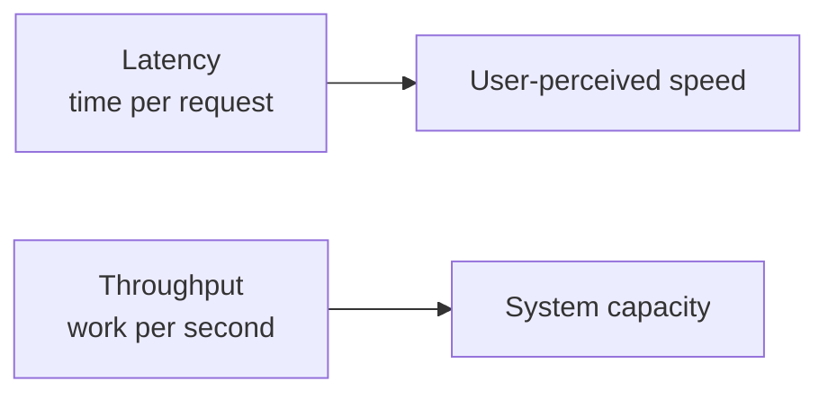
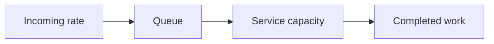

# Latency vs Throughput

## 1. Overview

Latency and throughput are two of the most important performance dimensions in system design, and they are often confused or optimized in the wrong order.

Latency answers:

> How long does one operation take?

Throughput answers:

> How much total work can the system complete over time?

A system can have low latency and low throughput. It can also have high throughput and poor latency. Good architecture work depends on understanding which one matters more for the specific workload and where the tradeoffs between them appear.

## 2. Why This Distinction Matters

Teams often say a system is "fast" without specifying what they mean.

That hides important questions:

- is the user waiting too long for one response
- is the system unable to handle the volume of requests
- is average speed good while tail latency is bad
- is batch throughput strong while interactive latency is poor

System design decisions often improve one dimension by stressing the other.

Examples:

- batching improves throughput but may increase latency
- strong coordination may improve correctness but increase latency
- deeper queues may keep throughput high while latency deteriorates

That is why the two metrics need to be reasoned about separately.

## 3. Visual Model



What to notice:

- latency is about individual request experience
- throughput is about aggregate system output
- strong systems usually need to balance both rather than optimize only one

## 4. Latency

Latency is the elapsed time taken to complete a unit of work.

Examples:

- API response time
- database query duration
- queue processing delay
- end-to-end user action completion time

Latency matters most for:

- interactive systems
- user-facing APIs
- synchronous dependencies
- tail-sensitive request paths

### Average vs Tail Latency

Average latency is useful, but tail latency is often more important operationally.

Examples:

- p50
- p95
- p99

One slow dependency can make a small fraction of requests much worse than the average suggests.

## 5. Throughput

Throughput is the amount of work completed per unit time.

Examples:

- requests per second
- transactions per minute
- messages consumed per second
- bytes processed per hour

Throughput matters most for:

- high-volume APIs
- stream processing
- background workers
- ingestion pipelines

High throughput does not guarantee low latency. A system can process a lot of work overall while individual requests still wait too long.

## 6. Visual Model: Queueing Effect



What to notice:

- if incoming rate approaches or exceeds service capacity, queueing grows
- throughput may remain high for a while
- latency rises because requests spend more time waiting before service

## 7. Where the Tradeoff Appears

### Batching

Batching can increase throughput by amortizing overhead across many items.

But it may increase latency because work waits for the batch to fill.

### Concurrency

Higher concurrency may improve throughput up to a point.

Beyond that point:

- context switching
- lock contention
- resource contention
- queue buildup

can all make latency worse.

### Replication and Coordination

Strong coordination often increases latency because more nodes or steps must agree.

That can still be the correct choice if correctness matters more than raw speed.

### Caching

Caching can improve both latency and throughput:

- lower request time
- less backend work

But cache misses, cold starts, and invalidation bugs can complicate the story.

## 8. Little's Law as a Mental Model

A useful high-level relationship is:

```text
concurrency = throughput x latency
```

This helps explain why systems with longer request time often need more concurrency capacity to sustain the same throughput.

It is not a full performance model, but it is a very useful systems intuition.

## 9. Common Performance Shapes

### Interactive API

Usually latency-sensitive first, throughput-sensitive second.

The user notices:

- response delay
- timeout behavior
- tail latency spikes

### Batch Pipeline

Usually throughput-sensitive first.

The system may tolerate higher latency for individual units if total work completed over time is strong.

### Queue-Based Worker System

Often both matter differently:

- user-facing latency may depend on backlog delay
- total system health depends on processing throughput

## 10. Supporting Mechanisms and Related Ideas

### 10.1 Load Balancing

Better traffic distribution can reduce queueing and improve both throughput and latency under load.

### 10.2 Backpressure

Backpressure helps stop throughput goals from destroying latency and stability through uncontrolled overload.

### 10.3 Caching

Caches often improve both dimensions by reducing repeated work, but only if hit rate is good and invalidation is sound.

### 10.4 Autoscaling

More capacity can improve throughput and protect latency, but only if scaling happens fast enough and the bottleneck is actually parallelizable.

### 10.5 Tail Latency Amplification

In multi-hop request paths, one slow dependency can dominate end-to-end latency even when overall throughput remains high.

## 11. Real-World Examples

### API Request Handling

User-facing APIs usually care a lot about latency because each slow request is directly visible to a human or calling system.

A design that maximizes total requests per second is not automatically good if tail latency becomes unacceptable for the user journey.

### Batch Analytics Pipelines

Data processing systems often optimize for throughput instead of per-item speed.

If a nightly analytics job processes millions of records efficiently, slightly higher latency for any single record may be acceptable because the business goal is total completion within a broader window.

### Queue-Backed Systems Under Load

A system may preserve good short-term throughput by accepting more work into a queue, while latency quietly worsens because every item waits longer before processing.

This is a common production trap: the throughput graph looks healthy while user-perceived responsiveness is already deteriorating.

## 12. Common Misconceptions

### "High Throughput Means the System Is Fast"

Not necessarily.

The system may process a lot of work while individual requests still experience long waits.

### "Low Average Latency Means the System Is Healthy"

Not necessarily.

Bad tail latency can still make the user experience or dependency chain unreliable.

### "More Concurrency Always Improves Throughput"

Only up to the point where contention and queueing begin to dominate.

### "Batching Is Always Good"

It is good when throughput matters more than immediacy. It is harmful when low latency is the core requirement.

### "Latency and Throughput Are Independent"

They influence each other through queueing, contention, and capacity limits.

## 13. Design Guidance

Start by identifying which metric is the primary success criterion for the workload.

Questions worth asking:

- is this user-facing or batch-oriented
- what latency percentile actually matters
- what throughput target is required
- where does queueing form
- does batching help or hurt
- what happens under overload
- can the workload scale horizontally

Useful patterns:

- optimize tail latency on synchronous critical paths
- optimize throughput on asynchronous or batch-heavy workloads
- use backpressure and admission control before queueing becomes destructive
- measure both latency distribution and sustained throughput, not just one

Good system design is not about choosing latency or throughput in the abstract. It is about deciding which one is primary for the specific workload and preventing the other from collapsing.

## 14. Summary

Latency and throughput describe different aspects of performance.

Latency tells how long one request takes. Throughput tells how much total work the system can do. Strong systems understand both and treat queueing, batching, and contention as first-class design forces.

That is the core tradeoff:

- systems can often increase total output by accepting more waiting or batching
- systems can often reduce waiting by doing less aggregate work or by adding capacity

The right performance strategy starts with the actual workload, not a generic idea of speed.
