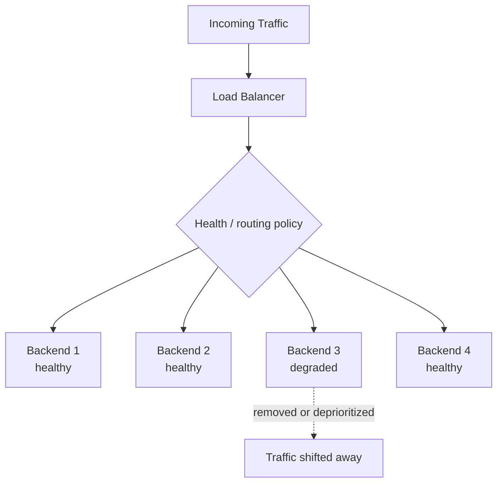
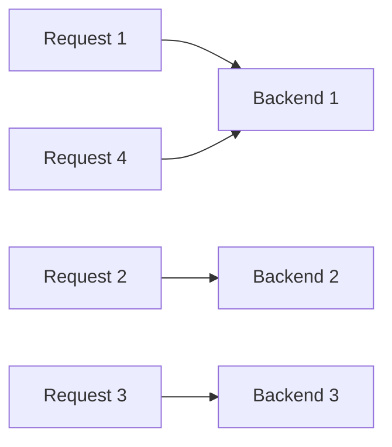
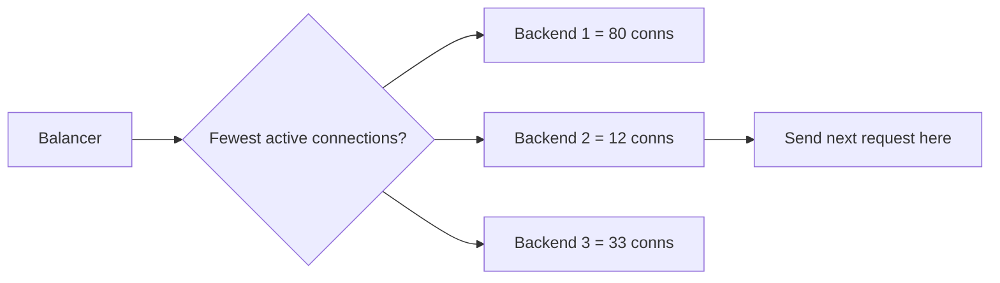
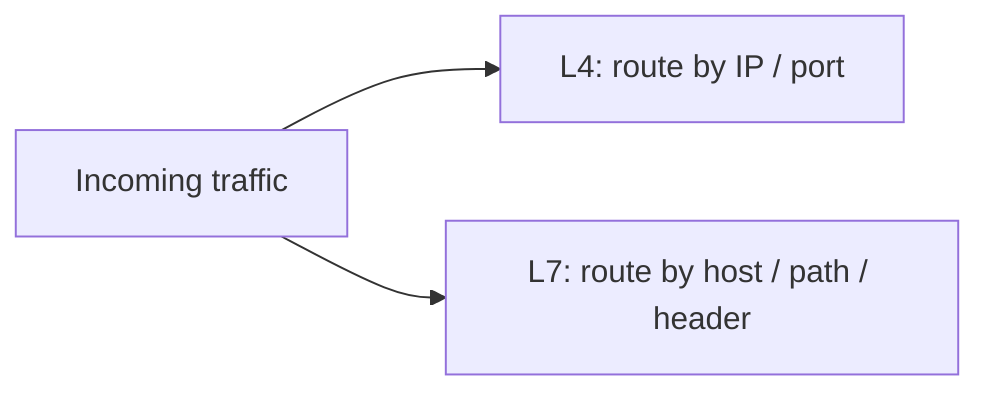
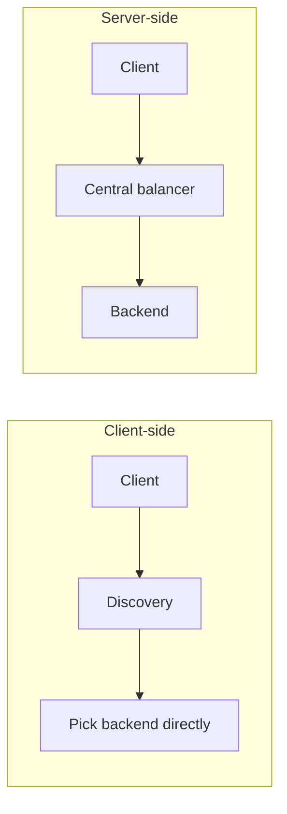

# Load Balancing

## 1. Overview

Load balancing is the practice of distributing incoming traffic or work across multiple resources so no single instance becomes an unnecessary bottleneck.

This is one of the most visible scaling mechanisms in distributed systems because it sits directly in the request path. A load balancer can improve throughput, reduce tail latency, increase availability, and make rolling deployments possible. It can also become a central coordination point whose behavior shapes the health of the entire service.

At a high level, load balancing sounds simple: spread requests evenly. Real systems are more complicated because "evenly" is rarely the actual goal. The real goal is to place work where it can be handled most effectively while respecting capacity, health, locality, connection state, and failure conditions.

That is why load balancing is both a routing problem and a systems control problem.

## Visual Model

Load balancing is easiest to visualize as one entry point distributing traffic across a backend pool.

The important detail is that the balancer is not just splitting traffic randomly. It may also:

- make routing decisions based on health and load, not just count
- reduce traffic to degraded backends before they become full outage points
- keep the fleet usable even when one node is slow rather than dead

## 2. The Core Problem

One service instance can only handle so much traffic.

Limits include:

- CPU saturation
- memory pressure
- connection limits
- thread or event-loop capacity
- disk or network throughput

Scaling a service usually means running multiple instances. But once multiple instances exist, the system has to decide where each request should go.

Without load balancing:

- some instances may be overloaded while others are idle
- instance failures can cause large traffic loss
- deployments become disruptive
- capacity changes are hard to absorb smoothly

Example:

1. A service runs ten application servers.
2. Clients keep sending requests to the same few servers due to cached DNS or reused connections.
3. Those servers saturate while others remain underused.

The problem is no longer application logic. It is traffic distribution.

## 3. Formal Statement

Load balancing is the mechanism of distributing requests, connections, or tasks across multiple backends according to health, capacity, and routing policy.

A load-balancing design has to define:

- what unit of work is being distributed
- how backends are discovered
- how backend health is assessed
- which routing algorithm is used
- how failures are handled
- whether stateful affinity is required

Load balancing does not simply mean "round robin." It is the system's policy for turning a pool of instances into one usable service surface.

## 4. Key Terms

### 4.1 Backend

A backend is a server, instance, pod, or worker that receives traffic from the load balancer.

### 4.2 Health Check

A health check is a signal used to determine whether a backend should receive traffic.

Health checks may test:

- process liveness
- dependency readiness
- latency thresholds
- application-level correctness

### 4.3 L4 Load Balancing

Layer 4 load balancing routes traffic based on transport-level information such as IP addresses and ports.

It is typically faster and simpler, but has less application awareness.

### 4.4 L7 Load Balancing

Layer 7 load balancing routes traffic using application-layer information such as HTTP headers, paths, hosts, or cookies.

It enables richer routing behavior, but usually with more complexity and processing overhead.

### 4.5 Sticky Sessions

Sticky sessions, or session affinity, route a client repeatedly to the same backend.

This can simplify stateful applications, but it also creates imbalance and failover complications.

### 4.6 Connection Draining

Connection draining is the practice of letting in-flight connections complete before removing a backend from service.

This is important for safe deployments and graceful shutdowns.

### 4.7 Active-Active and Active-Passive

- **active-active**: multiple backends actively serve traffic
- **active-passive**: one backend serves traffic while another waits as standby

These modes have different tradeoffs in utilization, failover speed, and complexity.

### 4.8 Tail Latency

Tail latency refers to the slowest requests in the distribution, such as p95 or p99 latency.

Load-balancing quality often matters more at the tail than at the average.

## 5. What It Really Means

Load balancing is how a distributed service turns horizontal capacity into usable capacity.

Adding more instances is not enough. If traffic is routed badly:

- hot backends get slower
- retries amplify load
- queueing builds up unevenly
- partial failures become full outages

A good load balancer does more than distribute work. It:

- removes unhealthy instances
- shifts traffic during deploys
- reacts to skewed load
- helps keep tail latency under control

In that sense, load balancing is part traffic routing, part fault containment, and part capacity management.

## 6. Why the Constraint Exists

Consider a service running on six instances behind a public endpoint.

1. Traffic spikes suddenly during a product launch.
2. Two instances are already running near CPU limits.
3. A naive balancer continues sending equal traffic to all six.
4. The overloaded instances begin timing out.
5. Clients retry, which increases pressure further.

Now the system faces a distribution problem:

- should it remove slow instances from rotation
- should it shift traffic away from overloaded nodes
- should it prefer least-loaded backends instead of equal distribution

This is why load balancing matters. The question is not just whether there are enough servers in total. It is whether incoming work is placed on servers that can actually absorb it safely.

## 7. Main Variants or Modes

### 7.1 Round Robin

Round robin sends requests to backends in order.

What to notice:

- the algorithm is simple because it ignores instantaneous backend load
- fairness by count is not the same as fairness by work

Strengths:

- simple
- low overhead
- works well when backends are similar

Costs:

- ignores backend load and request cost
- can be suboptimal for uneven traffic

### 7.2 Weighted Round Robin

Weighted round robin gives more traffic to stronger backends.

Strengths:

- useful when capacity differs between nodes
- simple extension of round robin

Costs:

- still does not react dynamically to instantaneous load

### 7.3 Least Connections

Least connections sends traffic to the backend with the fewest active connections.

What to notice:

- the decision uses current connection pressure rather than simple rotation
- this works better when request duration varies

Strengths:

- better than round robin for long-lived connections
- adapts somewhat to uneven request duration

Costs:

- connection count is not always equal to real resource usage

### 7.4 Least Response Time / Least Loaded

These strategies route traffic toward backends responding fastest or carrying less observed load.

Strengths:

- more adaptive
- helps with heterogeneous or variable backends

Costs:

- requires more metrics and control logic
- can oscillate if signals are noisy

### 7.5 Consistent Hashing

Consistent hashing routes related requests to the same backend based on a hash.

Strengths:

- useful for cache locality
- reduces disruption when backends are added or removed

Costs:

- can create skew
- not ideal for purely even request distribution

### 7.6 Layer 4 vs Layer 7 Balancing

What to notice:

- L4 sees transport-level metadata
- L7 sees application-level semantics and can make richer routing decisions

#### Layer 4

Best when:

- routing can be based on transport information
- performance and simplicity matter most

#### Layer 7

Best when:

- routing needs to inspect application semantics
- path-based, host-based, tenant-based, or header-based routing is required

### 7.7 Client-Side vs Server-Side Load Balancing

What to notice:

- client-side pushes policy into callers
- server-side centralizes policy in infrastructure

#### Client-Side

Clients discover backends and choose where to send requests.

Strengths:

- avoids an extra central hop
- can react quickly with local decisions

Costs:

- puts more complexity into clients
- requires discovery consistency across clients

#### Server-Side

A central proxy or balancer receives traffic and forwards it to backends.

Strengths:

- centralized policy
- simpler clients
- operationally familiar

Costs:

- extra network hop
- the balancer tier itself must scale and remain highly available

## 8. Supporting Mechanisms and Related Ideas

### 8.1 Health Checking

Good load balancing depends on accurate health signals.

Bad health checks can:

- send traffic to broken instances
- remove healthy instances unnecessarily
- create flapping behavior

### 8.2 Autoscaling

Load balancing and autoscaling work together.

- autoscaling changes the number of backends
- load balancing determines how traffic reaches them

Poor coordination between the two can create warm-up issues and transient overload.

### 8.3 Retry Behavior

Retries interact directly with load balancing.

If the system retries aggressively without budget or backoff, the balancer may spread failure amplification instead of protecting the service.

### 8.4 Queueing and Backpressure

A load balancer should not blindly push traffic into saturated backends.

Queue limits, concurrency limits, and backpressure signals matter because routing without admission control can still overload the system.

### 8.5 Stateful Services and Affinity

Some services require locality:

- websocket sessions
- in-memory carts
- sticky authentication state

Affinity may help performance or correctness, but it reduces flexibility and can create imbalance.

## 9. Real-World Examples

### 9.1 HTTP Reverse Proxy

A reverse proxy such as NGINX or Envoy distributes traffic across application servers.

Why it works:

- centralized routing policy
- health-based traffic control
- support for rolling deploys and TLS termination

Tradeoff:

- the proxy layer becomes critical infrastructure

### 9.2 Cloud Load Balancer

Managed cloud load balancers front application fleets.

Why they work:

- reduce operational burden
- integrate with autoscaling and health checks
- provide regional or global traffic management

Tradeoff:

- less control than a fully custom routing layer
- platform semantics must be understood carefully

### 9.3 Client-Side Balancing in Service Meshes or RPC Systems

Internal service clients may load balance across discovered endpoints.

Why it works:

- reduces central bottlenecks
- enables richer per-client routing decisions

Tradeoff:

- every client must handle discovery and failure semantics correctly

### 9.4 Consistent Hashing for Cache Clusters

Cache requests may be routed using consistent hashing.

Why it works:

- keeps related keys on the same nodes
- reduces remapping when capacity changes

Tradeoff:

- even request distribution is not guaranteed

## 10. Common Misconceptions

### 10.1 "Round Robin Is Enough"

It is enough only for simple, homogeneous workloads.

Real systems often have:

- uneven request cost
- long-lived connections
- heterogeneous instance health
- bursty traffic

### 10.2 "Healthy Means Ready for Any Amount of Traffic"

A backend may be technically alive but still overloaded or degraded.

Good routing needs more than liveness checks.

### 10.3 "Sticky Sessions Are Harmless"

Sticky sessions can simplify stateful designs, but they also:

- reduce balancing quality
- make failover harder
- create uneven load during hot-client scenarios

### 10.4 "A Load Balancer Solves Capacity Problems"

It does not create capacity. It only distributes available capacity more effectively.

If the whole fleet is undersized, the load balancer cannot invent headroom.

### 10.5 "The Balancer Itself Is Not a Risk"

The balancer is a critical dependency.

If it is misconfigured, overloaded, or partially failing, the whole service can degrade even when backends are healthy.

## 11. Design Guidance

Choose a load-balancing strategy based on request shape, backend behavior, and failure model.

Questions worth asking:

- are requests short-lived or long-lived
- are all backends equally capable
- is request cost uniform or highly variable
- does routing require HTTP awareness
- is backend-local state involved
- how quickly must unhealthy nodes be removed
- how does retry behavior interact with routing

Prefer round robin or weighted round robin when:

- backends are relatively homogeneous
- requests are short and similar in cost

Prefer least-connections or least-loaded strategies when:

- request duration varies
- backend utilization diverges significantly

Prefer L7 balancing when:

- routing depends on host, path, headers, or tenant

Prefer client-side balancing when:

- low overhead and decentralization matter
- clients can safely handle discovery and policy

Prefer server-side balancing when:

- simpler clients and centralized control matter more

Useful patterns:

- combine health checks with graceful draining
- track tail latency, not just averages
- integrate routing policy with autoscaling and retry budgets
- avoid unnecessary session affinity unless locality clearly pays for it

The best load balancer is the one that keeps the fleet usable under normal traffic, partial failure, and change.

## 12. Reusable Takeaways

- Load balancing turns a pool of instances into one service surface.
- Good balancing is about effective placement, not just even distribution.
- Health checks, retries, and autoscaling all interact directly with routing behavior.
- Layer 4 and Layer 7 balancing solve different kinds of problems.
- Sticky sessions simplify some stateful flows but reduce flexibility.
- Tail latency and overload behavior matter more than average fairness.
- The load balancer itself is a critical system component and must be treated that way.

## 13. Summary

Load balancing is the mechanism that lets distributed capacity behave like a single reliable service.

It works by deciding where each request should go, but its deeper role is to keep the system stable as traffic, failures, and deployments change over time.

That is the core tradeoff:

- more intelligent routing improves utilization and resilience
- more intelligent routing also adds policy and operational complexity

A strong load-balancing design does not just spread traffic. It helps the system stay healthy under stress.
