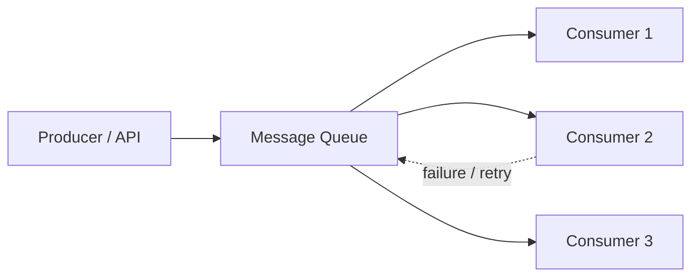
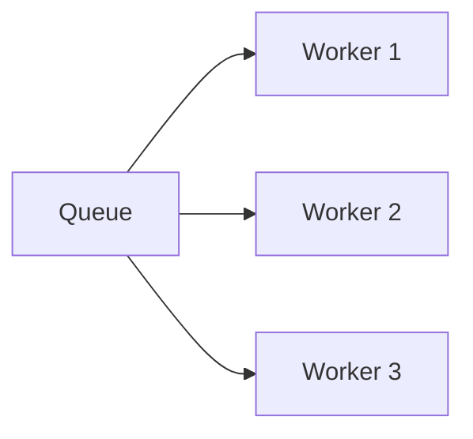
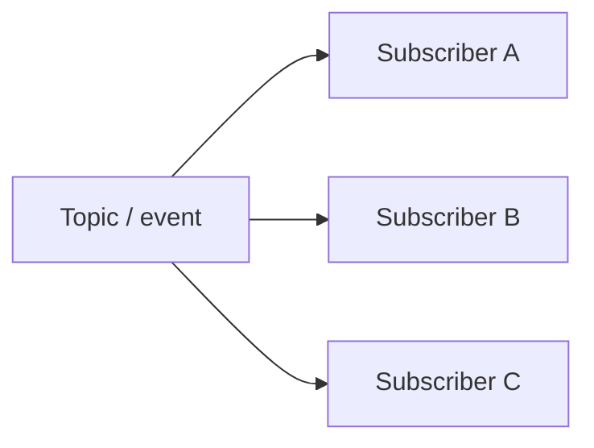
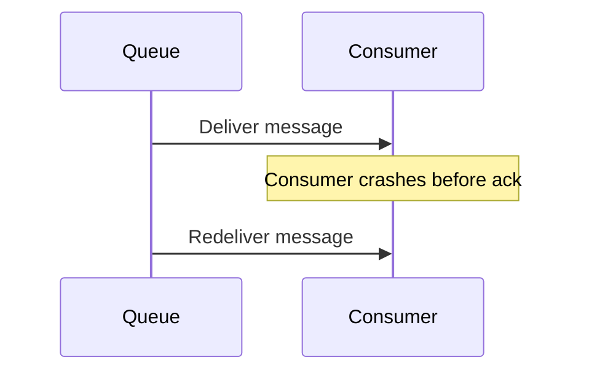

# Message Queues

## 1. Overview

Message queues are a mechanism for decoupling producers from consumers by introducing an intermediate buffer of work.

That sounds simple, but the design impact is substantial. A queue changes how systems absorb traffic, recover from failure, scale processing, and coordinate work across services. Instead of forcing one component to wait synchronously for another, the system can accept work now and process it later.

This is why queues show up everywhere:

- background jobs
- event processing
- email and notification systems
- order pipelines
- payment workflows
- analytics ingestion

The queue is not just a transport. It is a control point for flow, durability, retries, ordering, and backpressure.

## 2. Visual Model

The simplest useful model is a producer placing work into a durable buffer and independent workers consuming from it.

What this changes immediately:

- the producer no longer waits for all downstream work to finish
- consumers can scale independently
- retries and spikes are absorbed by the queue rather than by the producer's request path

## 3. The Core Problem

Direct synchronous communication creates tight coupling.

If service A calls service B directly for every action:

- latency in B becomes latency in A
- failures in B become failures in A
- spikes in B can take down A
- A cannot easily absorb more work than B can process right now

That is often the wrong shape for workloads that are:

- slow
- bursty
- retry-heavy
- side-effect driven
- not required to complete inside the original request path

Example:

1. A user uploads a video.
2. The system must store metadata, transcode the file, generate thumbnails, run moderation, and send notifications.
3. Doing all of that synchronously inside one request is slow and fragile.

A queue lets the system acknowledge the upload and process downstream work asynchronously.

## 4. Formal Statement

A message queue is an intermediary system that stores messages produced by one component so they can be processed later by one or more consumers.

A queue design has to define:

- how messages are enqueued
- how consumers receive them
- when messages are acknowledged
- what happens on consumer failure
- how retries are handled
- what ordering guarantees exist
- how duplicate delivery is handled

The point of a queue is not only transport. It is temporal decoupling and controlled work distribution.

## 5. Key Terms

### 5.1 Producer

A producer is the component that sends a message to the queue.

Examples:

- an API service
- a cron job
- another worker

### 5.2 Consumer

A consumer is the component that receives and processes messages from the queue.

Consumers are often stateless workers so they can scale horizontally.

### 5.3 Acknowledgment

An acknowledgment tells the queue that a message has been successfully processed.

Without correct acknowledgment semantics, the system can lose work or process it repeatedly.

### 5.4 Visibility Timeout

Some queue systems make a message temporarily invisible after delivery. If the consumer fails to acknowledge it in time, the message becomes visible again for retry.

### 5.5 Dead Letter Queue

A dead letter queue stores messages that repeatedly fail processing.

This prevents poison messages from endlessly blocking normal flow.

### 5.6 At-Most-Once, At-Least-Once, Exactly-Once

These are delivery semantics, not marketing labels.

- **at-most-once**: messages may be lost, but not redelivered
- **at-least-once**: messages are retried, so duplicates are possible
- **exactly-once**: difficult in distributed practice and usually depends on deduplication and transaction boundaries

### 5.7 Ordering

Ordering defines whether consumers must observe messages in the same sequence they were produced.

Strict ordering is expensive and often limits parallelism.

### 5.8 Backpressure

Backpressure is the mechanism that prevents producers or consumers from overrunning the rest of the system.

A queue often becomes the place where backpressure is measured and enforced.

## 6. What It Really Means

A queue turns a synchronous dependency into an asynchronous contract.

That usually buys:

- lower producer latency
- better spike absorption
- independent scaling of workers
- retry isolation

But it also changes the problem space:

- work is no longer immediate
- duplicates become normal
- ordering may weaken
- monitoring gets harder
- eventual completion becomes more important than instant completion

A queue is useful when delayed correctness is acceptable and decoupling is valuable. It is a poor choice when the caller truly needs the downstream result before it can continue.

## 7. Main Variants or Modes

### 7.1 Simple Point-to-Point Queue

One producer writes work and one consumer group processes it.

Strengths:

- simple mental model
- good for background jobs
- easy load-leveling

Costs:

- one message is usually processed by one consumer path only

### 7.2 Work Queue with Competing Consumers

Many workers consume from the same queue for throughput.

What to notice:

- one queue can feed many workers in parallel
- this increases throughput, but usually weakens ordering guarantees

Strengths:

- horizontal scaling
- good parallel processing model

Costs:

- strict ordering becomes harder
- idempotency becomes essential

### 7.3 Pub/Sub Topic

One message can be delivered to multiple independent subscribers.

What to notice:

- the same message fans out to many consumers
- this is fundamentally different from one-work-item-to-one-worker queueing

Strengths:

- decoupled fan-out
- good for event-driven architectures

Costs:

- more consumers means more failure paths
- event versioning and schema discipline matter more

### 7.4 Delay / Retry Queues

Some systems route failed or deferred work to delayed queues before retry.

Strengths:

- smoother retry behavior
- avoids immediate hot-loop retries

Costs:

- more operational complexity
- harder observability across stages

## 8. Delivery Semantics and Failure Behavior

Message queues are defined as much by their failure behavior as by their happy path.

### At-Most-Once

- simpler
- fewer duplicates
- risk of message loss

### At-Least-Once

What to notice:

- redelivery is expected after failure
- safe processing depends on idempotency, not wishful thinking

- much more common in real systems
- safer for durability
- requires idempotent consumers

### Exactly-Once

This is usually expensive and context-dependent.

In practice, many systems approximate exactly-once business behavior using:

- deduplication keys
- idempotent consumers
- transactional outbox patterns
- careful commit/ack boundaries

## 9. Supporting Mechanisms and Related Ideas

### 9.1 Idempotency

At-least-once delivery and retries make idempotent consumers essential.

Without idempotency, retries turn normal failure recovery into duplicate side effects.

### 9.2 Backpressure and Load Shedding

Queues can absorb bursts, but they are not infinite.

You still need:

- queue depth monitoring
- producer throttling
- worker scaling
- admission control

### 9.3 Ordering vs Throughput

Strict ordering and high parallelism usually fight each other.

If ordering matters, the system may need:

- partitioned queues
- per-key ordering
- reduced concurrency

### 9.4 Dead Letter Queues

Dead letter queues are operational safety valves.

They prevent permanently failing messages from:

- blocking progress
- consuming retries forever
- hiding systemic bugs

### 9.5 Outbox Pattern

The outbox pattern helps make database changes and message publication line up safely.

It matters because "write to DB, then publish event" is otherwise vulnerable to partial failure.

## 10. Real-World Examples

### 10.1 Email Delivery

User actions enqueue email jobs rather than sending mail synchronously.

Why it works:

- email is slow relative to API latency budgets
- retries are common
- throughput may spike after campaigns or bulk actions

### 10.2 Order Processing Pipeline

An order may trigger inventory checks, fraud review, billing, and fulfillment steps asynchronously.

Why it works:

- the system decouples intake from downstream processing
- different workers can scale differently

### 10.3 Analytics Ingestion

User events are often queued before downstream aggregation.

Why it works:

- event volume is bursty
- downstream processing can be batched or parallelized

### 10.4 Media Processing

Uploads often enqueue transcoding and thumbnail generation jobs.

Why it works:

- heavy work leaves the user-facing request path
- retries can happen without blocking the upload acknowledgement

## 11. Common Misconceptions

### "A Queue Automatically Solves Scaling"

It helps absorb and distribute work, but it does not remove downstream bottlenecks.

If consumers are too slow, the queue just becomes a growing backlog.

### "Queues Guarantee Exactly Once"

Usually not in the strong business sense people assume.

Most practical systems rely on at-least-once delivery and idempotent processing.

### "Asynchronous Means Faster Completion"

It usually means faster acknowledgment to the producer, not necessarily faster end-to-end completion.

### "Queue Depth Going Up Is Fine"

Only temporarily.

Persistent queue growth means arrival rate exceeds processing rate or failure rate is too high.

### "Ordering Comes for Free"

It does not.

Strong ordering constraints often reduce throughput and parallelism.

## 12. Design Guidance

Choose a queue when work should be decoupled in time and independently retried or scaled.

Questions worth asking:

- does the caller need the downstream result immediately
- what happens if a message is processed twice
- how long can work wait in the queue
- does ordering matter globally or per key
- what retry policy is acceptable
- what backlog size is safe
- how will poison messages be isolated

Useful patterns:

- keep producers simple and durable
- make consumers idempotent
- monitor lag, depth, age, and retry rates
- use dead letter queues for persistent failures
- keep strict ordering only where it truly matters

A good queue design is not just about getting messages from one place to another. It is about making delayed work predictable under load and failure.

## 13. Summary

Message queues are foundational because they let systems separate accepting work from completing work.

That separation improves resilience, scalability, and operational control, but it also moves the architecture toward asynchronous behavior, retries, duplicates, and eventual completion.

That is the central tradeoff:

- queues decouple systems and absorb spikes
- queues also require stronger thinking about retries, ordering, idempotency, and backlog health

The right queue design makes asynchronous work reliable instead of merely delayed.
