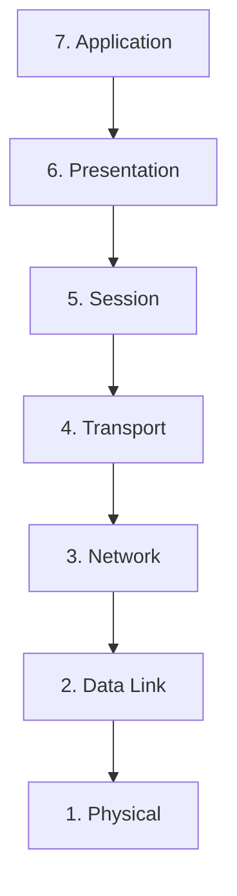
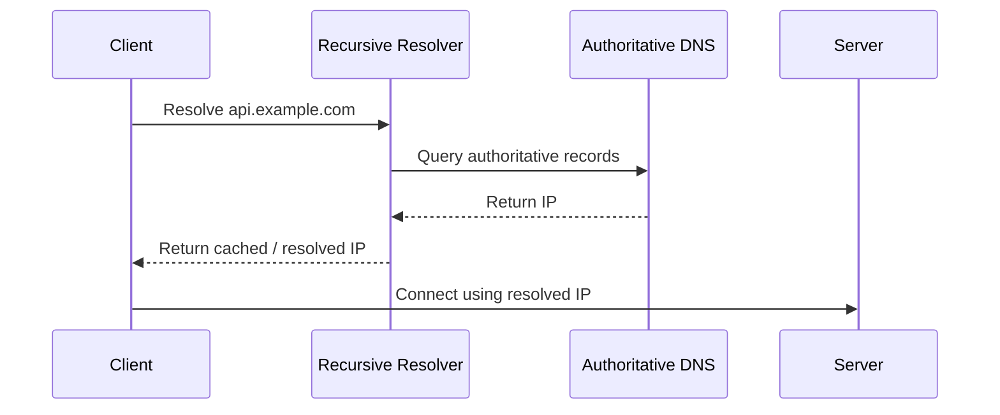
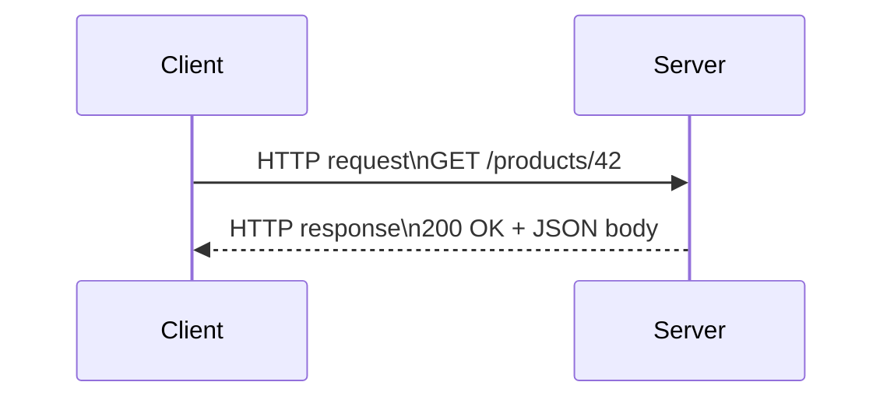
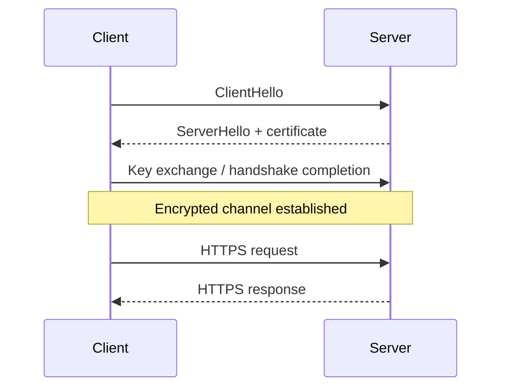

# Networking Basics

## 1. Overview

Networking basics matter because every distributed system is built on message exchange between machines.

At the application layer, a request may look simple:

- open a website
- call an API
- fetch a service response

Underneath that simple action, multiple layers are working together:

- a domain name is resolved
- a connection is established
- a protocol such as HTTP is spoken
- encryption may be negotiated
- packets are carried across the network

This page groups the most important networking foundations for system design:

- the OSI model as a mental map
- DNS for name resolution
- HTTP for application communication
- HTTPS for secure communication

The goal is not to memorize every protocol detail. The goal is to understand the path a request takes and why networking behavior shapes latency, reliability, security, and scalability.

## 2. Why Networking Matters in System Design

Many system design failures are actually networking failures in disguise.

Examples:

- slow DNS resolution increases request latency before the application even runs
- TLS handshakes add connection overhead
- retries amplify traffic during partial packet loss
- connection reuse changes performance dramatically
- proxies and load balancers change routing behavior

If networking is treated as a black box, distributed systems are harder to reason about. If networking is understood as layered behavior, many production problems become easier to diagnose.

## 3. Visual Model

The simplest useful mental model is an end-to-end request path.

This one path already shows why networking is layered:

- DNS answers "where should the request go"
- transport and TLS establish a safe channel
- HTTP defines how the application request is expressed
- infrastructure in the middle may still route, terminate, or transform traffic

## 4. The OSI Model as a Mental Map

The OSI model is a conceptual framework for understanding networking layers. In day-to-day engineering, people do not always use all seven layers precisely, but the model is still valuable because it helps separate concerns.

What to notice:

- the higher layers describe application-facing behavior
- the lower layers handle delivery over actual networks
- debugging gets easier when the failure is mapped to the right layer

The seven layers are:

1. **Physical**: signals, cables, radio, hardware transmission
2. **Data Link**: local network framing and MAC-level delivery
3. **Network**: IP routing between networks
4. **Transport**: end-to-end delivery, usually TCP or UDP
5. **Session**: connection/session management
6. **Presentation**: formatting, encoding, encryption representation
7. **Application**: protocols such as HTTP, DNS, SMTP

### Why the OSI Model Is Useful

It helps answer questions like:

- is this a routing problem or an application problem
- is the failure happening before HTTP ever starts
- is the issue encryption, transport, name resolution, or application semantics

It is best used as a debugging and mental-model tool, not as a ritual to memorize mechanically.

## 5. DNS: How Names Become Reachable Destinations

DNS, the Domain Name System, translates human-readable names such as `api.example.com` into IP addresses.

Without DNS, clients would have to know destination IPs directly, which is brittle and operationally impractical.

### Visual Model

### Why DNS Matters

DNS affects:

- latency before the request starts
- traffic steering
- failover
- load distribution
- service discovery in some architectures

### Important Ideas

- DNS records are cached
- TTL controls how long clients or resolvers may reuse answers
- cached answers improve speed but delay reaction to change
- DNS is often a control plane input, not just a lookup utility

## 6. HTTP: The Application Request Model

HTTP is the protocol used by clients and servers to exchange application requests and responses on the web and in many APIs.

At a high level, HTTP defines:

- methods such as `GET`, `POST`, `PUT`, `DELETE`
- headers
- request bodies
- response status codes
- response bodies

### Visual Model

### Why HTTP Matters

HTTP shapes:

- API design
- caching behavior
- idempotency expectations
- load balancer and proxy behavior
- observability patterns such as status codes and headers

### Important Engineering Ideas

- HTTP is stateless at the protocol level
- connections may still be reused underneath
- headers carry metadata for auth, caching, tracing, and content negotiation
- semantics of methods matter for correctness and interoperability

## 7. HTTPS: HTTP Over Encryption

HTTPS is HTTP running over TLS, which provides encryption, integrity, and server identity verification.

Without HTTPS:

- intermediaries can read traffic
- requests can be tampered with more easily
- server identity is much harder to trust safely

### Visual Model

### What TLS Adds

- confidentiality: others should not read the payload
- integrity: traffic should not be changed silently
- authentication: the client can validate the server certificate chain

### Why HTTPS Matters in System Design

It affects:

- connection setup cost
- certificate management
- proxy and load balancer architecture
- zero-trust and internal service security models

## 8. How These Pieces Work Together

A practical request path looks like this:

1. the client resolves a domain name using DNS
2. the client opens a transport connection to the resolved IP
3. if HTTPS is used, TLS negotiation happens
4. the client sends an HTTP request
5. proxies or load balancers may route the request
6. the application responds

This sequence matters because latency accumulates across layers.

When a request is slow, the bottleneck might be:

- DNS resolution
- TCP connection setup
- TLS handshake
- proxy traversal
- backend processing

That is why layered understanding matters operationally.

## 9. Real-World Examples

### Opening an E-Commerce Website

When a user opens a shopping site, DNS resolves the domain, TCP and TLS establish a secure connection, and HTTP carries the actual request and response.

That full path is why network basics matter in system design. A slow DNS lookup, failed certificate validation, or overloaded origin can all show up to the user as "the website is slow" even though the problem sits in a different layer.

### Calling a Public API

A mobile app calling an API over HTTPS depends on several pieces working together: name resolution, routing, transport reliability, encryption, and application semantics.

Understanding that stack helps explain why timeouts, retries, keep-alive behavior, and certificate issues can all affect what looks like one simple API call.

### CDN and Reverse Proxy Deployments

Modern systems often place DNS, CDN, TLS termination, load balancers, and application services across different layers.

That architecture only makes sense if the team understands how the network path is composed. Otherwise, debugging becomes guesswork because every component is treated like an opaque box.

## 10. Common Misconceptions

### "DNS is just a phone book"

Incomplete.

DNS is also part of traffic steering, failover strategy, and caching behavior.

### "HTTP and HTTPS are basically the same"

Close at the application semantics layer, but operationally very different because HTTPS introduces TLS, certificates, encryption, and handshake cost.

### "The OSI model is not practical"

It is practical when used as a reasoning tool.

It helps isolate where a problem lives rather than mixing routing, transport, and application issues together.

### "Once DNS resolves, the job is done"

No.

Resolution is only the first step. Connection establishment, TLS, routing, and application handling still remain.

### "HTTPS means the system is fully secure"

No.

HTTPS secures transport. It does not automatically solve authorization, input validation, secret management, or application vulnerabilities.

## 11. Design Guidance

Use networking fundamentals to reason about latency, availability, and security path by path.

Questions worth asking:

- where does name resolution happen
- how long are DNS responses cached
- where is TLS terminated
- are connections reused or repeatedly reopened
- what infrastructure sits between client and application
- what parts of the request path are observable
- which failures happen before the application code even sees a request

Useful practical patterns:

- measure DNS, connect, TLS, and application latency separately
- understand where proxies and load balancers terminate TLS
- use HTTP method semantics carefully
- treat networking layers as part of system behavior, not hidden plumbing

Strong systems are built by people who can reason not only about the business logic, but about the path the bytes take to reach it.

## 12. Summary

Networking basics are foundational because distributed systems are ultimately coordinated over networks, not inside one process.

The OSI model provides the layered map. DNS tells clients where to go. HTTP defines how requests and responses are expressed. HTTPS secures that communication with TLS.

That is the core idea:

- application behavior depends on lower networking layers more than many designs initially assume
- understanding the request path makes systems easier to scale, secure, and debug

A strong engineer does not treat networking as background detail. They treat it as part of the execution model of the system.
