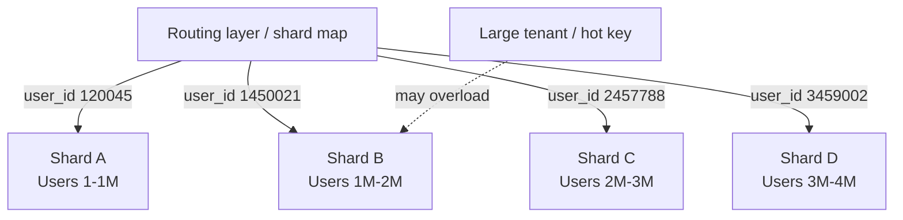
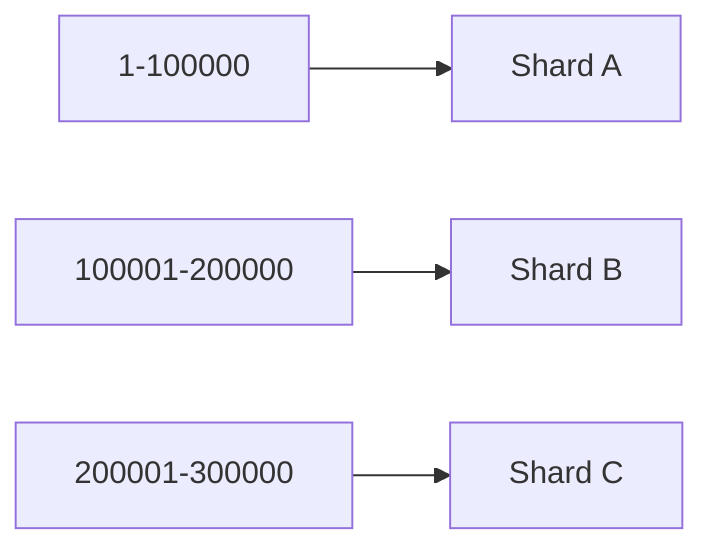

# Partitioning and Sharding

## 1. Overview

Partitioning is the practice of splitting a large dataset into smaller pieces so the system can store, manage, and serve that data across multiple nodes. Sharding is the common term used when those partitions are distributed across independent machines.

This concept becomes necessary when a single machine stops being enough. A dataset may outgrow one node's storage, one CPU's processing capacity, one disk's throughput, or one network interface's bandwidth. At that point, scaling the system means dividing the data itself.

Partitioning sounds like a straightforward scaling strategy, but it changes the shape of almost every other design decision. Once data is split across shards, the system has to answer questions about routing, hot spots, rebalancing, joins, transactions, and failure recovery.

That is why partitioning is not just a storage technique. It is one of the main architectural boundaries in large-scale systems.

## Visual Model

Partitioning becomes intuitive when the dataset is shown as many ownership buckets instead of one giant table.



The point of the split is simple:

- requests are routed by key, not broadcast everywhere
- each shard owns a subset of the dataset
- uneven growth or hot tenants can still make one shard problematic

## 2. The Core Problem

A single database node has hard limits:

- finite storage
- finite memory
- finite CPU
- finite disk throughput
- finite network capacity

As traffic and data volume grow, the system eventually reaches a point where replication alone is not enough.

Replication helps:

- improve availability
- improve durability
- scale reads

Replication does not fundamentally solve:

- total data size on one primary
- total write throughput to one write authority
- contention on one node's storage engine

To keep scaling, the system has to divide the dataset so different subsets of data can be handled independently.

Example:

1. A messaging system stores all conversations in one database.
2. The dataset grows to billions of messages.
3. One node becomes a bottleneck for writes, storage, and maintenance.
4. The system splits data by conversation or user ID across many machines.

Now each machine handles only part of the data, and the total capacity of the system increases.

## 3. Formal Statement

Partitioning is a data distribution strategy in which a logical dataset is divided into multiple disjoint subsets, with each subset stored and served independently.

Sharding is a common implementation of partitioning where each partition, or shard, is assigned to a different node or group of nodes.

A partitioning design has to define:

- how data is assigned to shards
- how requests are routed to the correct shard
- how new shards are added
- how data is rebalanced when distribution changes
- how cross-shard queries and transactions behave
- how failures are isolated and recovered

Partitioning does not just improve scale. It changes the consistency, latency, operational complexity, and failure modes of the system.

## 4. Key Terms

### 4.1 Partition

A partition is one logical subset of the dataset.

Each partition owns a well-defined slice of the overall keyspace or record set.

### 4.2 Shard

A shard is typically a partition deployed as an independently managed storage unit on a node or cluster.

In practice, many teams use "partition" and "shard" interchangeably.

### 4.3 Partition Key / Shard Key

The partition key is the attribute used to decide where a record belongs.

Examples:

- `user_id`
- `order_id`
- `region`
- `tenant_id`

Choosing the wrong partition key is one of the fastest ways to create hot spots, skew, and expensive cross-shard operations.

### 4.4 Keyspace

The keyspace is the full range of keys that can exist in the system.

Partitioning splits that keyspace into smaller owned ranges or buckets.

### 4.5 Rebalancing

Rebalancing is the process of moving data between shards so load and storage are distributed more evenly.

Rebalancing is unavoidable in real systems because data growth is rarely uniform.

### 4.6 Hot Partition

A hot partition is a shard receiving disproportionate traffic or data growth compared with others.

This is one of the most common scaling problems in sharded systems.

### 4.7 Cross-Shard Query

A cross-shard query touches more than one shard.

These queries are often expensive because they require:

- fan-out reads
- result aggregation
- more network hops
- more failure points

### 4.8 Resharding

Resharding is the act of changing the partition layout, usually to add capacity, reduce skew, or change the distribution strategy.

This is often one of the hardest operational tasks in a sharded system.

## 5. What It Really Means

Partitioning is what allows a system to scale beyond one machine, but it does so by forcing the application and data model to acknowledge distribution explicitly.

Once data is sharded:

- locality becomes important
- routing becomes part of the architecture
- joins and transactions become harder
- some requests become cheap and some become expensive
- operational growth depends on rebalancing strategy

The main idea is simple:

- keep related data together when possible
- spread unrelated data across many nodes

The challenge is that access patterns rarely stay stable forever. A sharding strategy that works today can become a liability once traffic, tenants, or product behavior change.

That is why partitioning is less about splitting data once and more about choosing the long-term boundaries of scale.

## 6. Why the Constraint Exists

Consider an e-commerce system with all orders stored on one primary database.

1. Order traffic grows to tens of thousands of writes per second.
2. The order table becomes too large for efficient indexing and maintenance.
3. Backups take too long.
4. Vacuuming, compaction, or reindexing becomes operationally painful.
5. One node becomes the write bottleneck.

The system decides to shard orders by `customer_id`.

Now:

- each shard stores fewer rows
- writes are spread across many machines
- maintenance can happen shard by shard

But new tradeoffs appear:

- queries by `order_id` need routing rules
- customers with unusually high activity can create hot shards
- reports spanning all customers require cross-shard aggregation
- moving a large customer to another shard is now a migration problem

This is the core reality of partitioning: it solves scale by making data placement an explicit design concern.

## 7. Main Variants or Modes

### 7.1 Horizontal Partitioning

Horizontal partitioning splits rows across partitions.

Example:

- users `1-1,000,000` on shard A
- users `1,000,001-2,000,000` on shard B

This is the most common meaning of sharding.

Strengths:

- increases total capacity
- distributes write load
- scales with data growth

Costs:

- cross-shard queries become harder
- routing logic is required

### 7.2 Vertical Partitioning

Vertical partitioning splits columns or functional domains rather than rows.

Example:

- profile data in one store
- billing data in another
- analytics fields in a third

Strengths:

- isolates access patterns
- reduces row width and unnecessary I/O
- allows different storage choices for different domains

Costs:

- more service or storage boundaries
- data that used to live together may now require multiple calls

### 7.3 Range-Based Sharding

Range-based sharding assigns contiguous key ranges to shards.



What to notice:

- routing is simple because ranges are explicit
- hot ranges can become concentrated on one shard

Example:

- shard A handles `1-100000`
- shard B handles `100001-200000`

Strengths:

- simple routing
- good for range scans
- natural fit for ordered data

Costs:

- hot spots if writes cluster in one range
- rebalancing can be painful when ranges grow unevenly

### 7.4 Hash-Based Sharding

Hash-based sharding uses a hash of the partition key to distribute data across shards.

```mermaid
flowchart LR
    K[Key] --> H[Hash(key)]
    H --> M[Map to shard bucket]
    M --> S[Target shard]
```

What to notice:

- distribution is usually more even than plain ranges
- ordered locality is lost because placement follows the hash, not the natural key sequence

Strengths:

- spreads data more evenly
- reduces the chance of obvious skew
- good for point lookups

Costs:

- range queries become difficult
- data locality by key order is lost
- changing shard count may require significant movement unless consistent hashing is used

### 7.5 Directory-Based Sharding

Directory-based sharding uses a lookup service or metadata table to map records to shards.


What to notice:

- placement is flexible because the directory controls routing
- the routing metadata itself becomes an important dependency

Strengths:

- flexible placement
- easier targeted migrations
- can support non-uniform workloads

Costs:

- requires metadata consistency
- routing depends on an extra system
- directory lookups can become a dependency bottleneck

### 7.6 Geo-Sharding

Geo-sharding places data based on region or geography.

Strengths:

- lower latency for region-local users
- clearer data residency control
- natural failure isolation by geography

Costs:

- cross-region users may touch multiple shards
- global queries become more complex
- uneven regional traffic can still create skew

## 8. Supporting Mechanisms and Related Ideas

### 8.1 Consistent Hashing

Consistent hashing reduces data movement when nodes are added or removed.

This is useful in systems where shard membership changes regularly.

It is especially common in caches and distributed key-value stores.

### 8.2 Secondary Indexes

Indexes become more complex in sharded systems.

Questions that matter:

- is the index local to each shard
- is there a global index
- how are index updates coordinated

Global secondary indexes are powerful but operationally expensive.

### 8.3 Rebalancing and Resharding

Shards do not stay balanced forever.

Systems need strategies for:

- splitting large shards
- merging underutilized shards
- moving ranges or buckets
- draining traffic safely during migration

Good sharding designs assume rebalancing will happen repeatedly.

### 8.4 Replication

Partitioning and replication solve different problems and are often used together.

- partitioning increases capacity by dividing data
- replication increases resilience and read scale by copying data

A real system usually shards first for scale and replicates each shard for fault tolerance.

### 8.5 Transactions and Joins

Single-shard transactions are much easier than multi-shard transactions.

Once operations span shards, systems often need:

- distributed transactions
- application-level coordination
- asynchronous workflows
- denormalized data models

This is one of the biggest downstream consequences of partitioning.

## 9. Real-World Examples

### 9.1 User-Based Sharding

A social platform may shard by `user_id`.

Why it works:

- most reads and writes are user-centric
- a user's data stays colocated
- request routing is straightforward

Tradeoff:

- celebrity users can create hot shards
- cross-user analytics becomes more expensive

### 9.2 Tenant-Based Sharding

A SaaS platform may shard by `tenant_id`.

Why it works:

- tenant isolation is improved
- noisy tenants are easier to reason about
- compliance boundaries are clearer

Tradeoff:

- one very large tenant can dominate a shard
- moving tenants between shards becomes an operational requirement

### 9.3 Time-Based Partitioning

Logging or metrics systems often partition by time window.

Why it works:

- recent data is queried differently from historical data
- retention and deletion become simpler
- old partitions can be archived or compressed

Tradeoff:

- recent partitions can become hot
- queries spanning long time windows may touch many partitions

### 9.4 Geo-Based Sharding

A global application may store EU users in EU shards and US users in US shards.

Why it works:

- supports latency goals
- supports locality and residency requirements

Tradeoff:

- global users and cross-region operations are more complex

## 10. Common Misconceptions

### 10.1 "Sharding Is Just a Scaling Switch"

It is not.

Sharding changes data access patterns, query design, operational tooling, failure handling, and often the application model itself.

### 10.2 "A Hash Key Solves Distribution Forever"

Hashing improves evenness, but it does not solve:

- poor query locality
- hot logical entities
- expensive fan-out reads
- painful resharding without proper strategy

### 10.3 "Cross-Shard Queries Are Fine If the Database Supports Them"

They may be supported, but they are still expensive.

Cross-shard work adds latency, network hops, aggregation cost, and more failure surfaces.

### 10.4 "One Shard Key Works for Every Access Pattern"

It rarely does.

Every shard key optimizes one set of queries and makes others harder. That tradeoff has to match the dominant access path.

### 10.5 "Sharding and Replication Are the Same"

They are different:

- sharding divides data for scale
- replication copies data for resilience and read distribution

Large systems usually need both.

## 11. Design Guidance

Choose a partitioning strategy based on access patterns before choosing it based on storage size alone.

Questions worth asking:

- what is the dominant lookup key
- what data should stay colocated
- what queries must remain cheap
- what hot spots are likely to emerge
- how often will shards need to be rebalanced
- what operations will cross shard boundaries
- what is the plan for large-tenant or skewed growth

Prefer range-based sharding when:

- range scans matter
- key order has business value
- growth patterns are predictable

Prefer hash-based sharding when:

- point lookups dominate
- even traffic distribution matters more than ordered access

Prefer directory-based sharding when:

- placement needs to be flexible
- migrations and exceptions are common

Prefer tenant or geo sharding when:

- isolation and locality are core requirements

Useful design pattern:

- shard by the dominant write and read path
- replicate each shard for resilience
- design APIs to avoid cross-shard joins on hot paths
- assume rebalancing is part of normal life, not a rare migration

The wrong time to think about resharding is after the system has already become uneven.

## 12. Reusable Takeaways

- Partitioning divides data so the system can scale beyond one machine.
- Sharding increases capacity, but makes routing, joins, and rebalancing harder.
- The partition key is one of the most important long-term decisions in the system.
- Replication and sharding solve different problems and usually need to be combined.
- Hot partitions are a normal risk, not an edge case.
- Cross-shard operations are always more expensive than local ones.
- Good sharding designs plan for redistribution from the start.

## 13. Summary

Partitioning and sharding are the mechanisms that let a data system grow past the limits of a single node.

They work by turning one large dataset into many smaller ownership boundaries. That increases capacity and parallelism, but it also makes data placement, routing, and rebalancing first-class concerns.

That is the core tradeoff:

- dividing data creates scale
- dividing data also creates coordination boundaries

The best partitioning strategy is the one that matches the system's real access patterns and remains manageable as the workload evolves.
