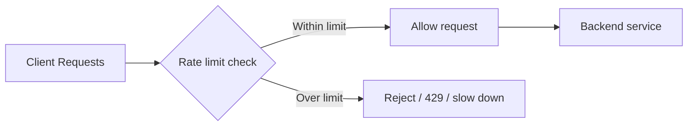
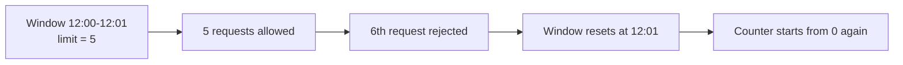
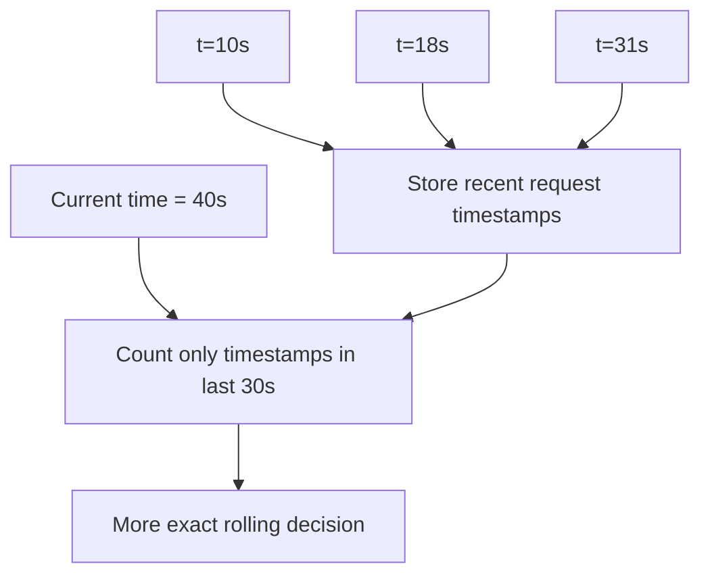
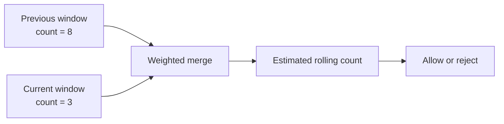
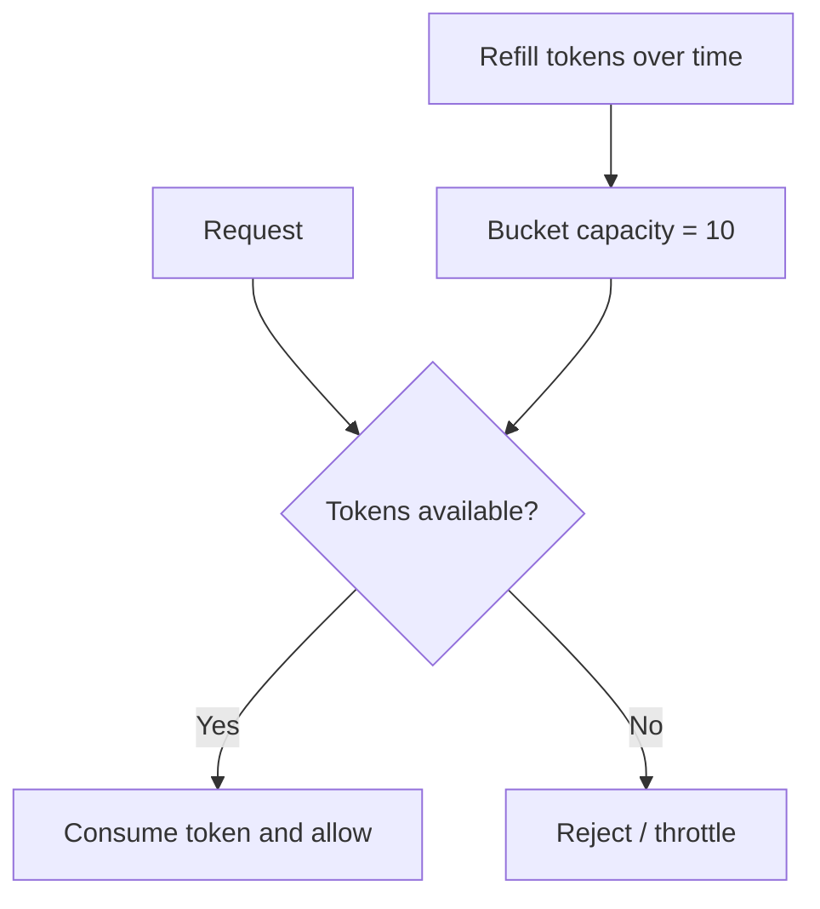
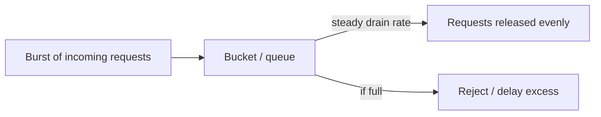

# Rate Limiting

## 1. Overview

Rate limiting is the practice of controlling how much work a client, user, tenant, token, IP, or system component is allowed to send within a defined period.

This is one of the most important defensive mechanisms in modern systems because it protects shared resources from overload, abuse, and unfair usage. Without rate limiting, one noisy actor can consume disproportionate capacity and degrade service for everyone else.

Rate limiting is not only about blocking attackers. It is also about shaping healthy traffic:

- protecting backends
- enforcing fairness
- controlling cost
- preserving latency objectives
- preventing retry storms from causing collapse

A good rate limiter is part policy engine, part protection system, and part fairness mechanism.

## 2. Visual Model

The simplest useful model is a request stream entering a gate that decides whether each request should pass or be rejected or delayed.

The key design point is that the limiter protects the backend before overload becomes application failure:

- requests inside policy pass normally
- excess requests are stopped or shaped at the boundary
- fairness is enforced before resource exhaustion spreads downstream

## 3. The Core Problem

Every system has limited capacity:

- CPU
- memory
- network bandwidth
- database connections
- thread pools
- downstream quotas

If incoming traffic exceeds safe capacity, the system may:

- become slow
- start timing out
- trigger retries that worsen the problem
- fail for well-behaved users because of a few abusive or buggy clients

Example:

1. An API normally handles 10,000 requests per minute.
2. One client starts sending 50,000 requests per minute due to a bug or aggressive retry loop.
3. Backend latency rises.
4. Other clients begin failing even though they did nothing wrong.

Rate limiting exists to stop that kind of shared-resource collapse.

## 4. Formal Statement

Rate limiting is a control mechanism that restricts the number of requests or operations allowed for a subject within a defined interval or according to a refill policy.

A rate-limiting design has to define:

- what entity is being limited
- what counts as one unit
- what the limit is
- what time model is used
- where enforcement happens
- what happens when the limit is exceeded

The goal is not simply denial. The goal is controlled admission to shared resources.

## 5. Key Terms

### 5.1 Subject

The subject is the thing being limited.

Examples:

- API key
- user ID
- IP address
- tenant
- service instance

### 5.2 Quota

A quota is the allowed amount of activity in a time window or according to a refill policy.

### 5.3 Burst

A burst is a short spike above the average request rate.

Some algorithms allow bursts intentionally, others do not.

### 5.4 Refill Rate

In token-based systems, the refill rate controls how quickly new capacity becomes available.

### 5.5 429 Too Many Requests

`429` is the common HTTP response used when a client exceeds allowed rate.

### 5.6 Global vs Local Limits

- **local** limits are enforced on one node
- **global** limits are coordinated across a fleet

Global limits are harder because they require shared state or coordination.

### 5.7 Fairness

Fairness means one subject should not consume a disproportionate share of a shared resource.

### 5.8 Load Shedding vs Rate Limiting

They are related but not identical.

- **rate limiting** enforces policy or fairness boundaries
- **load shedding** drops work because the system is overloaded right now

Rate limiting is usually more deliberate. Load shedding is often a last-resort protective response.

## 6. What It Really Means

Rate limiting is an admission-control policy.

It says:

- not every request that arrives is entitled to immediate service
- shared systems need boundaries
- fairness and system safety must be enforced before saturation

This matters especially in distributed systems because overload rarely stays local.

One overloaded backend causes:

- slower responses
- more retries
- more queueing
- more thread and connection pressure
- wider blast radius

A good rate limiter reduces that amplification early.

## 7. Main Algorithms and Modes

### 7.1 Fixed Window

Counts requests in a fixed interval such as one minute.

What to notice:

- counting is simple because the counter resets at known boundaries
- the reset creates edge effects
- a client can burst near the end of one window and again at the start of the next

Strengths:

- simple
- cheap to implement

Costs:

- boundary effects can allow bursts at window edges

### 7.2 Sliding Window Log

Stores timestamps of recent requests and evaluates a rolling window.

What to notice:

- the limiter keeps actual recent request times
- the decision is based on a moving window, not a reset boundary
- accuracy improves, but the storage and bookkeeping cost rise

Strengths:

- more accurate
- smoother behavior

Costs:

- more storage and bookkeeping

### 7.3 Sliding Window Counter

Approximates a rolling window using counters from adjacent windows.

What to notice:

- the system avoids storing every request timestamp
- it estimates a rolling count using neighboring windows
- this is cheaper than a full log but less exact

Strengths:

- smoother than fixed window
- cheaper than full logs

Costs:

- still approximate

### 7.4 Token Bucket

Tokens accumulate at a refill rate and requests spend tokens.

What to notice:

- unused capacity is stored as tokens
- short bursts are allowed if enough tokens have accumulated
- long sustained excess traffic still gets limited once the bucket empties

Strengths:

- allows controlled bursts
- widely useful
- intuitive for API traffic

Costs:

- still needs shared coordination for global enforcement

### 7.5 Leaky Bucket

Requests are processed at a steady outflow rate.

What to notice:

- incoming traffic can be bursty
- outgoing traffic is shaped into a steadier flow
- this is useful when the downstream system needs smooth load rather than spiky arrival patterns

Strengths:

- smooth output rate
- useful for shaping traffic

Costs:

- less burst-friendly
- may queue or delay work depending on implementation

## 8. Where Rate Limiting Is Applied

### Edge / API Gateway

Common for:

- public APIs
- abuse protection
- per-key or per-IP controls

### Application Layer

Useful when:

- the subject is business-specific
- quotas depend on plan, tenant, or internal rules

### Downstream Protection

Sometimes rate limiting protects fragile dependencies:

- third-party APIs
- databases
- internal services with strict concurrency or quota limits

The placement matters because earlier enforcement is usually cheaper and safer.

## 9. Supporting Mechanisms and Related Ideas

### 9.1 Distributed Coordination

Global rate limits are difficult because multiple servers may receive requests for the same subject at the same time.

Common approaches include:

- centralized counters
- Redis-backed token buckets
- approximate local limits with periodic sync

### 9.2 Retries and Backoff

Rate limiting and retry behavior must align.

If clients retry aggressively after being limited, the limiter may reduce symptoms without fixing the traffic pattern.

### 9.3 Fairness by Tenant or Plan

Many systems limit not just per user, but per tenant or service tier.

This matters for:

- multi-tenant SaaS
- paid API plans
- internal platform governance

### 9.4 Backpressure and Load Shedding

Rate limiting is preventive. Backpressure and shedding are reactive safety tools.

Well-designed systems often use all three.

### 9.5 Observability

A rate limiter needs visibility into:

- allowed requests
- rejected requests
- near-limit traffic
- hot subjects
- degraded backends

Without that, policies are hard to tune safely.

## 10. Real-World Examples

### 10.1 Public API Limits

An API provider may allow 1,000 requests per minute per API key.

Why it works:

- prevents abuse
- creates predictable capacity planning
- supports pricing tiers

### 10.2 Login Protection

Authentication endpoints are often rate-limited by IP, account, or device.

Why it works:

- reduces brute-force attacks
- protects expensive auth infrastructure

### 10.3 Internal Service Protection

A service may rate-limit calls to a fragile downstream dependency.

Why it works:

- prevents overload from propagating
- protects expensive or low-capacity integrations

### 10.4 Multi-Tenant SaaS

A large tenant may be allowed more traffic than a small tenant, but still within bounded policy.

Why it works:

- supports fairness and paid tiers
- prevents one tenant from collapsing shared capacity

## 11. Common Misconceptions

### "Rate Limiting Is Only for Security"

It is also a core resilience and fairness mechanism.

### "One Global Limit Is Enough"

Often it is not.

Different subjects may need:

- per-IP limits
- per-user limits
- per-tenant limits
- per-endpoint limits

### "Rejecting Requests Means the System Is Failing"

Not necessarily.

Sometimes rejecting excess work is the correct behavior because it preserves the rest of the system.

### "A Limit Value Is Just a Product Decision"

It is also a capacity and reliability decision.

Poorly chosen limits either fail to protect the system or throttle legitimate traffic unnecessarily.

### "Rate Limiting Solves Overload by Itself"

It helps, but it must work with:

- retries and backoff
- load shedding
- autoscaling
- queueing
- admission control deeper in the stack

## 12. Design Guidance

Start with what needs protection and who should be treated fairly.

Questions worth asking:

- what resource is being protected
- who is the subject of the limit
- should bursts be allowed
- where should enforcement happen
- does the limit need to be global or local
- what should the client do after rejection
- how will the policy be observed and tuned

Prefer token bucket when:

- bursts are acceptable within a bounded average rate

Prefer sliding approaches when:

- smoother enforcement is important

Prefer edge enforcement when:

- the goal is cheap rejection and broad abuse control

Prefer application-aware enforcement when:

- limits depend on business identity or plan logic

Useful patterns:

- return clear `429` responses with retry hints where possible
- combine rate limiting with exponential backoff guidance
- protect fragile dependencies separately from public edge policy
- monitor near-limit traffic before incidents force emergency tuning

The strongest rate limiter is one that preserves healthy traffic while containing unhealthy traffic early.

## 13. Summary

Rate limiting is one of the simplest and most effective ways to protect shared systems from overload and unfair consumption.

Its job is not just to reject requests. Its job is to enforce safe admission so the system stays usable under normal traffic, abuse, and accidental client bugs.

That is the central tradeoff:

- stricter limits protect capacity and fairness
- stricter limits can also reject legitimate bursts if the policy is poorly designed

Strong rate limiting is not just a gate. It is a deliberate control layer for system health.
