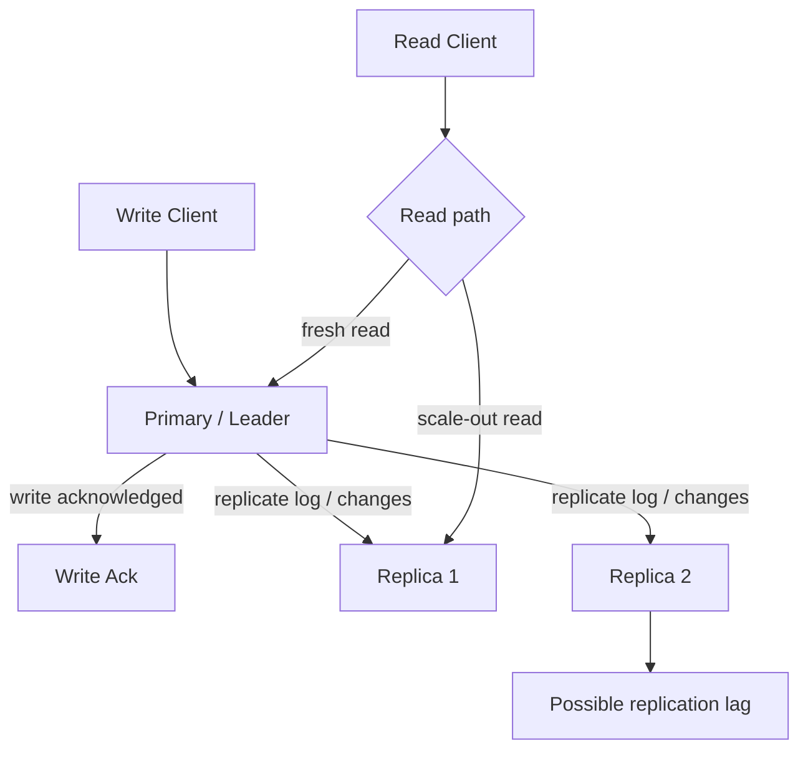
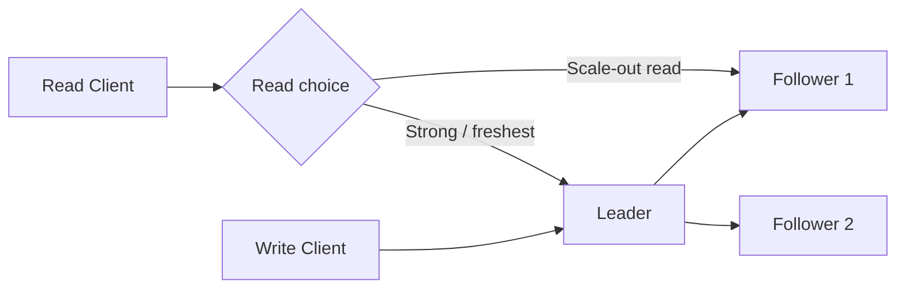
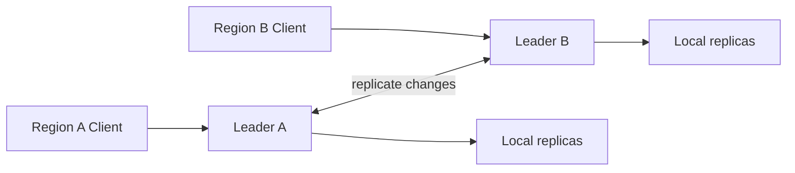
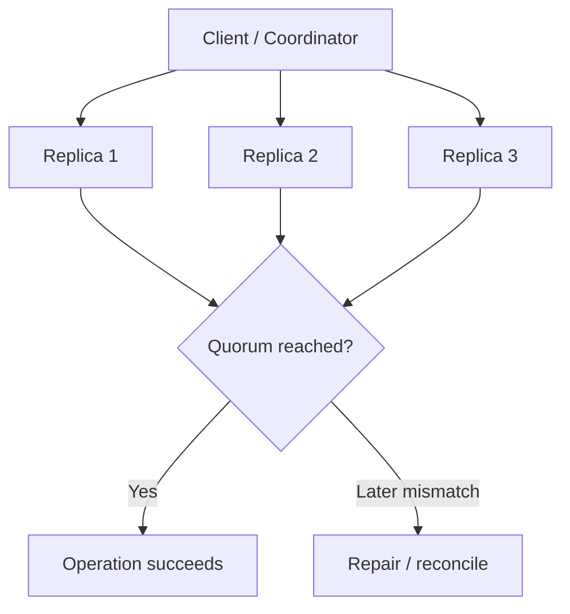
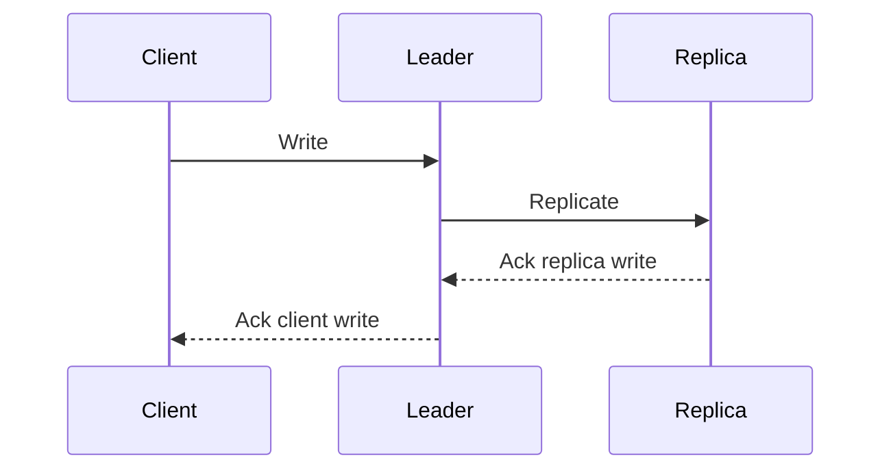
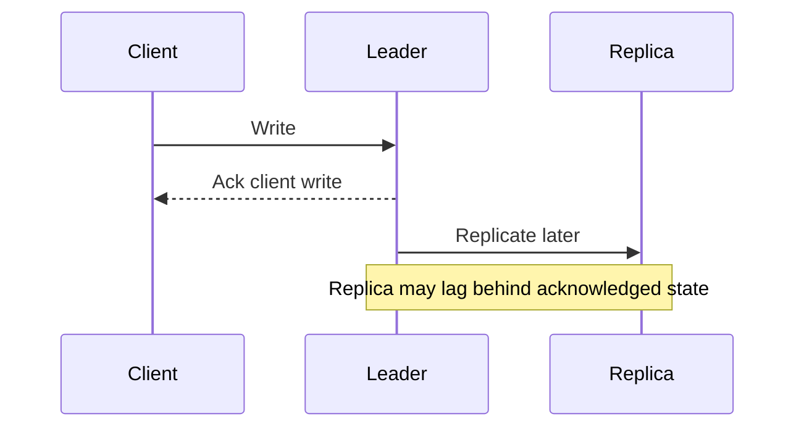
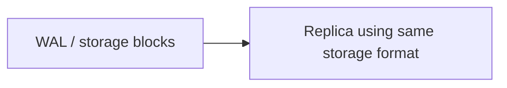
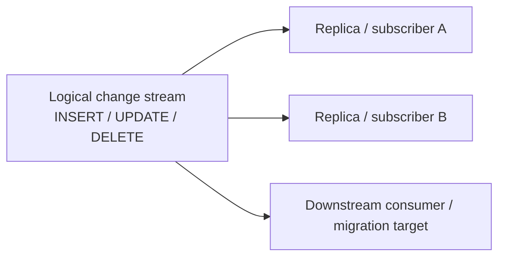

# Replication

## 1. Overview

Replication is the practice of keeping multiple copies of the same data across different machines, processes, or locations.

At first glance, replication sounds simple: copy data from one place to another so the system is safer and faster. In practice, replication is one of the central design choices in distributed systems because the moment multiple copies exist, the system has to answer hard questions about ordering, freshness, failure, and recovery.

Replication exists because one copy of data is rarely enough for a serious system. Systems replicate data to survive machine failures, serve read traffic at scale, reduce latency by placing data closer to users, and make maintenance possible without total downtime.

But replication is never free. Every additional copy improves fault tolerance and scalability while also creating new coordination problems. That tension is what makes replication such a foundational concept.

## Visual Model

Leader-based replication is the easiest starting point for visualizing how writes and reads move through a replicated system.

This model immediately surfaces the important questions:

- where writes are ordered
- where stale reads can emerge
- why read scaling and freshness are often in tension

## 2. The Core Problem

A single-node database is simple in one important way: there is exactly one authoritative copy of the data.

Once data is replicated, the system must deal with questions that do not exist in the single-copy case:

- which replica should accept writes
- when does a write count as committed
- how quickly must other replicas apply it
- what happens if replicas disagree
- what happens if the primary fails after accepting a write but before propagating it
- what should readers see while replicas are catching up

These are not edge cases. They define the behavior of the system under load and failure.

Example:

1. A user updates their email address.
2. The primary database acknowledges the write.
3. One replica receives the update immediately.
4. Another replica is lagging by two seconds.
5. A read is routed to the lagging replica.

Should the system return the old email address or route the read elsewhere? That question is not just about performance. It is about what guarantees the replicated system makes to clients.

## 3. Formal Statement

Replication is a strategy in which the same logical dataset is maintained on multiple nodes to improve availability, durability, read scalability, geographic reach, or operational resilience.

A replication design has to define:

- where writes are accepted
- how updates are propagated
- when updates are considered durable
- how replicas recover after lag or failure
- how conflicts are prevented or resolved
- what read consistency guarantees the replicas provide

Replication by itself does not imply strong consistency, eventual consistency, high availability, or fault tolerance. Those outcomes depend on the replication model and the rules used to coordinate copies.

## 4. Key Terms

### 4.1 Primary

The primary is the node that acts as the main authority for writes in a leader-based replication model.

It usually:

- accepts writes
- orders those writes
- propagates them to replicas

This is also called a leader or master in some systems.

### 4.2 Replica

A replica is another copy of the data maintained by the system.

Replicas may be used for:

- failover
- read scaling
- disaster recovery
- geographic distribution

Not all replicas serve the same purpose. Some are optimized for fast failover, some for distant reads, and some only for backup or recovery.

### 4.3 Synchronous Replication

In synchronous replication, a write is not considered committed until one or more replicas acknowledge it.

This improves durability and freshness guarantees, but adds coordination cost and can increase write latency.

### 4.4 Asynchronous Replication

In asynchronous replication, the primary acknowledges the write before all replicas have applied it.

This improves write latency and availability, but creates a window where acknowledged writes may not yet exist on all replicas.

### 4.5 Replication Lag

Replication lag is the delay between a write being accepted on one node and that write becoming visible on another replica.

Lag is one of the most important practical properties of a replicated system because it directly affects stale reads, failover safety, and user-visible correctness.

### 4.6 Failover

Failover is the process of switching traffic from a failed or unhealthy node to another replica.

The quality of failover depends on whether the replacement replica has the latest committed state.

### 4.7 Split Brain

Split brain happens when two or more nodes each believe they are the correct authority for the same data and continue accepting writes independently.

This is one of the most dangerous failure modes in replicated systems because it can produce conflicting histories that are difficult or impossible to reconcile safely.

### 4.8 Single-Leader, Multi-Leader, and Leaderless

These are broad families of replication models:

- **single-leader**: one node orders writes
- **multi-leader**: multiple nodes can accept writes
- **leaderless**: clients coordinate reads and writes across replicas without a permanent single writer

The rest of the replication design follows from this choice.

## 5. What It Really Means

Replication is often introduced as a reliability feature, but in practice it is a tradeoff engine.

It gives systems important capabilities:

- survive node failure
- scale reads
- keep services running during maintenance
- place data closer to users

At the same time, it introduces hard questions:

- how much stale data is acceptable
- how much write latency is acceptable
- how much coordination is acceptable
- how much operational complexity is acceptable

A replicated system is not just "one database plus backups." It is a distributed protocol for maintaining enough agreement between copies that the application still behaves correctly.

That is why replication is tightly connected to consistency models, CAP, quorum systems, and consensus.

## 6. Why the Constraint Exists

Consider a system with a primary and two replicas.

1. Client A writes `shipping_address = New Delhi`.
2. The primary accepts and acknowledges the write.
3. Replica `R1` receives the change.
4. Replica `R2` is briefly disconnected and misses the update.
5. The primary crashes before `R2` catches up.

Now the system must answer several questions:

- Can `R1` safely become the new primary?
- What if `R2` is elected instead?
- If a read goes to `R2`, should it return the old address?
- If the primary acknowledged the write but the only up-to-date replica is lost, was the write really durable?

This is the core constraint of replication: multiple copies improve resilience, but only if the system can reason about which copies are authoritative and current.

Without that reasoning, replication can make a system look safer while actually making correctness less predictable.

## 7. Main Variants or Modes

### 7.1 Single-Leader Replication

In single-leader replication, one node accepts writes and sends changes to follower replicas.

What to notice:

- all writes pass through one authority, so ordering is straightforward
- followers are replicas of leader state, not independent write authorities
- the main tradeoff is simple correctness versus leader bottlenecks and stale follower reads

How it behaves:

- all writes go through one authority
- replicas apply updates in the leader's order
- reads may be served by the leader or by followers

Strengths:

- simple write path
- easier conflict prevention
- easier to reason about ordering

Costs:

- the leader can become a bottleneck
- failover must be handled carefully
- follower reads may be stale

Where it fits:

- relational databases with read replicas
- many operational datastores
- systems that want simple write ordering with moderate scale

### 7.2 Multi-Leader Replication

In multi-leader replication, more than one node can accept writes.

What to notice:

- local writes become faster because each region can accept writes nearby
- replication now happens between leaders, not only from one authority outward
- the cost of lower write latency is conflict handling whenever leaders accept overlapping changes

How it behaves:

- each leader accepts local writes
- leaders replicate changes to each other
- conflicting updates are possible

Strengths:

- good write locality across regions
- better tolerance of regional isolation for local traffic
- reduced write latency for geographically distributed users

Costs:

- conflict detection and resolution become mandatory
- operational behavior is harder to reason about
- application semantics must tolerate concurrent divergence

Where it fits:

- collaborative systems
- partially disconnected environments
- systems where local write availability matters more than strict global ordering

### 7.3 Leaderless Replication

In leaderless replication, no permanent primary orders all writes.

What to notice:

- the client or coordinator talks to several replicas directly
- success depends on quorum policy rather than one leader's acknowledgment
- divergence is not exceptional in this model, so repair and reconciliation are part of normal operation

How it behaves:

- clients or coordinators send reads and writes to multiple replicas
- quorums are often used to determine success
- replicas may reconcile differences later

Strengths:

- avoids a fixed single write authority
- can provide high availability under some failure conditions
- can work well with eventually consistent designs

Costs:

- conflict handling is more complex
- stale reads are common unless quorums are chosen carefully
- repair and reconciliation are part of normal operation

Where it fits:

- Dynamo-style key-value stores
- large-scale systems that prioritize availability and partition tolerance

### 7.4 Synchronous vs Asynchronous Replication

This is an orthogonal choice to leader model and is often the most important practical tradeoff.

#### Synchronous Replication

What to notice:

- the client acknowledgment waits on replica acknowledgment
- this improves durability and failover freshness
- it also makes write latency depend on replica responsiveness

Benefits:

- stronger durability
- lower risk of losing acknowledged writes
- fresher failover targets

Costs:

- higher write latency
- lower write availability during network issues
- more coupling between nodes

#### Asynchronous Replication

What to notice:

- the client gets a faster acknowledgment because replication is deferred
- this improves write latency and resilience to slow replicas
- it creates a window where acknowledged writes may not yet exist on failover targets

Benefits:

- faster writes
- better resilience to slow replicas
- simpler scaling for read-heavy systems

Costs:

- acknowledged writes may still be missing on some replicas
- failover may lose recent data
- readers may see stale values

### 7.5 Physical vs Logical Replication

Replication can copy data at different levels.

#### Physical Replication

Copies low-level storage changes.

What to notice:

- the replica receives low-level engine-native changes
- this is efficient for like-for-like replicas
- it is excellent for exact copies, but less flexible for selective downstream use

Characteristics:

- efficient for identical storage engines
- good for exact copies
- less flexible for schema transformations or heterogeneous consumers

#### Logical Replication

Copies higher-level change events such as row updates or domain events.

What to notice:

- the change is represented semantically rather than as raw storage mutation
- different subscribers can consume the same stream for different purposes
- flexibility improves, but semantic complexity and mapping responsibility increase

Characteristics:

- more flexible
- easier to route subsets of data
- useful for downstream consumers and migrations
- usually more complex semantically

## 8. Supporting Mechanisms and Related Ideas

### 8.1 Write-Ahead Logs

Many replicated systems rely on a write-ahead log or equivalent ordered change stream.

Why it matters:

- it gives replicas a deterministic sequence of updates
- it supports recovery and replay
- it helps replicas catch up after lag or restart

The log is often the real replication contract, not just the table state.

### 8.2 Quorums

Quorums are commonly used in replicated systems to decide when reads or writes succeed.

With:

- `N` total replicas
- `W` replicas required for a write
- `R` replicas required for a read

If `R + W > N`, reads and writes overlap at at least one replica, which can help preserve freshness for successful operations.

Quorums are not a replacement for a replication design. They are one of the tools that define how replicas cooperate.

### 8.3 Read Repair and Anti-Entropy

Replicas do not always stay aligned automatically.

Systems often need background correction mechanisms:

- **read repair**: fix stale replicas during reads
- **anti-entropy**: background synchronization between replicas

These mechanisms matter more in eventually consistent or leaderless systems where divergence is expected.

### 8.4 Consistency Models

Replication creates the need for consistency rules.

Examples:

- can followers serve reads safely
- does a client see its own write immediately
- can different clients observe different values temporarily

Consistency models define what replicated state is allowed to look like from the application's perspective.

### 8.5 Consensus and Leader Election

In leader-based systems, replication safety often depends on choosing one valid authority at a time.

Consensus and leader election are the mechanisms that help prevent:

- split brain
- conflicting primaries
- unsafe failovers

Without these mechanisms, replication can amplify failures instead of containing them.

## 9. Real-World Examples

### 9.1 Read Replicas in a Relational Database

A common setup uses one primary for writes and multiple replicas for reads.

Why it works:

- write ordering stays simple
- read throughput improves
- failover is possible if a replica is up to date

Tradeoff:

- follower reads may lag
- applications must decide which queries require fresh data

### 9.2 Multi-Region User Data

A globally distributed application may want local writes in multiple regions to reduce latency.

Why this is attractive:

- users write close to where they are
- regional outages do not stop all writes everywhere

Tradeoff:

- concurrent updates can conflict
- reconciliation logic becomes part of application correctness

### 9.3 Object Storage

Object storage systems often replicate data across multiple devices or zones before treating it as durable.

Why this matters:

- hardware failures are common at scale
- durability depends on surviving multiple independent failures

Tradeoff:

- writes may take longer before acknowledgment
- the storage layer is doing significant coordination behind the scenes

### 9.4 Distributed Key-Value Stores

Some key-value stores use leaderless replication with tunable quorums.

Why it works:

- availability can remain high
- clients can choose different read and write behaviors

Tradeoff:

- conflict resolution and repair become normal operating concerns
- the effective consistency depends heavily on configuration

## 10. Common Misconceptions

### 10.1 "Replication Is Just Backup"

It is not.

Backups are point-in-time recovery artifacts. Replication is an online mechanism for maintaining multiple live copies.

Replication helps with availability and scale. Backups help with recovery from corruption, accidental deletion, or historical rollback. A system usually needs both.

### 10.2 "More Replicas Automatically Mean More Safety"

More replicas can improve resilience, but only if the system can coordinate them correctly.

Bad failover logic, stale replicas, or split brain can make a heavily replicated system behave less safely than a simpler one.

### 10.3 "Asynchronous Replication Is Fine Unless There Is a Big Outage"

Even small lag windows matter.

They can cause:

- stale reads
- lost acknowledged writes during failover
- inconsistent decisions across services

Asynchronous replication is often the right choice, but its failure window has to be treated as part of the design.

### 10.4 "Read Replicas Are Safe for All Reads"

They are safe only if the application can tolerate stale data or if the routing layer enforces freshness guarantees.

Without that discipline, read replicas create subtle correctness bugs.

### 10.5 "Multi-Leader Always Means Higher Availability"

It can improve local write availability, but the cost is much more complex conflict behavior.

If the application cannot safely merge concurrent updates, multi-leader replication can create more operational pain than value.

## 11. Design Guidance

Choose a replication strategy by starting with failure semantics, not topology diagrams.

Questions worth asking:

- can the system tolerate stale reads
- can it tolerate losing a recently acknowledged write
- what is the maximum acceptable replication lag
- does write latency matter more than freshness
- does the system need regional write locality
- can the domain safely merge concurrent updates
- what failover behavior is acceptable

Prefer single-leader replication when:

- write ordering should be simple
- conflicts should be prevented rather than merged
- the system mainly scales through reads

Prefer multi-leader replication when:

- local writes in multiple regions are important
- disconnected or semi-connected operation must continue
- conflicts can be reconciled safely at the domain level

Prefer leaderless replication when:

- availability under partition is a primary goal
- tunable read/write behavior is useful
- the system is designed to handle repair and reconciliation explicitly

Prefer synchronous replication when:

- losing acknowledged writes is unacceptable
- failover freshness matters more than raw write latency

Prefer asynchronous replication when:

- low latency is critical
- some lag is acceptable
- the application can tolerate stale reads or handle recovery complexity

The strongest designs are explicit about which data needs which replication policy. Most large systems do not use one replication model everywhere.

## 12. Reusable Takeaways

- Replication means maintaining multiple live copies of the same logical data.
- Replication improves durability, availability, and read scale, but introduces coordination problems.
- The most important replication decisions are where writes go, when they commit, and what readers are allowed to observe.
- Synchronous replication improves safety but increases latency and reduces tolerance for slow links.
- Asynchronous replication improves speed and availability but creates lag and failover risk.
- Single-leader, multi-leader, and leaderless replication solve different problems and fail in different ways.
- Replication is tightly connected to consistency models, quorums, consensus, and recovery strategy.

## 13. Summary

Replication is one of the core mechanisms that makes modern distributed systems practical.

It allows systems to survive failures, scale reads, and operate across regions. But every extra copy of data creates a new requirement: the system must explain how those copies stay aligned and what happens when they do not.

That is the central truth of replication:

- more copies increase resilience
- more copies also increase coordination complexity

A good replication design is not the one with the most replicas. It is the one whose failure behavior matches the needs of the system.
