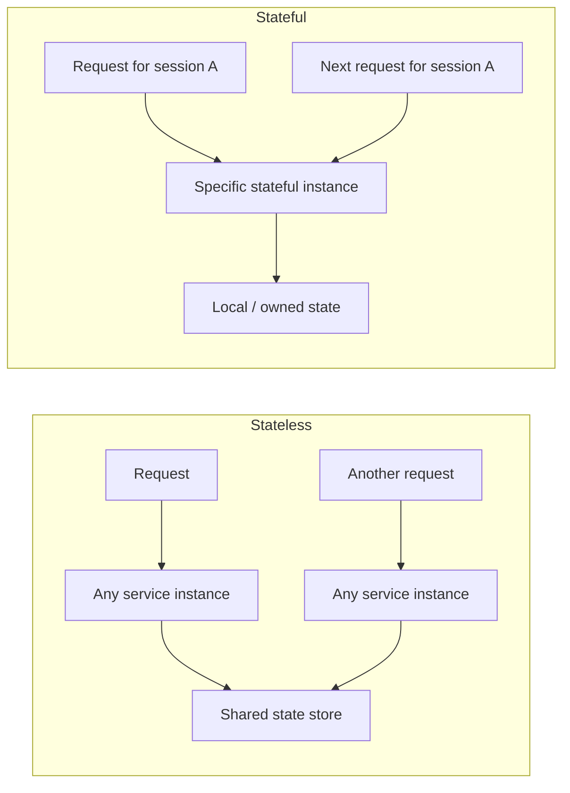
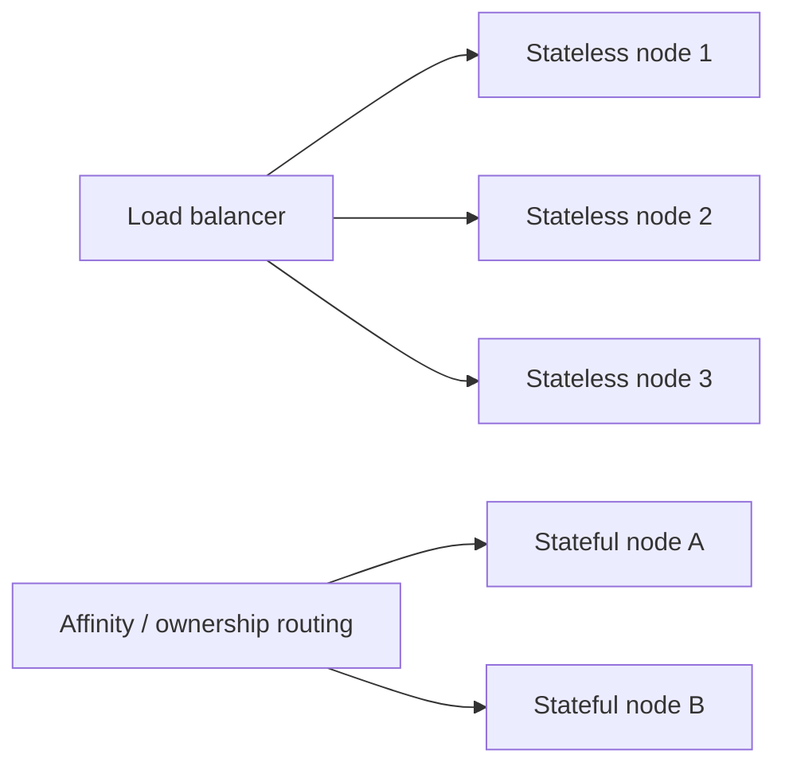

# Stateless vs Stateful Services

## 1. Overview

Stateless and stateful services differ in one core way:

> Does the service instance need to remember client-specific or workflow-specific state locally between requests?

This distinction matters because it directly affects scaling, failover, routing, deployment strategy, and operational complexity.

Stateless services are generally easier to scale and replace because any healthy instance can usually handle any request. Stateful services can still be the right design, but they demand stronger thinking around placement, persistence, recovery, and coordination.

## 2. Why This Matters

Many systems start effectively stateless at the service layer because that makes:

- load balancing easier
- autoscaling easier
- deployments safer
- failure recovery simpler

But not all workloads fit that model.

Some services naturally need local or durable state:

- databases
- caches
- stream processors
- websocket session coordinators
- consensus or metadata services

The right design depends on whether state is essential to the service role and whether that state can be externalized safely.

## 3. Visual Model

What to notice:

- stateless services push durable state to shared systems and keep instances interchangeable
- stateful services bind some requests or data ownership to specific instances

## 4. Stateless Services

A stateless service does not rely on local in-memory state from previous requests to process the current one.

That usually means:

- any instance can serve any request
- local restarts are cheap
- scaling horizontally is straightforward

Examples:

- many HTTP application servers
- simple API gateways
- request processing services that use external databases or caches

### Benefits

- easy load balancing
- easy autoscaling
- easier rolling deploys
- simpler failover

### Costs

- shared state must live elsewhere
- external data stores may become bottlenecks
- some workflows may require extra lookups or tokens to reconstruct context

## 5. Stateful Services

A stateful service keeps important state locally or owns a portion of system state directly.

Examples:

- databases
- distributed caches
- message brokers
- coordination services
- per-session in-memory systems

### Benefits

- can preserve locality
- can reduce repeated reconstruction work
- may fit the workload naturally

### Costs

- scaling is harder
- failover is harder
- data movement and recovery matter
- routing often needs affinity or ownership rules

## 6. Visual Model: Routing Difference

What to notice:

- stateless routing optimizes interchangeability
- stateful routing usually needs stickiness, partition ownership, or explicit placement logic

## 7. Where State Lives

State does not disappear just because the service layer is stateless.

It is often moved into:

- databases
- distributed caches
- object stores
- message queues
- tokens or cookies

That is an important design point:

- stateless services reduce statefulness at the compute layer
- they often increase the importance of shared backing stores

## 8. Common Patterns

### Session Externalization

Instead of storing session data in application memory, store it in:

- Redis
- database-backed session store
- signed tokens where appropriate

This lets any instance serve the request.

### Sticky Sessions

Sticky routing sends the same client repeatedly to the same instance.

This can help stateful behavior temporarily, but it reduces flexibility and failover quality.

### Partitioned Stateful Ownership

Some systems intentionally assign data ownership to specific nodes.

Examples:

- shard ownership
- topic partition ownership
- key range ownership

This is a valid design, but it requires explicit recovery and rebalancing logic.

## 9. Supporting Mechanisms and Related Ideas

### 9.1 Load Balancing

Stateless services pair naturally with simple load balancing. Stateful services often need affinity or partition-aware routing.

### 9.2 Replication

Stateful services often need replication to preserve durability and availability.

### 9.3 Partitioning

Many stateful systems scale by partitioning state across instances rather than trying to make every instance interchangeable.

### 9.4 Caching

Caching often creates stateful behavior at some layer even when the app tier is stateless.

### 9.5 Deployment Strategy

Stateless services are easier to rotate and replace. Stateful services require more careful draining, transfer, or failover behavior.

## 10. Real-World Examples

### Stateless API Tiers

Most web API fleets are designed to be stateless at the compute layer.

That allows any request to land on any healthy instance, which makes autoscaling, load balancing, and rolling deployments much simpler.

### Stateful Databases and Queues

Databases, brokers, and coordination systems are inherently stateful because the value they provide comes from persisted data, ordering, or ownership.

These systems need careful replication, failover, and placement strategies because moving or replacing an instance is not as trivial as rotating an API server.

### Session Handling in User-Facing Apps

A system may keep its application servers stateless while moving session state to Redis, a database, or signed client tokens.

That is a common design because it preserves the operational flexibility of stateless services without pretending the application has no state at all.

## 11. Common Misconceptions

### "Stateless Means No State Exists"

Wrong.

It only means the service instance is not relying on local remembered state between requests.

### "Stateful Services Are Bad Design"

Wrong.

Some workloads are naturally stateful, and forcing them into an unnatural stateless shape can make the system worse.

### "Sticky Sessions Make a Stateful System Equivalent to Stateless"

Wrong.

They only hide some routing complexity while preserving many failure and scaling drawbacks.

### "Stateless Services Automatically Scale Infinitely"

Wrong.

They still depend on shared data stores, downstream services, and network capacity.

### "All Modern Architectures Should Be Stateless"

Wrong.

Modern systems often mix stateless compute with stateful data infrastructure.

## 12. Design Guidance

Prefer stateless services by default when the workload allows it, because they make scaling and operations simpler.

Questions worth asking:

- does the instance really need local request-to-request memory
- can the state be externalized safely
- does routing need affinity
- what happens if the instance restarts
- how is state recovered or replicated
- is locality worth the operational cost

Use stateful design deliberately when:

- the service's job is to own or process state directly
- locality is central to performance or correctness
- externalizing the state would be more expensive or less safe

Useful patterns:

- keep compute stateless where possible
- keep state ownership explicit where necessary
- avoid accidental statefulness in the app tier
- do not hide statefulness with weak routing hacks alone

Good architecture is not about eliminating state. It is about putting state where it can be managed safely.

## 13. Summary

Stateless versus stateful services is really a question of where the system chooses to keep and manage state.

Stateless services improve interchangeability, scaling, and operational simplicity. Stateful services support workloads where state ownership, locality, or in-memory continuity are essential.

That is the core tradeoff:

- statelessness simplifies the compute layer
- statefulness can better fit some workloads, but increases routing, recovery, and scaling complexity

Strong systems are deliberate about where state lives and what that decision costs.
