# Distributed Cache

## 1. Problem Statement

Design a distributed cache similar to Redis used as a shared low-latency caching layer.

The system should let applications:

- read values by key
- write and update values
- set TTLs
- scale across many nodes
- survive node failures with bounded disruption

At small scale, this sounds simple:

- keep key-value pairs in memory
- evict when memory is full

At production scale, the system must handle:

- shard routing and topology change
- replication and failover
- hot keys and skewed traffic
- memory fragmentation and eviction
- optional persistence and recovery
- cache stampede and mass expiry

The hard part is not putting bytes in RAM.

The hard part is designing a system where:

- routing stays correct while the cluster changes
- writes and failover have well-defined semantics
- hot keys do not melt one shard
- expiration and eviction do not create latency spikes
- optional persistence does not destroy low-latency behavior

## 2. Scope and Assumptions

In scope:

- key-value operations
- TTL and expiration
- sharding
- replication
- failover
- eviction
- optional persistence for restart and recovery

Out of scope:

- full module ecosystem
- search indexes
- stream processing abstractions

Assumptions:

- most operations are small key-value reads or writes
- workloads are read-heavy but write traffic can still be large
- some deployments want pure cache behavior, others want restart durability
- traffic is skewed and hot keys are expected

## 3. Functional Requirements

The system must support:

- `GET`
- `SET`
- `DEL`
- TTL-based expiration
- topology-aware routing
- primary failover to replicas

Important secondary behaviors:

- pipelining or batched requests
- optional read replicas
- optional append-only or snapshot persistence
- hot-key mitigation
- topology updates to clients or proxies

## 4. Non-Functional Requirements

The most important non-functional requirements are:

- very low latency
- high throughput
- high availability
- predictable failover behavior
- bounded memory usage
- operationally safe rebalancing

Consistency requirements are mixed.

The system should strongly preserve:

- shard ownership metadata
- per-primary write ordering

The system can often tolerate:

- replica lag
- stale replica reads when explicitly allowed
- temporary reduction in hit rate during rebalance

The key design question is:

how much consistency do we give up in order to get lower latency and faster failover?

## 5. Capacity and Scale Estimation

Assume:

- 100 million active keys
- average value size around 1 KB
- replication factor of 2 or 3
- 1 million operations per second at peak

Raw value memory alone would be around:

- 100 GB for values

Real memory usage is much higher because of:

- key bytes
- metadata overhead
- allocator fragmentation
- replication buffers
- persistence buffers if enabled

A practical rule is that logical payload size can understate memory need by 1.5x to 3x.

Main scaling pressures:

- hot key concentration
- rebalance traffic
- failover correctness
- expiration storms

## 6. Core Data Model

Main entities:

- `KeyEntry`
- `TTLIndex`
- `ShardMap`
- `ReplicaOffset`
- `PersistenceLog`

### KeyEntry

Fields:

- key
- value
- type
- last access time
- logical version

### TTLIndex

Fields:

- key
- absolute expiry time
- expiration bucket or wheel slot

### ShardMap

Fields:

- slot or partition ID
- primary owner
- replica owners
- map version

### ReplicaOffset

Fields:

- primary node
- replica node
- replicated offset or sequence number
- lag status

### PersistenceLog

If enabled, stores:

- ordered write commands or state snapshots
- recovery point metadata

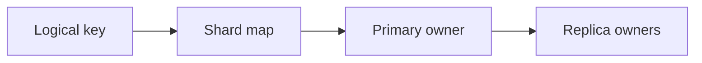

### Persistence Model

There is no single ideal storage mode for every cache deployment.

Common modes:

- pure in-memory cache with no durability
- append-only mutation log for faster crash recovery
- periodic snapshots for compact persistence
- combined append-only plus snapshots for stronger recovery

This matters because the system may serve two different roles:

- a disposable cache in front of a source of truth
- a low-latency state store where losing all data on restart is unacceptable

## 7. APIs or External Interfaces

### Read

`GET key`

### Write

`SET key value [ttl]`

### Delete

`DEL key`

### Expire

`EXPIRE key ttl`

### Batch

`MGET keys[]`

## 8. High-Level Design

At a high level, the system has six concerns:

1. routing and topology awareness
2. primary read and write serving
3. replication and failover
4. expiration and eviction
5. optional persistence
6. rebalance and hot-key protection

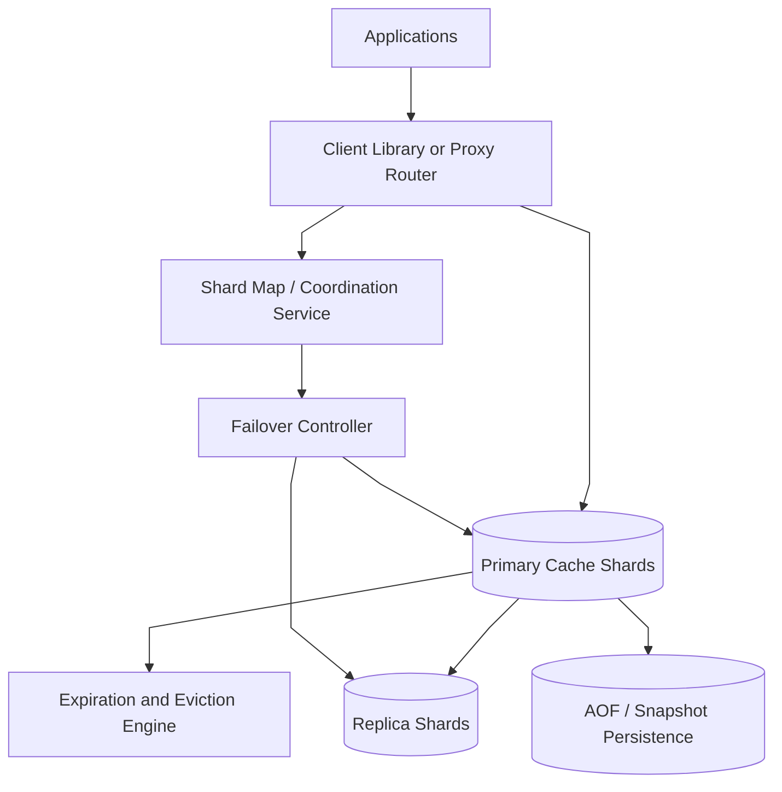

### Component Responsibilities

`Client Library or Proxy Router`

- routes requests to the correct shard
- refreshes topology when ownership changes
- may do request coalescing or retry logic

`Shard Map / Coordination Service`

- stores slot ownership and cluster membership
- versions topology changes

`Primary Cache Shards`

- own writes for their partitions
- serve low-latency reads
- manage in-memory data and replication streams

`Replica Shards`

- receive ordered mutations from primaries
- take over on failover
- optionally serve stale-tolerant reads

`Expiration and Eviction Engine`

- removes expired keys
- frees memory under pressure
- applies admission and eviction rules

`AOF / Snapshot Persistence`

- makes restart recovery faster when enabled
- trades extra write cost for lower data loss

`Failover Controller`

- monitors health and replica lag
- elects new primaries when the old owner fails

### What to Notice

- routing and topology are separate from in-memory data storage
- write ordering is primary-owned per shard
- expiration and eviction are not the same thing
- persistence is optional and should not be forced on all deployments

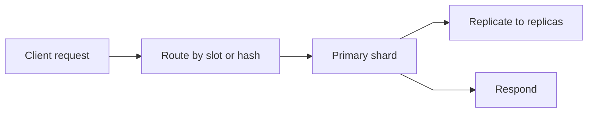

## 9. Request Flows

### Flow 1: Normal Write Path

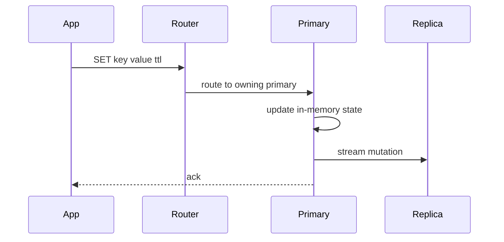

Possible write-ack policies:

- ack after primary memory update only
- ack after primary plus one replica

Those choices trade latency for durability.

### Flow 2: Read Path

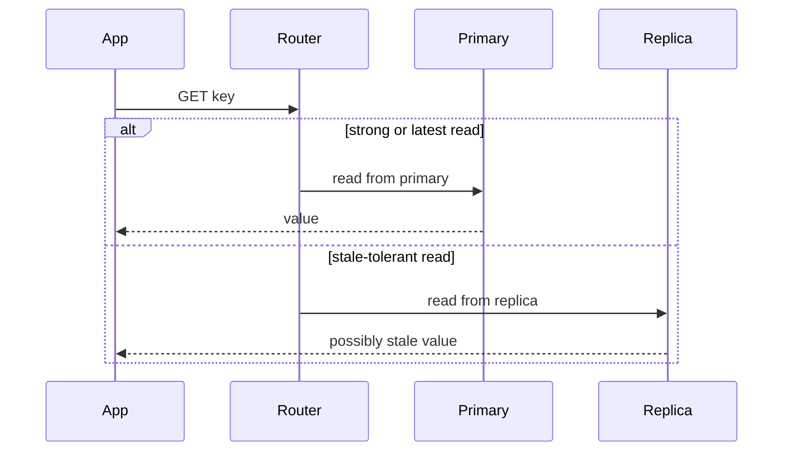

### Flow 3: Failover

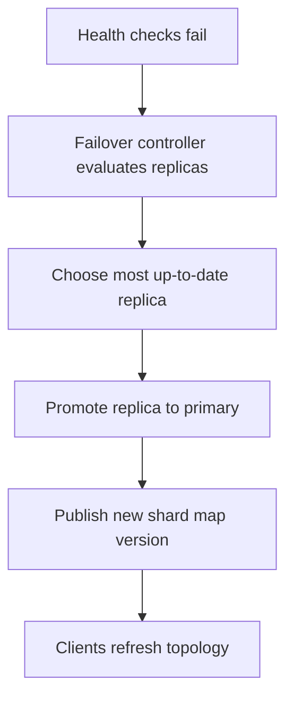

### Flow 4: Rebalance

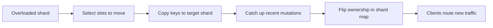

## 10. Deep Dive Areas

### Deep Dive 1: Partitioning and Routing

Two common approaches are:

- consistent hashing
- fixed slot map

A slot map is often easier to rebalance operationally.

Example:

- hash key into one of 16,384 logical slots
- assign slot ranges to shard owners
- move slots during rebalance without changing the whole hash function

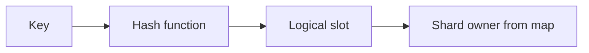

Why slot maps are useful:

- topology changes only update slot ownership
- clients can cache the map
- rebalancing moves selected slots rather than all keys

Client-side routing vs proxy routing:

- client-side routing removes one network hop and improves latency
- proxy routing centralizes topology knowledge and operational control

### Deep Dive 2: Replication, Consistency, and Failover

Replication is usually asynchronous.

That means writes can be acknowledged before all replicas have them.

The consequence is simple:

- a failover can lose the last few acknowledged writes if the old primary dies before replicas catch up

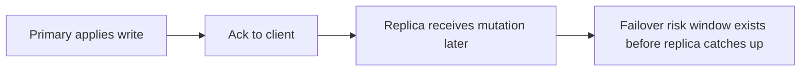

If stronger durability is needed, the system can:

- wait for at least one replica ack
- use semi-synchronous write acknowledgment

That improves safety but increases latency and reduces availability under replica lag.

Important edge cases:

- split brain if two nodes both believe they are primary
- clients writing with stale topology
- replica chosen for promotion while behind

Practical mitigations:

- topology versions
- fencing tokens or epoch numbers
- leader election through a coordination system
- reject writes from demoted primaries

### Deep Dive 3: Expiration Is Different from Eviction

These are often confused.

Expiration means:

- the application declared the key invalid after a time

Eviction means:

- the cache is under memory pressure and must choose a victim

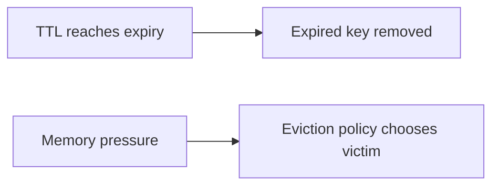

A good implementation usually combines:

- lazy expiration on access
- active background expiration scanning
- memory-aware eviction

If expiration is only lazy:

- memory can fill with dead keys

If expiration scanning is too aggressive:

- CPU spikes and latency suffers

### Deep Dive 4: Eviction and Admission Policies

Eviction is not just LRU.

Common choices:

- LRU approximation
- LFU or frequency-aware eviction
- TTL-aware eviction
- admission control that refuses to cache one-hit-wonder items

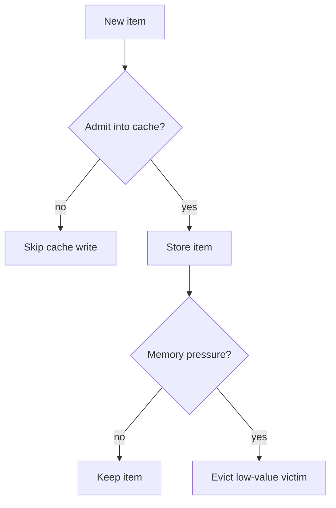

Why admission matters:

- blindly caching everything can evict high-value hot keys
- scan-heavy workloads can pollute the cache

### Deep Dive 5: Hot Keys, Stampede, and Mass Expiry

Real clusters usually fail from skew, not average load.

A single hot key can overwhelm one shard even if the cluster looks lightly loaded overall.

Typical mitigations:

- local per-process caches for extremely hot keys
- request coalescing
- key replication for read-mostly hotspots
- prewarming and jittered TTLs

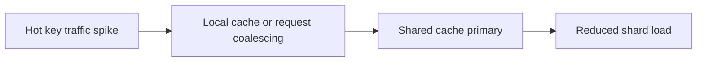

Cache stampede flow:

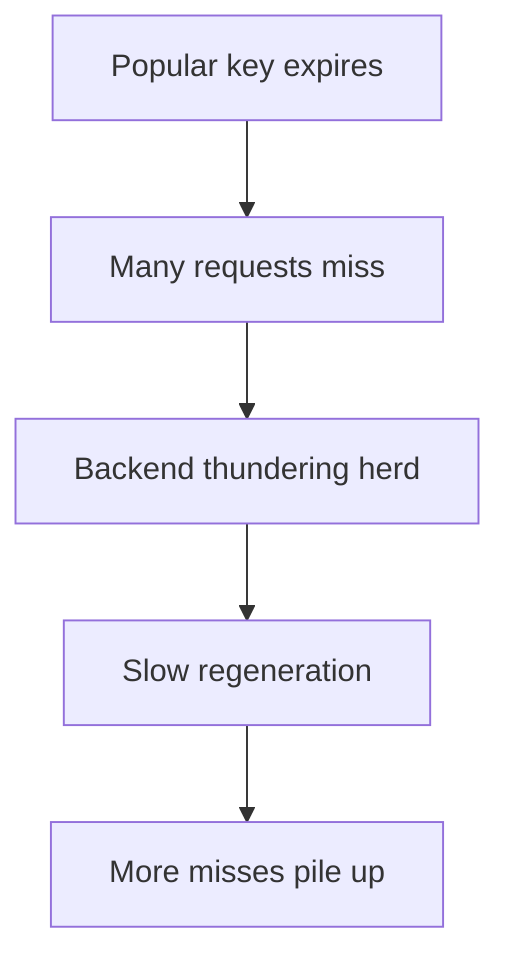

Mitigations:

- single-flight regeneration
- soft TTL with background refresh
- probabilistic early refresh
- TTL jitter so many keys do not expire together

## 11. Bottlenecks and Failure Modes

Likely bottlenecks:

- hot shards from uneven key distribution
- memory fragmentation reducing effective capacity
- replication backlog during write bursts
- proxy bottlenecks if a central router layer is undersized

Failure modes:

- failover promotes a stale replica and loses recent writes
- stale clients keep writing to the old primary
- expiration storms cause CPU spikes
- rebalance causes hit-rate collapse if too many slots move at once

Mitigations:

- monitor hot keys and shard skew explicitly
- version topology and force client refresh on mismatch
- pace rebalance traffic
- use TTL jitter and request coalescing

## 12. Scaling Strategy

A practical evolution path:

1. start with a single primary and optional replica
2. add sharding through slot-based routing
3. add automated failover and topology versioning
4. add persistence modes for faster restart where needed
5. introduce hot-key mitigation, admission control, and rebalance automation
6. regionalize clusters or use local caches near application clusters

## 13. Tradeoffs and Alternatives

Client-side routing vs proxy routing:

- client-side routing is lower latency and more scalable
- proxy routing is easier to operate and secure

Asynchronous replication vs stronger synchronous acks:

- asynchronous replication gives better latency
- stronger acks reduce data loss during failover

Pure cache vs persistence-enabled cache:

- pure cache is operationally simpler
- persistence-enabled cache shortens restart recovery and broadens use cases

LRU-style eviction vs LFU-style eviction:

- LRU adapts well to recency-driven workloads
- LFU handles stable hot sets better

## 14. Real-World Considerations

Production concerns usually include:

- multi-tenant isolation and noisy-neighbor control
- memory allocator behavior and fragmentation monitoring
- encryption and auth for shared cache clusters
- safe rolling restarts
- capacity headroom for failover
- operational tooling for key distribution and TTL diagnostics

The system should expose observability for:

- hit rate by shard
- hot key concentration
- replica lag
- eviction rate
- expiration scan time
- topology churn

## 15. Summary

The recommended design is a sharded in-memory cache with:

- topology-aware routing
- primary-owned write ordering
- asynchronous replication and controlled failover
- explicit expiration and eviction engines
- optional persistence for faster recovery
- hot-key and rebalance protections

The main architectural insight is that distributed cache design is less about a hash map in RAM and more about making topology change, replication semantics, memory pressure, and skew behave predictably.
