# Distributed File System

## 1. Problem Statement

Design a distributed file system similar to Google File System.

The system should let clients:

- create files
- read and write large files
- append records efficiently
- store data durably across many machines

At small scale, this sounds straightforward:

- split a file into chunks
- replicate chunks on multiple servers
- keep a metadata table that maps files to chunks

At production scale, the design becomes a metadata control plane plus a replicated chunk data plane.

Now the system must handle:

- large files and high aggregate throughput
- append-heavy workloads
- machine and rack failures
- stale replicas after crashes
- background repair and rebalancing
- metadata coordination without putting all bytes through one node

The hard part is not chunking a file.

The hard part is designing a system where:

- metadata stays manageable even when total storage is huge
- writes are ordered correctly without centralizing all data traffic
- under-replicated chunks are repaired safely
- record append semantics remain usable despite retries and failures

## 2. Scope and Assumptions

In scope:

- metadata namespace
- chunk placement and replication
- reads, writes, and record append
- lease-based write coordination
- failure repair and rebalancing

Out of scope for this version:

- full POSIX semantics
- very small file optimization
- end-user mount implementation
- object-store API compatibility

Assumptions:

- files are large and often written sequentially
- append-heavy analytics or log workloads are common
- chunk size is much larger than a traditional filesystem block
- metadata volume is small relative to data volume, but critical for correctness

## 3. Functional Requirements

The system must support:

- create and delete file metadata
- read byte ranges from files
- write byte ranges to files
- append records to files
- return chunk locations to clients
- replicate and repair chunk data

Important secondary behaviors:

- snapshots or cloning via copy-on-write metadata
- checksums for corruption detection
- stale replica detection
- rebalancing for skewed capacity or traffic

## 4. Non-Functional Requirements

The most important non-functional requirements are:

- high throughput for large sequential reads and writes
- durability through replication
- availability during machine failures
- bounded metadata latency
- efficient append path
- operationally safe repair

Consistency requirements are mixed.

The system should strongly preserve:

- file-to-chunk mapping
- chunk versioning
- write ordering within a lease epoch

The system can tolerate eventual consistency for:

- background replica repair
- rebalancing
- stale replica cleanup

The key design question is:

which decisions must be coordinated centrally, and which can happen in the client and chunkservers?

## 5. Capacity and Scale Estimation

Assume:

- 500 PB logical data
- 3x replication for most chunks
- 64 MB chunk size
- billions of chunks over time
- tens of GB/s aggregate throughput

If one chunk is 64 MB, then:

- 1 PB requires about 16 million chunks
- 500 PB requires about 8 billion logical chunks over long horizons

Even if active metadata is only a subset in memory, metadata scale matters.

Main pressure points:

- metadata memory footprint and recovery
- chunkserver disk and network throughput
- repair traffic after failures
- hot files or hot chunks for popular datasets

Large chunks reduce metadata amplification but increase:

- tail space waste
- recovery granularity
- hotspot impact when a single chunk becomes popular

## 6. Core Data Model

Main entities:

- `FileMetadata`
- `ChunkMetadata`
- `ReplicaMetadata`
- `ChunkLease`
- `OperationLog`

### FileMetadata

Represents namespace and file layout.

Fields:

- `file_id`
- logical path
- ordered chunk list
- file size
- attributes such as owner, ACL, and timestamps

### ChunkMetadata

Represents logical chunk state.

Fields:

- `chunk_id`
- `file_id`
- chunk index within file
- current version
- desired replica count
- checksum block references

### ReplicaMetadata

Represents physical chunk placement.

Fields:

- `chunk_id`
- `server_id`
- rack or zone
- replica state
- last reported version

### ChunkLease

Represents temporary write authority.

Fields:

- `chunk_id`
- primary replica server
- replica set
- lease expiry
- version epoch

### OperationLog

Represents the replicated metadata log.

It stores:

- namespace mutations
- chunk mapping changes
- lease assignments
- version changes

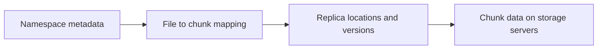

### Persistence Model

The system usually has three persistence layers:

- replicated metadata log and state machine for authoritative namespace state
- local chunk data files on chunkservers
- checksum and version metadata to detect corruption and stale replicas

This is usually not one relational database.

A common design is:

- metadata master backed by a replicated write-ahead log and checkpoints
- chunk data stored directly on chunkserver local filesystems
- periodic chunkserver heartbeats reporting replica state

That separation matters because:

- metadata writes require coordination and durability
- chunk bytes require throughput, not rich transactions
- repair needs versioned state, not only location state

## 7. APIs or External Interfaces

### Create File

`create(path, attributes)`

### Read Range

`read(path, offset, length)`

### Write Range

`write(path, offset, bytes)`

### Record Append

`append(path, record)`

### Get Chunk Locations

Internal control-plane call used by clients:

`lookup(path, chunk_index)`

## 8. High-Level Design

At a high level, the system has five concerns:

1. namespace and metadata management
2. chunk placement and version tracking
3. read and write data transfer
4. lease-based mutation ordering
5. repair and rebalancing

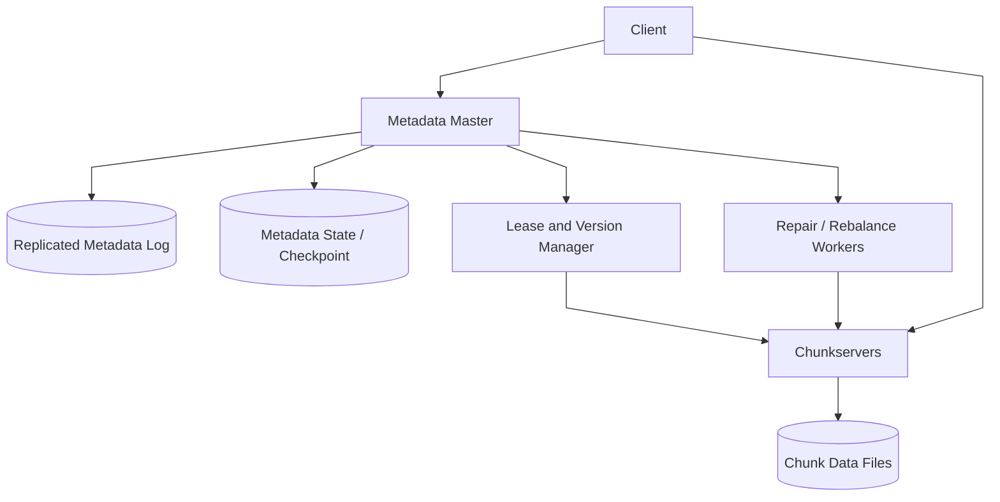

### Component Responsibilities

`Metadata Master`

- manages namespace and file-to-chunk mapping
- decides replica placement and lease assignment
- tracks chunk versions and server liveness

`Replicated Metadata Log`

- durably records metadata mutations
- supports recovery and follower replication

`Metadata State / Checkpoint`

- stores compact metadata snapshots for fast restart

`Chunkservers`

- store chunk bytes on local disks
- serve reads and participate in write pipelines
- report health, versions, and checksums

`Lease and Version Manager`

- chooses the primary replica for a chunk during a write epoch
- prevents concurrent write ordering ambiguity

`Repair / Rebalance Workers`

- recreate lost replicas
- move chunks for capacity balance
- remove stale replicas after version mismatch

### What to Notice

- clients fetch metadata first, then move bytes directly with chunkservers
- the master coordinates but does not proxy file data
- metadata durability and chunk durability are different problems
- repair is part of the normal design, not an afterthought

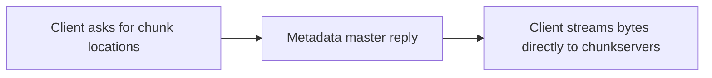

## 9. Request Flows

### Flow 1: Read Path

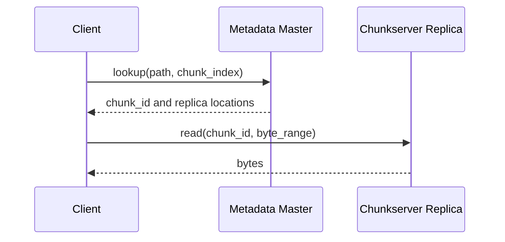

Key point:

- metadata lookup is separate from data transfer

### Flow 2: Write Path with Primary Lease

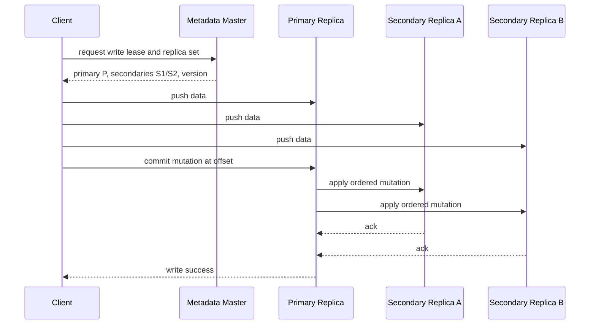

Important nuance:

- data can be pipelined to all replicas first
- ordering is established when the primary assigns mutation order

### Flow 3: Record Append

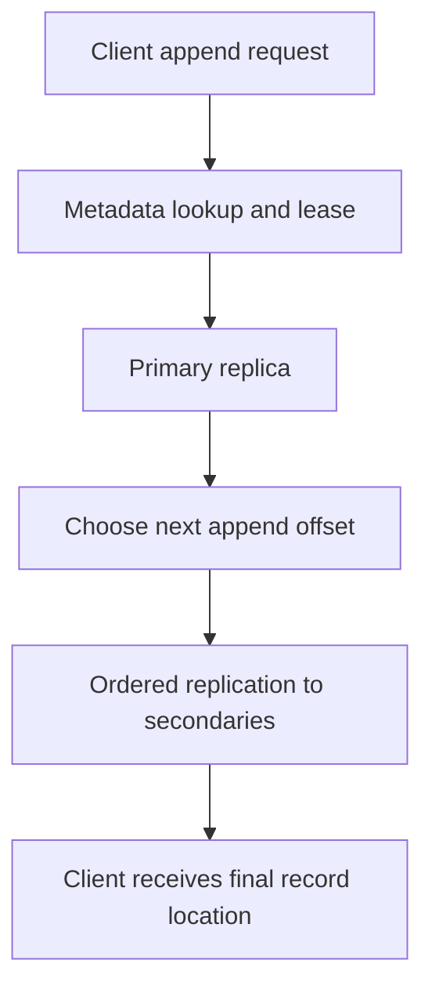

Record append semantics are usually:

- atomic at least once per record within a chunk lease epoch
- clients may need record identifiers for deduplication
- padding and chunk rollover can occur when remaining chunk space is insufficient

### Flow 4: Replica Repair

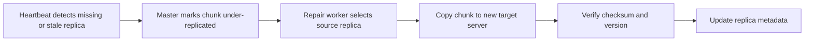

## 10. Deep Dive Areas

### Deep Dive 1: Metadata Design and Recovery

The metadata master is small in bytes compared with total chunk data, but it is critical for correctness.

Metadata usually includes:

- namespace tree or inode-like mapping
- file length
- file-to-chunk mapping
- replica locations
- chunk versions
- leases

The authoritative mutation path should be:

- append metadata mutation to a replicated log
- apply it to in-memory state
- periodically checkpoint state

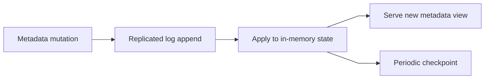

Why this matters:

- replaying only logs can make restart slow
- storing only a checkpoint makes crash recovery lose recent mutations
- using both gives durability and acceptable recovery time

### Deep Dive 2: Why the Write Path Uses a Primary Lease

Without a primary, concurrent writes to replicas can diverge.

Example problem:

- client retries after timeout
- two chunkservers see the operations in different orders
- replicas end up with different byte sequences

The primary lease solves this by making one replica assign mutation order.

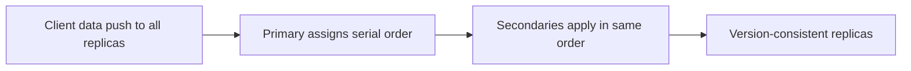

Important edge cases:

- lease expiry during a slow write
- primary crash after some secondaries applied mutation
- client retry after timeout without knowing whether commit succeeded

Practical handling:

- include chunk version and mutation IDs
- reject operations from old lease epochs
- make client retries idempotent at mutation level where possible

### Deep Dive 3: Record Append Is Convenient but Not Identical to Byte-Range Write

Record append is designed for log-style workloads.

The server picks the final offset, not the client.

That gives better concurrency for many writers, but it changes semantics:

- retries can create duplicate records
- padding may be inserted if the record does not fit the remaining chunk space
- readers often need record framing and deduplication keys

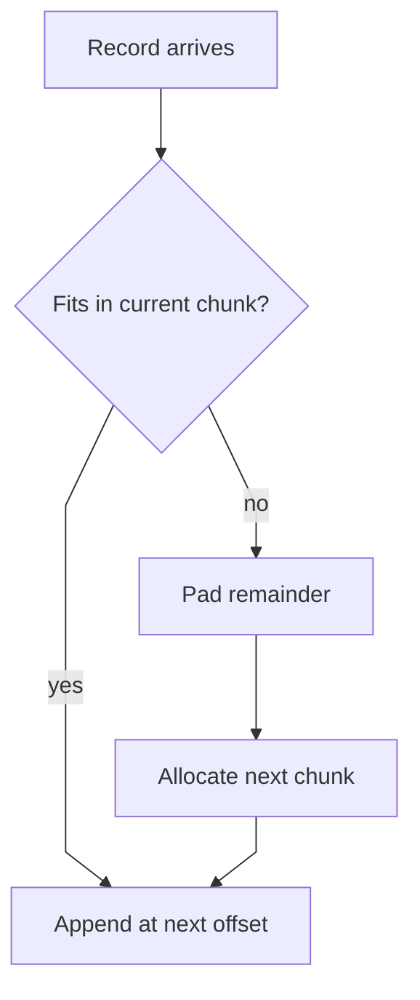

This is acceptable for analytics and log ingestion, but not for arbitrary POSIX-style file semantics.

### Deep Dive 4: Replica Placement, Repair, and Stale Replica Detection

Replica placement should spread risk.

Typical rules:

- do not place all replicas on one rack
- keep one replica near the write-heavy clients if locality matters
- avoid overfilling one server or rack

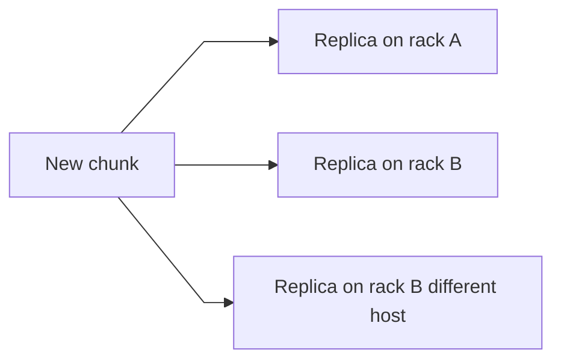

Stale replica detection usually relies on version numbers.

If a server misses a mutation and later rejoins:

- the master compares its reported chunk version with the authoritative version
- stale replicas are not returned to clients
- stale replicas are deleted or refreshed

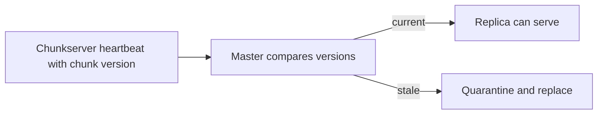

### Deep Dive 5: Checksums and Corruption Handling

Machine failure is not the only threat.

Bit rot, firmware bugs, and partial disk corruption happen too.

Practical design:

- each chunk is divided into checksum blocks
- reads verify checksums
- checksum mismatch triggers read from another replica
- background scrubbing scans cold data proactively

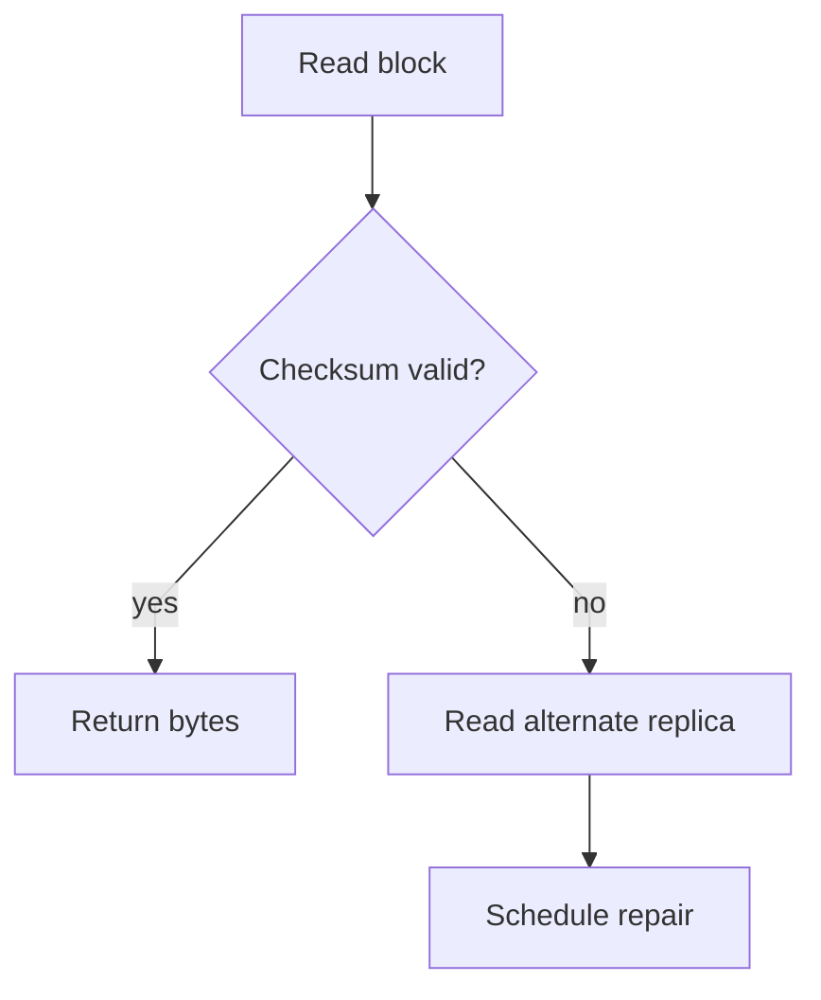

## 11. Bottlenecks and Failure Modes

Likely bottlenecks:

- metadata master memory or failover delay
- chunkserver network saturation
- repair storms after rack failures
- hot chunks for very popular files

Failure modes:

- master unavailability blocks new metadata operations
- stale replica accidentally serving data causes inconsistency
- repair traffic competes with foreground traffic
- record append retries create duplicate logical records

Mitigations:

- replicate metadata log and maintain warm standbys
- use versioned replicas and never serve stale versions
- throttle repair traffic
- expose append semantics clearly to client applications

## 12. Scaling Strategy

A reasonable evolution path:

1. start with one metadata master and replicated chunkservers
2. add metadata checkpoints and standby replay for faster recovery
3. introduce rack-aware placement and automated repair
4. separate metadata shards or federation if namespace scale demands it
5. add multi-cell deployment for isolation across large regions

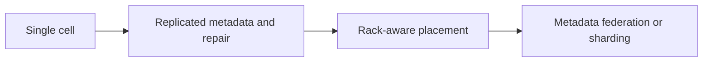

## 13. Tradeoffs and Alternatives

Large chunks vs small chunks:

- large chunks reduce metadata size and improve streaming throughput
- small chunks reduce internal fragmentation and hotspot intensity

Central metadata master vs fully distributed metadata:

- central metadata simplifies placement and lease logic
- distributed metadata improves scale but increases coordination complexity

Replication vs erasure coding:

- replication gives simple reads and fast repair for hot data
- erasure coding reduces storage overhead but increases recovery complexity and latency

Record append semantics vs strict byte-range semantics:

- record append scales better for logs
- strict byte-range semantics are easier for general-purpose applications

## 14. Real-World Considerations

Production concerns usually include:

- namespace ACLs and multi-tenant isolation
- disk retirement and rolling maintenance
- background data scrubbing
- auditability of metadata changes
- throttled rebalancing to avoid harming foreground traffic
- per-file or per-dataset replication policy

Observability is especially important for:

- lease churn
- under-replicated chunk counts
- chunkserver skew
- metadata replay time
- checksum failure rates

## 15. Summary

The recommended design uses:

- a metadata control plane with replicated log and checkpoints
- direct client-to-chunkserver data transfer
- lease-based primary ordering for writes
- record append semantics for log-style workloads
- background repair, rebalancing, and checksum verification

The core design insight is that throughput comes from keeping data off the metadata master, while correctness comes from making metadata, leases, and chunk versions authoritative.
