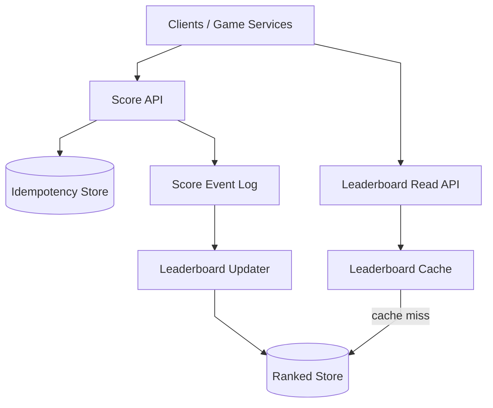
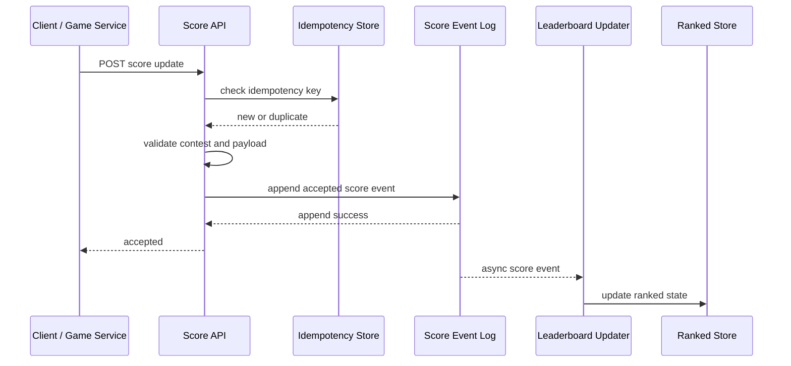
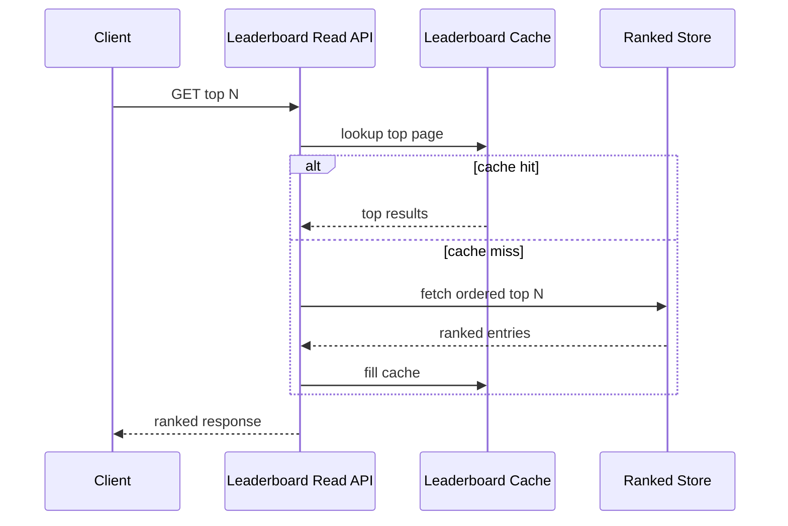
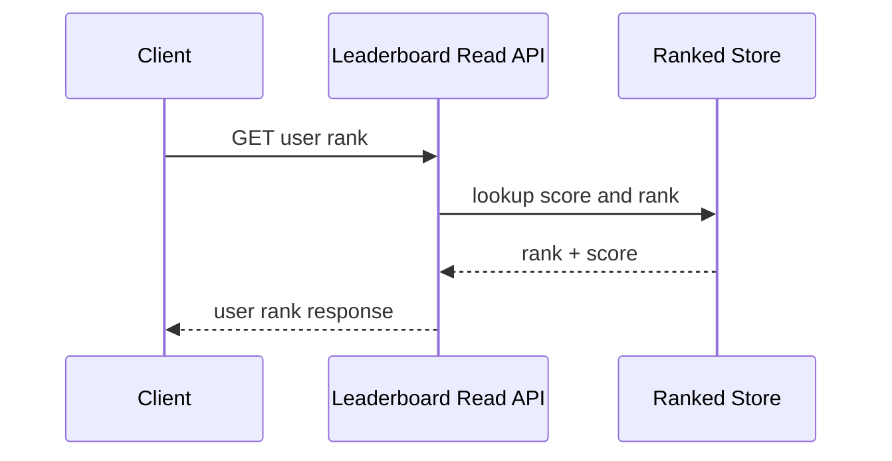

# Leaderboard System

## 1. Problem Statement

Design a large-scale leaderboard system similar to what is used in:

- gaming platforms
- fantasy sports
- fitness challenges
- coding contests
- sales competitions

The product should let users:

- submit score updates
- view the global leaderboard
- view a leaderboard for a cohort such as region, league, or tournament
- view their own rank
- view nearby ranks around themselves

At small scale, this sounds simple:

- store a score per user
- sort users by score
- return the top `N`

At meaningful scale, the problem becomes much more interesting.

Now the system has to deal with:

- frequent score updates
- top-K queries under low latency
- rank lookup for arbitrary users
- ties and deterministic ordering
- multiple leaderboard scopes
- anti-cheat and validation concerns
- contest windows and resets

The hard part is not storing a number.

The hard part is supporting:

- fast writes
- fast rank queries
- consistent enough ordering
- predictable behavior during heavy bursts

This is a strong case study because it forces tradeoffs across:

- write throughput vs ranked-read efficiency
- exact ranking vs approximation
- global boards vs partitioned boards
- mutable score correction vs append-based event history
- freshness vs cost

## 2. Scope and Assumptions

In scope:

- user score submission or update
- global leaderboard for a competition
- segmented leaderboards such as country or league
- fetch top `N`
- fetch rank for a user
- fetch a window around a user such as rank `-5` to `+5`
- leaderboard reset by season or contest

Out of scope for this version:

- deep anti-cheat model internals
- payment or prize distribution
- social graph features
- full analytics warehouse design
- recommendation or matchmaking systems

Assumptions:

- the product may have many leaderboards, not only one
- reads are latency-sensitive because rank display is user-facing
- writes may be bursty during match or contest completion windows
- exact ranking matters more than eventual analytics freshness
- a leaderboard usually has a bounded active time window such as daily, weekly, seasonal, or tournament-based

## 3. Functional Requirements

The system must support:

- creating a leaderboard for a contest or season
- updating a user's score
- reading the top `N` users for a leaderboard
- reading an individual user's current rank and score
- reading nearby users around a given rank or around a given user
- resetting or archiving a leaderboard when the contest ends

Important secondary behaviors:

- deterministic tie-breaking
- idempotent score updates for retried producer calls
- support for multiple leaderboard scopes
- ability to invalidate fraudulent scores
- ability to rebuild leaderboard state if needed

## 4. Non-Functional Requirements

The most important non-functional requirements are:

- low latency for rank reads
- high write throughput during bursts
- correct ordering semantics
- high availability
- durability for accepted score updates
- cost-efficient support for many active leaderboards
- operationally safe reset and archival flows

Consistency requirements are mixed.

The system should strongly preserve:

- accepted score updates
- deterministic ordering rules
- leaderboard identity and contest boundaries

The system can often allow eventual consistency for:

- analytics aggregates
- delayed fraud review outcomes
- archival views for old leaderboards

For a staff-level answer, the critical point is this:

the system must be clear about which path requires exactness.

Usually that is:

- current contest ranking

not:

- downstream reporting and analytics

## 5. Capacity and Scale Estimation

Assume:

- 50 million registered users
- 5 million daily active competitors
- 1 million peak concurrent viewers during major events
- 20 million score updates per day
- 200 million leaderboard reads per day

That gives rough average traffic:

- score writes: about 230 writes/second
- leaderboard reads: about 2,300 reads/second

That average is misleading.

Assume peaks are:

- 20x for writes after contest rounds complete
- 10x for reads during event windows

Then a more realistic design target is:

- 4,000 to 5,000 writes/second peak
- 20,000 to 30,000 reads/second peak

If the product supports many simultaneous contests, the harder problem is skew.

For example:

- one global tournament board may dominate traffic
- many small boards may remain cold

Storage assumptions:

- current score record per active user per leaderboard: around 50 to 150 bytes
- event history per score update: around 100 to 300 bytes

If 20 million score events are stored daily, the event log remains manageable, but exact sorted-state maintenance becomes the central operational challenge.

## 6. Core Data Model

Main entities:

- `Leaderboard`
- `LeaderboardEntry`
- `ScoreEvent`
- `UserProfileSummary`

### Leaderboard

Fields:

- `leaderboard_id`
- `scope_type` such as global, region, league, contest
- `scope_key`
- `start_time`
- `end_time`
- `status`
- tie-break rules

### LeaderboardEntry

Represents the current ranked state for one user in one leaderboard.

Fields:

- `leaderboard_id`
- `user_id`
- `score`
- `tie_break_value`
- `updated_at`
- `rank` if materialized explicitly

### ScoreEvent

Represents the durable write history.

Fields:

- `event_id`
- `leaderboard_id`
- `user_id`
- score delta or absolute score
- source
- idempotency key
- event_time

The important modeling distinction is:

- event history for durability and replay
- current ranked state for low-latency reads

That separation is central to the architecture.

## 7. APIs or External Interfaces

### Update Score

`POST /api/v1/leaderboards/{leaderboard_id}/scores`

Request:

- `user_id`
- score delta or absolute score
- idempotency key

Response:

- accepted status
- current score if available

### Get Top N

`GET /api/v1/leaderboards/{leaderboard_id}?limit=100`

Returns:

- top ranked users
- scores
- ranks

### Get User Rank

`GET /api/v1/leaderboards/{leaderboard_id}/users/{user_id}`

Returns:

- current score
- current rank

### Get Surrounding Window

`GET /api/v1/leaderboards/{leaderboard_id}/users/{user_id}/neighbors?before=5&after=5`

Returns:

- the user
- nearby ranks

## 8. High-Level Design

At a high level, the system can be divided into four concerns:

1. score ingestion
2. durable event recording
3. ranked-state maintenance
4. read serving

For interview discussion, the high-level diagram should emphasize only the critical production boundaries:

- score write API
- durable score event log
- leaderboard updater
- ranked store
- leaderboard read API
- cache

What to notice:

- accepted writes become durable in the event log before downstream ranking work completes
- ranked state is maintained asynchronously from the durable write path
- the read API does not scan raw events; it reads a ranked representation
- cache is useful for top pages, but rank correctness still comes from the ranked store

The key architectural separation is this:

- event durability is one problem
- efficient ranking queries are another

A strong interview answer should say explicitly that one datastore rarely serves both perfectly.

### Component Responsibilities

#### Score API

The write-path service responsible for:

- validating score update requests
- enforcing leaderboard status and contest windows
- checking idempotency
- appending accepted updates to the score event log

This service should not block on recomputing the full leaderboard.

#### Idempotency Store

Used to make retried score submissions safe.

Responsibilities:

- deduplicate repeated producer calls
- map idempotency key to accepted event
- prevent accidental double increments

#### Score Event Log

The durable append path for accepted updates.

Responsibilities:

- persist accepted score changes
- provide replay for recovery
- decouple write acceptance from ranked-state recomputation

This is the correctness backbone of the write path.

#### Leaderboard Updater

The worker or stream processor that:

- consumes score events
- applies ordering rules
- updates ranked state
- handles rebuilds or backfills when needed

This is where business semantics become leaderboard state.

#### Ranked Store

The serving-oriented store used for:

- top `N`
- user rank lookup
- nearby-rank window queries

For exact ranking, this is commonly implemented with a sorted-set-like structure or a store that supports ordered indexing efficiently.

#### Leaderboard Read API

The read-path service responsible for:

- top `N` reads
- user rank lookup
- neighboring rank window queries
- hydration of user display metadata

This service should remain fast and should not depend on event replay or heavy recomputation per request.

#### Leaderboard Cache

The cache layer that accelerates:

- first page or top `N` reads
- hot contest boards
- frequently requested leaderboard windows

This cache improves latency but is not the source of truth.

## 9. Request Flows

### Score Update Flow

What to notice:

- the client is acknowledged after durable acceptance, not after leaderboard recomputation finishes
- idempotency belongs on the write path
- ranked state update is asynchronous but still near-real-time

### Top N Read Flow

### User Rank Lookup Flow

## 10. Deep Dive Areas

### Ranked Store Choice

This is the hardest core decision.

The system needs efficient support for:

- ordered updates
- top `N`
- rank lookup
- range queries around rank

Options include:

#### Redis Sorted Sets or Similar Ordered In-Memory Structures

Strengths:

- very fast top `N`
- efficient rank lookup
- natural leaderboard semantics

Costs:

- memory cost
- operational limits for very large boards
- durability usually needs help from another system

This is often a strong choice for hot active leaderboards.

#### SQL With Ordered Indexes

Strengths:

- strong transactional behavior
- familiar operations

Costs:

- rank queries and large reordering behavior can become expensive
- not a natural fit for very high write/update rates on hot leaderboards

This is often acceptable for smaller or lower-churn boards, but less attractive for high-scale hot rankings.

#### Custom Ordered State on Top of a Stream Processor

Strengths:

- scalable if carefully designed
- good fit for append-heavy event inputs

Costs:

- significantly higher implementation complexity
- harder operational semantics

For interview answers, it is usually sufficient to say:

- use a durable event log for correctness
- maintain a serving-oriented ordered structure for ranking

### Absolute Score vs Delta Events

A write can represent:

- the new absolute score
- or a delta such as `+10`

Absolute score simplifies idempotency and replay reasoning.

Delta events are often more natural for gaming or activity systems.

A practical design often stores:

- incoming event form
- plus normalized current score in ranked state

### Tie-Breaking

Leaderboards need deterministic order.

If two users have the same score, use a stable secondary rule such as:

- earliest time reaching that score
- lower penalty time
- user ID as final deterministic tie-breaker

If tie semantics are vague, the system will appear inconsistent to users.

### Many Leaderboards vs One Giant Leaderboard

Real systems often need:

- one global board
- many contest boards
- many segmented boards

That implies partitioning by `leaderboard_id` first.

This is usually the dominant partition key because ranking work and reads are scoped to a board.

## 11. Bottlenecks and Failure Modes

### Hot Leaderboards

One contest may dominate both reads and writes.

Mitigations:

- cache hot top pages
- isolate hot boards operationally
- dedicate updater capacity to hot partitions

### Write Bursts

Many updates may arrive at the same time after a match or contest round.

Mitigations:

- append to a durable log first
- smooth downstream updater processing
- separate acceptance latency from full recomputation latency

### Duplicate Score Updates

Producer retries can create accidental double increments.

Mitigations:

- idempotency keys
- event dedupe
- source-specific replay protection

### Rank Drift During Lag

If updater lag grows, reads may return stale rank.

Mitigations:

- monitor end-to-end staleness
- autoscale updater workers
- surface freshness SLOs explicitly

### Reset and Archival Complexity

Resetting an active leaderboard naively can create correctness bugs.

Mitigations:

- use versioned leaderboard IDs by season or contest
- archive old boards instead of mutating them in place

## 12. Scaling Strategy

### Stage 1: Single Active Leaderboard

Start with:

- one score API
- one ranked store
- one cache

This is enough for moderate traffic and simple contests.

### Stage 2: Add Durable Event Log

As write correctness and replayability matter more:

- append score events durably
- update ranked state asynchronously

This is often the first important production step.

### Stage 3: Partition by Leaderboard

As many boards become active:

- partition updater work by leaderboard ID
- isolate hot boards from cold ones

### Stage 4: Separate Read API and Hot-Board Cache

As read traffic grows:

- split write and read services
- aggressively cache top pages
- keep user-rank lookups on ranked state

### Stage 5: Regional and Seasonal Scale

As the product becomes global:

- regionalize write ingestion
- replicate serving views where needed
- archive old boards to cheaper storage

## 13. Tradeoffs and Alternatives

### Exact Ranking vs Approximate Ranking

Approximation is acceptable for some analytics, but it is usually a poor fit for user-visible competitive ranking.

For product-facing leaderboards, exact ordering is usually the safer default.

### Synchronous Rank Update vs Async Materialization

Synchronous writes give fresher reads but increase write latency and coupling.

Async ranked-state maintenance gives better throughput and fault isolation, but introduces bounded staleness.

For most large systems, async materialization is the better architecture.

### In-Memory Ranked Store vs General Database

In-memory ordered structures are faster and more natural for ranking.

General databases are often better for durability and management workflows.

A strong design usually combines both concerns instead of forcing one system to do all jobs.

## 14. Real-World Considerations

### Cheating and Fraud

Leaderboard systems are often attacked through:

- fake score submissions
- replay abuse
- manipulated clients

The architecture should leave room for:

- score validation pipelines
- event auditing
- delayed score invalidation

### Contest Semantics

The product team must define:

- whether scores can decrease
- whether corrections are allowed
- whether tied users share a rank or get deterministic ordering
- when a leaderboard is considered final

These are not just product questions.

They directly shape data modeling and update logic.

### Observability

Important metrics:

- score acceptance latency
- updater lag
- rank read latency
- cache hit rate
- duplicate event rate
- freshness delay from accepted score to visible rank

### Cost Control

The expensive parts are usually:

- maintaining hot ranked state
- keeping many boards active
- storing full event history forever

Lifecycle management matters.

## 15. Summary

A leaderboard system is fundamentally a ranked serving system built on top of a durable score-ingestion path.

The central architectural recommendation is:

- accept score updates through an idempotent write API
- persist them durably to an event log
- maintain ranked state asynchronously in a serving-oriented store
- serve top pages and rank lookups from that ranked state
- cache only the hottest reads

The key staff-level insight is that:

- event durability
- ordered serving
- analytics

are different concerns and should not be collapsed into one storage model.

That separation is what keeps the system:

- correct enough
- fast enough
- operable under bursty contest traffic
