# Leaderboard System

## 1. Problem Statement

Design a large-scale leaderboard system similar to what is used in:

- gaming platforms
- fantasy sports
- fitness challenges
- coding contests
- sales competitions

The product should let users:

- submit score updates
- view the global leaderboard
- view a scoped leaderboard such as region, season, division, or tournament
- view their own current rank
- view nearby ranks around themselves

At small scale, this sounds trivial:

- store a score per user
- sort by score descending
- return the top `N`

At meaningful scale, the problem becomes much more interesting.

Now the system has to handle:

- frequent score updates
- low-latency top-K queries
- direct rank lookup for any user
- deterministic tie-breaking
- many simultaneous leaderboards
- contest resets and versioning
- correction or fraud invalidation after the fact

The hard part is not storing a score.

The hard part is supporting:

- durable writes
- efficient ordered reads
- predictable ranking semantics
- bursty update patterns
- operationally safe replay and rebuild

This is a strong case study because it forces tradeoffs across:

- write throughput vs ranked-read efficiency
- exact ranking vs approximate ranking
- event history vs materialized serving state
- freshness vs write latency
- global boards vs many scoped boards

## 2. Scope and Assumptions

In scope:

- creating a leaderboard for a season, tournament, or challenge
- updating a user's score
- global and segmented leaderboards
- reading top `N`
- reading a specific user's rank and score
- reading nearby ranks around a given user
- resetting, archiving, and versioning leaderboards

Out of scope for this version:

- full anti-cheat model internals
- payment or reward distribution
- matchmaking
- social feed or sharing features
- full analytics warehouse design

Assumptions:

- there may be many leaderboards active at once
- reads are latency-sensitive because ranking is user-facing
- writes are bursty after game rounds, event completion, or score uploads
- exact ordering matters for live product display
- downstream analytics can be eventually consistent
- every leaderboard has an explicit lifecycle such as draft, active, closed, archived

## 3. Functional Requirements

The system must support:

- creating and activating a leaderboard
- updating a user's score
- returning the top `N` users
- returning a user's current rank and score
- returning neighbors around a rank or a user
- closing and archiving a leaderboard

Important secondary behaviors:

- deterministic tie-breaking
- idempotent score submission
- support for both absolute scores and score deltas
- corrections or invalidations after fraud review
- rebuild of materialized rank state from event history

## 4. Non-Functional Requirements

The most important non-functional requirements are:

- low latency for rank reads
- high write throughput during bursts
- deterministic ordering
- high availability
- durable acceptance of score updates
- operable reset and archival flows
- efficient support for many boards with skewed traffic

Consistency requirements are mixed.

The system should strongly preserve:

- accepted score updates
- leaderboard identity and contest boundaries
- ordering and tie semantics

The system can often allow eventual consistency for:

- analytics aggregates
- anti-cheat review outcomes
- archive views for older boards

The key design question is:

which path must be exact enough for the product to feel trustworthy?

Usually that is:

- current rank display for an active board

not:

- historical reporting or analytics dashboards

## 5. Capacity and Scale Estimation

Assume:

- 50 million registered users
- 5 million daily active competitors
- 1 million peak concurrent viewers during major events
- 20 million score updates per day
- 200 million leaderboard reads per day

Average traffic:

- score writes: about 230 writes/second
- leaderboard reads: about 2,300 reads/second

Those averages are misleading.

Assume peak multipliers:

- 20x on writes after contest rounds complete
- 10x on reads during event windows

Then a more realistic target becomes:

- 4,000 to 5,000 writes/second peak
- 20,000 to 30,000 reads/second peak

If the product supports many simultaneous boards, the real issue is skew:

- one global event board can dominate all traffic
- many smaller boards remain cold

Storage assumptions:

- current leaderboard entry: roughly 100 bytes logical
- score event: roughly 150 to 300 bytes depending on metadata

If 20 million score events are stored per day:

- raw event storage is manageable

The actual challenge is not total bytes.

The actual challenge is:

- maintaining ordered serving state efficiently
- handling hot boards and hot users
- replaying and correcting state safely

## 6. Core Data Model

Main entities:

- `Leaderboard`
- `LeaderboardEntry`
- `ScoreEvent`
- `LeaderboardVersion`

### Leaderboard

Fields:

- `leaderboard_id`
- `scope_type` such as global, region, league, tournament
- `scope_key`
- `status`
- `start_time`
- `end_time`
- tie-break policy
- scoring mode such as absolute or delta

### LeaderboardEntry

Represents the current serving state for one user in one leaderboard.

Fields:

- `leaderboard_id`
- `user_id`
- `score`
- `tie_break_value`
- `updated_at`
- optional `rank` if materialized explicitly

### ScoreEvent

Represents the durable write history.

Fields:

- `event_id`
- `leaderboard_id`
- `user_id`
- absolute score or delta
- source
- idempotency key
- event_time
- event_version

### LeaderboardVersion

This is conceptually important even if not stored as a separate table.

It identifies one immutable contest window such as:

- season 2025
- week 17
- tournament finals

This avoids dangerous in-place reset semantics.

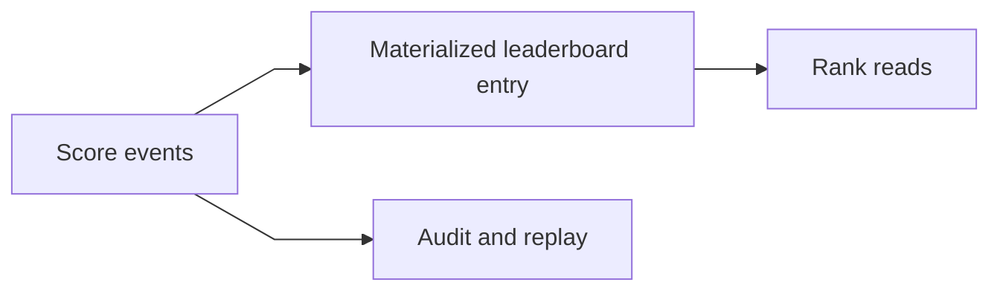

The key modeling distinction is:

- event history for durability and replay
- materialized ranked state for fast reads

That separation is central to the architecture.

## 7. APIs or External Interfaces

### Update Score

`POST /api/v1/leaderboards/{leaderboard_id}/scores`

Request:

- `user_id`
- score delta or absolute score
- idempotency key

Response:

- accepted status
- current score if available

### Get Top N

`GET /api/v1/leaderboards/{leaderboard_id}?limit=100`

Returns:

- ranked users
- scores
- ranks

### Get User Rank

`GET /api/v1/leaderboards/{leaderboard_id}/users/{user_id}`

Returns:

- current score
- current rank

### Get Neighbor Window

`GET /api/v1/leaderboards/{leaderboard_id}/users/{user_id}/neighbors?before=5&after=5`

Returns:

- the user
- nearby ranks

### Close or Archive Leaderboard

`POST /api/v1/leaderboards/{leaderboard_id}/close`

## 8. High-Level Design

At a high level, the system can be divided into four concerns:

1. score ingestion
2. durable event recording
3. ranked-state maintenance
4. read serving

The high-level diagram should emphasize the critical production boundaries:

- score write API
- idempotency and policy checks
- durable score event log
- leaderboard updater
- ranked store
- read API and cache

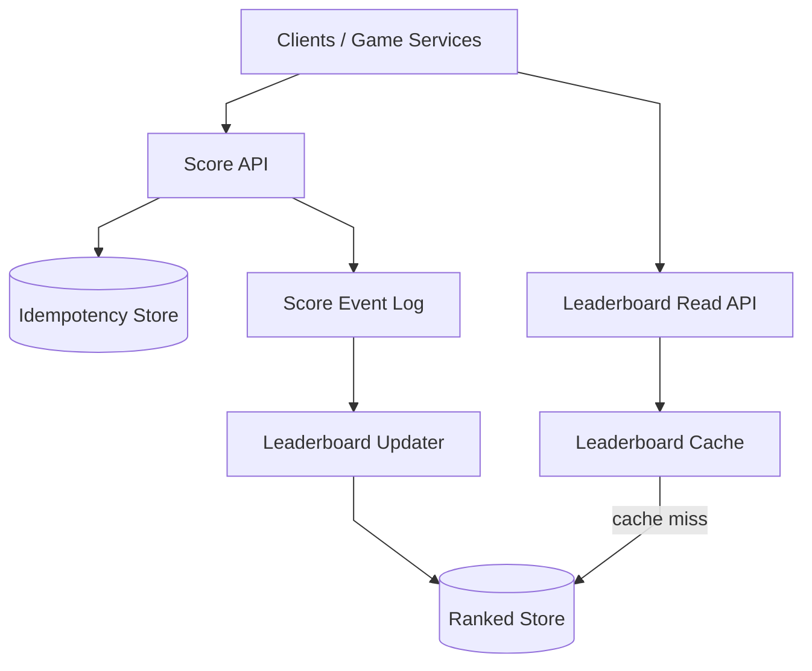

What to notice:

- writes become durable in the event log before ranked recomputation completes
- the ranked store is a serving view, not the durability system of record
- the read path never scans raw events on demand
- cache helps top pages, but authoritative ranking comes from the ranked store

The key architectural separation is this:

- event durability is one problem
- efficient ordered reads are another

One datastore rarely solves both perfectly.

### End-to-End Shape

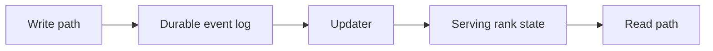

### Component Responsibilities

#### Score API

The write-path service responsible for:

- validating score updates
- enforcing leaderboard status and contest windows
- checking idempotency
- appending accepted updates to the event log

This service should not wait for full leaderboard recomputation.

#### Idempotency Store

Responsibilities:

- deduplicate repeated producer calls
- map idempotency key to accepted event
- prevent accidental double increments

#### Score Event Log

The durable append path for accepted updates.

Responsibilities:

- persist accepted score changes
- provide replay for recovery
- decouple write acceptance from ranked-state maintenance

#### Leaderboard Updater

Responsibilities:

- consume score events
- apply scoring and tie rules
- update ranked state
- rebuild state when replay or backfill is needed

This is where contest semantics become visible ranking.

#### Ranked Store

The serving-oriented store used for:

- top `N`
- rank lookup
- neighbor-window queries

This store is chosen for ordered access patterns, not for long-term event durability.

#### Leaderboard Read API

Responsibilities:

- top `N` reads
- user-rank lookup
- neighbor-window lookup
- hydration of display metadata

#### Leaderboard Cache

The cache layer that accelerates:

- hot top pages
- repeated rank windows
- highly viewed contests

## 9. Request Flows

### Score Update Flow

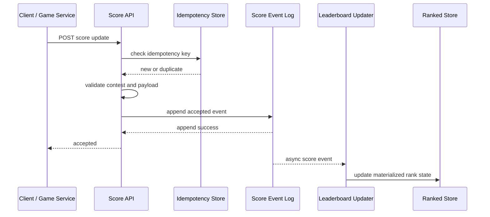

What to notice:

- the client is acknowledged after durable acceptance
- ranked state update is asynchronous but near-real-time
- idempotency is enforced before the event becomes visible

### Top N Read Flow

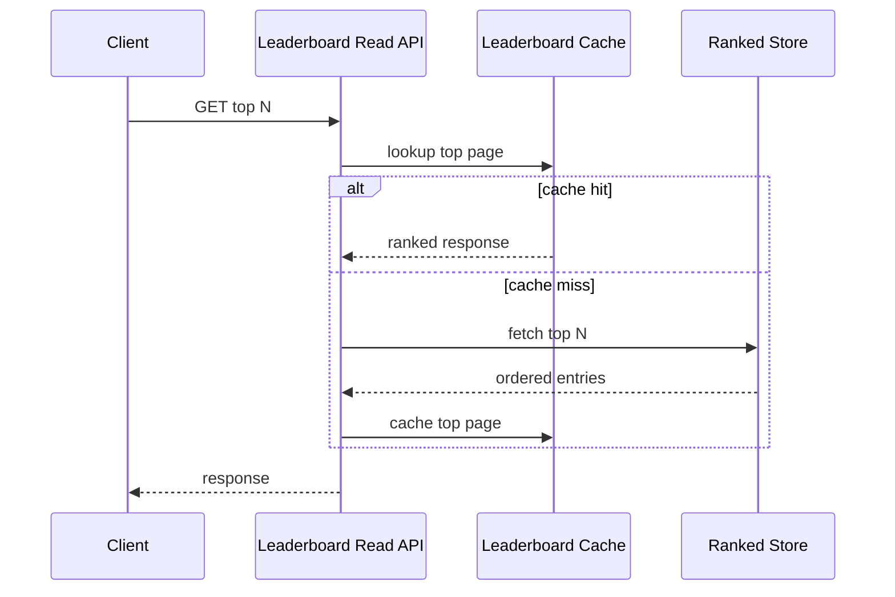

### User Rank Lookup Flow

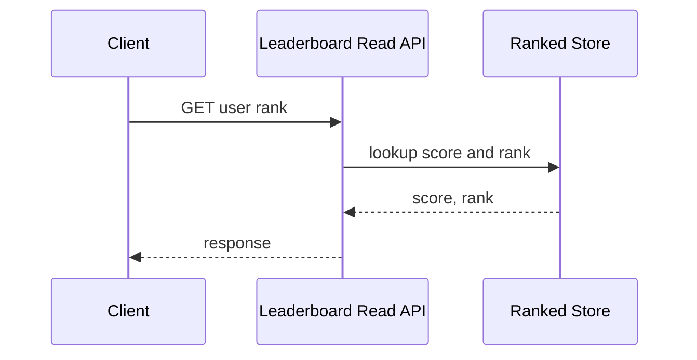

### Replay / Rebuild Flow

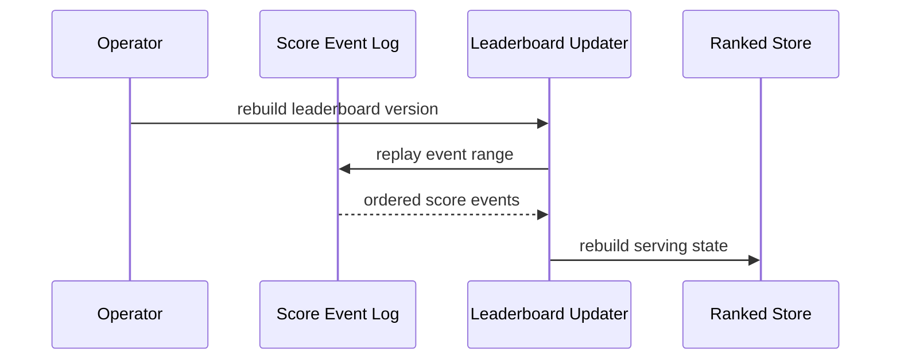

This flow is important because real systems eventually need:

- correction
- backfill
- fraud invalidation
- disaster recovery

## 10. Deep Dive Areas

### Ranked Store Choice

This is the core design decision.

The system needs efficient support for:

- ordered updates
- top `N`
- rank lookup
- nearby-window queries

No single persistence model is ideal for every aspect of the problem.

#### Option 1: In-Memory Sorted Set Store

Examples:

- Redis sorted sets
- a similar ordered in-memory keyspace

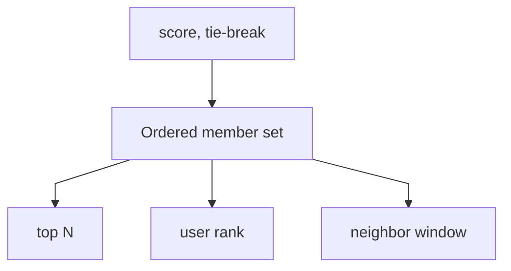

Strengths:

- very fast top `N`
- efficient rank lookup
- natural fit for ordered serving state
- simple mental model

Costs:

- memory-heavy for very large boards
- durability usually requires a separate system of record
- cross-region exact coordination is expensive

This is often the best choice for:

- hot active boards
- exact ranked serving

#### Option 2: SQL With Ordered Indexes

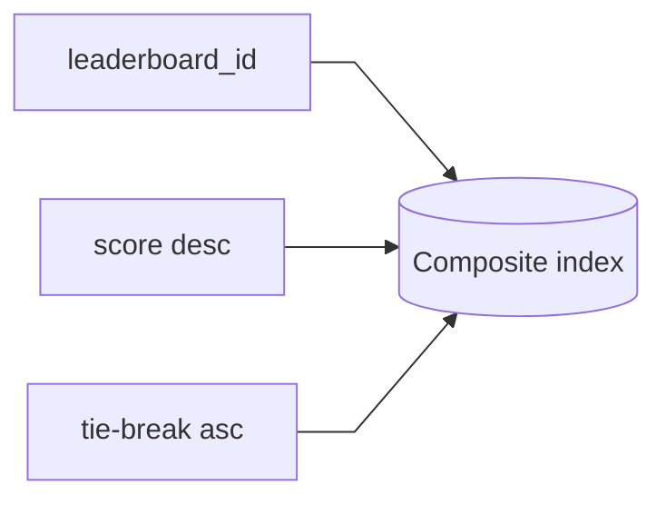

Strengths:

- transactional updates
- familiar tooling
- easy management workflows

Costs:

- large rank scans are expensive
- maintaining exact rank under frequent updates is awkward
- top-K is fine, arbitrary rank lookup can become painful without extra machinery

This is often acceptable for:

- lower-churn boards
- admin workflows
- authoritative metadata

It is usually not the best serving store for very hot exact rankings.

#### Option 3: Event Log Plus Materialized Ordered State

This is usually the most practical production design.

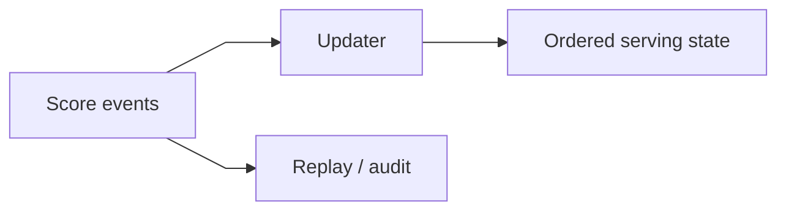

Strengths:

- durable and replayable writes
- efficient serving state
- operationally safe rebuilds

Costs:

- more moving parts
- bounded staleness between write acceptance and read visibility

This design exists because:

- durability and replay want append logs
- rank reads want ordered state

Those are different access patterns.

### Absolute Score vs Delta Events

A write can represent:

- a new absolute score
- a delta such as `+10`

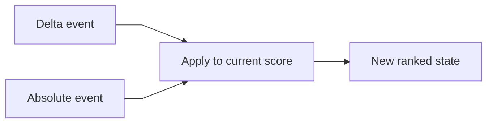

Absolute score strengths:

- simpler idempotency
- simpler replay reasoning
- easier late correction

Delta score strengths:

- natural fit for gameplay or activity events
- more expressive event history

Practical pattern:

- accept the source event form
- normalize into current serving score

### Tie-Breaking and Deterministic Order

Leaderboards need deterministic order, not just score comparison.

If two users have the same score, use a stable secondary rule such as:

- earliest time reaching that score
- lower penalty time
- lexicographic user ID as final fallback

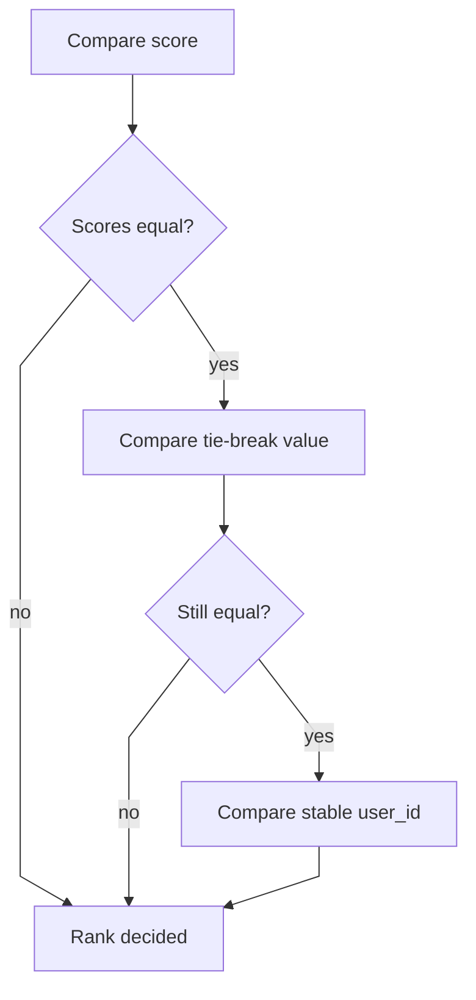

If tie semantics are vague, users will see:

- rank flicker
- inconsistent ordering across pages
- distrust in the system

### Edge Cases in Rank Semantics

This is where many explanations stay too shallow.

Questions the system must answer:

- if two users tie, do they share a rank or get deterministic unique ranks
- if a score is corrected downward, how quickly must all affected ranks move
- if a leaderboard closes, can late events still be ingested
- if an event is duplicated, what exactly prevents double counting
- if the board is segmented by region, what happens when a user changes region mid-season

A good design does not hide these questions.

It makes them explicit.

### Many Leaderboards vs One Giant Leaderboard

Real systems often need:

- one global board
- many tournament boards
- many segmented boards

That implies partitioning first by:

- `leaderboard_id`

because ranking work and reads are scoped to a board.

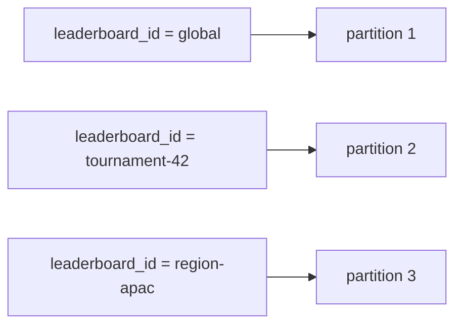

This is usually better than trying to mix all boards into one shared ordered structure.

## 11. Bottlenecks and Failure Modes

### Hot Leaderboards

One contest may dominate both reads and writes.

Mitigations:

- cache hot top pages
- isolate hot boards operationally
- dedicate updater capacity to hot partitions

### Write Bursts

Many updates may arrive at the same time after a match or contest round.

Mitigations:

- append to a durable log first
- absorb bursts in the updater pipeline
- separate acceptance latency from recomputation latency

### Duplicate Score Updates

Producer retries can create accidental double increments.

Mitigations:

- idempotency keys
- event dedupe
- source-specific replay protection

### Rank Drift During Updater Lag

If updater lag grows, reads return stale rank.

Mitigations:

- freshness SLOs
- autoscaling updater workers
- visible lag metrics

### Correction and Fraud Invalidation

A correction can affect:

- one score
- every rank below it

Mitigations:

- replay-safe event model
- invalidation events
- explicit correction pipeline

### Reset and Archival Complexity

Resetting an active leaderboard in place creates correctness bugs.

Mitigations:

- use versioned leaderboard IDs
- archive old boards
- treat new season as new serving state

## 12. Scaling Strategy

### Stage 1: One Active Leaderboard

Start with:

- one score API
- one ordered serving store
- one cache

This is enough for modest traffic.

### Stage 2: Add Durable Event Log

As correctness and replayability matter more:

- append score events durably
- update ranked state asynchronously

This is often the first important architectural step.

### Stage 3: Partition by Leaderboard

As many boards become active:

- partition updater work by leaderboard ID
- isolate hot boards from cold ones

### Stage 4: Split Read and Write Services

As read traffic grows:

- separate write acceptance from read serving
- aggressively cache hot top pages
- keep rank lookup on ordered serving state

### Stage 5: Regional and Seasonal Scale

As the product becomes global:

- regionalize ingestion
- replicate serving views when needed
- archive old leaderboard versions cheaply

## 13. Tradeoffs and Alternatives

### Exact Ranking vs Approximate Ranking

Approximation is acceptable for analytics.

It is usually a poor fit for user-visible competitive rank.

### Synchronous Rank Update vs Async Materialization

Synchronous writes give fresher reads and worse write latency.

Async materialization gives better throughput and replayability, but introduces bounded staleness.

For most large systems, async materialization is the better architecture.

### In-Memory Ordered Store vs General Database

In-memory ordered structures are better for serving rank.

General databases are better for metadata and management flows.

Combining both is often the right design.

## 14. Real-World Considerations

### Cheating and Fraud

Leaderboard systems are often attacked through:

- fake score submissions
- replay abuse
- manipulated clients

The architecture should leave room for:

- score validation pipelines
- event auditing
- delayed invalidation

### Contest Semantics

The product team must define:

- whether scores can decrease
- whether corrections are allowed
- whether ties share a rank or use deterministic ordering
- when a leaderboard is considered final

These are not side details.

They directly shape the storage and update model.

### Observability

Important metrics:

- score acceptance latency
- updater lag
- freshness delay from accepted event to visible rank
- cache hit rate
- duplicate event rate
- rebuild duration

### Cost Control

The expensive parts are usually:

- maintaining hot ordered serving state
- keeping many boards active
- retaining event history forever

Lifecycle policy matters:

- expire cold caches
- archive old boards
- retain raw events based on replay or compliance needs

## 15. Summary

A leaderboard system is fundamentally an ordered serving system built on top of a durable score-ingestion path.

The central architectural recommendation is:

- accept score updates through an idempotent write API
- persist them durably to an event log
- maintain ordered serving state asynchronously
- serve top pages and rank lookups from the ranked store
- use cache only for the hottest reads

The key insight is that:

- event durability
- ordered serving
- replay
- analytics

are different concerns and should not be collapsed into one storage model.

That separation is what keeps the system:

- trustworthy
- fast
- replayable
- operable under bursty contest traffic
