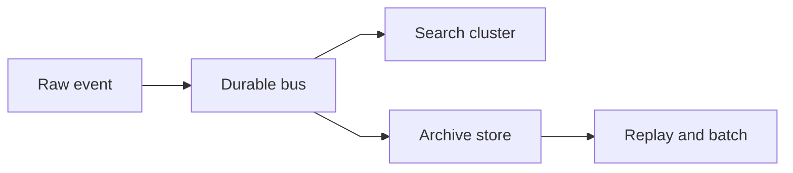
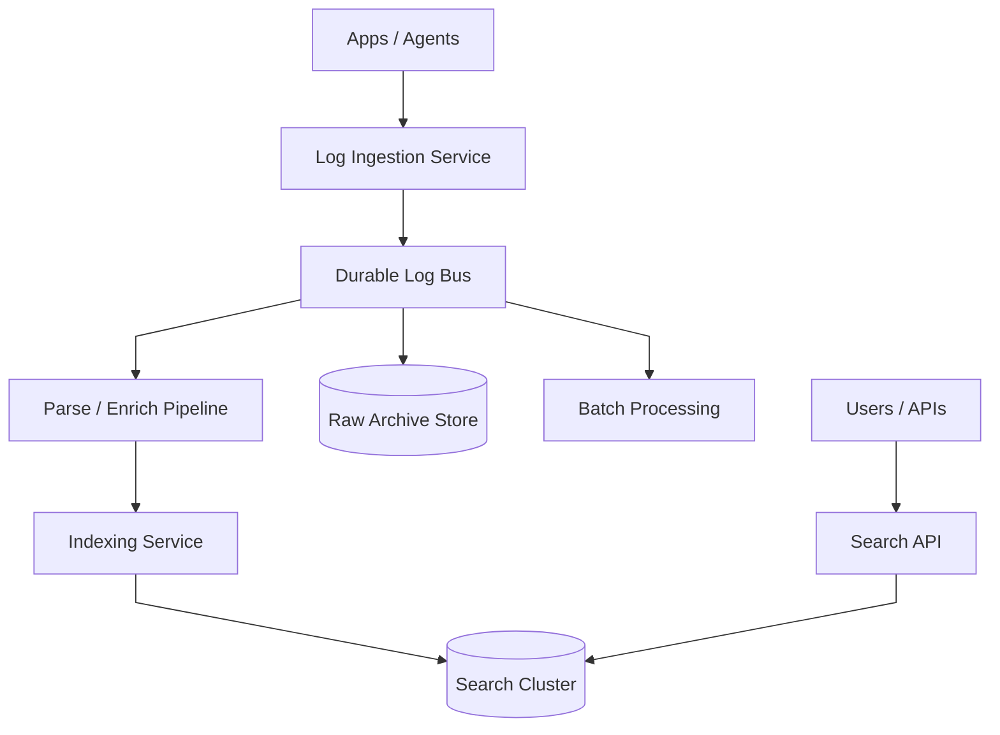
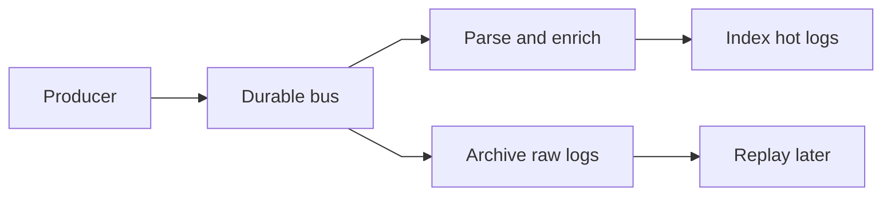
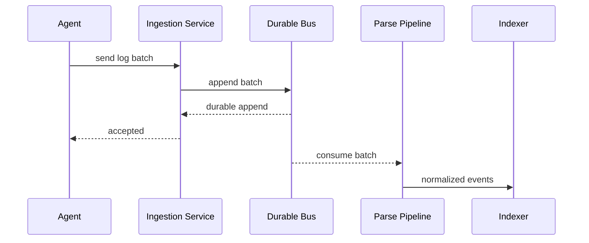
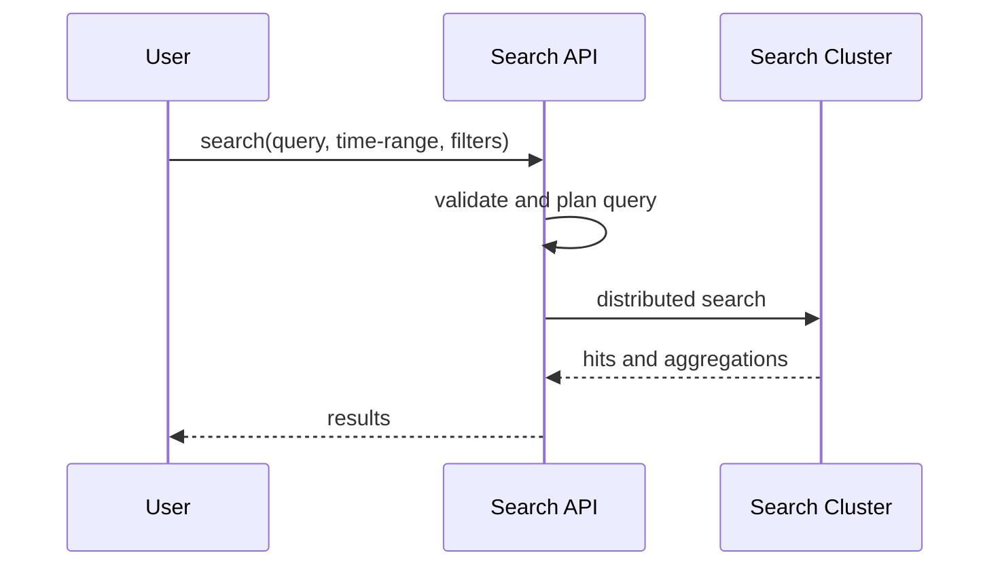
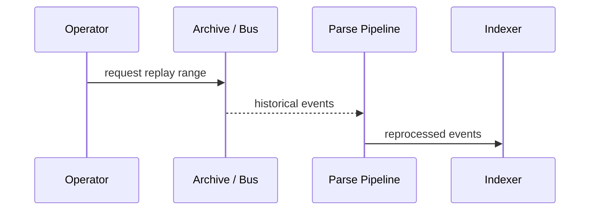

# Logging System

## 1. Problem Statement

Design a large-scale logging system similar to the ELK stack.

The system should let applications and infrastructure:

- emit logs at very high volume
- search recent logs quickly
- retain logs for debugging, audit, and compliance
- support both real-time and batch processing

At small scale, logging can look like:

- append files locally
- ship them centrally
- search later

At production scale, the platform becomes a set of specialized pipelines.

Now the system must handle:

- ingestion bursts during outages
- structured and semi-structured payloads
- parsing and enrichment
- indexing cost and field explosion
- short-retention hot search and cheap long-term archive
- reprocessing when schemas and pipelines change

The hard part is not accepting events.

The hard part is building a system where:

- ingestion remains durable under bursts
- indexing does not control availability
- search remains useful and affordable
- retention cost does not dominate the platform

This is a strong case study because it forces tradeoffs across:

- index everything vs selective indexing
- immediate searchability vs delayed indexing
- raw archive vs searchable hot store
- schema freedom vs mapping control
- operational use vs compliance retention

## 2. Scope and Assumptions

In scope:

- log ingestion
- durable buffering
- parsing and enrichment
- indexing into a searchable cluster
- archival to cheap storage
- real-time and batch processing paths

Out of scope for this version:

- SIEM-specific detection logic
- distributed tracing internals
- dashboard UI design

Assumptions:

- ingest volume is extremely high
- most logs are never queried again
- recent logs are far hotter than older logs
- not every field should be indexed

## 3. Functional Requirements

The system must support:

- ingesting structured and semi-structured logs
- parsing and enrichment
- searching recent logs by time, service, host, and selected fields
- retaining raw logs durably
- replaying historical ranges through new pipelines
- lifecycle movement across hot, warm, and cold tiers

Important secondary behaviors:

- schema evolution
- tenant isolation
- field masking or redaction
- index templates and field controls

## 4. Non-Functional Requirements

The most important non-functional requirements are:

- extremely high ingest throughput
- durable acceptance
- low-latency recent search
- cost-efficient long-term retention
- tolerance of bursty and uneven workloads
- bounded impact from field explosion

Consistency requirements are mixed.

The system should strongly preserve:

- accepted raw event durability
- retention and compliance policy

The system can often allow eventual consistency for:

- search index freshness
- enrichment side outputs
- batch-derived analytics tables

The design should explicitly separate:

- raw durability
- searchability
- analytical processing

because one pipeline rarely optimizes all three well.

## 5. Capacity and Scale Estimation

Assume:

- 5 million log events per second
- 1 KB average event size

That yields:

- about 5 GB/s raw ingest
- over 400 TB/day raw before replication and indexing overhead

If failure spikes or traffic bursts create 3x load:

- 15 GB/s ingest is plausible

This immediately implies:

- durable buffering is mandatory
- indexing cannot be the durability path
- long-term retention cannot live in the hot search cluster

The main scaling pressures are:

- broker throughput
- parse and enrich CPU
- indexing amplification
- search cluster merge and shard behavior

## 6. Core Data Model

Main entities:

- `LogEvent`
- `ParsedFieldSet`
- `IndexSegment`
- `ArchiveObject`
- `ProcessingPipeline`

### LogEvent

Durable raw event.

Fields:

- timestamp
- service or source
- host or container identity
- raw payload
- tenant

### ParsedFieldSet

Extracted structured data.

Examples:

- level
- request ID
- status code
- endpoint
- environment

### IndexSegment

Searchable hot data.

Fields:

- time range
- shard ID
- inverted indexes for selected fields
- stored fields or source references
- doc values for aggregatable fields

### ArchiveObject

Compressed raw batches in cheap long-term storage.

Fields:

- time range
- tenant or source partition
- storage location
- compression format
- retention class

### Persistence Model

Different storage systems are ideal for different persistence needs.

#### 1. Durable Ingestion Layer

The first persistence boundary should be a replicated append log such as Kafka or Pulsar.

Why this is a good fit:

- append-heavy writes
- replay support
- buffering during indexing lag
- multiple downstream consumers

This layer is ideal for:

- short- to medium-term durability
- ordered consumption by partition
- decoupling producers from indexing and archive consumers

It is not ideal for:

- low-latency search
- cheapest long-term retention

#### 2. Searchable Hot Store

For recent interactive search, the ideal persistence model is a search engine such as Elasticsearch or OpenSearch.

Why this is a good fit:

- inverted indexes on selected fields
- time-based partitioning
- full-text and filtered search
- aggregations

This store is ideal for:

- recent debugging
- operational incident search
- selected-field exploration

It is not ideal for:

- storing every raw log forever
- indexing every field without cost consequences

#### 3. Raw Archive Store

For long-term durability, the ideal persistence model is object storage such as S3, GCS, or HDFS-like archival layers.

Why this is a good fit:

- very cheap storage per TB
- high durability
- lifecycle rules
- replay and batch analytics support

This store is ideal for:

- compliance retention
- reprocessing
- offline analytics

It is not ideal for:

- low-latency ad hoc search without rehydration

The key architecture point is:

- do not make the search cluster the long-term system of record for all logs

## 7. APIs or External Interfaces

### Ingest Logs

`POST /logs/ingest`

### Search Logs

`GET /logs/search`

### Update Processing Pipeline

`PUT /pipelines/{id}`

### Replay Range

`POST /logs/replay`

## 8. High-Level Design

At a high level, the system has five concerns:

1. ingestion and durable buffering
2. parsing and enrichment
3. searchable indexing
4. raw archival
5. batch analytics

The high-level diagram should show the key control boundaries:

- ingestion
- durable bus
- parse and index path
- archive path
- search API

What to notice:

- ingestion durability is provided by the bus, not by immediate indexing
- parsing and indexing are downstream consumers that can lag
- raw archival is decoupled from searchability
- batch analytics should not share the same serving path as recent interactive search

The key architectural separation is this:

- durable append pipeline
- expensive searchable projection

### Pipeline Lifecycle

### Component Responsibilities

#### Log Ingestion Service

Responsibilities:

- accept log batches
- authenticate producers
- normalize envelopes
- batch and append to the durable bus

This service should optimize for:

- throughput
- batching
- durability

not:

- heavy parsing
- indexing

#### Durable Log Bus

Responsibilities:

- absorb bursts
- retain raw events long enough for replay
- fan out to multiple consumers

This is the shock absorber of the system.

#### Parse and Enrich Pipeline

Responsibilities:

- parse semi-structured messages
- enrich with service, env, or tenant metadata
- redact or mask sensitive fields
- route to indexing or specialized pipelines

#### Indexing Service

Responsibilities:

- map events into indexable fields
- decide what is indexed, stored, or dropped
- write to the search cluster

#### Search Cluster

Responsibilities:

- provide low-latency recent search
- support time-based partitioning
- execute distributed queries across shards

#### Raw Archive Store

Responsibilities:

- durable low-cost long-term retention
- replay source of truth
- feed batch analytics

#### Batch Processing

Responsibilities:

- reprocess historical logs
- build offline analytical datasets
- support replay after parser or mapping changes

## 9. Request Flows

### Ingestion Flow

### Search Flow

### Replay and Reindex Flow

### Tiered Retention View

## 10. Deep Dive Areas

### Ingestion Pipeline and Backpressure

Indexing is almost always slower and more variable than raw append throughput.

This means the system needs:

- durable buffering
- consumer lag visibility
- backpressure and overload controls

Otherwise an indexing slowdown can directly take down ingestion.

### Indexing Strategy

Indexing every field is a trap.

Important design choices:

- time-based index partitioning
- explicit field mappings
- selective indexing of high-value fields
- stored-only fields for low-value dimensions
- keyword vs text handling

Why this matters:

- indexed fields consume memory and disk
- dynamic field explosion destabilizes clusters
- merge cost rises with unnecessary indexed content

### Database Choice by Layer

This question should be answered explicitly.

For durable ingest:

- use a log or streaming system

For hot searchable logs:

- use a search engine with inverted indexing

For long-term retention:

- use object storage

For configuration and pipeline metadata:

- use a general metadata store or relational DB

No single database is ideal for all logging concerns.

### Edge Cases in Schema and Mapping

This is where many explanations stay too shallow.

Questions the system must answer:

- what if a service suddenly emits unbounded JSON keys
- what if the same field flips types across producers
- what if enrichment depends on a slow external lookup
- what if parsing fails for only a subset of logs

A good design defines:

- unknown-field handling
- parse failure side paths
- strict vs permissive mappings
- redaction before indexing

### Real-Time vs Batch

Recent logs need:

- fast indexed search

Older logs often need:

- cheap retention
- slower replay
- offline analytics

These are different workloads and should be treated that way.

## 11. Bottlenecks and Failure Modes

### Parser Lag

Complex parsing or enrichment can make the parse tier the bottleneck.

### Search Cluster Overload

Broad queries over many shards can damage latency badly.

### Mapping Explosion

Dynamic field creation can destabilize the cluster.

### Hot Shards

Recent logs can concentrate writes into a few partitions.

### Archive or Replay Backlog

Historical replay can compete with normal indexing if not isolated.

## 12. Scaling Strategy

### Stage 1: Central Ingest and Search Cluster

Good enough for modest volume.

### Stage 2: Add Durable Bus

Separate durability from indexing.

### Stage 3: Add Archive and Replay

Support long retention and reprocessing.

### Stage 4: Tiered Retention and Query Guards

Split hot, warm, and cold tiers with search limits.

### Stage 5: Tenant Isolation and Field Governance

Add quotas, mapping limits, and per-tenant controls.

## 13. Tradeoffs and Alternatives

### Index Everything vs Selective Indexing

Index everything improves ad hoc search and destroys cost efficiency.

### Immediate Indexing vs Delayed Indexing

Immediate indexing improves freshness.

Delayed indexing improves resilience and throughput.

### Search Cluster vs Object-Storage-First Analytics

Search clusters are good for recent debugging.

Object storage plus batch engines is better for cheap deep history.

## 14. Real-World Considerations

### PII and Security

The system should support:

- redaction
- tokenization
- retention by sensitivity class

### Tenant Isolation

One team's log storm should not destroy everyone else's search.

### Retention Policy

Retention should be explicit by:

- source
- severity
- compliance class

### Observability

Important metrics:

- ingest latency
- broker lag
- parser lag
- index freshness delay
- slow search rate

## 15. Summary

A logging system is fundamentally a durable ingestion pipeline plus a selective searchable projection.

The central architectural recommendation is:

- acknowledge after durable append
- buffer heavily before parsing and indexing
- keep recent searchable logs separate from long-term raw retention
- use selective indexing and tiered storage
- support replay because schemas and pipelines change

The key insight is that:

- durability
- searchability
- processing latency
- storage cost
- schema control

must be designed together, because real production pain shows up at their boundaries.
