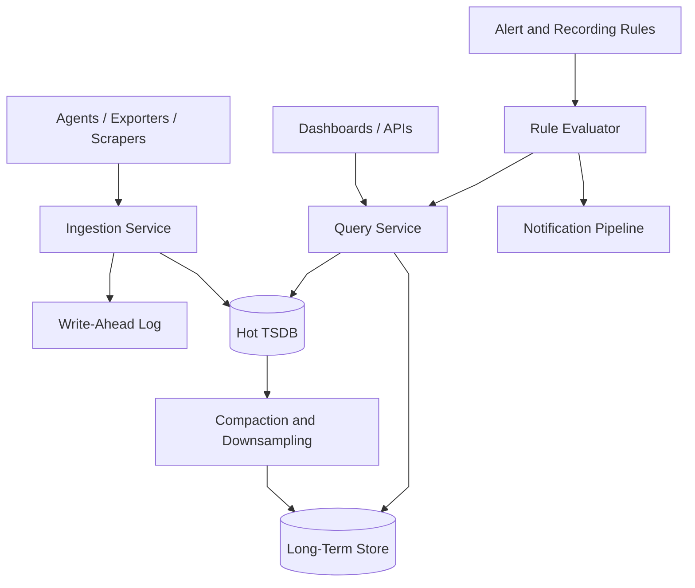
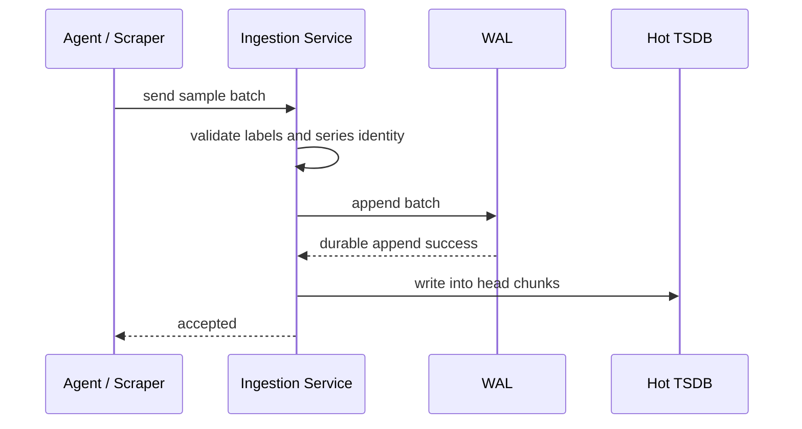
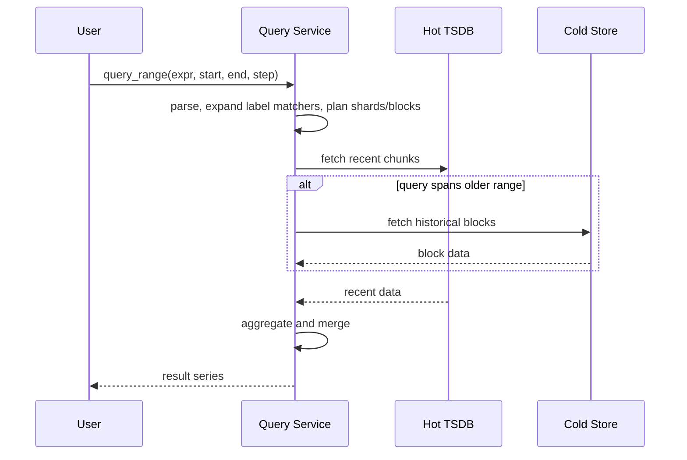
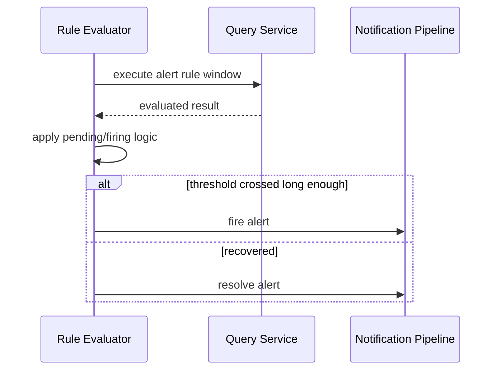
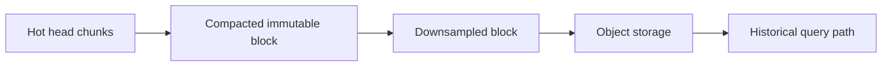

# Metrics and Monitoring System

## 1. Problem Statement

Design a large-scale metrics and monitoring system similar to Prometheus plus remote storage, query aggregation, and alerting.

The system should let infrastructure and applications:

- expose or push metrics
- store labeled time-series data
- query recent and historical metrics
- compute aggregations such as `sum`, `rate`, `avg`, `histogram_quantile`
- evaluate alert rules continuously

At small scale, this can look deceptively simple:

- scrape targets
- append samples
- query by metric name

At production scale, the real problem is much harder.

The system now has to handle:

- extremely high write throughput
- cardinality explosion from labels
- compressed hot storage for recent windows
- long-term retention at lower cost
- query fan-out across many series and time blocks
- alert evaluation that depends on query correctness and freshness

The hard part is not storing points.

The hard part is designing a system where:

- write-heavy ingestion does not collapse query latency
- cardinality does not destroy memory and storage
- queries remain bounded under broad selectors
- alerts are timely but not noisy

This is a strong case study because it forces tradeoffs across:

- raw retention vs rollups
- single-node TSDB simplicity vs distributed remote storage
- ingest throughput vs query flexibility
- cardinality freedom vs operational safety
- alert freshness vs query cost

## 2. Scope and Assumptions

In scope:

- pull- and push-style ingestion models
- labeled time-series storage
- query API for instant and range queries
- aggregation and downsampling
- alert rule evaluation and notification handoff

Out of scope for this version:

- distributed tracing internals
- dashboard UI design
- incident management workflow
- full APM semantics for profiles or spans

Assumptions:

- writes vastly exceed reads
- recent data is queried much more often than historical data
- historical data can tolerate slower queries and more aggressive compression
- high-cardinality labels are a major practical risk
- alerting is built on top of query semantics, not a separate bespoke storage path for every rule

## 3. Functional Requirements

The system must support:

- ingesting counters, gauges, histograms, and summaries
- storing time-series keyed by metric name plus labels
- instant queries such as current value
- range queries over recent and historical windows
- aggregation across many time series
- alert rules such as threshold, absent-series, error-rate, and saturation conditions
- retention and expiration policies

Important secondary behaviors:

- service discovery for scrape targets
- remote write or remote read integration
- recording rules and precomputed aggregates
- tenant isolation if the platform is shared
- safe query limits and cancellation

## 4. Non-Functional Requirements

The most important non-functional requirements are:

- extremely high write throughput
- efficient compression for append-heavy time series
- low-latency recent queries
- acceptable latency for historical queries
- strong enough durability for accepted samples
- bounded memory impact from active series
- reliable alert evaluation with clear freshness semantics

Consistency requirements are mixed.

The system should strongly preserve:

- accepted sample ordering within a series
- WAL durability guarantees
- alert rule definitions

The system can often allow eventual consistency for:

- long-term remote replicated data
- downsampled aggregates
- dashboard views spanning multiple storage tiers

The design should say explicitly:

- recent hot-path monitoring data and long-term observability retention are not the same storage problem

## 5. Capacity and Scale Estimation

Assume:

- 10 million active time series
- 15-second scrape interval on average
- 2 samples per scrape for some histogram buckets or multi-sample payloads on average

That yields:

- about 1.3 million samples per second

Now add peak skew:

- fleet rollouts
- autoscaling bursts
- exporters that flush many series together

If peak is 3x average, the design target is closer to:

- 4 million samples per second

Storage assumptions:

- a raw sample with timestamp and value may look small logically
- effective cost is dominated by label metadata, chunk headers, WAL, indexing, and replication

If 1.3 million samples per second are retained raw:

- about 112 billion samples per day

This makes two things obvious:

- compression is not optional
- retention cannot be "store all raw forever" for most organizations

The main scaling pressures are:

- active-series memory
- WAL disk bandwidth
- compaction I/O
- query fan-out on broad selectors

## 6. Core Data Model

Main entities:

- `MetricSeries`
- `Sample`
- `Chunk`
- `Block`
- `RecordingRule`
- `AlertRule`

### MetricSeries

Series identity is:

- metric name
- full label set

This is critical because a new label combination creates a new series.

Fields:

- `metric_name`
- normalized `label_set`
- internal `series_id`

### Sample

Represents one value at one time.

Fields:

- `series_id`
- `timestamp`
- `value`

### Chunk

Hot TSDBs rarely store every sample independently in the query path.

They group adjacent samples into compressed chunks.

Fields:

- `series_id`
- time range
- compressed sample payload

### Block

Compacted immutable unit used for longer query windows and historical storage.

Fields:

- block time range
- series index
- postings lists or label indexes
- compressed chunks

The key modeling distinction is:

- mutable hot ingestion structures
- immutable compacted blocks
- alert and recording rules as derived logic

That distinction shapes almost all architecture choices.

## 7. APIs or External Interfaces

### Ingest Samples

`POST /ingest`

Request:

- series metadata and sample batches

Response:

- accepted or rejected counts

### Instant Query

`GET /query?expr=...&time=...`

### Range Query

`GET /query_range?expr=...&start=...&end=...&step=...`

### Create Alert Rule

`PUT /alerts/{rule_id}`

### Create Recording Rule

`PUT /recording-rules/{rule_id}`

## 8. High-Level Design

At a high level, the system has five concerns:

1. target discovery and ingestion
2. durable append path
3. hot TSDB for recent data
4. long-term storage and compaction
5. query and alert evaluation

For interview discussion, the high-level diagram should emphasize the major production boundaries:

- ingestion
- WAL plus hot TSDB
- compaction and remote storage
- query execution
- alert evaluation

What to notice:

- the write path is append-heavy and durability-first
- the query path reads recent data from hot storage and older data from compacted tiers
- compaction is a first-class subsystem, not background cleanup trivia
- alerting depends on query semantics and freshness, not just raw sample arrival

The key architectural separation is this:

- hot mutable recent data
- immutable historical blocks

A strong interview answer should make that explicit.

### Component Responsibilities

#### Ingestion Service

Responsibilities:

- receive scraped or pushed samples
- normalize label sets
- reject malformed or policy-violating samples
- append to durable WAL
- update hot in-memory or on-disk TSDB state

This service is optimized for:

- throughput
- batching
- append locality

not:

- arbitrary point lookups

#### Write-Ahead Log

Responsibilities:

- provide crash recovery for accepted samples
- decouple durability from compaction timing
- support replay into hot storage after failure

Without a WAL, the system is forced to choose between fragile memory-first ingestion and much slower synchronous block writes.

#### Hot TSDB

Responsibilities:

- store recent writable chunks
- serve most dashboard and alert queries
- keep active series indexed in memory-efficient form

This is usually where:

- head chunks
- active series maps
- recent postings indexes

live.

#### Compaction and Downsampling

Responsibilities:

- turn mutable hot chunks into immutable blocks
- merge blocks to reduce query overhead
- produce rollups or lower-resolution views for old data
- ship cold blocks to cheaper storage

This is essential because querying millions of tiny head fragments forever is not sustainable.

#### Long-Term Store

Responsibilities:

- retain compacted historical blocks
- serve slower historical queries
- reduce cost versus hot local TSDB

This is often object storage plus index metadata.

#### Query Service

Responsibilities:

- parse expressions
- expand label matchers
- plan time-range reads
- execute aggregations
- merge results from hot and cold storage

This service is the main guardrail point for:

- query limits
- fan-out bounds
- timeout control

#### Rule Evaluator

Responsibilities:

- execute alert and recording rules on schedule
- track state transitions such as pending, firing, resolved
- emit alert notifications
- write recorded aggregates back if recording rules are used

Alerting is not just "run a query sometimes."

It needs explicit semantics for:

- evaluation interval
- missed data
- staleness
- flapping suppression

## 9. Request Flows

### Metric Ingestion Flow

The important point is:

- acknowledge after durable append, not after compaction or remote replication

### Query Flow

### Alert Evaluation Flow

### Storage Lifecycle Flow

This lifecycle is what lets the system support both:

- fast recent observability
- cheaper long-term retention

## 10. Deep Dive Areas

### Time-Series Storage Layout

A TSDB differs from a general database in three important ways:

1. writes are append-heavy and mostly ordered by time
2. reads are dominated by time-range scans, not point lookups
3. compression can exploit temporal locality and repeated label references

Practical implications:

- keep recent series state in memory-friendly head structures
- compress values in chunks
- use immutable blocks for older data
- index label matchers with postings-like structures so a query can find relevant series before scanning values

### Cardinality Explosion

This is often the real operational limit before raw sample throughput.

Bad labels include:

- user ID
- session ID
- request ID
- container hash with rapid churn

Why cardinality hurts:

- more series maps in memory
- more head chunks
- more postings entries
- more alert query fan-out

Mitigations:

- enforce label allowlists or deny risky dimensions
- cap new-series creation per tenant
- monitor churn rate, not just total series count
- drop or relabel pathological dimensions at ingestion

The design should call out that:

- cardinality is a control-plane and governance problem, not only a storage optimization problem

### Aggregation Cost

Aggregations are expensive because they require:

- finding many matching series
- scanning samples over time
- computing functions across large result sets

Important practical optimizations:

- recording rules for expensive repeated expressions
- downsampled historical blocks
- query planner limits on series count and lookback
- shard-aware execution if storage is distributed

### Alert Semantics

Alerting is harder than it looks because metrics are noisy and can disappear.

Questions the system must answer:

- what does missing data mean
- how long must a condition hold before firing
- how are duplicate alerts deduplicated across evaluator replicas
- what happens during evaluator restart

A strong answer should mention:

- pending state before firing
- stateful evaluation
- alert deduplication downstream

## 11. Bottlenecks and Failure Modes

### Cardinality Blowups

One bad deployment can create millions of new series quickly.

Mitigations:

- ingestion-side rate limits for new series
- tenant isolation
- emergency relabel or drop rules

### WAL Disk Pressure

If WAL append or replay slows:

- ingestion backs up
- recovery time increases

Mitigations:

- sequential append-friendly disks
- bounded WAL segments
- replay parallelism where safe

### Query Fan-Out Explosions

Broad selectors or poorly scoped dashboards can query too many series.

Mitigations:

- query budgets
- matcher limits
- result cardinality caps
- recording rules

### Compaction Backlog

If compaction falls behind:

- head memory grows
- query fragmentation rises
- historical block count explodes

### Alert Storms

A broad outage can cause huge numbers of simultaneously firing alerts.

Mitigations:

- grouping and inhibition in notification pipeline
- rule design standards
- dedupe keys

## 12. Scaling Strategy

### Stage 1: Single-Node TSDB

Start with:

- local scrape or push ingestion
- WAL
- recent hot storage
- basic alert rules

This is enough for moderate team-level monitoring.

### Stage 2: Add Remote Write and Long-Term Storage

As retention needs grow:

- keep recent local TSDB fast
- ship compacted or streamed data remotely
- support historical queries from cheaper storage

### Stage 3: Separate Ingest, Query, and Rule Evaluation

As scale and multi-tenancy grow:

- isolate write-heavy ingestion
- isolate query compute
- isolate alert evaluators

### Stage 4: Cardinality Governance and Tenant Isolation

At larger organizational scale:

- enforce label budgets
- shard ingestion by tenant or metric family
- apply query fairness controls

## 13. Tradeoffs and Alternatives

### Pull vs Push Ingestion

Pull strengths:

- service discovery friendly
- central control over scrape cadence

Push strengths:

- easier for ephemeral or remote producers

Large systems often end up supporting both.

### Full Raw Retention vs Rollups

Full raw retention preserves detail and explodes cost.

Rollups reduce cost and query time but lose fidelity.

The right answer is usually tiered retention, not one extreme.

### Single Binary Simplicity vs Separated Services

Single-node TSDB designs are elegant early.

At larger scale, write, query, compaction, and alerting pressure diverge enough that separation becomes operationally valuable.

## 14. Real-World Considerations

### Label Governance

This is as important as storage tuning.

The platform should publish rules for:

- allowed labels
- cardinality budgets
- naming standards

### Tenant Isolation

In shared platforms, one team's broad query or bad labels can damage everyone else.

The system needs:

- per-tenant quotas
- query limits
- rate limits on new series

### Query Protection

The query service should support:

- timeouts
- cancellation
- concurrency limits
- cost estimation where possible

### Retention Cost Control

Raw monitoring data can grow extremely quickly.

The design should include:

- tiered retention
- downsampling
- archive lifecycle policy

## 15. Summary

A monitoring system is fundamentally a high-write time-series platform with a query and alert layer built on top.

The central architectural recommendation is:

- use append-friendly ingestion with WAL durability
- keep recent hot data in a TSDB optimized for time-range scans
- compact and downsample older data into cheaper long-term storage
- protect the system from cardinality and query explosions
- treat alert evaluation as a first-class subsystem with explicit state semantics

The key insight is that:

- write path
- storage layout
- query fan-out
- cardinality governance
- alert behavior

must be designed together, because the real failures happen at their boundaries.
