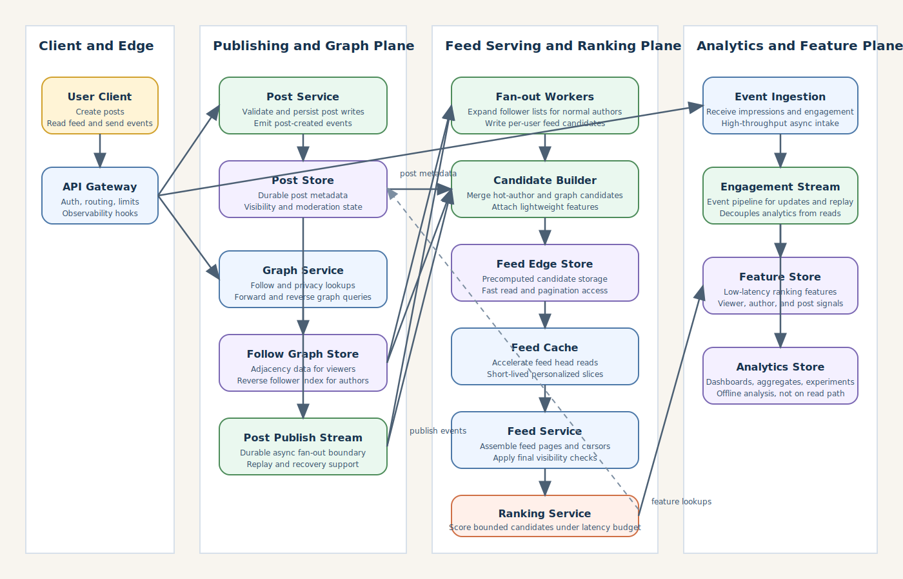
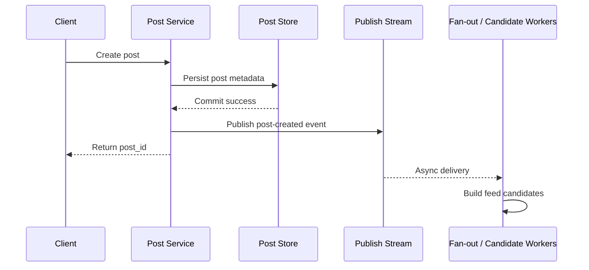
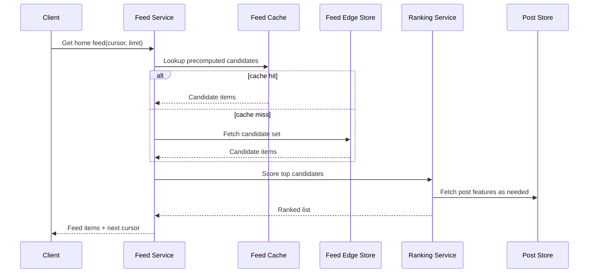
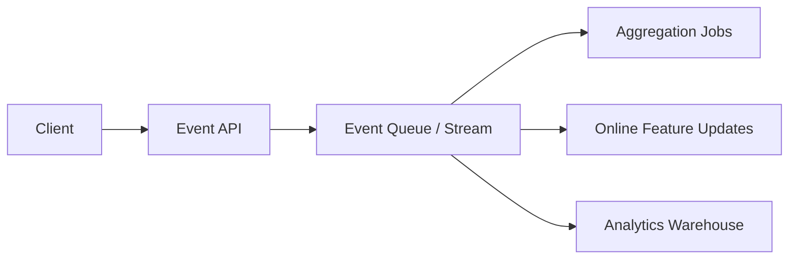
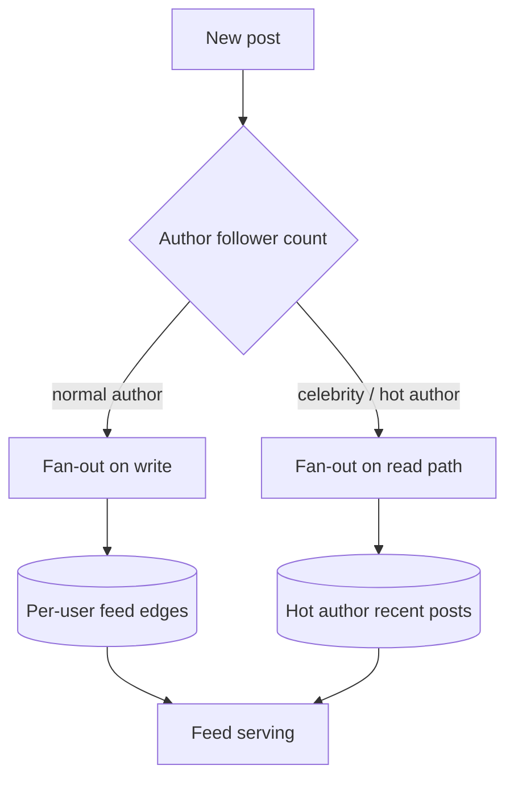
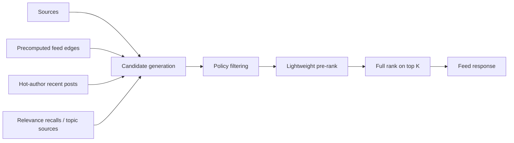
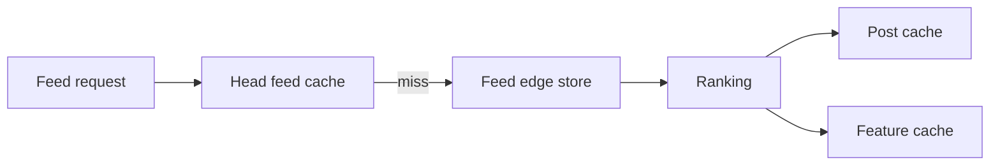

# News Feed System

## 1. Problem Statement

Design a large-scale news feed system similar to the home timeline in Facebook, LinkedIn, or Instagram.

The product should let users:

- publish posts
- follow people, pages, or topics
- open the app and see a personalized feed
- refresh and get newer content
- continue scrolling into older content

At small scale, this can look simple:

- store posts
- store follow relationships
- query recent posts from followed accounts
- sort by time

At large scale, that model breaks down quickly.

A mature feed product has to handle:

- extremely read-heavy traffic
- celebrity or hot-account fan-out
- ranking and personalization
- freshness expectations
- pagination over continuously changing data
- cache efficiency under personalized reads
- spam, abuse, and content moderation constraints

The core challenge is not only storing posts.

The challenge is producing a feed that is:

- fast enough to feel instant
- fresh enough to feel alive
- personalized enough to be useful
- scalable enough to survive skewed traffic

This is a strong case study because it forces tradeoffs across:

- write fan-out vs read fan-in
- precomputation vs online ranking
- cache locality vs personalization
- consistency vs latency
- product quality vs infrastructure cost

## 2. Scope and Assumptions

In scope:

- user follows another user, page, or creator
- user creates a text or media-backed post
- home feed shows ranked posts from followed entities
- feed supports refresh and pagination
- likes and comments exist as engagement signals
- hidden or deleted posts should disappear eventually

Out of scope for this version:

- ad auction systems
- full search
- story or reel products
- ML training pipeline internals
- content storage and transcoding details beyond feed references
- deep moderation model implementation

Assumptions:

- the system is for a mature consumer product
- reads are much higher than writes
- only a small fraction of users publish frequently
- a few publishers can have extremely large follower counts
- ranking quality matters more than strict chronological ordering
- eventual consistency is acceptable for some feed updates, but missing a newly published post for too long is not

## 3. Functional Requirements

The system must support:

- creating a post
- deleting or hiding a post
- following and unfollowing accounts
- generating a home feed for a user
- refreshing for new feed items
- paginating older feed items
- recording engagement signals such as like, share, comment, dwell, or hide
- applying privacy and visibility rules

Important secondary behaviors:

- deduplicating repeated posts in a session
- preventing blocked or muted authors from appearing
- supporting pinned or boosted product surfaces later
- allowing partial degradation during ranking or feature outages

## 4. Non-Functional Requirements

The most important non-functional requirements are:

- low feed read latency
- high availability
- freshness for new content
- scalability under highly skewed publisher traffic
- ranking quality
- cost-efficient storage and fan-out
- fault isolation between publishing and feed serving
- strong enough durability for posts and graph metadata

Consistency requirements are mixed.

The system should strongly preserve:

- post durability once accepted
- follow graph correctness
- privacy and visibility checks

The system can often allow eventual consistency for:

- feed materialization
- engagement counters
- ranking feature updates
- deletion propagation within a bounded window

That distinction is important because a feed system that tries to do everything synchronously becomes expensive and fragile.

## 5. Capacity and Scale Estimation

Assume:

- 300 million daily active users
- 80 million users open feed on a heavy day within a few peak hours
- 40 million posts created per day
- average user opens feed 5 times per day
- average session requests 3 pages of feed

This gives rough traffic:

- post writes: about 463 posts per second average
- peak post writes at 10x: about 4,600 per second
- feed page requests: 300 million x 5 x 3 = 4.5 billion requests/day
- average feed read QPS: about 52,000 requests/second
- peak feed read QPS at 5x to 8x: about 250,000 to 400,000 requests/second

Follow graph assumptions:

- average user follows 300 accounts
- active graph size for 500 million registered users can easily reach tens of billions of edges

Storage assumptions:

- post metadata in feed-serving path: around 1 KB
- feed edge entry: around 32 to 64 bytes
- 40 million posts/day means post metadata alone is around 40 GB/day raw

Feed storage is often larger than post storage.

If the system precomputes feed edges for many recipients, write amplification becomes the central scaling pressure.

That means the architecture must explicitly handle:

- normal publishers
- hot publishers
- cold inactive users
- active users with frequent refreshes

## 6. Core Data Model

Main entities:

- `User`
- `Post`
- `FollowEdge`
- `FeedEdge`
- `EngagementEvent`
- `UserFeature`
- `AuthorFeature`

### Post

Fields:

- `post_id`
- `author_id`
- `created_at`
- `visibility`
- content pointer or media reference
- feature summary such as topic, media type, language
- moderation state

### FollowEdge

Fields:

- `follower_id`
- `followed_id`
- `created_at`
- relationship state such as active, muted, blocked

This is usually stored in a graph-like adjacency representation:

- forward index: user -> followed accounts
- reverse index: author -> followers

### FeedEdge

Represents a candidate item available to a user feed.

Fields:

- `viewer_id`
- `post_id`
- `author_id`
- insertion reason
- candidate timestamp
- lightweight ranking features

Not every design stores this permanently for every user.

Some systems materialize it fully, some partially, and some build candidate sets at read time.

### EngagementEvent

Fields:

- `viewer_id`
- `post_id`
- event type
- event time
- surface

These events are important both for product metrics and ranking feedback.

## 7. APIs or External Interfaces

### Create Post

`POST /api/v1/posts`

Request:

- author identity
- text and media references
- audience or privacy metadata

Response:

- `post_id`
- creation timestamp

### Follow User

`POST /api/v1/follows`

Creates or reactivates a follow edge.

### Get Home Feed

`GET /api/v1/feed/home?cursor=...&limit=...`

Response:

- ranked feed items
- next cursor
- optional server hints for refresh gap

### Record Engagement

`POST /api/v1/feed/events`

Accepts:

- impression
- click
- like
- comment
- hide
- dwell bucket

This should be asynchronous and high-throughput.

## 8. High-Level Design

The system can be viewed as four cooperating planes:

1. publishing plane
2. graph plane
3. feed serving and ranking plane
4. analytics and feature plane

The key separation is this:

- post publishing must remain durable and reliable
- feed serving must remain fast
- ranking and analytics must be allowed to lag somewhat without taking down the product

### Component Responsibilities

#### User Client

The mobile or web application that:

- creates posts
- loads the home feed
- paginates older items
- sends engagement events such as impression, click, like, hide, or dwell

This client should remain thin.

Most feed assembly, filtering, and ranking decisions belong on the server.

#### API Gateway

The entry point that handles:

- authentication and authorization
- request routing
- rate limiting
- tenant or product-surface policy
- common observability hooks

It should not contain feed business logic.

Its job is to protect and route traffic to the right backend services.

#### Post Service

The write-path service responsible for:

- validating post creation requests
- enforcing author-level permissions
- writing post metadata durably
- emitting post-created events after persistence
- handling delete or hide requests

This service owns post correctness, not feed ranking.

#### Post Store

The source of truth for post metadata used by the feed system.

It stores:

- post IDs
- authorship
- timestamps
- visibility settings
- moderation state
- content pointers

This store should be durable and queryable by post ID at high scale.

#### Graph Service

The service that manages follow relationships and graph queries such as:

- who a user follows
- who follows an author
- whether mute, block, or privacy constraints apply

It is critical for both:

- write-time fan-out
- read-time candidate generation

#### Follow Graph Store

The backing store for the social graph.

It typically maintains:

- forward adjacency lists for `viewer -> followed`
- reverse adjacency lists for `author -> followers`

Without both views, the system becomes inefficient for either fan-out on read or fan-out on write.

#### Post Publish Stream

The durable event stream that decouples publishing from downstream feed work.

It allows the system to:

- acknowledge post creation after durable persistence
- process fan-out asynchronously
- replay events during recovery
- scale feed materialization independently of the post write API

This stream is one of the main fault-isolation boundaries.

#### Fan-out Workers

Background workers that consume post-created events and push candidate feed entries to recipients for normal authors.

Their responsibilities include:

- expanding follower lists
- applying basic eligibility filters
- writing feed edges
- throttling or skipping expensive work for hot authors

These workers should never block post creation.

#### Candidate Builder

The service or worker stage that assembles feed candidates from multiple sources.

It is responsible for:

- pulling recent content from hot authors
- merging graph-derived candidates
- attaching lightweight ranking features
- preparing candidate sets for feed serving

This is where hybrid feed assembly starts to become practical.

#### Feed Edge Store

The storage layer for precomputed per-user candidate entries.

It is optimized for:

- fetching the newest candidate slice for a viewer
- pagination into older candidates
- high write throughput from fan-out workers

This is not always the long-term source of truth for all feed logic, but it is often the main acceleration layer for serving.

#### Feed Service

The read-path service that serves home feed requests.

It is responsible for:

- fetching candidate sets
- merging precomputed and read-time candidates
- calling ranking
- enforcing final visibility checks
- building cursors and returning feed pages

This service owns feed assembly semantics.

#### Feed Cache

The low-latency cache used to accelerate the most common read path, especially the first page of feed.

Typical uses:

- cached feed head for active users
- cached candidate slices
- short-lived session-local feed fragments

The cache improves latency, but correctness must not depend on it.

#### Ranking Service

The service that scores and orders candidate posts for a viewer.

It uses:

- viewer features
- author features
- post features
- freshness signals
- engagement predictions

Its job is not to discover the whole universe of content.

Its job is to rank a bounded candidate set within a strict latency budget.

#### Feature Store

The low-latency storage layer for ranking features.

It may contain:

- viewer affinity signals
- author quality scores
- content-level engagement summaries
- recency and interaction features

This store is usually fed continuously by engagement pipelines.

#### Event Ingestion

The write-optimized service that receives engagement telemetry from clients and servers.

It accepts:

- impressions
- clicks
- likes
- comments
- hides
- dwell or watch signals

This path must be scalable and asynchronous because event volume can exceed post-write volume by orders of magnitude.

#### Engagement Stream

The durable event pipeline for downstream processing of engagement data.

It is used for:

- online feature updates
- aggregate counter jobs
- experimentation analysis
- replay and recovery

This keeps behavioral data collection decoupled from feed reads.

#### Analytics Store

The analytical system used for:

- dashboards
- product metrics
- offline investigation
- experiment analysis
- long-term aggregates

It should not sit on the synchronous feed-serving path.

## 9. Request Flows

### A. Post Creation Flow

Important point:

- acknowledge the post after durable write
- do not wait for all followers to receive feed updates synchronously

### B. Feed Read Flow

### C. Engagement Feedback Flow

This path should never sit on the critical path for feed reads.

## 10. Deep Dive Areas

### Fan-out on Write vs Fan-out on Read

This is the core design decision.

#### Fan-out on Write

When an author posts, push that post into followers' feed candidate stores immediately.

Advantages:

- low read latency
- simple feed reads for average users
- good freshness

Costs:

- large write amplification
- severe pain for celebrity accounts
- expensive storage for inactive users who may never open feed

#### Fan-out on Read

When a viewer opens the feed, pull recent posts from followed accounts and rank then.

Advantages:

- avoids pushing to every follower on publish
- better for celebrity accounts
- avoids wasted work for inactive users

Costs:

- expensive reads
- harder pagination and freshness behavior
- more online ranking pressure

In practice, large feed systems usually use a hybrid model.

Recommended approach:

- use fan-out on write for normal authors
- use fan-out on read for very large or very hot authors
- merge both candidate sets during feed serving

That keeps the common case fast without letting a few publishers dominate infrastructure cost.

### Candidate Generation and Ranking

Do not rank against the entire graph at request time.

Instead, use a staged pipeline:

1. generate a candidate set
2. filter by policy and visibility
3. rank top candidates
4. hydrate and return top N

This matters because online ranking is expensive.

A staff-level design should make the ranking budget explicit:

- maybe fetch 500 to 2,000 candidates
- pre-rank to top 100
- full-rank top 25 to 50

Otherwise feed latency becomes unbounded.

### Feed Pagination and Cursors

Offset pagination is a bad fit.

The feed is changing continuously:

- new posts appear
- hidden posts disappear
- ranking features change

Use opaque cursors that encode enough of:

- candidate timestamp boundary
- tie-breaker ID
- optional session snapshot or generation token

This avoids duplicates and skips better than naive page numbers.

### Caching Strategy

Personalized feeds are not globally cacheable in the same way as a public page.

Useful cache layers are:

- per-user feed head cache for first page
- post object cache
- author/profile cache
- feature cache for hot ranking features

The first page deserves special treatment because:

- it gets the highest traffic
- users are most sensitive to latency there
- later pages can tolerate slightly higher latency

### Follow Graph Storage

The graph has two dominant queries:

- who does user X follow
- who follows author Y

That generally implies maintaining both:

- forward adjacency
- reverse adjacency

The reverse index is critical for fan-out on write.

The forward index is critical for fan-out on read and policy checks.

## 11. Bottlenecks and Failure Modes

### Celebrity Fan-out

A single post from a major account can create explosive fan-out pressure.

Mitigations:

- classify hot authors
- bypass full fan-out for them
- use read-time merge from hot-author stores
- cap synchronous work per publish

### Cache Churn

Highly active users can invalidate feed head caches frequently.

Mitigations:

- cache only top slice
- use short TTLs
- allow partial staleness
- decouple candidate cache from final rank cache

### Ranking Dependency Latency

If ranking or feature lookup becomes slow, the whole feed slows down.

Mitigations:

- strict deadlines
- fallback rankers
- cached baseline ordering
- partial feature fetch with defaults

### Deletion and Privacy Propagation

Deleted or privacy-restricted posts may still exist in precomputed feed edges.

Mitigations:

- enforce final visibility checks at read time
- run async invalidation for materialized edges
- maintain moderation tombstones

### Cold Start for New Users

A new user has:

- little graph data
- little engagement history

Mitigations:

- bootstrap with follow suggestions and popular content
- separate onboarding feed logic from steady-state home feed

### Feed Inconsistency Across Refreshes

Users may see:

- duplicates
- reordered items
- slightly stale counters

This is normal unless the system chooses expensive session snapshotting.

The right goal is:

- bounded inconsistency
- no privacy violations
- no severe duplication

## 12. Scaling Strategy

### Stage 1: Simple Pull-Based Feed

Start with:

- post store
- follow graph store
- read-time query of recent posts from followed accounts

This is enough for modest scale, but it will not hold once feed reads grow.

### Stage 2: Precompute Feed Head for Active Users

Add:

- publish stream
- fan-out workers
- feed edge store
- first-page caching

This is usually the first real production architecture.

### Stage 3: Hybrid Fan-out

As skew becomes painful:

- classify hot authors
- avoid full fan-out for them
- merge hot-author content at read time

This is often the most important scaling step.

### Stage 4: Multi-Stage Ranking

As personalization matures:

- separate candidate generation from ranking
- add feature store
- add online pre-rank and heavier full-rank stages

### Stage 5: Multi-Region Feed Serving

As the product becomes global:

- regionalize feed serving and caches
- replicate graph and post metadata where needed
- keep publish events streaming across regions
- keep ranking features region-local where latency matters

## 13. Tradeoffs and Alternatives

### Full Push vs Full Pull

Full push is fast to read and expensive to write.

Full pull is cheaper to publish and expensive to read.

For a large social product, hybrid is usually the only durable answer.

### Chronological Feed vs Ranked Feed

Chronological feed is easier to explain and debug.

Ranked feed is usually better for engagement and relevance.

Once ranking quality becomes a product requirement, architecture must budget for candidate generation and scoring explicitly.

### Materialized Feed Storage vs Recompute on Demand

Materialized feeds reduce online work but create:

- write amplification
- invalidation complexity
- storage overhead

Recompute-on-demand reduces storage but increases tail latency and ranking pressure.

### Strong Session Snapshot vs Eventual Feed Evolution

A fully stable session snapshot improves pagination consistency.

It also increases:

- state management complexity
- storage for session views
- difficulty serving very fresh new content

Most real systems accept some feed movement between requests.

## 14. Real-World Considerations

### Abuse and Integrity

Feed systems are highly vulnerable to:

- spam posting
- engagement manipulation
- coordinated amplification

Ranking and integrity systems must work together.

### Observability

Important metrics:

- feed p50 and p99 latency
- cache hit ratio
- candidate generation latency
- ranking timeout rate
- publish-to-feed freshness delay
- hot-author fallback usage
- duplicate item rate

### Cost Control

The most expensive parts are often:

- fan-out storage
- ranking compute
- cache footprint
- cross-region replication

Design should minimize waste for inactive users and extreme publishers.

### Product Semantics

The team must define:

- what "fresh" means
- whether a deleted post can briefly appear
- how much reordering is acceptable
- whether feed is optimized for recency, engagement, or relationship strength

If these are ambiguous, the architecture will optimize the wrong thing.

### Privacy and Policy

Before returning any item, the system must respect:

- audience settings
- block lists
- moderation actions
- regional policy restrictions

These checks cannot be treated as optional best effort.

## 15. Summary

A news feed system is fundamentally a personalized retrieval and ranking platform built on top of:

- durable posts
- a large social graph
- feed candidate generation
- latency-sensitive serving
- continuous engagement feedback

The central architectural recommendation is:

- separate publishing from feed serving
- use hybrid fan-out instead of pure push or pure pull
- rank in stages rather than against the full universe online
- cache the feed head aggressively
- keep policy checks and post durability stronger than ranking freshness

The hardest part is not storing posts.

It is controlling the interaction between:

- graph skew
- ranking cost
- freshness
- cache efficiency
- product semantics

That is why a good news feed design looks less like one database query and more like a set of deliberately separated pipelines that keep the common path fast without letting outliers dominate the system.
