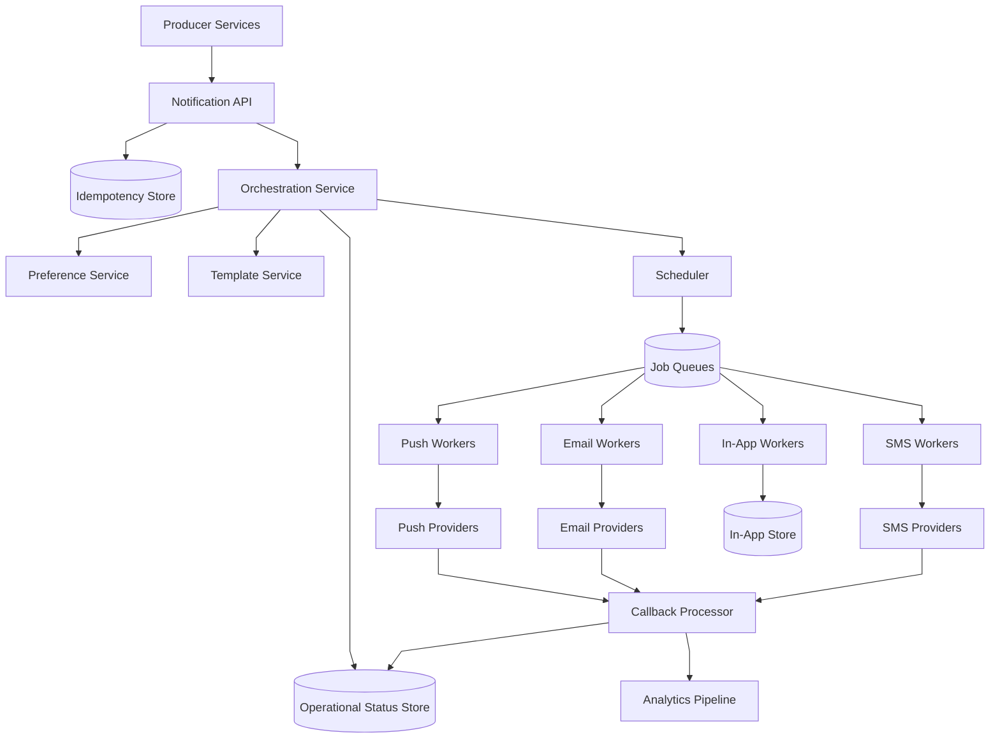
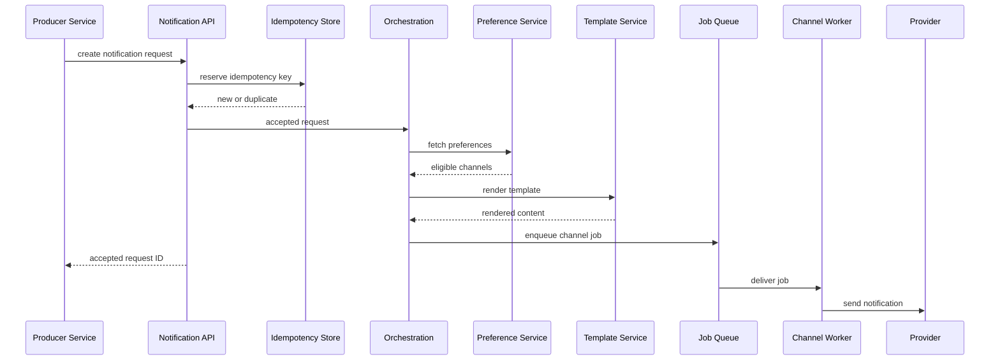
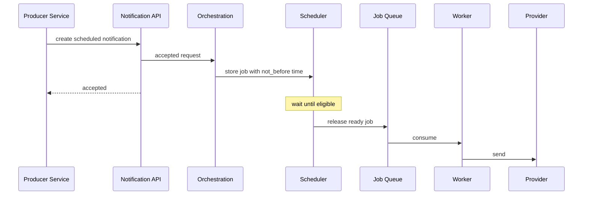
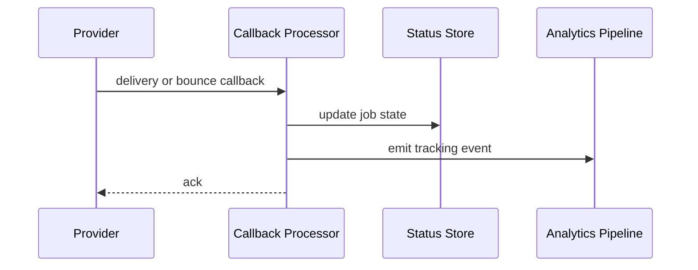
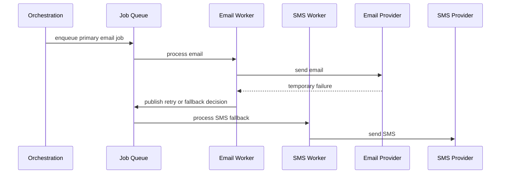

# Notification Service

## 1. Problem Statement

Design a large-scale notification service that can send:

- push notifications
- emails
- SMS
- in-app notifications

to users of many product surfaces.

This kind of system usually starts small.

A product team wants to send:

- order updates
- password reset emails
- payment alerts
- marketing campaigns
- unread message reminders

and the first implementation is often a direct API call to one provider.

That approach stops working once the platform grows.

At scale, a notification system becomes a shared infrastructure layer with a hard mix of requirements:

- low latency for transactional notifications
- scheduled and bulk delivery for campaigns
- user preference enforcement
- multi-channel fallback
- provider-specific reliability and rate limits
- deduplication and idempotency
- auditability and delivery tracking

It is not enough to "send an email" or "send a push."

The platform has to answer deeper questions:

- which channel should be used
- whether the user has opted out
- whether the event is duplicated
- whether the notification should be sent now or later
- which provider should handle delivery
- what to do when a provider is slow or failing
- how to track success, bounce, and click events

This is a strong case study because it combines:

- synchronous APIs
- asynchronous orchestration
- queue-based buffering
- external provider integration
- compliance and preference management
- cost and reliability tradeoffs

## 2. Scope and Assumptions

To keep the design focused, assume the platform supports:

- producer services publishing notification intents
- transactional notifications such as OTP, security alerts, order updates, and payment confirmations
- scheduled notifications such as reminders
- bulk campaign notifications
- channel selection across push, email, SMS, and in-app
- user preferences and opt-out handling
- delivery tracking and provider callback processing

Out of scope for the first version:

- rich content authoring tools for marketers
- advanced experimentation and recommendation ranking
- full ML-based send-time optimization
- deep fraud detection internals

Assume the system is a shared internal platform used by many product teams.

Assume also that:

- transactional notifications are more latency-sensitive than campaigns
- delivery guarantees vary by channel and provider
- the system may rely on third-party providers for actual email, SMS, or mobile push delivery
- producers should not directly integrate with every provider

## 3. Functional Requirements

The system must support:

- accepting notification requests from product services
- sending notifications through email, SMS, push, and in-app channels
- looking up recipient preferences
- applying user opt-out and quiet-hour rules
- choosing a template and rendering message content
- scheduling notifications for future delivery
- retrying transient failures
- tracking delivery outcomes when providers report them
- exposing status for producers or admin systems

Important secondary behaviors:

- idempotent request handling
- deduplication for repeated producer events
- channel fallback when appropriate
- support for bulk fan-out to many recipients
- provider failover where practical
- rate limiting per tenant, use case, or provider

## 4. Non-Functional Requirements

The most important non-functional requirements are:

- high availability
- durability of accepted notification jobs
- low latency for critical transactional notifications
- elasticity during spikes and campaigns
- cost efficiency across channels
- strong auditability for compliance-sensitive notifications
- tenant isolation so one producer cannot starve others
- operational visibility into queue lag, provider health, and delivery success

Consistency requirements are mixed.

The system should strongly preserve:

- whether a notification job was accepted
- whether idempotency prevented duplicate creation
- whether user preferences blocked the send

But it can often treat as eventually consistent:

- final delivery status updates
- campaign aggregates
- click/open analytics

This distinction matters because external providers are rarely perfectly synchronous or perfectly reliable.

## 5. Capacity and Scale Estimation

Assume the platform serves:

- 50 internal producer services
- 200 million registered users
- 20 million daily active users

Assume average daily notification volume:

- 80 million push notifications
- 12 million emails
- 4 million SMS
- 25 million in-app notification writes

That is roughly:

- 121 million notifications per day
- about 1,400 notifications per second average

Assume peak is 10x average during:

- flash sales
- major product launches
- outage recovery bursts
- campaign send windows

Then peak system pressure is closer to:

- 14,000 notification requests per second

This is only ingress pressure.

Downstream pressure is often higher because one accepted intent may expand into:

- multiple channels
- multiple devices
- retries
- provider callbacks

Storage assumptions:

- notification job metadata: around 1 KB
- rendered payload references or compact content: around 1-2 KB
- delivery attempt records: around 0.5 KB each

If the platform stores 120 million jobs per day with moderate metadata, the raw metadata footprint can reach hundreds of GB per day before retention pruning and indexing overhead.

A practical system usually separates:

- hot operational status data with shorter retention
- long-term audit and analytics data in cheaper storage

## 6. Core Data Model

The key entities are:

- `NotificationRequest`
- `NotificationJob`
- `DeliveryAttempt`
- `UserPreference`
- `Template`
- `ProviderConfig`
- `ScheduledNotification`
- `DeliveryEvent`

### NotificationRequest

Represents the producer-facing intent.

Fields:

- `request_id`
- `tenant_id`
- `event_type`
- `recipient_id`
- `idempotency_key`
- `requested_channels`
- `priority`
- `scheduled_at`
- `payload_reference` or structured variables

### NotificationJob

Represents an internal unit of work after orchestration.

Fields:

- `job_id`
- `request_id`
- `channel`
- `recipient_target`
- `template_id`
- `provider`
- `job_state`
- `not_before`
- `created_at`

One producer request may turn into multiple channel-specific jobs.

### DeliveryAttempt

Tracks tries against a provider.

Fields:

- `attempt_id`
- `job_id`
- `provider`
- `attempt_number`
- `attempt_state`
- `error_code`
- `provider_message_id`
- `attempted_at`

### UserPreference

Stores notification eligibility rules.

Fields:

- `user_id`
- `event_type`
- allowed channels
- quiet hours
- locale
- opt-out or subscription flags

### Template

Defines renderable content.

Fields:

- `template_id`
- `channel`
- `locale`
- title or subject
- body
- version

The main data access patterns are:

- create notification by request ID or idempotency key
- fetch preferences by user and event type
- enqueue jobs by schedule time and priority
- update job state by job ID
- query delivery history by request ID
- process provider callbacks by provider message ID

## 7. APIs or External Interfaces

### Create Notification

`POST /api/v1/notifications`

Request:

- tenant ID
- recipient ID
- event type
- structured payload variables
- optional requested channels
- optional idempotency key
- optional scheduled time

Response:

- accepted request ID
- internal status such as `accepted` or `deduplicated`

### Bulk Notification Submit

`POST /api/v1/notifications/bulk`

Used for campaign-like fan-out or batch audience delivery.

The response should acknowledge intake, not full delivery completion.

### Get Notification Status

`GET /api/v1/notifications/{request_id}`

Returns:

- orchestration status
- channel jobs
- delivery attempts
- current terminal or in-progress state

### Manage Preferences

`PUT /api/v1/users/{user_id}/preferences`

Used to:

- opt out of categories
- configure quiet hours
- select preferred channels
- set locale

### Provider Callback Endpoint

`POST /api/v1/providers/{provider}/callback`

Used for:

- delivered
- bounced
- rejected
- unsubscribed
- clicked
- opened

The service should verify provider signatures and map callbacks to internal jobs.

## 8. High-Level Design

At a large scale, the platform should separate:

- ingestion
- orchestration
- preference evaluation
- content rendering
- scheduling
- delivery execution
- provider integration
- callback processing
- analytics and reporting

For interview discussion, the high-level diagram should show the main control points rather than every helper service:

- producer services
- notification API
- idempotency store
- orchestration service
- preference service
- template service
- scheduler
- job queues
- channel workers
- provider adapters
- callback processor
- status store
- analytics pipeline

What to notice:

- producers never call email, SMS, or push providers directly
- orchestration is separate from execution because routing and policy decisions are different from sending
- scheduling is separate from worker execution because deferred delivery needs time-based release, not busy waiting
- callbacks are handled asynchronously because provider outcome reporting is delayed and provider-specific

This diagram intentionally compresses the platform into the boundaries that matter most in an interview:

- intake
- policy and orchestration
- queued execution
- provider interaction
- feedback and analytics

### Responsibility of Each Service

#### Notification API

Responsibilities:

- authenticate producers
- validate request shape
- enforce tenant-level quotas
- persist or reserve idempotency keys
- hand accepted requests to orchestration

This service should be thin and stable.

It should not contain provider-specific logic.

#### Idempotency Store

Responsibilities:

- prevent duplicate notification creation from producer retries
- map an idempotency key to the previously accepted request
- return the earlier result for safe retries

This is especially important for:

- payment alerts
- order confirmations
- password reset sends

#### Orchestration Service

Responsibilities:

- interpret the notification intent
- choose candidate channels
- apply business rules
- expand one request into one or more channel-specific jobs
- decide whether the request should send immediately or be scheduled

This is the decision-making brain of the platform.

#### Preference Service

Responsibilities:

- enforce opt-out rules
- enforce quiet hours
- expose locale and preferred channels
- apply category-specific notification policy

This service ensures correctness from the user's perspective, not just from the producer's perspective.

#### Template Service

Responsibilities:

- version templates
- render channel-specific content
- localize content
- validate variable completeness

Keeping template handling separate helps avoid duplicating rendering logic across workers.

#### Scheduler

Responsibilities:

- hold deferred jobs until eligible for release
- release jobs into execution queues at the right time
- smooth spikes by controlling batch release behavior

It is better to model scheduled notifications explicitly than to leave sleeping tasks in worker memory.

#### Channel Workers

Responsibilities:

- consume ready jobs
- call the appropriate provider adapter
- apply channel-specific throttling and retry policy
- persist attempt status

Workers should be specialized by channel because email, SMS, push, and in-app delivery behave very differently.

#### Provider Adapters

Responsibilities:

- translate internal requests into provider-specific APIs
- handle authentication and provider-specific payload formatting
- normalize provider errors into internal failure classes

This layer protects the rest of the platform from vendor-specific details.

#### Callback Processor

Responsibilities:

- verify callbacks from providers
- map provider events to internal jobs
- update delivery state
- trigger analytics and compliance updates

Without this component, the platform cannot accurately track bounces, rejects, or unsubscribe signals.

#### Operational Status Store

Responsibilities:

- keep the current state of each request and job
- support status lookup APIs
- support operations dashboards and debugging

This store is optimized for operational visibility, not long-term analytics.

### Why Separate Orchestration from Delivery Workers

This boundary is important.

The orchestration service answers:

- should this notification be sent
- which channels are allowed
- which template should be used
- whether the send should happen now or later

The worker tier answers:

- how to execute one channel-specific job
- how to retry provider failures
- how to respect provider throttling

If these concerns are collapsed into one service, the code tends to mix:

- product policy
- user preference logic
- provider-specific delivery rules
- retry behavior

That becomes hard to evolve and hard to debug.

## 9. Request Flows

### Transactional Notification Flow

What to notice:

- the producer only waits for acceptance, not delivery completion
- idempotency sits on the intake path
- preference evaluation happens before execution
- rendering and orchestration happen before provider delivery

### Scheduled Notification Flow

What to notice:

- scheduling is modeled as time-based release into a queue
- workers only process ready jobs
- the platform avoids leaving large numbers of sleeping tasks in memory

### Provider Callback Flow

What to notice:

- callback handling is asynchronous and provider-driven
- delivery status often becomes final after the initial send call returns
- operational state and analytics can be updated separately

### Multi-Channel Fallback Flow

What to notice:

- fallback should be policy-driven, not automatic for every failure
- channel escalation changes both cost and user experience
- the system needs explicit rules to avoid duplicate over-notification

## 10. Deep Dive Areas

### 10.1 Channel Selection and Routing

A notification service should not blindly send every event on every channel.

The routing problem usually depends on:

- event criticality
- user preference
- current device reachability
- cost
- latency requirement
- regulatory restrictions

For example:

- OTP may prefer SMS or push with aggressive latency goals
- password reset may use email plus optional push
- marketing campaigns may prefer email or push but never SMS by default because of cost and consent
- in-app may be written for feed visibility even if another live channel is also used

There are several routing models.

#### Producer-Chooses-All-Channels

The producer explicitly specifies every channel.

Strengths:

- simple producer control

Costs:

- duplicates policy logic across producers
- harder to enforce platform consistency
- easier to violate user preference or cost goals

#### Platform-Decides-Channel

The producer sends intent and the platform decides channels.

Strengths:

- centralized policy
- easier cost control
- easier experimentation and compliance

Costs:

- orchestration logic becomes more complex

#### Hybrid Model

The producer specifies:

- required channels
- allowed channels
- priority

and the platform applies final policy.

**Recommendation**

Use the hybrid model.

Why:

- some product domains genuinely know mandatory requirements
- the platform still needs final authority for user preference, quiet hours, and cost control
- it scales better organizationally than allowing every producer to reinvent delivery policy

### 10.2 Templates, Localization, and Rendering

Templates look simple until the platform supports:

- multiple channels
- many locales
- versioning
- product-specific branding

The system should separate:

- event payload variables
- template definition
- rendered content

That avoids producer teams hardcoding message strings in many codebases.

Common choices:

#### Render at Producer

Producer sends fully rendered content.

Strengths:

- simpler platform

Costs:

- template drift across teams
- no centralized localization or compliance controls

#### Render in Notification Platform

Producer sends structured variables and template ID.

Strengths:

- centralized content governance
- easier localization
- easier versioning

Costs:

- tighter dependency on template service availability

**Recommendation**

Render in the notification platform for most messages.

Why:

- it keeps content policy centralized
- it enables localization and template versioning
- it makes provider switching easier because the payload stays in platform-owned format longer

### 10.3 Idempotency and Deduplication

Notification systems create user trust problems quickly if they duplicate sends.

Duplicates commonly come from:

- producer retries after timeout
- replayed events from queues
- callback races
- multiple upstream services reacting to the same business event

There are two related but different controls.

#### Idempotency

Used on the API intake path.

If the producer retries the same request with the same idempotency key, the system should return the same accepted result instead of creating a new notification request.

#### Deduplication

Used deeper in the workflow to prevent semantically repeated sends.

Examples:

- do not send three "order shipped" messages for the same order state
- collapse repeated low-value reminders within a short interval

**Recommendation**

Use both:

- producer-facing idempotency keys at intake
- event-level dedupe rules in orchestration for selected event types

Why:

- intake idempotency protects against transport retries
- orchestration dedupe protects against repeated business events and noisy producers

### 10.4 Preferences, Quiet Hours, and Compliance

This is one of the most important correctness areas in a notification platform.

If the platform gets delivery semantics right but ignores opt-out or legal rules, the design is still wrong.

Preference evaluation may include:

- category-level opt-in or opt-out
- channel-level opt-out
- locale
- time-zone-aware quiet hours
- regional consent requirements
- marketing vs transactional classification

A key design decision is whether the producer or the platform classifies notification type.

**Recommendation**

The producer should declare the event category, but the platform must enforce the policy.

Why:

- product teams understand event semantics
- the platform must retain final authority for legal and user-preference enforcement

Quiet hours also require careful semantics.

Some messages should be delayed.

Some should bypass quiet hours entirely, such as:

- security alerts
- fraud warnings
- OTP

This is why the policy model should include:

- event category
- urgency
- bypass rules

not just a flat "send or do not send" switch.

### 10.5 Retry, Backoff, and Provider Failover

External providers fail in many ways:

- timeouts
- rate limiting
- temporary rejection
- hard bounce
- invalid token or address

The system should classify errors into:

- retryable
- non-retryable
- provider-health-affecting

Retryable failures should use:

- bounded retry count
- exponential backoff with jitter
- dead-lettering or operator visibility if retries exhaust

Provider failover is more subtle than it looks.

For email and SMS especially, failover is useful but not free.

Potential problems:

- duplicate sends if the first provider actually succeeded but timed out
- different deliverability reputation across providers
- different content or compliance rules

**Recommendation**

Use conservative provider failover.

Why:

- for critical channels, failover is valuable
- but it should be limited to clearly classified transient failures
- the platform should preserve a strong audit trail to avoid silent duplicate sends

### 10.6 Bulk Fan-Out and Campaign Isolation

The same platform often handles both:

- critical low-latency transactional sends
- huge campaign or promotional sends

This is dangerous if they share exactly the same queues and worker pools.

A big campaign can:

- starve transactional jobs
- exhaust provider quotas
- increase callback volume dramatically

**Recommendation**

Isolate transactional and campaign traffic.

That can mean:

- separate queues
- separate worker pools
- separate rate limits
- separate provider accounts or quotas

Why:

- the business impact of delaying OTP is much worse than delaying a marketing email
- the platform should encode that priority directly in architecture, not only in documentation

## 11. Bottlenecks and Failure Modes

### Queue Backlog

If workers fall behind:

- latency grows
- scheduled sends drift late
- transactional messages lose their usefulness

Mitigations:

- queue lag monitoring
- per-channel scaling
- priority isolation between transactional and campaign traffic

### Provider Outage or Throttling

A major provider can rate-limit or fail.

Effects:

- retries pile up
- queues expand
- fallback traffic may surge to another provider

Mitigations:

- per-provider circuit breaking
- backoff
- limited failover
- operator controls to pause low-priority traffic

### Preference Store Bottleneck

If preference lookups are synchronous on the hot path and the store is slow, all sends become slow.

Mitigations:

- cache hot preferences carefully
- keep the preference schema simple
- use explicit invalidation or bounded staleness rules

### Template Rendering Failures

Missing variables or broken templates can create large-scale failure for one event type.

Mitigations:

- template validation before activation
- preview tooling
- canary rollout for new templates

### Callback Flood

Large campaigns can create enormous callback volume for:

- delivered
- opened
- bounced
- unsubscribed

Mitigations:

- separate callback ingestion path
- idempotent callback processing
- async analytics pipeline

### Duplicate Sends

This can happen due to:

- producer retries
- worker retries after ambiguous provider response
- fallback after uncertain first-attempt outcome

Mitigations:

- intake idempotency
- attempt tracking
- conservative failover rules
- dedupe windows for selected events

## 12. Scaling Strategy

### Stage 1: Single Region, Few Channels

Start with:

- one notification API
- one orchestration service
- one queue
- one email or push provider

This is enough for moderate internal adoption.

### Stage 2: Separate Channel Workers

As usage grows:

- split workers by channel
- add retry policies per channel
- add operational status tracking

This is usually the first major step because channel behavior diverges quickly.

### Stage 3: Add Preference Service and Template Service

Once many products depend on the platform:

- centralize preferences
- centralize templates
- stop allowing every producer to bypass policy

This is where the platform becomes real shared infrastructure.

### Stage 4: Provider Redundancy and Campaign Isolation

As business importance increases:

- add backup providers for critical channels
- isolate bulk traffic from transactional traffic
- add explicit tenant quotas and prioritization

### Stage 5: Multi-Region and Compliance Expansion

As global scale and regulatory needs grow:

- regionalize delivery paths
- keep preferences and templates available regionally
- enforce region-specific compliance rules
- localize provider selection

## 13. Tradeoffs and Alternatives

### One Shared Platform vs Team-Owned Notification Logic

Shared platform advantages:

- consistency
- lower duplicate integration work
- better compliance control

Costs:

- platform complexity
- central team ownership burden

For any reasonably large organization, a shared platform is the better long-term design.

### Synchronous Send vs Queue-First

Synchronous delivery gives immediate feedback, but it couples producer latency to provider latency.

Queue-first design:

- improves resilience
- smooths spikes
- gives better retry behavior

but:

- delivery becomes asynchronous from the producer's point of view

For most notifications, queue-first is the better design.

### Producer-Owned Content vs Platform-Owned Templates

Producer-owned content is faster to start with.

Platform-owned templates are better for:

- localization
- governance
- consistency

The long-term platform should own templates for most important notification types.

### Single Provider vs Multi-Provider

Single provider is simpler and often sufficient at smaller scale.

Multi-provider increases resilience and negotiation leverage, but also increases:

- complexity
- operational surface area
- risk of inconsistent behavior

Use multi-provider selectively for critical channels.

## 14. Real-World Considerations

### Compliance and Consent

Different notification types have different legal constraints.

The system should explicitly model:

- transactional vs marketing
- unsubscribe handling
- region-specific consent
- audit trails for policy decisions

### Cost Control

SMS and some email paths can become expensive quickly.

The platform should support:

- per-tenant budget controls
- channel prioritization
- fallback rules that consider cost

### Observability

Operators need visibility into:

- queue lag
- provider error rate
- channel success rate
- template rendering failures
- callback delay
- per-tenant usage spikes

Without this, the platform becomes impossible to operate during incidents.

### Security

The platform handles sensitive user communication paths.

It should protect:

- provider credentials
- recipient addresses and device tokens
- notification content where sensitive
- admin access to templates and campaigns

### Data Retention

Not every notification record should be kept forever.

A practical platform usually separates:

- short-retention operational state
- longer-retention audit logs
- aggregated analytics

## 15. Summary

A strong notification service is not just a wrapper around email and SMS vendors.

It is a policy-driven orchestration platform that:

- accepts producer intents
- enforces user and compliance rules
- renders channel-specific content
- schedules and queues delivery work
- executes through specialized channel workers
- tracks provider outcomes and delivery state

The core design recommendation is:

- keep producer ingestion simple
- centralize orchestration and policy
- execute asynchronously through queues and channel workers
- isolate transactional traffic from bulk traffic
- treat providers as unreliable external dependencies behind adapters

That design fits the real shape of the problem:

- many producers
- many channels
- bursty delivery
- external provider uncertainty
- strict user-preference and compliance requirements
