# Rate Limiter

## 1. Problem Statement

Design a large-scale rate limiter that protects APIs, services, and shared infrastructure from overload, abuse, and unfair usage.

A rate limiter is used to answer questions such as:

- should this request be allowed right now
- how much budget remains
- when should the client retry
- which limit was violated

At small scale, this sounds simple:

- count requests per key
- reject anything beyond a threshold

At production scale, the problem becomes much more subtle.

The system now has to handle:

- distributed clients hitting many service instances
- very high request volume on the live request path
- multiple dimensions such as IP, user, tenant, token, endpoint, or method
- hot keys and attack traffic
- regional traffic distribution
- latency-sensitive decisions
- fairness, burst tolerance, and correctness tradeoffs

The hard part is not incrementing a counter.

The hard part is making a decision that is:

- fast enough to sit inline
- predictable enough to operate safely
- fair enough to protect shared capacity
- flexible enough to support different policy classes

This is a strong case study because it forces tradeoffs across:

- strictness vs availability
- local speed vs global fairness
- exactness vs cost
- request-path latency vs centralized coordination
- simple quotas vs real burst semantics

## 2. Scope and Assumptions

In scope:

- per-key rate limiting
- policies such as requests per second, minute, or hour
- support for dimensions such as user, IP, API key, tenant, or endpoint
- allow or reject decision on the request path
- return headers such as remaining budget and retry-after
- support for multiple policies on the same request

Out of scope for this version:

- full WAF and bot detection internals
- billing systems for purchased quota
- ML-based abuse detection
- deep product-specific fairness semantics

Assumptions:

- the limiter is shared infrastructure used by many services
- request-path latency matters significantly
- some policies can tolerate approximation
- some policies require tighter enforcement
- the platform may need both regional-local protection and globally scoped quotas

## 3. Functional Requirements

The system must support:

- defining a rate-limit policy for one or more keys
- evaluating whether a request is allowed
- consuming budget when allowed
- returning retry metadata when rejected
- supporting multiple concurrent policies such as:
  - per-IP
  - per-user
  - per-tenant
  - per-endpoint

Important secondary behaviors:

- shadow mode for testing policies without enforcement
- policy rollout without redeploying clients
- exemptions for trusted actors
- weighted requests
- optional idempotent handling for retried operations

## 4. Non-Functional Requirements

The most important non-functional requirements are:

- very low decision latency
- high availability
- predictable enforcement behavior
- scalability to very high QPS
- resilience against hot-key pressure
- strong observability

Consistency requirements are policy-dependent.

For some limits, approximate enforcement is acceptable.

Examples:

- coarse anonymous IP throttling
- soft per-minute limits

For others, tighter enforcement matters more.

Examples:

- expensive quota-backed APIs
- OTP or login abuse protection
- scarce multi-tenant backend capacity

The design should separate:

- soft or advisory policies
- strict or business-critical policies

because one consistency model is rarely right for every limit.

## 5. Capacity and Scale Estimation

Assume the shared platform protects:

- 200 APIs
- 50 million daily active clients
- 500,000 peak requests per second across all protected services

Assume not every request requires central coordination because:

- some endpoints use local burst absorption
- some coarse limits are cached

A realistic central decisioning target could still be:

- 100,000 to 200,000 centralized checks per second

Key distribution is highly skewed.

For example:

- one tenant may dominate traffic
- one abused token may become extremely hot
- one source IP may create attack traffic

Storage assumptions:

- active token or counter state per key is small, often tens to low hundreds of bytes
- policy configuration is small

The challenge is not total storage volume.

The challenge is:

- atomic mutation of hot keys
- cross-region overshoot
- request-path latency under centralized coordination

## 6. Core Data Model

Main entities:

- `RateLimitPolicy`
- `RateLimitKeyState`
- `PolicyVersion`
- `DecisionLog`

### RateLimitPolicy

Fields:

- `policy_id`
- key type such as IP, user, token, or tenant
- limit algorithm
- limit value
- burst allowance
- scope such as local, regional, or global
- enforcement mode such as active or shadow
- fail mode such as open or closed

### RateLimitKeyState

Represents the mutable serving state for a key.

Fields depend on algorithm, but may include:

- `key`
- `remaining_tokens`
- `last_refill_at`
- `window_start`
- `window_count`
- `version`

### PolicyVersion

This is conceptually important even if stored inside the policy document.

It allows:

- safe rollout
- cache invalidation
- shadow-vs-active comparison

### DecisionLog

Represents optional async decision telemetry.

Fields:

- key
- policy ID
- decision
- request cost
- timestamp
- region
- service

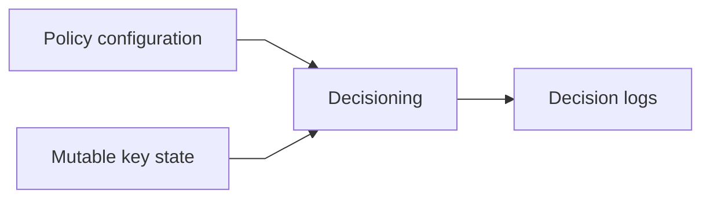

The important modeling distinction is:

- policy configuration
- hot mutable serving state
- async observability data

Those should not be forced into one storage system.

## 7. APIs or External Interfaces

### Check and Consume

`POST /api/v1/rate-limit/check`

Request:

- key
- request context
- request cost if weighted

Response:

- allow or reject
- remaining budget
- retry-after metadata
- matched policy identifiers

### Get Policy

`GET /api/v1/rate-limit/policies/{policy_id}`

### Update Policy

`PUT /api/v1/rate-limit/policies/{policy_id}`

### Shadow Evaluation

`POST /api/v1/rate-limit/check-shadow`

Used for validation or testing flows.

## 8. High-Level Design

At a high level, the system can be divided into four concerns:

1. policy management
2. request-path decisioning
3. hot serving state
4. async telemetry and analytics

The high-level diagram should emphasize the key production boundaries:

- gateway or middleware
- rate limit service
- policy store
- counter or token store
- async log path

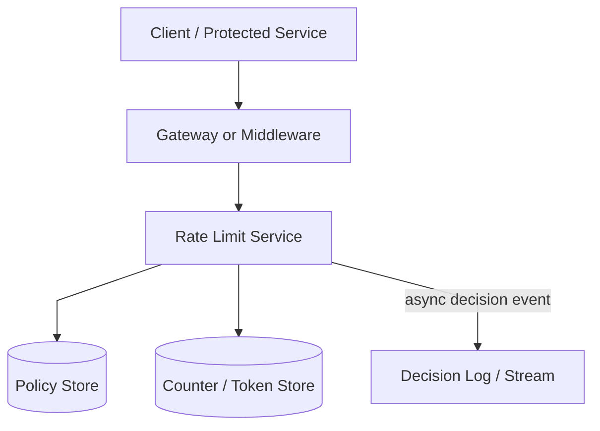

What to notice:

- the limiter is inline, so latency matters as much as correctness
- policy storage and mutable key state are different concerns
- observability is asynchronous because request-path logging on every request is too expensive
- middleware may cache policies or local budget, but shared enforcement still depends on the central decision path for selected policies

The key architectural separation is this:

- control plane for policies
- data plane for request decisions

### End-to-End Shape

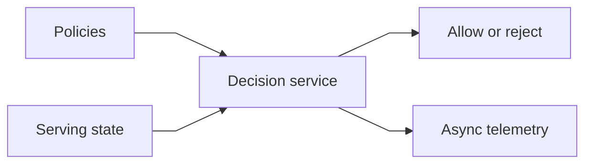

### Component Responsibilities

#### Gateway or Middleware

This component may live in:

- an API gateway
- a service mesh filter
- application middleware

Responsibilities:

- extract the key or keys to limit
- call the rate-limit service
- enforce allow or reject
- return appropriate headers

Some systems also let this layer consume locally pre-allocated budget.

#### Rate Limit Service

Responsibilities:

- load active policy
- check or consume budget
- combine multiple applicable limits
- return allow or reject plus metadata

This is the latency-critical core.

#### Policy Store

Responsibilities:

- store policy definitions
- store versions and rollout state
- support active and shadow configurations

This is usually a configuration store or database, not the hot mutation layer.

#### Counter or Token Store

Responsibilities:

- perform atomic budget mutation
- hold hot mutable state
- expire inactive keys
- support algorithm-specific logic such as refill or window advance

This store is the main scalability pressure point.

Typical choices:

- Redis for fast atomic operations
- a memory-heavy KV with replication
- a custom sharded in-memory state service for very high scale

#### Decision Log or Stream

Responsibilities:

- provide analytics and auditability
- support shadow-policy evaluation
- help detect abusive traffic patterns

It should not be on the critical decision path.

## 9. Request Flows

### Allow Flow

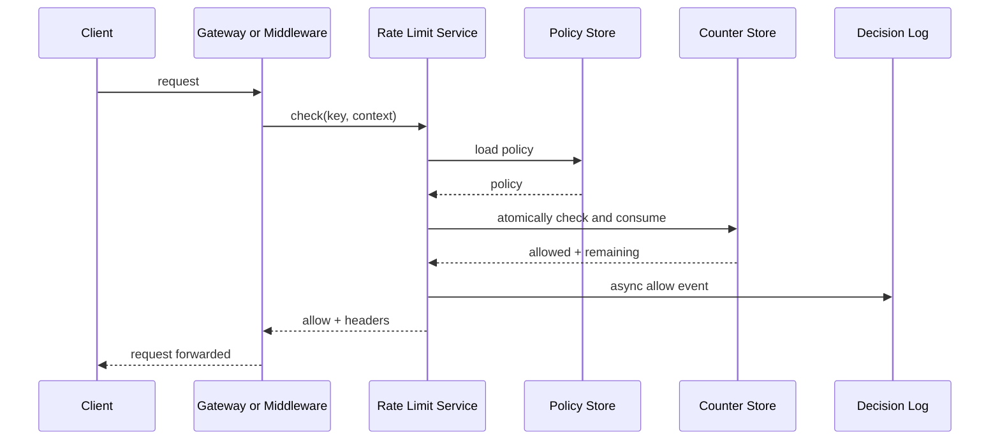

### Reject Flow

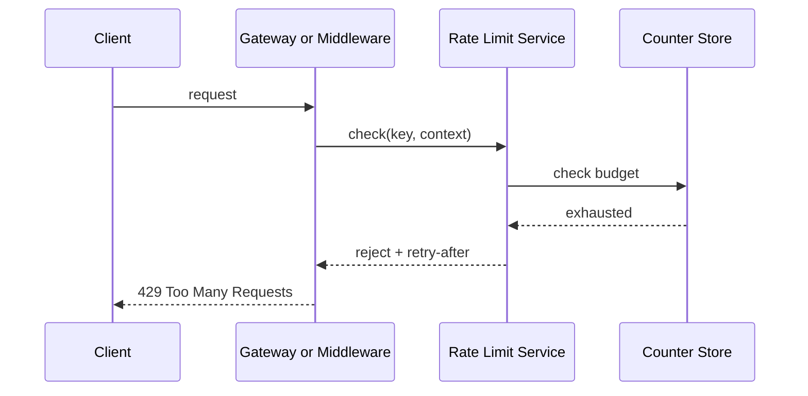

### Policy Update Flow

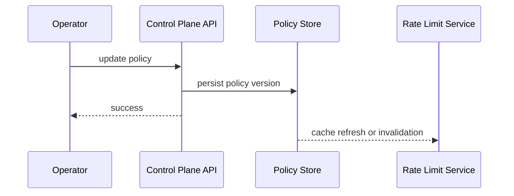

### Hybrid Local + Central Flow

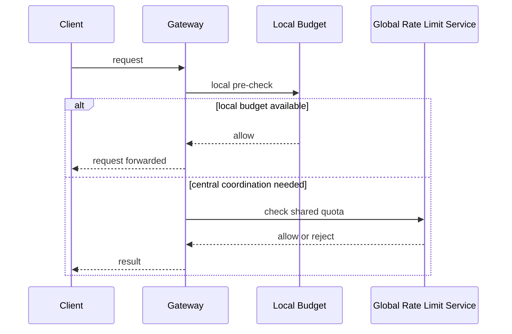

This pattern exists because:

- local checks are fast
- fully centralized checks are more accurate

Large systems often need both.

## 10. Deep Dive Areas

### Algorithm Choice

This is the central design question.

Different algorithms produce different user-visible behavior and operational cost.

#### Fixed Window Counter

Simple and cheap.

Strengths:

- simple to implement
- low storage overhead

Costs:

- unfair burst behavior at window boundaries

This is fine for coarse limits, but usually not ideal for sensitive fairness control.

#### Sliding Window Log

Tracks individual timestamps.

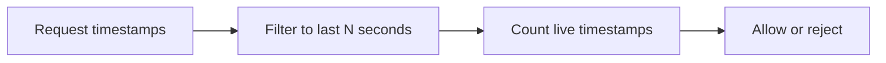

Strengths:

- accurate semantics
- intuitive reasoning

Costs:

- expensive memory and update behavior
- poor fit for very hot keys

This is usually too costly for a general-purpose shared limiter.

#### Sliding Window Counter

Uses bucketed approximation.

Strengths:

- better fairness than fixed window
- cheaper than full timestamp logs

Costs:

- approximate behavior

This is often a practical compromise for shared infrastructure.

#### Token Bucket

This is a very common production default.

Tokens refill steadily over time.

Requests consume tokens.

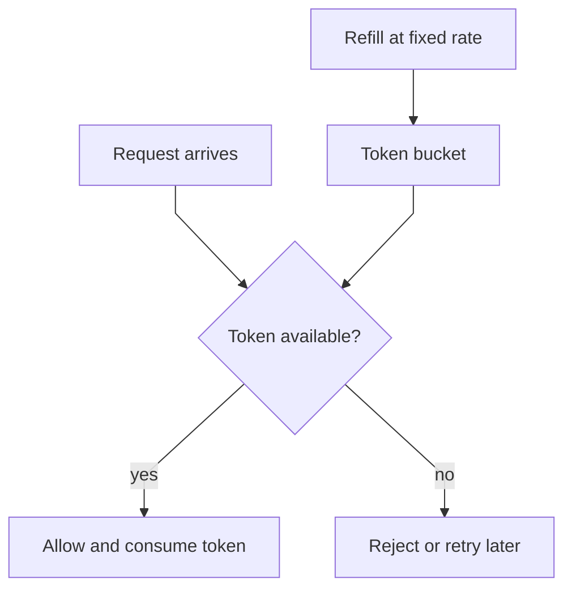

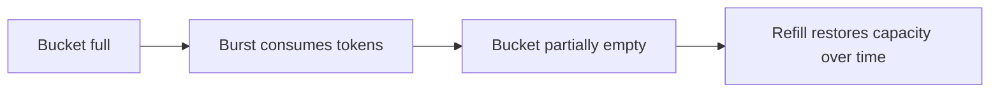

Strengths:

- natural burst support
- bounded average rate
- efficient mutable state

Costs:

- requires refill semantics and time-based mutation logic

This is often the best general default for APIs.

#### Leaky Bucket

Models a fixed drain rate.

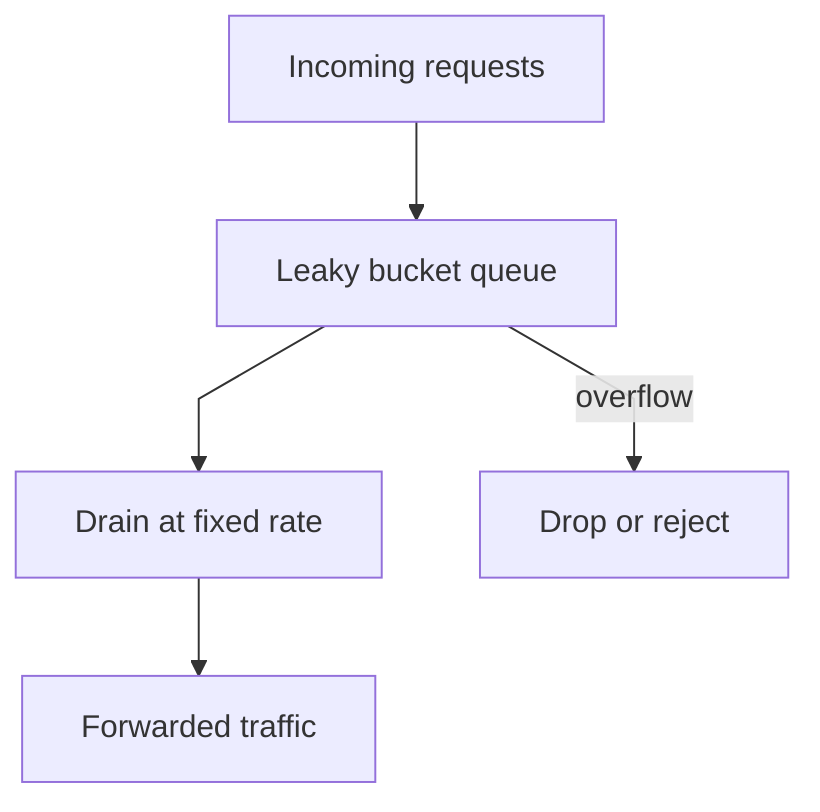

Strengths:

- smooths downstream traffic
- useful when backend stability matters more than burst allowance

Costs:

- different semantics than simple request quotas
- often feels more like queue-shaping than pure API quota

### Choosing the Database or Store

The ideal store depends on the policy class.

#### Redis or Similar In-Memory KV

Good fit for:

- hot token state
- atomic increment or Lua-like multi-step mutation
- low-latency serving

Bad fit for:

- long-term analytics
- unlimited hot-key scale without careful partitioning

#### Durable Log or Stream

Useful for:

- async decision telemetry
- replay of policy evaluation data
- shadow-mode analysis

Not the right primary store for inline token mutation.

#### Configuration Database

Good fit for:

- policy definitions
- rollout versions
- metadata and audit

Not the right place for request-path counter mutation.

The main design point is:

- policy definitions, mutable token state, and observability data want different storage systems

### Local vs Central Enforcement

A single central limiter gives better fairness and worse latency.

Local-only enforcement gives better latency and worse global accuracy.

That leads to three practical models:

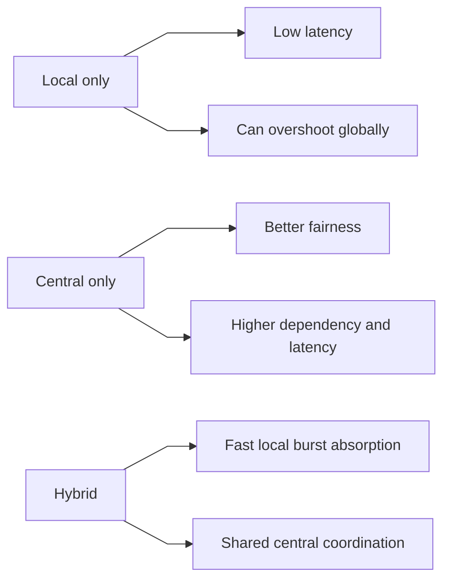

The hybrid model is often the most practical production answer.

### Edge Cases and Policy Semantics

This is where explanations often stay too shallow.

Questions the system must answer:

- if a request matches multiple policies, which reject reason wins
- if local budget says allow but central budget says reject, what is the final behavior
- if the central service is unavailable, does this endpoint fail open or fail closed
- if a request is retried, should it consume budget again
- if the key identity changes due to auth refresh or proxy headers, which identity is authoritative

A robust design does not hide these questions.

It makes them explicit per policy class.

### Global vs Regional Limits

Global exact limits are expensive because they require cross-region coordination.

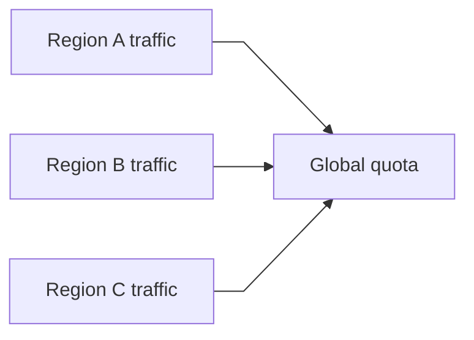

In practice, systems often use:

- regional-local enforcement for soft limits
- budget partitioning per region
- strict central coordination only for selected limits

## 11. Bottlenecks and Failure Modes

### Counter Store Hotspots

One key can overload a single partition.

Mitigations:

- shard by key
- isolate hot tenants or tokens
- local pre-allocation of budget

### Limiter Dependency Outage

If the limiter is down, every protected service is exposed.

This forces an explicit policy choice:

- fail open preserves availability
- fail closed preserves backend protection

### Policy Cache Staleness

If gateways run old policies:

- enforcement becomes inconsistent
- rollout behavior becomes confusing

Mitigations:

- explicit policy versions
- bounded TTLs
- invalidation streams

### Cross-Region Overshoot

Independent regional enforcement can exceed nominal global quota.

Mitigations:

- regional budget partitioning
- central coordination for strict policies
- accept approximate fairness for softer policies

### Clock Issues

Many algorithms depend on time.

If clocks drift:

- refill logic changes
- windows drift

Mitigations:

- monotonic time where possible
- bounded clock skew assumptions
- simplified refill arithmetic in the serving tier

## 12. Scaling Strategy

### Stage 1: Single Region, Simple Limits

Start with:

- one policy store
- one central rate-limit service
- one in-memory state store
- token bucket or fixed window

### Stage 2: Add Policy Caching and Async Telemetry

As adoption grows:

- separate control plane from decision path
- add async decision logging

### Stage 3: Hybrid Local and Central Enforcement

As latency and hot-key pressure matter more:

- local prechecks
- central shared quota for selected limits

### Stage 4: Multi-Region

As the platform becomes global:

- regionalize decisioning
- classify policies by strictness
- use regional or global quota models explicitly

## 13. Tradeoffs and Alternatives

### Fixed Window vs Token Bucket

Fixed window is simpler.

Token bucket usually gives better production behavior for APIs.

### Central Exactness vs Distributed Performance

Central exactness improves fairness.

Distributed performance improves latency and availability.

Most real systems mix both depending on policy criticality.

### Fail Open vs Fail Closed

Fail open preserves product availability.

Fail closed preserves backend safety.

This should be a policy-level choice, not one global rule.

## 14. Real-World Considerations

### Multi-Dimensional Limits

A request may need multiple simultaneous checks:

- per-IP
- per-user
- per-tenant
- per-endpoint

The system should support composing these efficiently.

### Shadow Mode

Before enforcing new policies, operators often want:

- would-have-blocked visibility
- false-positive estimation

### Security and Identity

Rate limiting only works if key extraction is trustworthy.

The system must define:

- trusted identity sources
- header handling rules
- proxy and gateway trust boundaries

### Observability

Important metrics:

- decision latency
- reject rate
- hot-key frequency
- fail-open or fail-closed incidents
- policy cache freshness

## 15. Summary

A rate limiter is fundamentally a low-latency decision system built on top of:

- configurable policy
- hot mutable serving state
- explicit enforcement semantics

The central architectural recommendation is:

- keep policy management separate from request-path decisioning
- use a serving store optimized for hot counter mutation
- choose algorithm and consistency level based on policy criticality
- log decisions asynchronously
- make fail-open and fail-closed behavior explicit

The key insight is that rate limiting is not one problem.

It is a family of enforcement problems with different correctness, latency, and availability needs.

A strong design makes those classes explicit instead of pretending one mechanism is ideal for every limit.
