# Recommendation System

## 1. Problem Statement

Design a large-scale recommendation system similar to Netflix.

The system should help users discover relevant content across surfaces such as:

- home page rows
- continue watching
- because you watched
- top picks
- trending now
- similar titles

At small scale, this can sound simple:

- record watch events
- find similar titles
- sort candidates by a score

At production scale, the problem becomes a multi-stage retrieval and ranking platform.

Now the system must handle:

- billions of interaction events
- a large and changing catalog
- per-row ranking objectives
- freshness for new watches and new releases
- country, plan, language, and maturity constraints
- diversity and fatigue controls
- cold start for users and titles

The hard part is not training one model.

The hard part is designing a system where:

- candidate generation is broad enough to find good options
- online serving is fast enough for page load latency
- freshness is good without making the page unstable
- policy filters are always respected
- offline models and online rules work together cleanly

## 2. Scope and Assumptions

In scope:

- user event ingestion
- feature computation
- candidate retrieval
- ranking and re-ranking
- row assembly
- recommendation serving

Out of scope for this version:

- search ranking
- ad ranking
- full experimentation platform design
- playback CDN pipeline

Assumptions:

- the system serves a global streaming product
- recommendations are personalized per profile
- a home page contains multiple rows with different intents
- some signals must be reflected within minutes, not hours
- the system can use both offline and online features

## 3. Functional Requirements

The system must support:

- recording user interactions such as impression, click, play, completion, and skip
- generating candidates from multiple retrieval strategies
- ranking candidates for a user and for a row
- assembling a home page with multiple rows
- filtering unavailable or ineligible content
- serving recommendations with low latency

Important secondary behaviors:

- continue watching updates
- cold start handling
- diversity controls
- deduplication across rows
- popularity and editorial boosts
- fallback when personalization inputs are sparse

## 4. Non-Functional Requirements

The most important non-functional requirements are:

- low serving latency
- very high event write throughput
- high availability
- freshness for behavior-driven surfaces
- predictable ranking cost
- debuggability of why an item was shown

Consistency requirements are mixed.

The system should strongly preserve:

- eligibility filters such as country, maturity, subscription plan, and takedown status
- continue-watching progress
- catalog availability windows

The system can allow eventual consistency for:

- long-term preference features
- model refreshes
- popularity aggregates
- cached row precomputations

The key design question is:

which computations belong offline, and which must happen on the request path?

## 5. Capacity and Scale Estimation

Assume:

- 200 million daily active users
- 2 billion recommendation page requests per day
- 20 billion interaction events per day
- 10 million catalog entities including titles, episodes, and collections

Average recommendation traffic:

- about 23,000 page requests per second

Peak traffic can easily be 5x to 10x higher:

- 100,000 to 200,000 page requests per second

Event ingestion:

- about 230,000 events per second on average
- bursts can exceed 1 million events per second

If each home page request scores:

- 1,000 coarse candidates
- 200 filtered candidates
- 50 final re-ranked items per row set

then online retrieval and ranking cost dominates serving design.

Main scaling pressures:

- ingesting and aggregating user behavior
- keeping features fresh enough for session-aware recommendations
- serving low-latency retrieval from multiple candidate sources
- limiting online ranking fan-out

## 6. Core Data Model

Main entities and data products:

- `UserProfile`
- `ContentMetadata`
- `InteractionEvent`
- `FeatureStoreOnline`
- `FeatureStoreOffline`
- `CandidateSourceOutput`
- `RecommendationRequestContext`
- `RecommendationResponse`

### UserProfile

Represents stable or slowly changing user state.

Fields:

- `user_id`
- locale and language
- subscription plan
- device preferences
- long-term taste embeddings
- parental control state

### ContentMetadata

Represents titles that can be recommended.

Fields:

- `content_id`
- type such as movie, series, episode, collection
- genres and tags
- availability windows
- language metadata
- maturity and policy flags
- popularity counters
- content embedding

### InteractionEvent

Represents user actions and context.

Fields:

- `event_id`
- `user_id`
- `content_id`
- event type such as impression, click, play, complete, skip, thumbs-up
- timestamp
- device, country, row, and UI context

### Online Feature Store

Stores request-path features that must be retrieved in milliseconds.

Examples:

- recent watch history
- recent genre counts
- session-level device context
- continue-watching progress
- per-user freshness markers

### Offline Feature Store

Stores large feature tables built from historical data.

Examples:

- long-term preference vectors
- collaborative filtering embeddings
- item-item similarity tables
- cohort popularity aggregates

### Candidate Source Output

Represents a retrieval source output before final ranking.

Fields:

- `user_id`
- `source_name`
- candidate item IDs
- source score
- retrieval timestamp

### Recommendation Response

Represents assembled rows.

Fields:

- `user_id`
- row IDs
- ordered item lists
- explanation tags
- request version

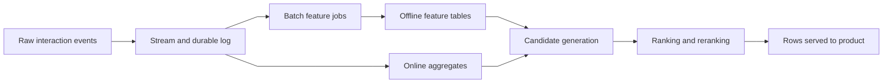

### Persistence Model

The system usually needs several storage types rather than one database.

- event log for durable write-heavy ingestion and replay
- offline analytical storage for large historical joins and training data
- low-latency key-value or document store for online features
- search or metadata store for content eligibility lookup
- cache for precomputed rows and hot recommendation responses

This is important because recommendation data is not one shape:

- raw events are append-heavy
- features are keyed lookups
- model artifacts are large immutable blobs
- final responses are low-latency assembled views

## 7. APIs or External Interfaces

### Record Event

`POST /events`

### Get Home Recommendations

`GET /recommendations/home?user_id=...`

### Get Similar Titles

`GET /recommendations/similar?user_id=...&content_id=...`

### Get Continue Watching

`GET /recommendations/continue-watching?user_id=...`

### Refresh Model Artifacts

Internal interface used by training and deployment pipelines.

## 8. High-Level Design

At a high level, the system has six concerns:

1. durable event ingestion
2. streaming and batch feature computation
3. multi-source candidate retrieval
4. ranking and re-ranking
5. row assembly and response caching
6. offline training and model publication

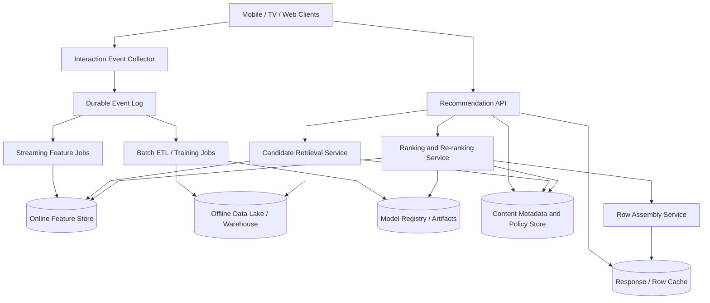

### Component Responsibilities

`Interaction Event Collector`

- receives high-volume behavior events
- validates schema and enrichment metadata
- writes events durably before downstream consumption

`Durable Event Log`

- acts as the system of record for recent user interactions
- supports replay when feature or training pipelines change

`Streaming Feature Jobs`

- compute short-latency aggregates
- update online features used on the request path

`Batch ETL / Training Jobs`

- build historical datasets
- compute item-item similarities, embeddings, and cohort statistics
- train and publish model artifacts

`Online Feature Store`

- serves low-latency user and session features
- holds recent behavior and high-value aggregates

`Offline Data Lake / Warehouse`

- stores long historical event data and derived tables
- supports heavy joins, training, and backfills

`Content Metadata and Policy Store`

- stores title attributes, catalog availability, maturity, and business rules
- provides authoritative filtering inputs

`Candidate Retrieval Service`

- pulls candidates from multiple retrieval strategies
- merges and deduplicates them before ranking

`Ranking and Re-ranking Service`

- computes final scores using model outputs, business constraints, freshness, and diversity rules

`Row Assembly Service`

- maps ranked items into row structures
- enforces row-level quotas and cross-row deduplication

### What to Notice

- the event path is separated from the serving path
- online features and offline features are different systems because their latency and access patterns differ
- recommendation serving is multi-stage because scoring the full catalog on the request path is not practical
- row assembly is a first-class layer because the product shows rows, not one flat list

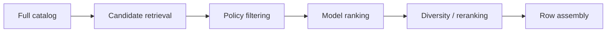

## 9. Request Flows

### Flow 1: User Watch Event to Fresh Features

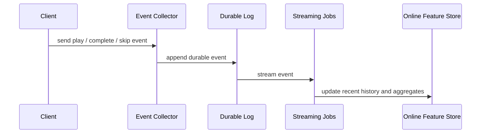

Key point:

- freshness-sensitive features should update from the stream, not wait for batch training

### Flow 2: Home Page Recommendation Request

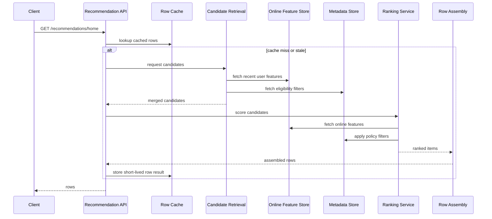

### Flow 3: Candidate Generation from Multiple Sources

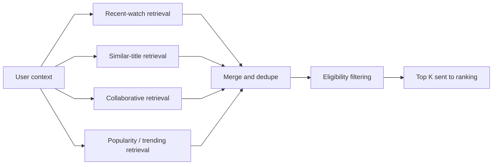

### Flow 4: Cold Start Request

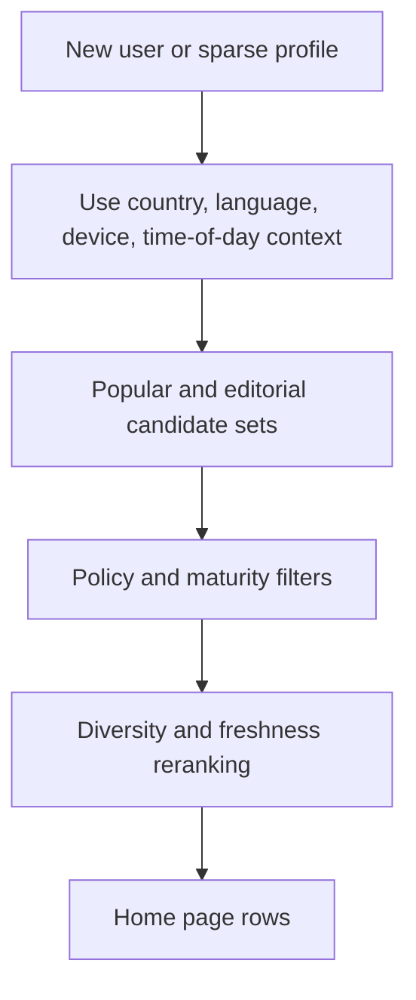

## 10. Deep Dive Areas

### Deep Dive 1: Candidate Retrieval Is the Core Scalability Boundary

The most common mistake is to talk about ranking as if the system can score the whole catalog.

That is rarely possible on the request path.

The architecture usually works in stages:

1. retrieve a few hundred or few thousand plausible candidates
2. filter ineligible items
3. run more expensive ranking on the reduced set
4. re-rank for diversity and product constraints

Typical retrieval sources:

- similar to recently watched titles
- collaborative filtering from similar users
- item embeddings nearest-neighbor lookup
- popularity within cohort or region
- editorial collections
- continue-watching state

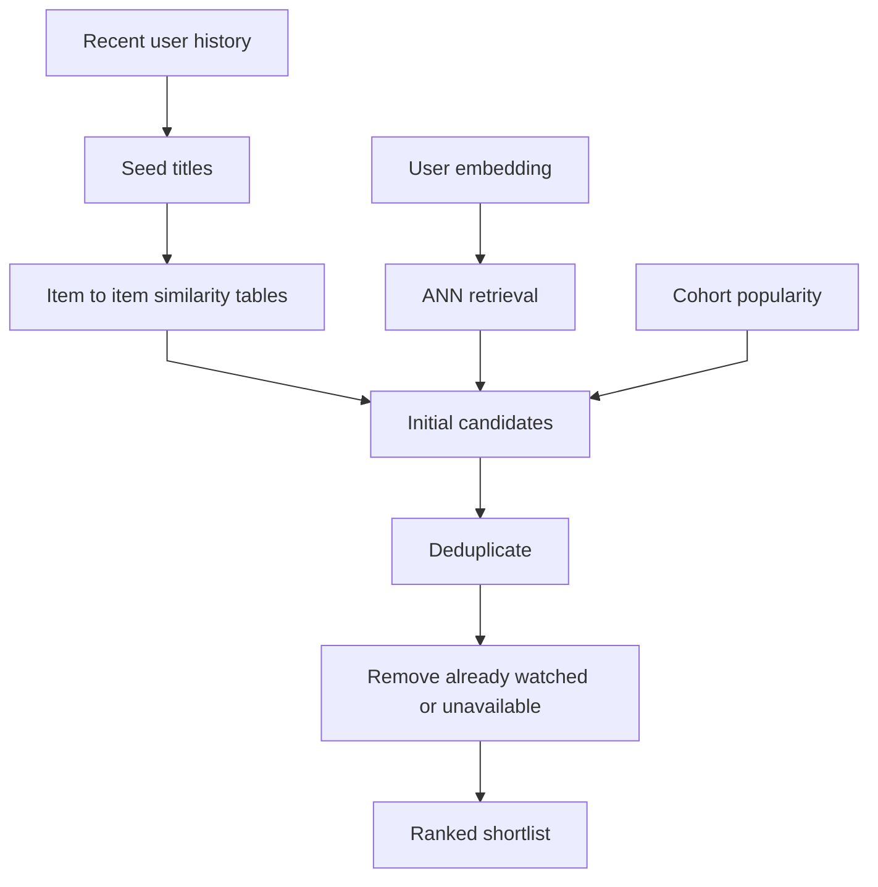

Why this matters:

- retrieval quality sets an upper bound on ranking quality
- missing a good item during retrieval means ranking never sees it
- retrieval must balance breadth, freshness, and cost

### Deep Dive 2: Ranking Is Not One Score

Final ranking usually combines:

- predicted engagement or watch probability
- expected watch time or completion value
- novelty and freshness
- diversity penalties
- row-specific business rules

An item can have a strong model score and still be demoted if:

- it duplicates another row
- it violates maturity or availability policy
- it is too similar to adjacent items
- it is overexposed to the user

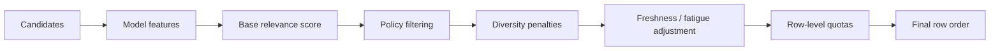

Important edge cases:

- new releases should not disappear because collaborative data is sparse
- stale cached rows should not keep surfacing already watched titles
- children profiles require strong policy filters before model scoring
- continue-watching should win for recent partial playback even if another title has higher long-term score

### Deep Dive 3: Online vs Offline Features

Not all features belong in the same store.

Offline features are usually:

- large
- expensive to compute
- updated hourly or daily

Online features are usually:

- small
- request-path critical
- updated within seconds or minutes

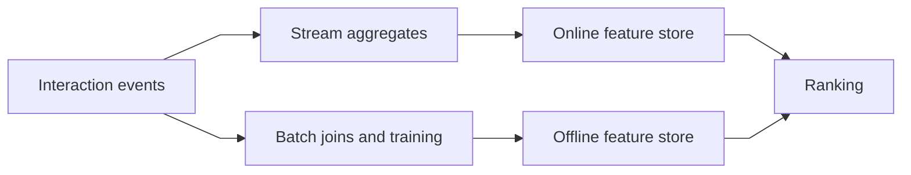

A useful rule:

- if a feature must react to the current session, it belongs online
- if a feature comes from long history or expensive joins, it belongs offline

### Deep Dive 4: Cross-Row Dedupe and Diversity

Users do not consume one globally sorted list.

They see rows.

That means the system must control:

- duplicates across rows
- over-concentration of one genre or franchise
- row-specific coverage quotas

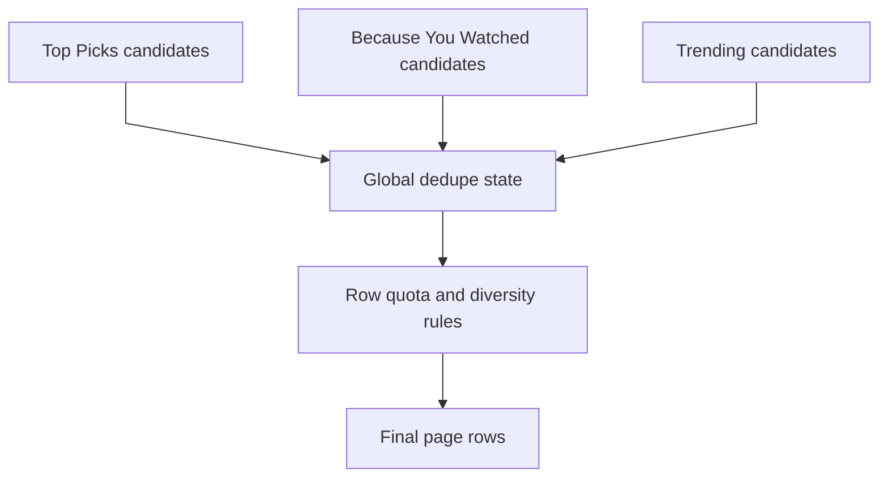

Without this stage, the page often looks repetitive even if individual row ranking is correct.

### Deep Dive 5: Freshness, Stability, and Caching

Users want the page to react to new watches, but not to change wildly every refresh.

That creates tension between:

- freshness
- cache hit rate
- user-perceived stability

Practical design:

- cache row outputs for a short TTL
- maintain session-aware invalidation triggers for important changes
- update continue-watching aggressively
- update long-tail rows on slower cadences

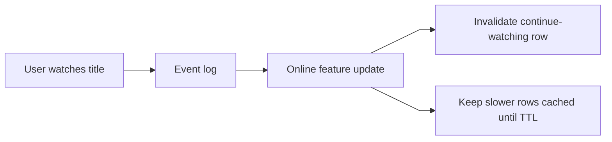

## 11. Bottlenecks and Failure Modes

Likely bottlenecks:

- feature store read amplification on page requests
- hot metadata lookups during major content launches
- heavy ranking cost when candidate sets are too large
- event pipeline lag causing stale personalization

Failure modes:

- online feature lag makes recommendations feel stale
- model rollout mismatch causes ranking errors between training and serving features
- metadata staleness surfaces unavailable content
- candidate source outage collapses coverage and makes rows repetitive

Mitigations:

- cap candidate counts per source
- keep popularity and editorial fallbacks
- version features and models together
- make policy filtering authoritative and early

## 12. Scaling Strategy

A reasonable evolution path:

1. start with batch-generated recommendations and simple per-user caches
2. add a durable event log and streaming updates for recent activity
3. split retrieval from ranking so online scoring cost is bounded
4. add specialized candidate sources such as embeddings and ANN retrieval
5. introduce row assembly, cross-row dedupe, and diversified reranking
6. add regional serving and model publication pipelines

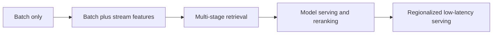

## 13. Tradeoffs and Alternatives

Batch-only recommendations vs hybrid online and offline:

- batch-only is simpler and cheaper
- hybrid design gives much better responsiveness to recent behavior

Single-stage ranking vs multi-stage retrieval and ranking:

- single-stage is conceptually simple
- multi-stage is necessary when catalog size is large

Per-request full personalization vs cached rows:

- full personalization maximizes freshness
- cached rows improve cost and tail latency

Embedding retrieval vs hand-built similarity tables:

- embeddings improve coverage and semantic retrieval
- similarity tables are simpler to operate and debug

## 14. Real-World Considerations

Production concerns usually include:

- explainability for why a title was shown
- legal and policy filtering for region and age gates
- experimentation, holdbacks, and model shadow evaluation
- abuse resistance against artificial popularity inflation
- privacy controls around behavioral data retention
- safe rollout of new models and new feature definitions

Operationally, two things matter a lot:

- replayability of historical events
- strict versioning of features, models, and ranking configs

Without those, offline and online behavior drift becomes very hard to debug.

## 15. Summary

The recommended design is a multi-stage recommendation platform:

- durable interaction ingestion
- separate online and offline feature systems
- multi-source candidate retrieval
- ranking and reranking with policy filters and diversity
- row assembly with short-lived caching

The main architectural insight is that recommendation quality depends as much on data flow and serving boundaries as on the model itself.

The system works well when it treats:

- event ingestion
- feature freshness
- candidate breadth
- policy correctness
- row assembly

as separate design problems with clear interfaces.
