# Ride Sharing App

## 1. Problem Statement

Design a large-scale ride-sharing platform similar to Uber.

The system should let riders:

- request a ride
- see nearby drivers and estimated wait time
- track driver arrival in real time
- complete the trip and pay

And it should let drivers:

- come online or offline
- publish live location updates
- receive trip offers
- accept or reject rides
- complete trips and receive earnings

At small scale, this can sound straightforward:

- rider sends pickup and destination
- system finds a nearby driver
- trip begins and ends

At production scale, the system becomes a set of tightly coupled real-time pipelines.

Now the platform must handle:

- continuous driver location updates
- low-latency nearest-driver lookup
- dispatch under regional skew
- trip state transitions across unreliable mobile networks
- surge pricing and market balance
- idempotent payment and trip completion
- fraud, abuse, and safety workflows

The hard part is not creating a trip row.

The hard part is building a system where:

- location freshness is high enough for dispatch
- dispatch decisions are fast and fair
- trip state remains consistent through retries and reconnects
- payment and trip completion are correct

This is a strong case study because it forces tradeoffs across:

- real-time location ingestion vs durable trip state
- low-latency local dispatch vs global coordination
- exactness vs practical dispatch heuristics
- synchronous user experience vs asynchronous reliability workflows

## 2. Scope and Assumptions

In scope:

- rider ride request
- driver availability and live location updates
- matching and dispatch
- trip lifecycle from requested to completed
- ETA estimation
- pricing estimate and final fare capture
- rider and driver status updates

Out of scope for this version:

- food delivery
- deep fraud model internals
- support tooling
- route optimization internals beyond basic map and ETA dependency
- full incentives marketplace design

Assumptions:

- the system is global and multi-region
- dispatch is city or region scoped most of the time
- location updates are frequent and ephemeral
- trip lifecycle state must be durable
- final payment is important but can be decoupled from the real-time dispatch path

## 3. Functional Requirements

The system must support:

- driver goes online and starts sending location
- rider requests a ride
- system finds candidate nearby drivers
- system dispatches offers or a selected match
- rider and driver see trip state changes
- trip starts, progresses, and ends
- fare is estimated and then finalized

Important secondary behaviors:

- rider cancellation
- driver timeout or rejection
- retrying dispatch if no driver accepts
- handling reconnect after mobile disconnect
- idempotent trip state transitions

## 4. Non-Functional Requirements

The most important non-functional requirements are:

- low dispatch latency
- high freshness of driver location
- durability of trip state
- high availability
- tolerance of mobile network instability
- bounded inconsistency between maps, ETA, and trip state
- strong enough payment correctness

Consistency requirements are mixed.

The system should strongly preserve:

- trip identity
- accepted driver-rider match
- trip state transitions
- final fare and payment state

The system can often allow eventual consistency for:

- driver heatmaps
- ETA smoothing
- analytics and demand forecasting
- delayed incentive calculations

The key design question is:

what has to be real-time and what only has to be durable?

Usually:

- dispatch and location freshness are real-time concerns
- payments, analytics, and settlement can be more asynchronous

## 5. Capacity and Scale Estimation

Assume:

- 30 million daily active riders
- 5 million daily active drivers
- 10 million trips per day
- 20 million ride requests per day including cancellations and retries

Average traffic:

- ride requests: about 230 requests/second
- completed trips: about 115 trips/second

Those averages hide the real complexity.

Assume:

- 10x peak request traffic in dense cities
- 2 location updates per driver every 5 seconds while online
- 1 million concurrently online drivers globally at busy periods

Then location update traffic alone becomes roughly:

- 400,000 location updates per second

This is the dominant real-time pressure point.

The key scaling pressures are:

- geo-index updates
- candidate lookup by region
- dispatch fan-out
- trip state transitions under retries

## 6. Core Data Model

Main entities:

- `DriverAvailability`
- `DriverLocation`
- `RideRequest`
- `Trip`
- `DispatchOffer`
- `FareQuote`
- `PaymentRecord`

### DriverAvailability

Represents whether a driver is eligible for dispatch.

Fields:

- `driver_id`
- status such as offline, available, assigned, on_trip
- vehicle metadata
- region or city

### DriverLocation

Represents latest ephemeral location.

Fields:

- `driver_id`
- latitude and longitude
- heading
- speed
- timestamp

This is primarily hot serving state, not long-term system-of-record data.

### RideRequest

Fields:

- `request_id`
- `rider_id`
- pickup
- destination
- requested product type
- quote reference
- created_at

### Trip

Represents the durable lifecycle state.

Fields:

- `trip_id`
- `request_id`
- `rider_id`
- `driver_id`
- state such as requested, matched, driver_arriving, in_progress, completed, cancelled
- pricing reference
- start and end timestamps

### DispatchOffer

Represents an offer made to one or more candidate drivers.

Fields:

- `offer_id`
- `trip_id`
- `driver_id`
- offer state
- expiry time

### FareQuote

Fields:

- `quote_id`
- price estimate
- pricing inputs
- expiry

### PaymentRecord

Fields:

- `trip_id`
- payment state
- capture amount
- refund state

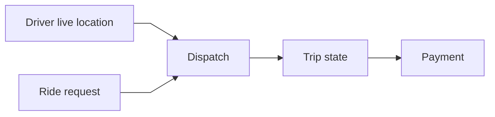

The key modeling distinction is:

- live driver location is ephemeral and fast-moving
- trip and payment state are durable and correctness-sensitive

## 7. APIs or External Interfaces

### Driver Heartbeat / Location Update

`POST /api/v1/drivers/{driver_id}/location`

### Request Ride

`POST /api/v1/rides`

### Accept Dispatch Offer

`POST /api/v1/dispatch/{offer_id}/accept`

### Update Trip State

`POST /api/v1/trips/{trip_id}/state`

### Get Trip Status

`GET /api/v1/trips/{trip_id}`

## 8. High-Level Design

At a high level, the system has five concerns:

1. driver location and availability ingestion
2. ride request and dispatch
3. durable trip lifecycle
4. pricing and payment
5. rider and driver real-time updates

The high-level diagram should emphasize the main production boundaries:

- mobile clients
- location service
- dispatch service
- trip service
- pricing service
- payment service
- realtime notification channel

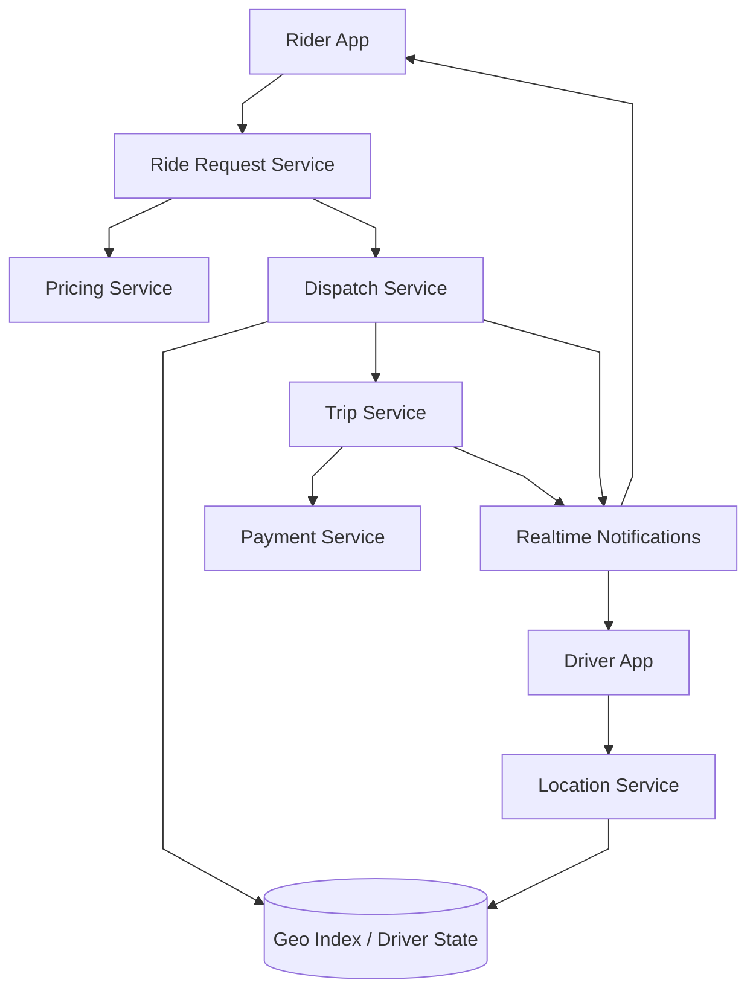

What to notice:

- live location updates and durable trip state are separated
- dispatch reads from geo-indexed live driver state, not from a transactional trip table
- trip state is the durable source of truth for lifecycle correctness
- payment sits downstream of trip completion, not inside the dispatch loop
- realtime notifications are delivery infrastructure, not the lifecycle source of truth

The key architectural separation is this:

- ephemeral location and dispatch state
- durable trip and payment state

### Ride Lifecycle Shape

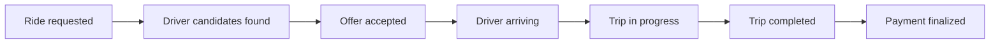

### Component Responsibilities

#### Location Service

Responsibilities:

- ingest driver heartbeats and location updates
- update latest driver state
- expire stale drivers
- feed geo-index for dispatch lookup

This service is optimized for:

- high write throughput
- freshness

not:

- long-term historical trip analytics

#### Geo Index / Driver State Store

Responsibilities:

- maintain latest available-driver positions
- support nearest-driver candidate lookup
- filter by product type, availability, and region

Typical storage choices:

- in-memory geo-indexed store such as Redis with geospatial primitives
- a custom sharded geo-cell service

This is the serving store for dispatch, not the authoritative trip database.

#### Ride Request Service

Responsibilities:

- accept rider request
- validate quote freshness
- create ride request record
- invoke pricing and dispatch

#### Dispatch Service

Responsibilities:

- fetch candidate drivers from geo state
- rank or filter candidates
- create dispatch offers
- retry if offers expire or are rejected

This is the real-time matching brain.

#### Trip Service

Responsibilities:

- persist durable trip lifecycle
- enforce allowed state transitions
- serve trip status to rider and driver apps

This is the correctness backbone of the ride lifecycle.

#### Pricing Service

Responsibilities:

- provide upfront estimate
- apply surge or dynamic pricing inputs
- finalize fare after trip completion

#### Payment Service

Responsibilities:

- authorize payment
- capture final fare
- handle refund or adjustment workflows

#### Realtime Notifications

Responsibilities:

- deliver ride offers to drivers
- deliver trip state changes to rider and driver apps
- support mobile reconnect and update fan-out

## 9. Request Flows

### Driver Online and Location Update Flow

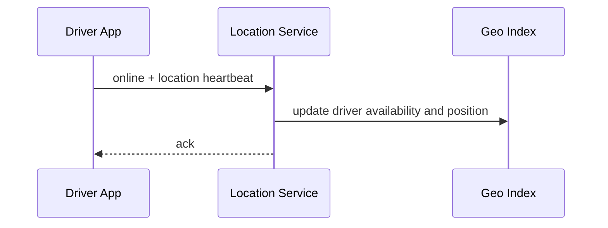

### Ride Request and Dispatch Flow

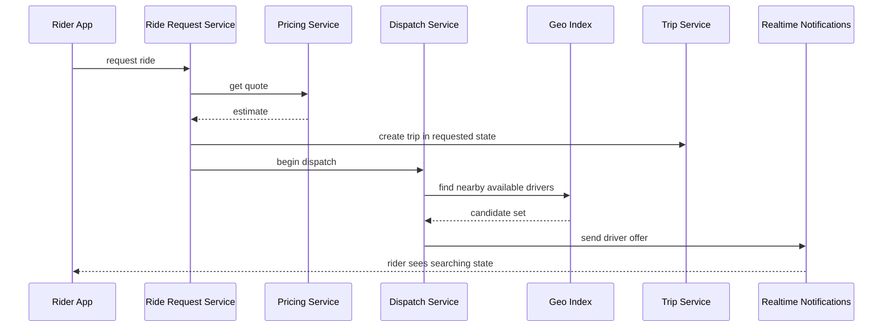

### Offer Accept Flow

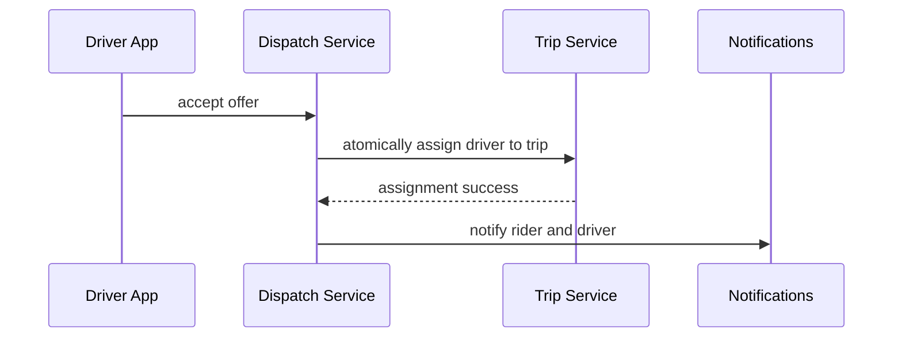

### Trip Completion and Payment Flow

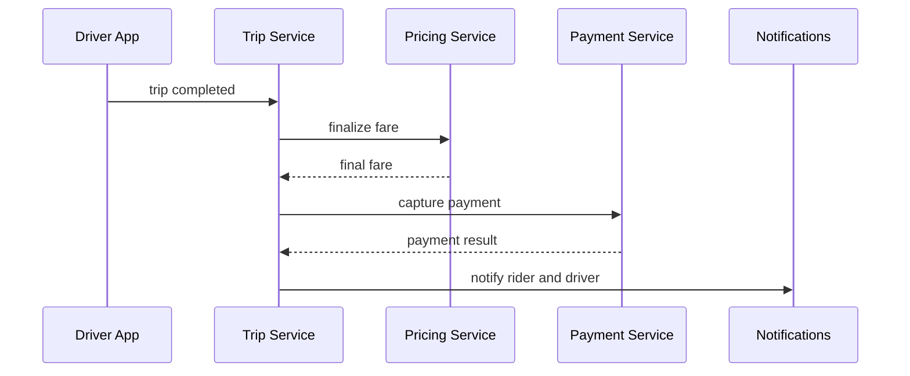

### Dispatch Retry Loop

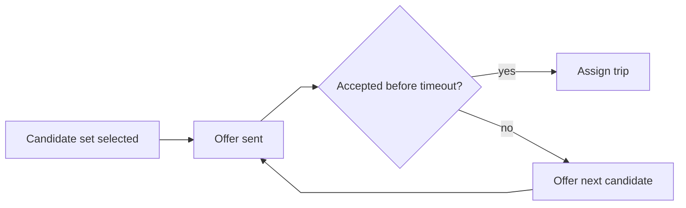

## 10. Deep Dive Areas

### Geo Index and Nearest Driver Lookup

Dispatch depends on fast lookup of nearby available drivers.

The database choice here is different from the trip database.

#### Geo Serving Store

Good fit:

- in-memory geo-indexed KV store
- geohash or cell-based partitioning
- latest state only

Why:

- location is continuously overwritten
- dispatch needs nearest-driver reads, not historical joins
- stale driver positions must expire quickly

Bad fit:

- using a transactional SQL trip database for nearest-driver search

#### How the System Finds the Nearest Drivers

This is one of the most common follow-up questions in ride-sharing design interviews.

The system should not:

- scan every online driver in the city
- compute distance to all of them

That does not scale.

The practical approach is:

1. partition the map into geo cells
2. place each available driver into the cell that contains the latest known location
3. identify the rider's pickup cell
4. search the pickup cell and then expand into nearby cells
5. compute more accurate dispatch ranking only on the resulting candidate set

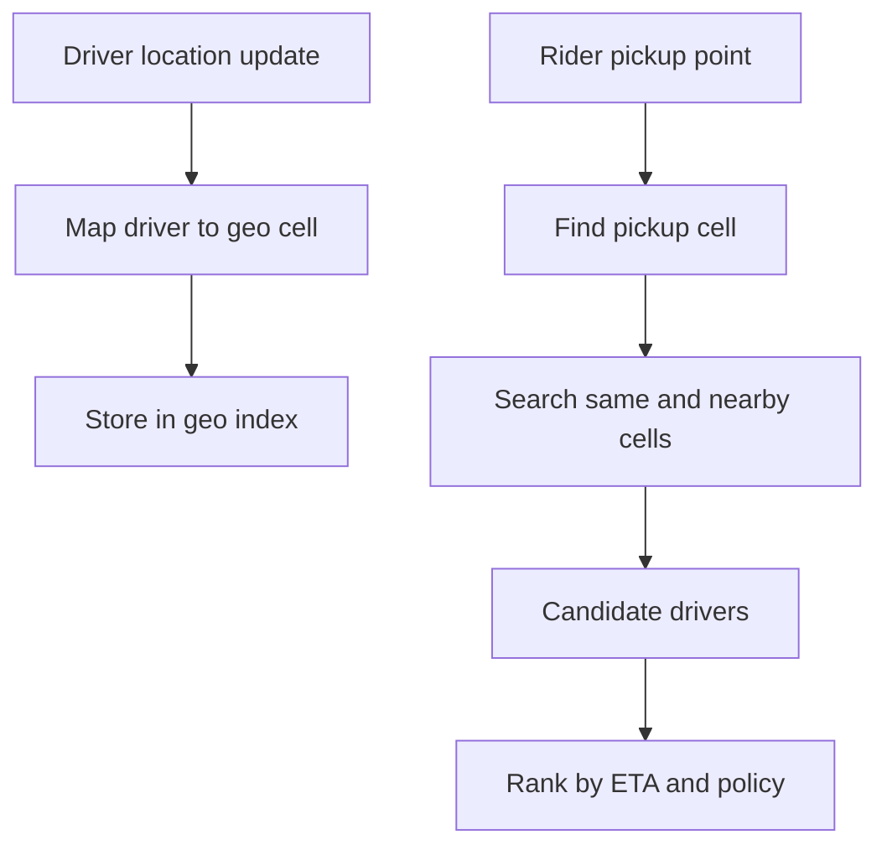

The important point is that nearest-driver lookup is usually a two-stage process:

- coarse geographic narrowing
- fine-grained dispatch ranking

#### Cell Expansion Strategy

Drivers near the pickup point may be spread across adjacent cells.

So the system typically searches in expanding rings:

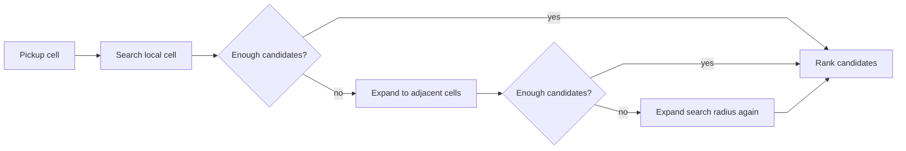

This avoids both extremes:

- searching too narrowly and missing valid drivers
- searching the whole city for every request

#### Why Straight-Line Distance Is Not Enough

The nearest driver by latitude and longitude is often not the best driver.

Real dispatch ranking often considers:

- ETA from the road network
- freshness of the latest heartbeat
- product type and vehicle constraints
- whether the driver is actually dispatchable right now
- market-balancing or fairness policies

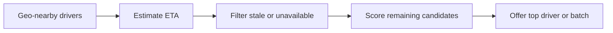

That matters because:

- straight-line nearest can be wrong in cities with rivers, one-way roads, or heavy traffic barriers
- a stale location can make a driver appear nearby even when they are no longer viable

#### A Useful Mental Model

The geo index answers:

- who is probably nearby

The dispatch ranker answers:

- who is the best offer target right now

The trip store answers:

- who is actually assigned

Those are related, but they are not the same question.

#### Important Edge Cases in Nearest-Driver Lookup

##### Cell boundary problem

A rider near the edge of one cell may actually be closest to a driver in the next cell.

Mitigation:

- always search adjacent cells
- expand in rings

##### Dense downtown problem

One cell may contain too many drivers.

Mitigation:

- subdivide hot cells
- cap the candidate set before detailed ranking

##### Sparse suburb problem

Many cell expansions may still yield too few drivers.

Mitigation:

- widen radius faster
- return more conservative ETA messaging
- support fallback dispatch policies

##### Stale location problem

A driver may appear nearby but has not sent a fresh heartbeat recently.

Mitigation:

- attach freshness TTL to availability
- filter stale drivers before ranking

##### Concurrent assignment problem

A candidate may still appear available in geo state while being assigned elsewhere.

Mitigation:

- geo state is only candidate discovery
- final assignment must be confirmed against durable trip or driver assignment state

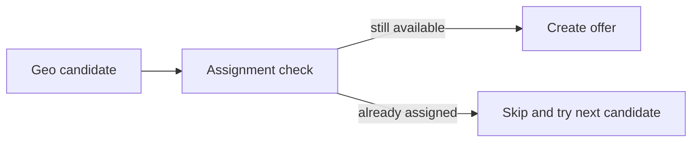

### Durable Trip State Database

The trip lifecycle wants a different persistence model.

Good fit:

- relational database or a strongly consistent transactional store

Why:

- trip states have legal transitions
- assignment must avoid double-booking a driver
- payment references and auditability matter

The key point is:

- geo state and trip state should not share one primary database

### Dispatch Algorithm and Edge Cases

Dispatch is not just "find nearest driver."

Questions the system must answer:

- what if the nearest driver is stale or already assigned
- what if multiple drivers accept simultaneously
- should the system fan out to one driver or a small batch
- when do you retry with a wider search radius
- how do you avoid starving drivers just outside a cell boundary

A practical dispatch flow often looks like:

1. find candidate drivers in nearby cells
2. filter by availability and product type
3. rank by ETA, acceptance likelihood, and fairness constraints
4. send one or a small batch of offers
5. commit first valid acceptance atomically

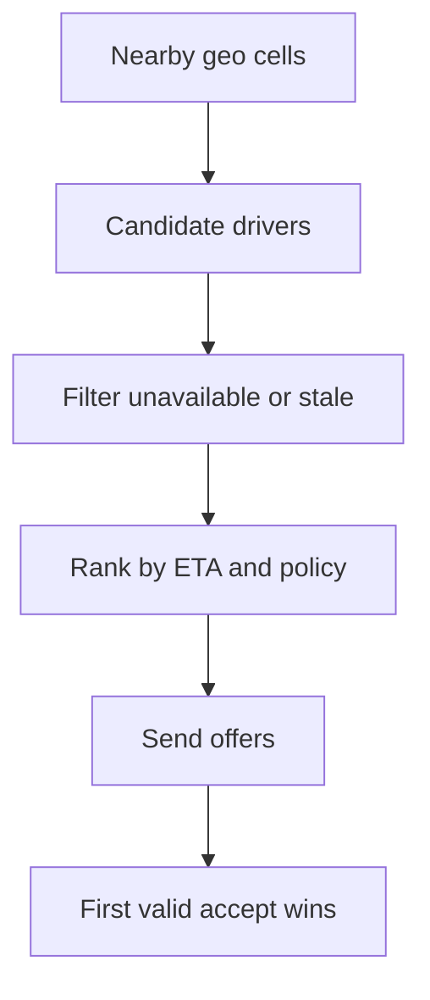

### State Machine and Idempotency

Trip state transitions should be explicit.

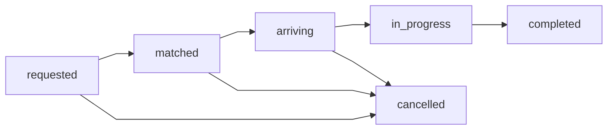

The system must guard against:

- duplicate driver accepts
- repeated start-trip or end-trip messages
- rider app reconnect sending stale actions

This usually means:

- idempotent commands
- versioned state transitions
- conditional updates in the trip store

### Pricing and Surge

Pricing usually should not block the full dispatch pipeline except for the initial quote boundary.

The system often needs:

- upfront estimate before ride request
- possible re-quote if demand changes or request expires
- final fare after trip completion

Surge is effectively a marketplace signal.

It should influence:

- quote generation
- supply-demand balance

But it should not destabilize trip lifecycle correctness.

### Region and Cell Boundaries

A common edge case:

- rider is near a geo partition boundary

If dispatch only looks at the local cell:

- nearby drivers in adjacent cells are missed

Mitigation:

- search expanding rings of adjacent cells
- rank candidates globally within the search radius

### Stale Driver Location

Driver location is inherently noisy.

The system must define:

- heartbeat timeout
- stale-driver eviction
- fallback behavior when ETA and actual position drift

Without this, dispatch quality degrades quickly.

## 11. Bottlenecks and Failure Modes

### Hot Regions

Dense cities can create extreme location and dispatch pressure.

Mitigations:

- shard by city or region
- isolate hot metros operationally
- autoscale dispatch capacity regionally

### Stale Geo State

If heartbeats lag:

- dispatch selects unavailable drivers

Mitigations:

- TTL on driver availability
- stale-state filtering
- heartbeat freshness scoring

### Double Assignment

Two accepts can race for one trip.

Mitigations:

- atomic compare-and-set on trip assignment
- idempotent offer handling

### Dispatch Retry Storms

If many offers time out:

- the system can generate expensive retry fan-out

Mitigations:

- bounded retry loops
- widening search in stages
- clear timeout strategy

### Payment or Pricing Delay

If payment capture is slow:

- trip completion UX may degrade

Mitigations:

- separate trip completion from settlement pipeline
- maintain explicit payment state

## 12. Scaling Strategy

### Stage 1: Single-City Core

Start with:

- one trip store
- one geo state service
- one dispatch service

### Stage 2: Separate Geo State From Trip State

As location throughput grows:

- keep location in a fast geo store
- keep lifecycle in a transactional trip store

### Stage 3: Regional Dispatch Isolation

As many cities become active:

- partition dispatch by city or region
- isolate hot metros

### Stage 4: Async Pricing, Notifications, and Payments

As product complexity grows:

- decouple payment and analytics
- keep realtime dispatch loop lean

### Stage 5: Multi-Region Global Platform

As the product becomes global:

- regionalize trip lifecycle
- use local dispatch and geo services
- replicate only what must be shared globally

## 13. Tradeoffs and Alternatives

### Single Driver Offer vs Batch Offer

Single offer reduces race complexity.

Batch offer reduces rider wait time.

The right answer depends on market density and acceptance behavior.

### Geo Store vs Transactional DB for Dispatch

Transactional DBs are good for durable trip state.

Geo serving stores are better for nearest-driver lookup.

### Synchronous Payment vs Async Settlement

Synchronous payment ties user experience to an external dependency.

Async settlement improves resilience, but requires explicit payment state handling.

## 14. Real-World Considerations

### Fraud and Abuse

The architecture should leave room for:

- location spoofing checks
- replay protection
- suspicious cancellation patterns

### Safety and Audit

The platform must preserve:

- trip audit trail
- driver-rider assignment history
- payment and dispute evidence

### Observability

Important metrics:

- dispatch latency
- time to first accepted driver
- location freshness
- stale-driver rate
- trip state transition failures
- payment capture latency

### Cost Control

The expensive parts are often:

- realtime location ingestion
- dispatch compute in dense regions
- mobile notification fan-out

## 15. Summary

A ride-sharing system is fundamentally a real-time dispatch platform built on top of durable trip and payment state.

The central architectural recommendation is:

- separate ephemeral location state from durable trip lifecycle state
- use geo-optimized serving for dispatch
- use transactional storage for trip correctness
- keep pricing and payment downstream of the realtime dispatch loop
- treat retries, stale state, and race conditions as first-class design problems

The key insight is that dispatch quality depends on freshness, while trip correctness depends on durable state.

A good design keeps those concerns separate and coordinates them carefully rather than forcing one storage model to do both jobs.
