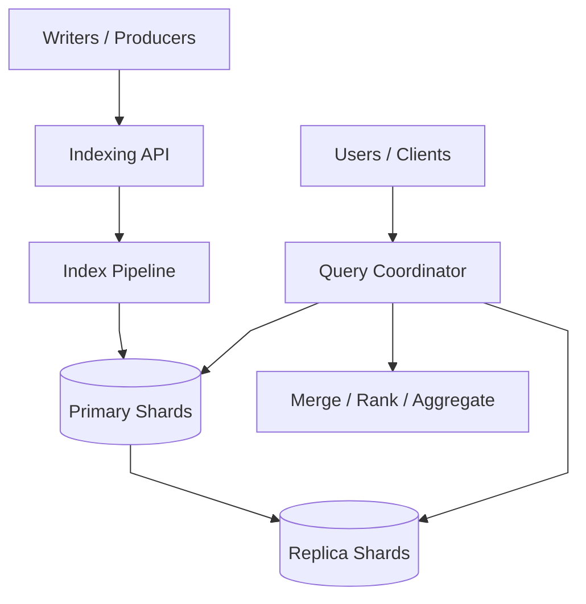
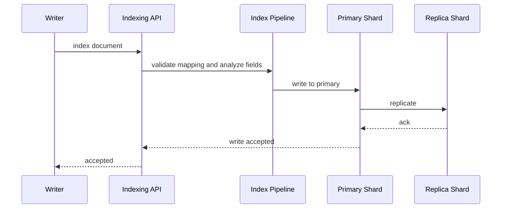
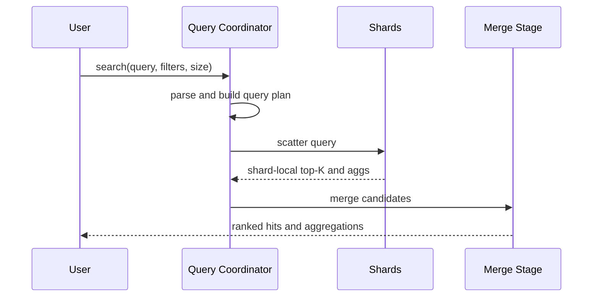

# Search System

## 1. Problem Statement

Design a distributed search system similar to Elasticsearch.

The system should let applications:

- index documents
- update and delete them
- execute keyword and filtered queries
- rank results by relevance
- return aggregations over matching documents

At small scale, search can look like:

- tokenize a document
- write an inverted index
- query it later

At production scale, the real challenge is much broader.

The system must handle:

- high document ingest throughput
- near-real-time refresh expectations
- distributed shards and replicas
- large query fan-out
- result merging and relevance ranking
- schema evolution and reindexing

The hard part is not storing documents.

The hard part is balancing:

- indexing cost
- refresh freshness
- query latency
- ranking quality
- shard sizing

This is a strong case study because it forces tradeoffs across:

- faster refresh vs indexing efficiency
- more shards vs more query coordination
- richer ranking vs lower latency
- schema flexibility vs operational safety

## 2. Scope and Assumptions

In scope:

- indexing pipeline
- inverted index storage
- distributed query execution
- ranking and relevance
- refresh and replication
- aggregations

Out of scope for this version:

- vector search internals
- recommendation systems
- autocomplete service details

Assumptions:

- writes are significant, but reads are highly latency-sensitive
- search spans many shards at scale
- near-real-time indexing is acceptable rather than fully synchronous visibility

## 3. Functional Requirements

The system must support:

- indexing documents
- updating and deleting documents
- keyword and filtered search
- ranked retrieval
- pagination
- aggregations
- index lifecycle operations

Important secondary behaviors:

- analyzers and tokenization configuration
- schema mapping control
- aliases and reindex support
- per-field boosts

## 4. Non-Functional Requirements

The most important non-functional requirements are:

- low query latency
- scalable indexing throughput
- predictable refresh behavior
- high availability
- relevance quality good enough for user-facing search
- operational safety around mappings and shard growth

Consistency requirements are mixed.

The system should strongly preserve:

- accepted writes to primary shards
- index metadata and mappings

The system can often allow:

- near-real-time visibility rather than instant visibility
- eventual replica catch-up

This distinction is central to the architecture.

## 5. Capacity and Scale Estimation

Assume:

- billions of documents
- 50,000 writes per second
- 30,000 search queries per second
- average query fan-out to tens of shards

If an average query fans out to 20 shards:

- internal shard-level query work is hundreds of thousands of shard-queries per second

The main scaling pressures are:

- inverted-index updates
- segment merge overhead
- query scatter-gather cost
- result ranking and aggregation merge cost

## 6. Core Data Model

Main entities:

- `Document`
- `InvertedIndexPosting`
- `Segment`
- `Shard`
- `IndexMapping`
- `QueryPlan`

### Document

Represents the source payload.

Fields:

- document ID
- typed fields
- raw source

### Segment

Search systems often write immutable index segments rather than mutating one huge index structure in place.

Fields:

- postings
- stored fields
- doc values
- term dictionaries

### Shard

Represents an independently searchable partition of an index.

The key modeling distinction is:

- source documents
- immutable search segments
- distributed shard routing

## 7. APIs or External Interfaces

### Index Document

`POST /index/{index_name}/documents`

### Search

`GET /search`

### Delete Document

`DELETE /index/{index_name}/documents/{id}`

### Update Mapping

`PUT /index/{index_name}/mapping`

## 8. High-Level Design

At a high level, the system has four concerns:

1. indexing ingestion
2. shard-local index maintenance
3. distributed query execution
4. ranking and aggregation merge

For interview discussion, the high-level diagram should show the main control boundaries:

- indexing API
- index pipeline
- primary and replica shards
- query coordinator
- merge and rank stage

What to notice:

- indexing and searching share shard infrastructure but have very different workloads
- writes land on primaries first and then replicate
- queries scatter to shards and gather centrally
- ranking quality and distributed coordination are tightly coupled

The key architectural separation is this:

- shard-local work
- cluster-level query coordination

That separation is one of the main architectural insights.

### Component Responsibilities

#### Indexing API

Responsibilities:

- receive writes
- validate mappings
- route documents to the correct primary shard
- acknowledge once primary write and chosen durability conditions are satisfied

#### Index Pipeline

Responsibilities:

- normalize fields
- run analyzers and tokenization
- build indexable terms
- write document updates into shard-local structures

This is where schema and analyzer choices become storage and query behavior.

#### Primary Shards

Responsibilities:

- accept authoritative writes
- build or update local index segments
- handle refresh and replication sequencing

#### Replica Shards

Responsibilities:

- serve reads
- improve availability
- reduce query pressure on primaries

#### Query Coordinator

Responsibilities:

- parse the request
- plan shard fan-out
- scatter subqueries
- collect top-K candidates and aggregation partials

#### Merge / Rank / Aggregate Stage

Responsibilities:

- merge shard-local top-K candidate lists
- apply final ranking and tie-breaking
- combine aggregation partials

This is the cluster-level query brain.

## 9. Request Flows

### Indexing Flow

### Search Flow

### Refresh and Segment Lifecycle

This matters because refresh latency and merge cost are central tradeoffs in search systems.

## 10. Deep Dive Areas

### Indexing Pipeline Internals

The design should explicitly mention:

- analyzers
- tokenization
- normalization
- inverted postings construction
- stored fields
- doc values for sorting and aggregations

Why it matters:

- query relevance depends on analysis choices
- aggregation cost depends on doc-value-like structures
- indexing throughput depends heavily on refresh policy and merge behavior

### Ranking and Relevance

Search relevance is not just BM25 or TF-IDF math.

Practical ranking often combines:

- lexical relevance
- field boosts
- freshness
- business weighting
- popularity signals

Distributed search complicates this because each shard only sees a subset of corpus statistics unless the system takes extra measures.

A strong answer should mention:

- shard-local top-K retrieval
- cluster-level merge
- the limits of perfectly global ranking in a distributed system

### Distributed Query Execution

The classic pattern is:

1. coordinator parses query
2. coordinator scatters to relevant shards
3. each shard computes local top-K
4. coordinator merges local results into final top-K

The same pattern applies to aggregations:

- shard-local partials
- central merge

The main costs are:

- network fan-out
- slowest shard dominates latency
- memory for candidate merge

### Shard Strategy

Too few shards:

- large shards become slow to move and recover

Too many shards:

- coordination overhead rises
- memory overhead rises

This is one of the highest-value points because poor shard sizing causes long-term operational pain.

### Refresh vs Throughput

Faster refresh means:

- fresher visibility
- more frequent segment creation
- more merge pressure

Slower refresh means:

- better ingest efficiency
- less fresh search results

This tradeoff should be called out explicitly.

## 11. Bottlenecks and Failure Modes

### Shard Hotspots

One index or routing key may overload specific shards.

Mitigations:

- balanced routing
- index partitioning strategy
- isolation of hot tenants or indexes

### Merge Backlog

If segment merges fall behind:

- query latency rises
- disk usage rises
- indexing slows

### Query Fan-Out Explosion

Broad queries over many shards can create high internal work even if user QPS looks moderate.

Mitigations:

- shard filtering
- index aliases
- query guards

### Mapping Bloat

Dynamic or inconsistent fields can create huge mapping structures and unpredictable index behavior.

Mitigations:

- explicit mappings
- field count limits
- template governance

## 12. Scaling Strategy

### Stage 1: Single Cluster, Basic Indexing

Enough for moderate corpus and query volume.

### Stage 2: Shards and Replicas

Add horizontal scale and high availability.

### Stage 3: Tune Refresh and Merge Behavior

As write rate grows, refresh and merge policy become first-class design choices.

### Stage 4: Hot vs Cold Index Lifecycle

Recent indexes stay hot and heavily replicated.

Older indexes move to lower-cost storage or lower query priority.

### Stage 5: Reindex and Schema Governance

At organizational scale, mapping discipline and reindex tooling become essential.

## 13. Tradeoffs and Alternatives

### Faster Refresh vs Indexing Cost

Faster refresh improves freshness and hurts indexing throughput.

### More Shards vs More Coordination

More shards improve parallelism and hurt query coordination.

### Richer Ranking vs Lower Latency

More ranking features improve quality and increase latency and complexity.

## 14. Real-World Considerations

### Schema Evolution

Mappings change over time.

The platform needs:

- aliases
- reindex jobs
- versioned schemas

### Query Protection

The system should support:

- timeouts
- clause limits
- aggregation limits
- expensive query detection

### Observability

Important metrics:

- indexing latency
- refresh time
- merge backlog
- shard skew
- slow search rate

## 15. Summary

A search system is fundamentally an indexing pipeline plus a distributed query engine over sharded inverted indexes.

The central architectural recommendation is:

- separate indexing concerns from query coordination
- optimize shard-local structures for search and aggregation
- control refresh and merge behavior explicitly
- design shard strategy carefully
- treat ranking quality and distributed execution as coupled problems

The key insight is that:

- ingestion
- segment lifecycle
- shard layout
- query fan-out
- ranking

must be reasoned about together, because most real search failures come from their interaction rather than from any single component.
