# Stock Broker Platform

## 1. Problem Statement

Design a large-scale stock broker platform similar to Robinhood.

The system should let users:

- create and fund brokerage accounts
- see market data and portfolio state
- place market and limit orders
- cancel eligible orders
- receive fills and trade confirmations
- track balances, positions, and order history

At small scale, this can sound simple:

- user submits an order
- system forwards it to an exchange or market maker
- trade comes back filled

At production scale, the platform becomes a latency-sensitive trading workflow plus a correctness-heavy ledger and post-trade platform.

Now the system must handle:

- bursty order traffic during market open and major news
- live market data fan-out to many clients
- buying power and risk checks before order acceptance
- partial fills, cancels, and asynchronous execution reports
- post-trade settlement and reconciliation
- strict auditability and regulatory retention

The hard part is not creating an `orders` table.

The hard part is building a system where:

- orders are accepted only when pre-trade checks pass
- clients see timely and consistent enough order state
- balances and positions remain correct through retries and out-of-order reports
- the platform can survive exchange disconnects and market data spikes
- money movement, trading, and settlement boundaries stay explicit

This is a strong case study because it forces tradeoffs across:

- low-latency order handling vs durable audit requirements
- synchronous user experience vs asynchronous exchange and clearing workflows
- strong correctness for balances and positions vs eventually consistent read views
- live market data scale vs trading system isolation

## 2. Scope and Assumptions

In scope:

- account and portfolio views
- order entry for equities
- market and limit orders
- pre-trade risk and buying power checks
- order routing to external venues
- execution report processing
- positions, balances, and order history
- settlement and reconciliation boundaries

Out of scope for this version:

- options, margin lending, and derivatives pricing internals
- payment for order flow business logic
- tax lot optimization
- advanced charting engines
- KYC and onboarding internals beyond simple boundaries

Assumptions:

- the platform supports cash brokerage accounts first
- orders may be routed to one or more market venues or market makers
- market data is near real time, but the exact market data vendor design is out of scope
- the broker keeps its own internal ledgers for cash, positions, and order state
- exchange and clearing interactions are asynchronous and can be delayed or retried

## 3. Functional Requirements

The system must support:

- user views account balances and portfolio
- user views quotes and security details
- user places market or limit orders
- system validates and accepts or rejects the order
- system routes accepted orders externally
- system ingests execution reports and updates user-visible order state
- system updates positions and cash balances after fills

Important secondary behaviors:

- cancel or replace eligible orders
- partial fill handling
- duplicate report deduplication
- trade confirmations and notifications
- daily statements and audit trails

## 4. Non-Functional Requirements

The most important non-functional requirements are:

- correctness of cash, positions, and order state
- low latency for order submission and acknowledgment
- high availability for portfolio reads and quote reads
- durability and auditability of all order lifecycle events
- bounded blast radius between market data and trading paths
- explicit recovery and reconciliation workflows

Consistency requirements are mixed.

The system should strongly preserve:

- one authoritative order lifecycle
- cash reservation and release logic
- filled quantity and average execution price
- ledger correctness for balances and positions

The system can often tolerate eventual consistency for:

- watchlists
- portfolio analytics
- chart data
- delayed read replicas and caches

The key design question is:

how do we separate the low-latency order path from the slower and failure-prone external trading ecosystem without losing correctness?

## 5. Capacity and Scale Estimation

Assume:

- 20 million funded accounts
- 5 million daily active traders on volatile days
- 100 million quote-view requests per day
- 20 million order submissions per day on active market days

Average order flow:

- about 230 orders per second

Peak traffic is what matters.

On market open or during major events:

- peak order traffic can exceed 10,000 orders per second
- quote and portfolio refresh traffic can exceed hundreds of thousands of requests per second
- market data updates can be much higher than client order traffic

Execution reports are also bursty:

- one order can produce multiple partial fill reports, cancels, rejects, and final completion reports

Main scaling pressures:

- market data fan-out
- risk and buying power checks on the write path
- durable order event ingestion
- consistent balance and position updates under asynchronous fills

## 6. Core Data Model

Main entities:

- `BrokerageAccount`
- `Security`
- `MarketQuote`
- `Order`
- `OrderEvent`
- `ExecutionReport`
- `PositionLot`
- `CashLedgerEntry`
- `SettlementObligation`

### BrokerageAccount

Represents the customer's trading account.

Fields:

- `account_id`
- user reference
- account status
- account type
- currency

### Security

Represents a tradable instrument.

Fields:

- `symbol`
- exchange or market center info
- trading status
- price bands and lot constraints

### MarketQuote

Represents current market data view.

Fields:

- `symbol`
- bid, ask, last trade
- timestamp
- market state

### Order

Represents the client intent and its current lifecycle state.

Fields:

- `order_id`
- `account_id`
- symbol
- side
- order type
- quantity
- limit price if applicable
- time-in-force
- accepted quantity
- filled quantity
- remaining quantity
- average fill price
- current state

### OrderEvent

Represents immutable lifecycle facts.

Examples:

- order_submitted
- risk_rejected
- order_accepted
- routed
- partially_filled
- filled
- cancel_requested
- cancelled

### ExecutionReport

Represents externally sourced execution updates.

Fields:

- external order reference
- execution ID
- fill quantity
- fill price
- report type
- event time

### PositionLot

Represents held shares or lots per account and symbol.

Fields:

- `account_id`
- symbol
- quantity
- cost basis or lot references

### CashLedgerEntry

Represents the authoritative money movement trail.

Fields:

- `entry_id`
- `account_id`
- entry type such as deposit, reserve, release, fill_debit, fill_credit, fee
- amount
- status
- reference IDs

### SettlementObligation

Represents pending post-trade settlement state.

Fields:

- trade date
- settlement date
- buy or sell obligation
- net cash amount
- security quantity
- settlement status

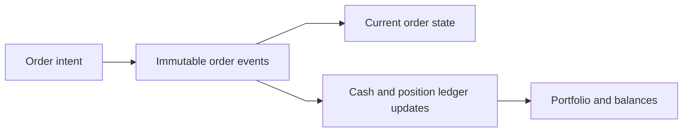

### Persistence Model

A broker platform usually needs multiple storage systems with different roles.

- transactional database for accounts, current order state, balances, and positions
- immutable event log for order and execution lifecycle replay
- market data cache and fan-out infrastructure for high-rate quote distribution
- analytical or archival storage for statements, surveillance, and audit retention

A practical default is:

- relational store for strongly consistent account state and order state transitions
- append-only event log for order lifecycle and replay
- in-memory cache for quotes and hot portfolio reads

Why this combination works:

- account state needs transactions and constraints
- order lifecycle needs replay, audit, and out-of-order event handling
- quote traffic is read-heavy and very latency-sensitive

## 7. APIs or External Interfaces

### Get Quote

`GET /quotes/{symbol}`

### Get Portfolio

`GET /accounts/{account_id}/portfolio`

### Place Order

`POST /accounts/{account_id}/orders`

Body includes:

- symbol
- side
- quantity
- order type
- limit price if applicable
- time in force
- idempotency key

### Cancel Order

`POST /orders/{order_id}/cancel`

### Get Order

`GET /orders/{order_id}`

### Execution Report Ingestion

Internal interface from venues or brokers:

`POST /execution-reports`

## 8. High-Level Design

At a high level, the system has seven concerns:

1. client-facing portfolio and quote reads
2. order entry and validation
3. pre-trade risk and buying power control
4. external routing and execution processing
5. position and cash ledger maintenance
6. market data ingestion and fan-out
7. settlement and reconciliation

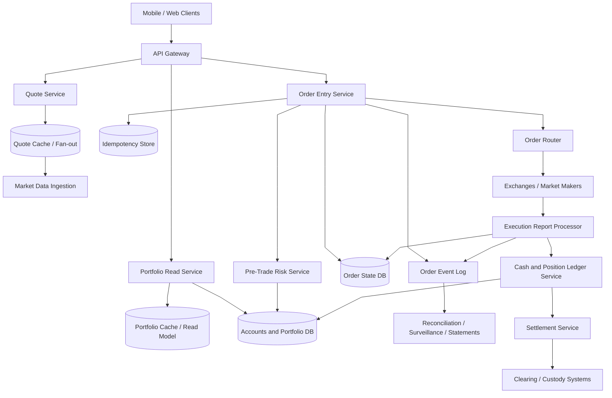

### Component Responsibilities

`Quote Service`

- serves live and delayed quote reads
- isolates quote fan-out from the trading path

`Market Data Ingestion`

- consumes external market data feeds
- normalizes and publishes quote updates

`Portfolio Read Service`

- serves positions, balances, order history, and portfolio snapshots
- uses read models and caches to protect the primary database

`Order Entry Service`

- validates request shape and idempotency
- creates the initial durable order record
- coordinates risk and routing

`Pre-Trade Risk Service`

- checks buying power, market state, symbol eligibility, and basic limits
- reserves funds or shares before external routing

`Order Router`

- translates internal orders into venue-specific messages
- tracks external references and route status

`Execution Report Processor`

- ingests fills, cancels, rejects, and busts
- deduplicates reports and updates current order state

`Cash and Position Ledger Service`

- applies authoritative financial state transitions
- updates balances, reserved cash, and held positions

`Settlement Service`

- tracks trade-date to settlement-date obligations
- reconciles internal books with clearing and custody systems

### What to Notice

- the quote path is separated from the order path
- the order path persists intent before depending on external venues
- order state and financial state are related but not identical
- settlement is downstream of execution and should not be mixed into the order-accept path

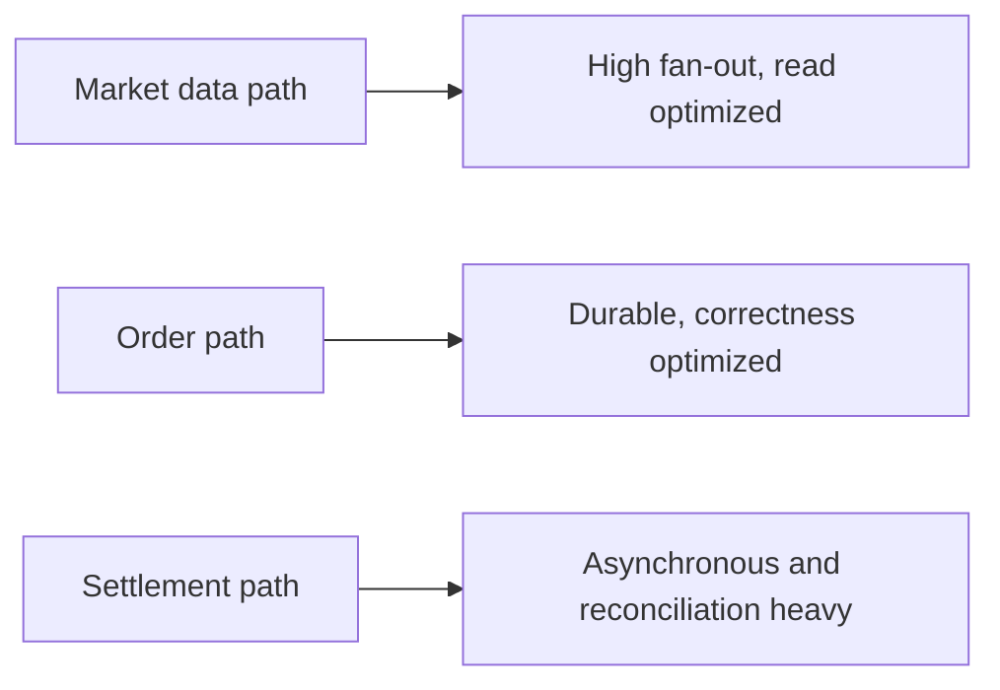

## 9. Request Flows

### Flow 1: Place Market Order

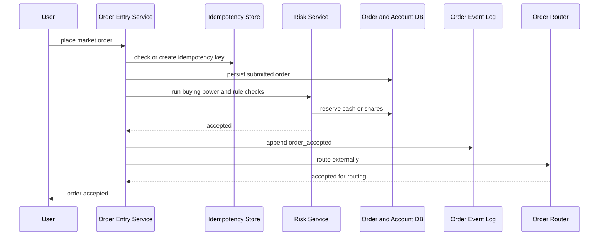

### Flow 2: Partial Fill Processing

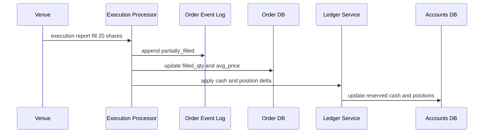

### Flow 3: Cancel Request

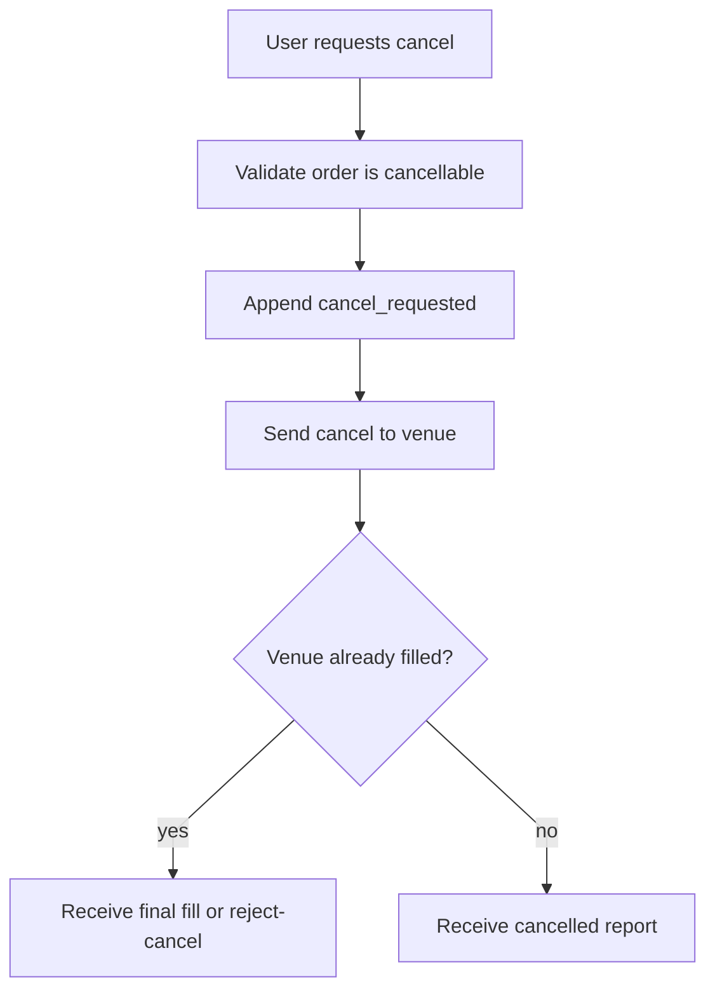

### Flow 4: Market Data Fan-out

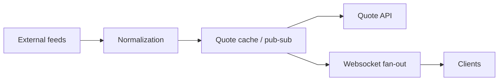

### Flow 5: Settlement Lifecycle

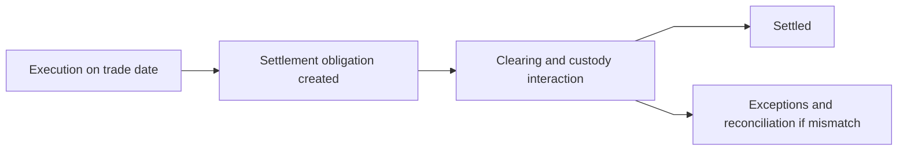

## 10. Deep Dive Areas

### Deep Dive 1: Order State vs Ledger State

A common mistake is to model trading as only an order table.

That is not enough.

The system really manages at least three related but distinct states:

- order lifecycle state
- cash ledger state
- position state

Example:

- an order can be `accepted` but not yet filled
- buying power may already be reduced because cash is reserved
- position quantity stays unchanged until an execution arrives

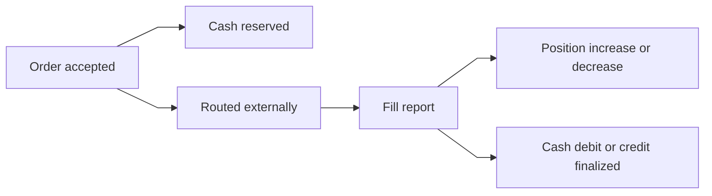

Why this separation matters:

- users need timely order state updates
- financial correctness needs an auditable ledger
- retries and duplicate reports must not double-apply money movements

### Deep Dive 2: Pre-Trade Risk and Buying Power

Before routing an order, the broker must decide if the order is permissible.

Typical checks:

- account status is active
- symbol is tradable
- market session allows the order type
- buying power is sufficient for buys
- held quantity is sufficient for sells
- notional or quantity limits are within policy

For a cash account buy:

1. compute maximum exposure
2. verify settled or available buying power
3. reserve cash
4. only then accept and route

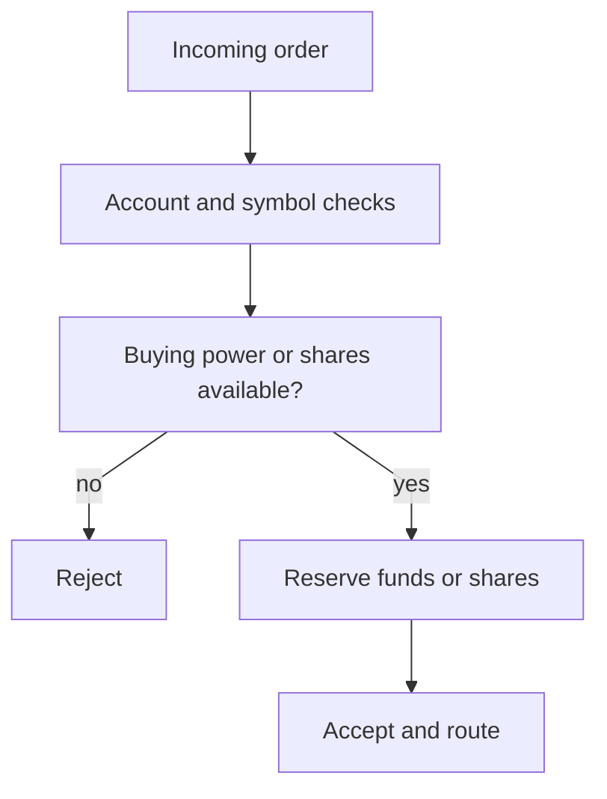

Important edge cases:

- order retried after timeout
- user places two near-simultaneous orders that compete for the same buying power
- market order notional is uncertain at acceptance time

Practical handling for market buys:

- reserve against a conservative reference price plus a risk buffer
- adjust reserved amount after final fills arrive

### Deep Dive 3: Durable Order Lifecycle and Event Sourcing Pattern

Order systems benefit from immutable lifecycle events.

Instead of only updating one mutable row, record events such as:

- submitted
- risk_accepted
- routed
- partially_filled
- filled
- cancel_requested
- cancelled
- rejected

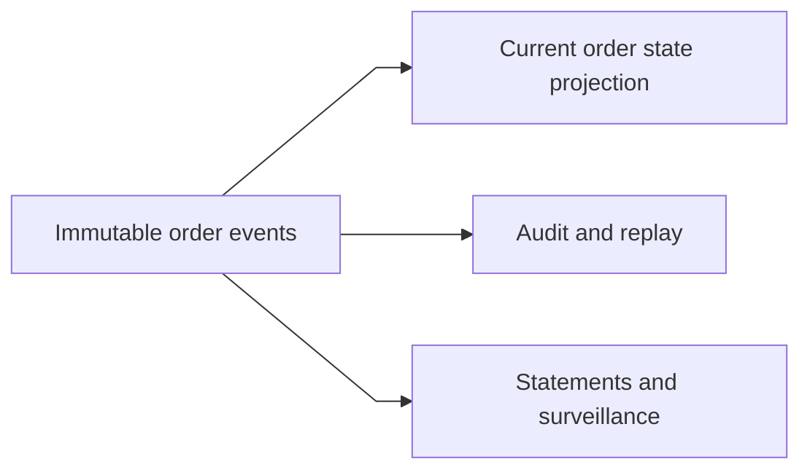

Why this helps:

- external reports can arrive out of order
- recovery after service crash can rebuild state
- regulatory and customer support workflows need complete order history

This does not require every read to replay from scratch.

A good design is:

- append immutable events
- maintain a current-state projection for fast reads

### Deep Dive 4: External Execution Reports Are Asynchronous and Messy

Venues do not guarantee a perfectly clean sequence aligned with your internal timing.

You may see:

- duplicate reports
- late cancel rejects
- multiple partial fills
- out-of-order events after reconnect
- trade bust or correction events

That means the execution processor must be idempotent and sequence-aware.

Typical safeguards:

- dedupe by execution ID and external order reference
- maintain per-order version or sequence tracking
- treat fill processing as append-only facts plus derived current state

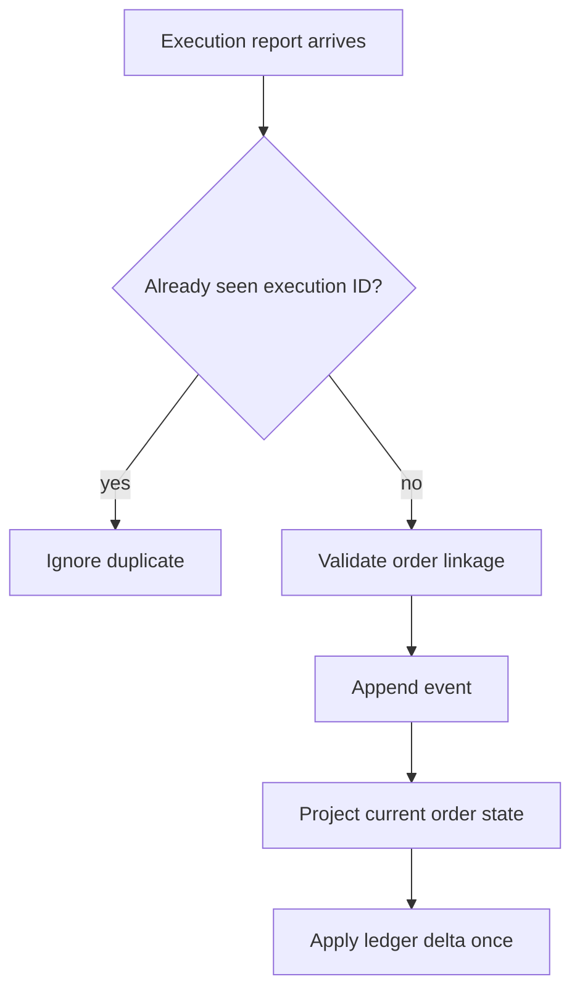

### Deep Dive 5: Average Price, Partial Fills, and Cancel Races

Suppose a user places a buy order for 100 shares.

The venue might return:

- 20 filled at one price
- 30 filled at another
- later a cancel confirmation for the remaining 50

The system must compute:

- cumulative filled quantity
- remaining quantity
- weighted average execution price
- released buying power for the unfilled remainder

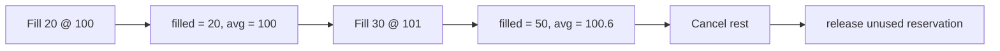

Cancel races are unavoidable.

The user can request cancel while the venue is already filling the order.

Correct behavior is not:

- assume cancel succeeds because the user clicked cancel

Correct behavior is:

- mark internal state as `cancel_requested`
- wait for venue-confirmed terminal state

### Deep Dive 6: Portfolio Reads vs Authoritative Books

Users want fast portfolio views:

- total account value
- unrealized gain or loss
- available buying power
- open orders

These reads should not force heavy joins on the core trading database every time.

A practical separation is:

- authoritative books in transactional storage
- portfolio read model built from order and ledger events
- cache for hot account summaries

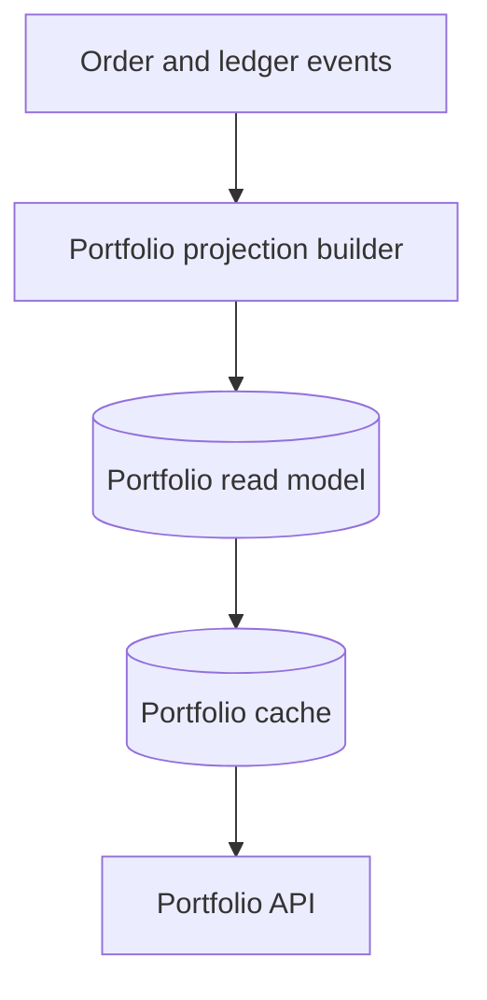

This read model may lag slightly.

That is acceptable for UI summaries as long as:

- the order submission path still checks the authoritative buying power state

### Deep Dive 7: Settlement and Reconciliation

Execution does not end the lifecycle.

Post-trade, the broker must manage:

- pending settlement obligations
- corporate action adjustments
- broker and clearing reconciliation
- statement generation

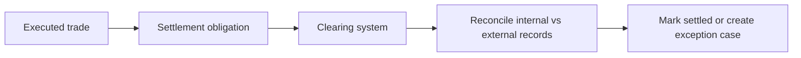

Why this matters in the design:

- if internal positions say one thing and the clearing system says another, the platform needs an exception workflow
- settlement systems should not sit inline on the user order-submit path

### Deep Dive 8: Isolation of Market Data from Trading

Retail broker platforms often fail under volatile markets because quote traffic and trading traffic compete for the same resources.

That is avoidable if the architecture isolates:

- market data ingestion and websocket fan-out
- order submission and execution processing

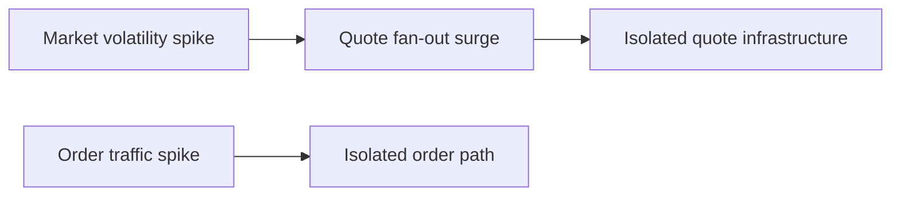

If both flows share the same core bottlenecks:

- quote spikes can delay order acknowledgments

That is unacceptable for a trading system.

## 11. Bottlenecks and Failure Modes

Likely bottlenecks:

- risk checks on hot accounts during order bursts
- order event log throughput during market open
- portfolio projection lag after volatile execution bursts
- websocket and quote fan-out saturation

Failure modes:

- duplicate execution report causes double position update
- stale buying power check accepts too many concurrent orders
- client timeout leads to repeated order submission
- exchange disconnect leaves routed orders in uncertain state
- reconciliation mismatch between internal books and clearing records

Mitigations:

- idempotency keys on order submission
- transactional reservation of cash or shares
- append-only execution events with dedupe keys
- order recovery and status reconciliation jobs
- separate market data infrastructure from order infrastructure

## 12. Scaling Strategy

A practical evolution path:

1. start with one order service, one transactional database, and one simple router
2. add immutable order event log and current-state projections
3. split quote infrastructure from trading infrastructure
4. introduce portfolio read models and caches
5. regionalize client-facing reads while keeping clear ownership of trading books
6. add stronger reconciliation, surveillance, and failover workflows

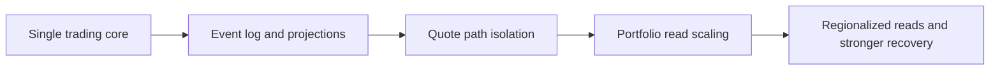

## 13. Tradeoffs and Alternatives

Single mutable order table vs event plus projection model:

- mutable-only state is simpler at first
- event plus projection design is better for audit, replay, and messy external reports

Synchronous strong reads of balances vs cached portfolio views:

- strong reads are simpler but expensive at high read volume
- cached and projected views scale better but can lag slightly

Direct exchange integration everywhere vs isolated order router:

- direct integration in the order service reduces components
- isolated routing layer contains venue-specific complexity better

One shared platform for quotes and orders vs isolated stacks:

- one stack looks simpler
- isolated stacks reduce blast radius under volatility

## 14. Real-World Considerations

Production concerns usually include:

- regulatory audit retention and surveillance hooks
- strict access control and operator action logging
- business continuity during market outages and halts
- customer notifications for rejects, fills, and corporate actions
- statement generation and tax reporting pipelines
- monitoring for stuck orders, unmatched fills, and reserve drift

Important operational dashboards:

- order acceptance latency
- risk rejection rate
- execution report lag
- cash reserve mismatch count
- portfolio projection lag
- clearing reconciliation exception count

## 15. Summary

The recommended design separates:

- market data fan-out
- order acceptance and risk validation
- external routing and execution ingestion
- authoritative cash and position books
- downstream settlement and reconciliation

The core design insight is that a retail broker platform is not just an order router.

It is a system that must keep:

- order lifecycle
- buying power reservations
- fills
- balances and positions
- settlement obligations

consistent enough to protect users and the firm while still delivering a fast trading experience.
