# Ticket Booking System

## 1. Problem Statement

Design a large-scale ticket booking platform for movies, concerts, sports events, and live shows.

The system should let users:

- browse venues, shows, and showtimes
- see seat availability
- temporarily hold seats
- pay for seats
- receive confirmed tickets

At small scale, this sounds simple:

- show a seating map
- let a user choose seats
- mark them sold after payment

At production scale, the system becomes a high-contention inventory and workflow problem.

Now the platform must handle:

- thousands of users competing for the same hot event
- seat holds that expire
- duplicate requests and payment retries
- distributed payment dependencies
- seat-map reads that are high volume and bursty
- consistent final booking state under race conditions

The hard part is not rendering the seat map.

The hard part is building a system where:

- two users cannot buy the same seat
- users can safely retry after timeouts
- temporary holds do not leak inventory forever
- payment success and seat ownership do not diverge
- read-heavy seat availability does not overload the primary inventory store

This is a useful case study because it forces tradeoffs across:

- strong correctness for seat inventory vs low-latency browsing
- pessimistic locking vs optimistic reservation
- synchronous booking UX vs asynchronous payment and recovery workflows
- hot-event contention vs general steady-state scale

## 2. Scope and Assumptions

In scope:

- venue and event catalog
- show and showtime management
- seat-map and availability reads
- seat hold and booking flow
- payment orchestration boundary
- ticket issuance

Out of scope for this version:

- venue onboarding tooling
- refund accounting internals
- dynamic pricing model training
- anti-bot system internals
- QR scanning gates and on-site operations

Assumptions:

- the system supports both reserved seating and general admission, but the main focus is reserved seats
- a seat hold has a short TTL such as 5 to 10 minutes
- payment provider calls can fail, timeout, or complete after the client disconnects
- the booking system is the source of truth for seat ownership
- browsing availability can be eventually consistent by a small amount, but final booking cannot

## 3. Functional Requirements

The system must support:

- browsing events and showtimes
- viewing seat maps and seat availability
- holding one or more seats for a user
- converting a valid hold into a booking after payment
- expiring abandoned holds
- issuing tickets for confirmed bookings

Important secondary behaviors:

- idempotent booking confirmation
- seat release after payment failure
- waitlist or retry when hot seats are unavailable
- support for general admission inventory
- cancellation and refund workflow hooks

## 4. Non-Functional Requirements

The most important non-functional requirements are:

- correctness of seat ownership
- low latency for seat-map reads
- high availability for browse and search flows
- graceful handling of traffic spikes for hot launches
- bounded hold leakage
- clear auditability of inventory transitions

Consistency requirements are mixed.

The system should strongly preserve:

- no double sale of the same seat
- one authoritative booking record per booked seat
- idempotent confirmation of payment-driven booking completion

The system can often tolerate eventual consistency for:

- browse/search indexes
- cached seat-map reads
- analytics
- recommendation or popularity ranking

The key design question is:

how do we keep the inventory path strongly correct while allowing the browse path to scale cheaply?

## 5. Capacity and Scale Estimation

Assume:

- 20 million daily active users during peak seasons
- 500,000 events across movies, concerts, and sports
- 5 million active showtimes per day
- a hot event can trigger hundreds of thousands of seat-map reads and tens of thousands of hold attempts in minutes

Average traffic may look reasonable:

- browse and search: tens of thousands of requests per second
- booking attempts: a few thousand requests per second

But the design is driven by skew.

For a hot concert release:

- 100,000 users may open the same seat map in a few minutes
- 10,000 or more may try to hold overlapping seats nearly simultaneously

Inventory writes are much smaller than browse reads, but the writes are the part that must be correct.

Main scaling pressures:

- seat-map fan-out reads
- contention on hot rows or hot seat sets
- hold expiration cleanup
- payment completion and reconciliation retries

## 6. Core Data Model

Main entities:

- `Venue`
- `Event`
- `Show`
- `Seat`
- `InventoryState`
- `SeatHold`
- `Booking`
- `PaymentAttempt`
- `Ticket`

### Venue

Represents a physical location.

Fields:

- `venue_id`
- name and location
- seat layout template
- zone and section metadata

### Event

Represents the content being sold.

Fields:

- `event_id`
- type such as movie, concert, sports match
- metadata such as performer, title, language, category

### Show

Represents a scheduled occurrence of an event.

Fields:

- `show_id`
- `event_id`
- `venue_id`
- start time
- pricing plan
- sale status

### Seat

Represents a sellable unit for reserved seating.

Fields:

- `seat_id`
- `venue_id`
- section, row, number
- seat type

### InventoryState

Represents current sellability for a seat in a show.

Fields:

- `show_id`
- `seat_id`
- state such as available, held, booked, blocked
- current hold or booking reference
- version

### SeatHold

Represents temporary inventory ownership before booking.

Fields:

- `hold_id`
- `user_id`
- `show_id`
- seat list
- expiry timestamp
- hold state

### Booking

Represents a confirmed purchase.

Fields:

- `booking_id`
- `user_id`
- `show_id`
- seat list
- total price
- booking state
- payment reference

### PaymentAttempt

Represents the payment lifecycle.

Fields:

- `payment_attempt_id`
- `booking_or_hold_reference`
- amount
- provider reference
- payment state

### Ticket

Represents the issued entitlement.

Fields:

- `ticket_id`
- `booking_id`
- seat reference
- barcode or QR payload

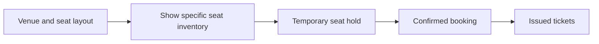

### Persistence Model

The system usually needs several storage patterns.

- relational or strongly consistent transactional store for inventory state, holds, and bookings
- cache for seat-map reads and hot availability views
- search or document index for browse and discovery
- durable event log or queue for async workflows such as ticket issuance and notifications

Why a relational inventory store is a strong default:

- booking requires transactional updates across a small set of seats
- unique constraints and conditional updates are valuable under contention
- auditability of state transitions matters

This does not mean every query hits the primary database.

The usual pattern is:

- strong source of truth for inventory writes
- derived read models and caches for high-volume seat-map reads

## 7. APIs or External Interfaces

### Browse Events

`GET /events?city=...&date=...`

### Get Show Seat Map

`GET /shows/{show_id}/seats`

### Hold Seats

`POST /shows/{show_id}/holds`

Body includes:

- user ID
- seat list
- idempotency key

### Confirm Booking

`POST /holds/{hold_id}/confirm`

Body includes:

- payment method or payment authorization reference
- idempotency key

### Get Booking

`GET /bookings/{booking_id}`

### Payment Webhook

`POST /payments/webhook`

## 8. High-Level Design

At a high level, the system has six concerns:

1. catalog and browse
2. seat availability serving
3. strongly correct hold and booking workflow
4. payment orchestration
5. ticket issuance and user notifications
6. expiration and recovery

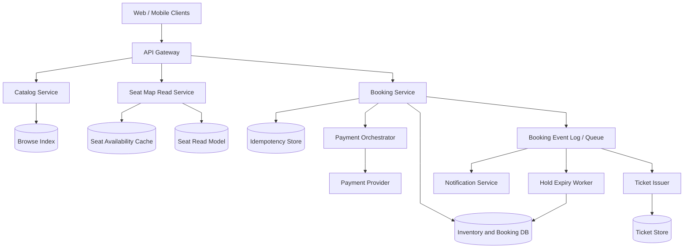

### Component Responsibilities

`Catalog Service`

- serves event and show metadata
- powers browse and discovery APIs

`Browse Index`

- supports search by city, venue, category, date, performer, and language
- is optimized for browse reads, not inventory correctness

`Seat Map Read Service`

- serves high-volume seat availability reads
- composes seat layout with current availability state

`Seat Availability Cache`

- stores hot seat-map snapshots and availability fragments
- reduces pressure on the inventory database

`Seat Read Model`

- keeps a derived representation of seat availability for fast reads
- can be updated from the transactional inventory store or booking events

`Booking Service`

- owns the hold and booking workflow
- executes strongly correct seat state transitions
- enforces idempotency and validates hold ownership

`Inventory and Booking DB`

- is the source of truth for seat inventory, holds, and bookings
- supports conditional updates and transactions

`Idempotency Store`

- tracks request keys for hold creation and booking confirmation
- prevents duplicate side effects during retries

`Payment Orchestrator`

- coordinates with payment providers
- maps external payment outcomes to internal booking state

`Booking Event Log / Queue`

- drives asynchronous downstream workflows
- decouples ticket issuance and notifications from the confirmation path

`Hold Expiry Worker`

- releases expired holds
- repairs inventory leaks from abandoned sessions

### What to Notice

- browse and seat-map reads are separated from the transactional booking path
- the booking service is intentionally narrow and correctness-focused
- payment is an important dependency but does not directly own inventory
- ticket issuance is asynchronous after booking confirmation

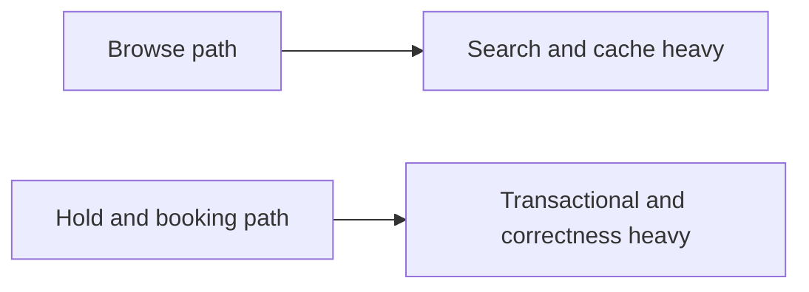

## 9. Request Flows

### Flow 1: Seat Map Read

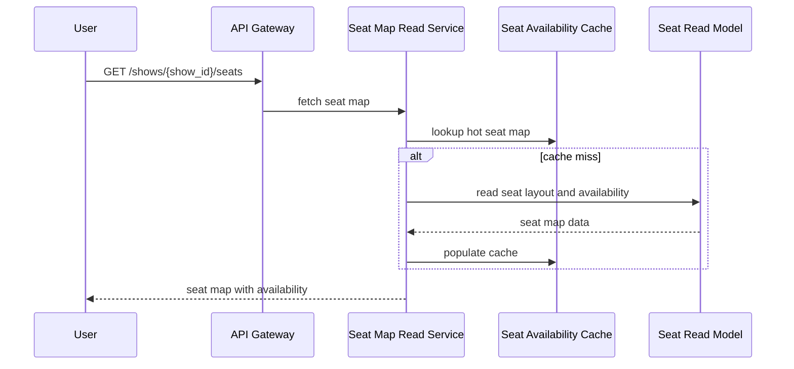

### Flow 2: Hold Seats

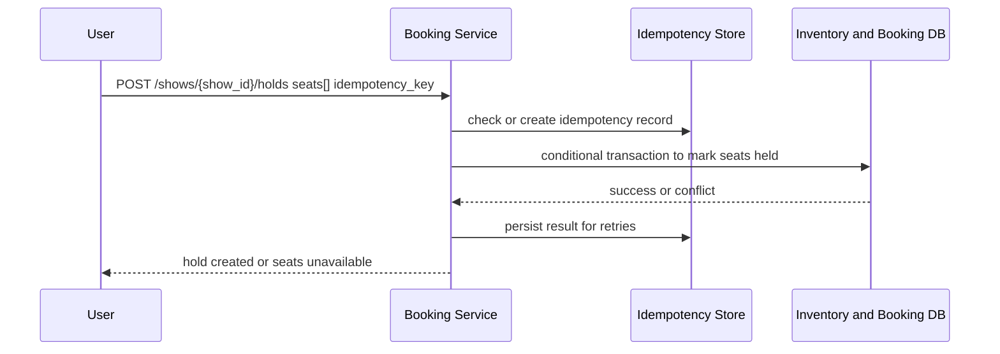

### Flow 3: Confirm Booking After Payment

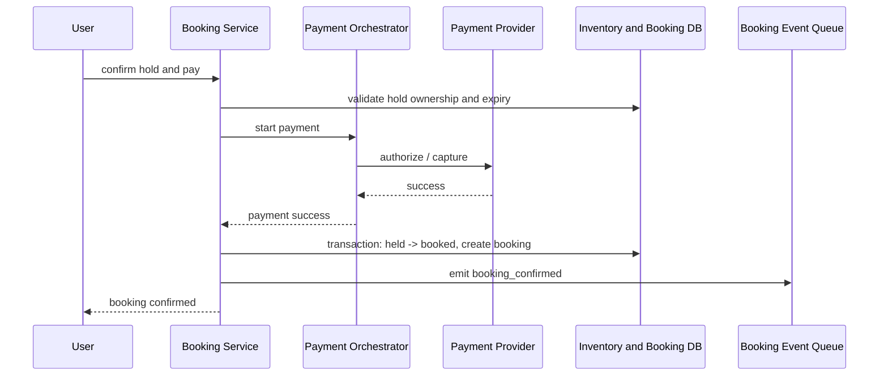

### Flow 4: Payment Succeeds but Client Disconnects

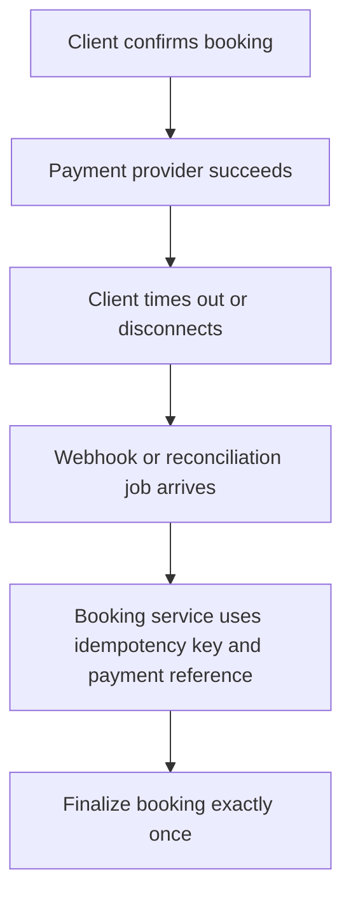

### Flow 5: Hold Expiry

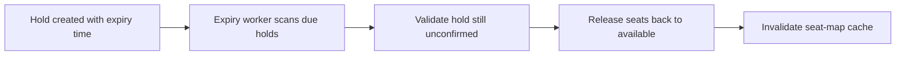

## 10. Deep Dive Areas

### Deep Dive 1: Preventing Double Booking

This is the core correctness problem.

The system should never rely on:

- cache-only seat state
- client-side seat ownership assumptions
- delayed asynchronous reservation for final seat booking

The source of truth should be a transactional inventory table keyed by:

- `show_id`
- `seat_id`

One strong pattern is conditional transactional update:

1. read the requested seat rows inside a transaction
2. verify all requested seats are currently `available`
3. update them to `held` with the same `hold_id`
4. commit atomically

If any seat is not available, the transaction fails and no partial hold is created.

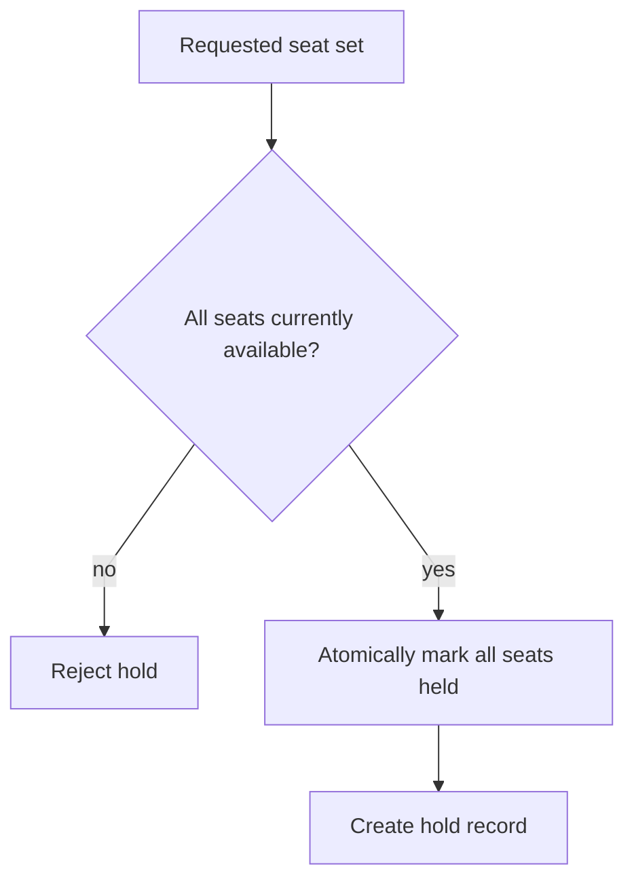

Possible implementation choices:

- row-level locking in a relational database
- compare-and-swap or conditional writes in a strongly consistent key-value store
- partitioned inventory service with per-show serial execution

The simplest strong default for interview design is:

- relational store with per-seat rows
- transaction across the requested seat set

That is easy to reason about and provides clear correctness guarantees.

### Deep Dive 2: Why Hold Before Payment

Trying to charge first and reserve later creates a bad user experience and difficult compensation logic.

If payment succeeds but seats are gone:

- the system must refund or void immediately
- users see success followed by failure

A better pattern is:

1. hold seats with a short TTL
2. perform payment while the hold is valid
3. convert hold to booking atomically if payment succeeds

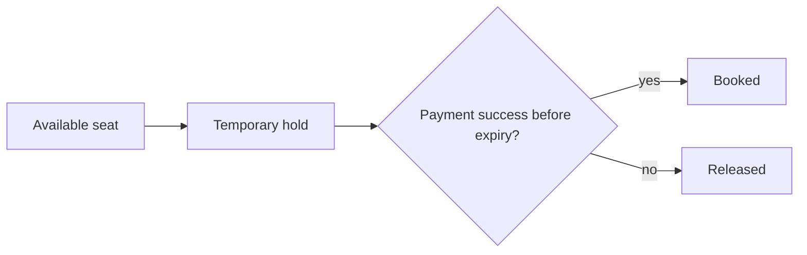

Important edge cases:

- payment succeeds after hold expiry
- payment provider times out but later reports success
- user submits confirm twice

Handling pattern:

- every confirm request has an idempotency key
- payment provider reference is stored and deduplicated
- hold expiry and confirmation both check current hold state transactionally

### Deep Dive 3: Database Shape for Reserved Seating

A common hot interview question is:

what does the persistence look like?

Reserved seating often maps well to a normalized transactional model:

- `shows`
- `show_seats`
- `holds`
- `hold_seats`
- `bookings`
- `booking_seats`

Possible `show_seats` table shape:

- primary key: `(show_id, seat_id)`
- columns: `state`, `hold_id`, `booking_id`, `version`, `updated_at`
- index by `show_id` for seat-map reads

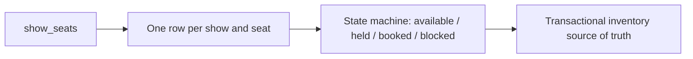

Why this works well:

- seat state is explicit
- conflicts are local to a show
- transactions usually involve a small seat set

Potential issue:

- very hot shows can concentrate writes on one partition

Typical mitigation:

- partition inventory by `show_id`
- isolate hot shows to dedicated shards
- keep seat-map reads off the primary path via read models and caches

### Deep Dive 4: Seat Map Reads vs Inventory Correctness

Reads are much more frequent than bookings.

If every seat-map read hits the transactional store directly for hot events, the system will struggle.

The usual separation is:

- transactional inventory store for authoritative writes
- read model or cache for serving seat maps

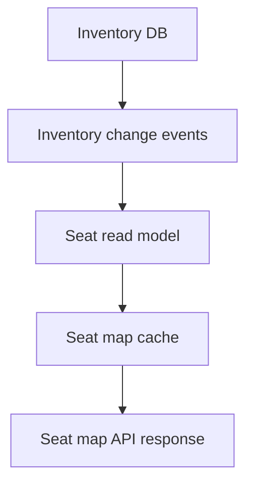

The cache can be slightly stale.

That is acceptable because:

- final correctness is enforced only at hold time
- stale reads may cause a user to click a seat that becomes unavailable, but not to buy the same seat twice

Practical UI behavior:

- return live-ish seat map
- if hold fails, surface "seat no longer available" and suggest nearby alternatives

### Deep Dive 5: Hot Event Contention

Hot events create the worst-case behavior:

- many users target the same few premium seats
- retry storms happen when requests fail
- bots can amplify contention

Useful control mechanisms:

- per-user rate limits on hold attempts
- queue or waiting-room mode for extreme launches
- partitioning by show so a hot event does not affect all events
- fast conflict detection without expensive retries

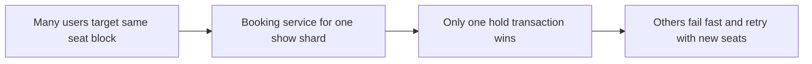

For extremely hot launches, some systems introduce a pre-queue:

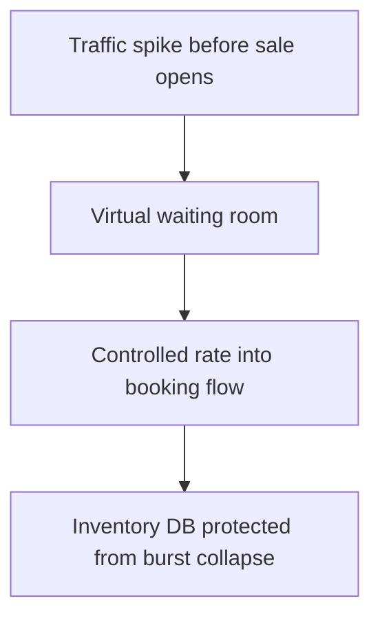

### Deep Dive 6: Idempotency and Exactly-Once Myths

Payment and booking systems always face retries.

Sources of duplicate attempts:

- user double-clicks
- mobile network retry
- API gateway timeout
- payment webhook replay

The system should not chase "exactly once" as a transport guarantee.

It should implement idempotent state transitions.

Pattern:

- `idempotency_key` on hold creation and confirmation requests
- unique constraint tying external payment reference to one internal booking result
- deduplicated event consumers for ticket issuance

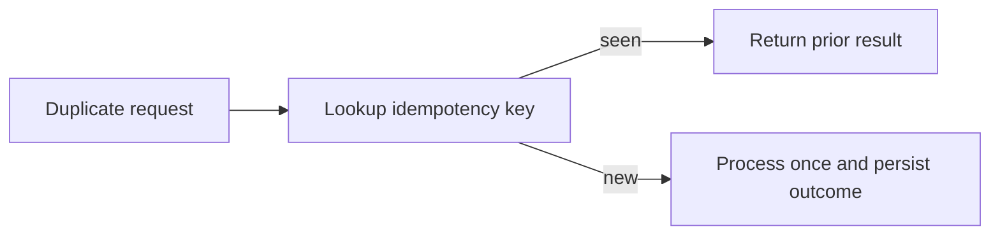

### Deep Dive 7: General Admission Inventory

Not all inventory is seat-based.

For general admission, the system often tracks:

- total capacity
- remaining sellable quantity

That changes the concurrency model.

Instead of locking named seats, the system usually does:

- conditional decrement of remaining inventory
- hold on a quantity

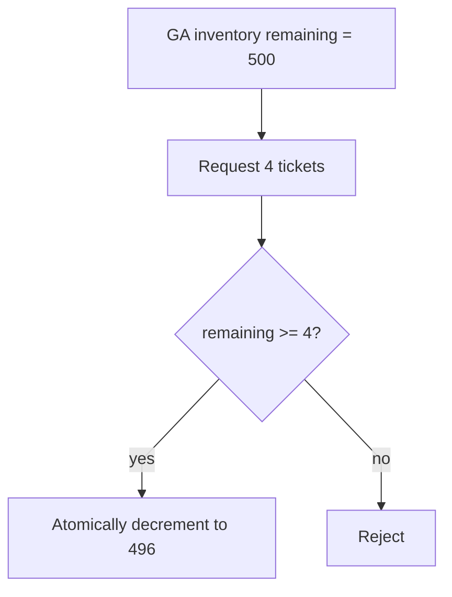

This is simpler than reserved seating, but hot contention still exists.

## 11. Bottlenecks and Failure Modes

Likely bottlenecks:

- hot seat-map cache churn for top events
- write contention on premium seats
- expiry worker lag causing held seats to linger
- payment provider latency increasing hold loss

Failure modes:

- seat shown as available in cache but unavailable at hold time
- payment success but booking confirmation delayed
- duplicate webhook causes repeated confirm attempts
- partial system outage leaves expired holds not yet released

Mitigations:

- keep authoritative hold/booking checks transactional
- make confirmation idempotent with payment reference dedupe
- run reconciliation jobs for payment and booking divergence
- invalidate or patch seat-map cache on hold and booking changes

## 12. Scaling Strategy

A practical evolution path:

1. start with one transactional inventory database and one seat-map cache
2. add browse index and seat read model for hot read offload
3. partition inventory by show or venue-region
4. add queue-based async workflows for ticketing, notifications, and reconciliation
5. add hot-event protections such as waiting room and isolated shards
6. regionalize browse, while keeping inventory ownership scoped cleanly

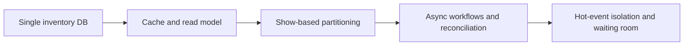

## 13. Tradeoffs and Alternatives

Relational inventory store vs eventually consistent document store:

- relational design gives simpler correctness for seat ownership
- eventually consistent stores can scale reads well but make booking correctness harder

Pessimistic seat hold vs optimistic booking-at-payment:

- hold first improves user experience and reduces refund complexity
- optimistic booking can look simpler but fails badly under contention

Cache-heavy seat map vs direct inventory reads:

- cache-heavy reads scale much better
- direct reads are simpler but collapse under hot events

Per-seat rows vs aggregated seat blocks:

- per-seat rows are precise and easier for reserved seating
- aggregated blocks reduce row count but complicate seat selection logic

## 14. Real-World Considerations

Production concerns usually include:

- bot prevention and waiting-room enforcement
- fraud checks for suspicious payment patterns
- audit trail for inventory transitions
- GDPR and payment token handling boundaries
- refund and cancellation policy workflows
- observability for hold conflict rate, payment latency, and hold expiry backlog

Operationally, the most important dashboards are often:

- hold success rate by event
- double-click and retry rate
- payment timeout and webhook delay rate
- seat-map cache hit rate
- expired holds pending cleanup

## 15. Summary

The recommended design separates:

- browse and seat-map read scaling
- strongly correct hold and booking transitions
- payment orchestration
- asynchronous ticket issuance and recovery

The core design insight is that ticket booking is fundamentally an inventory correctness problem under bursty contention.

The system works well when:

- seat ownership is controlled by a transactional source of truth
- holds are short-lived and explicit
- confirmation is idempotent
- browse reads are served from derived models and caches
- payment divergence is repaired through reconciliation rather than hand-waved away
