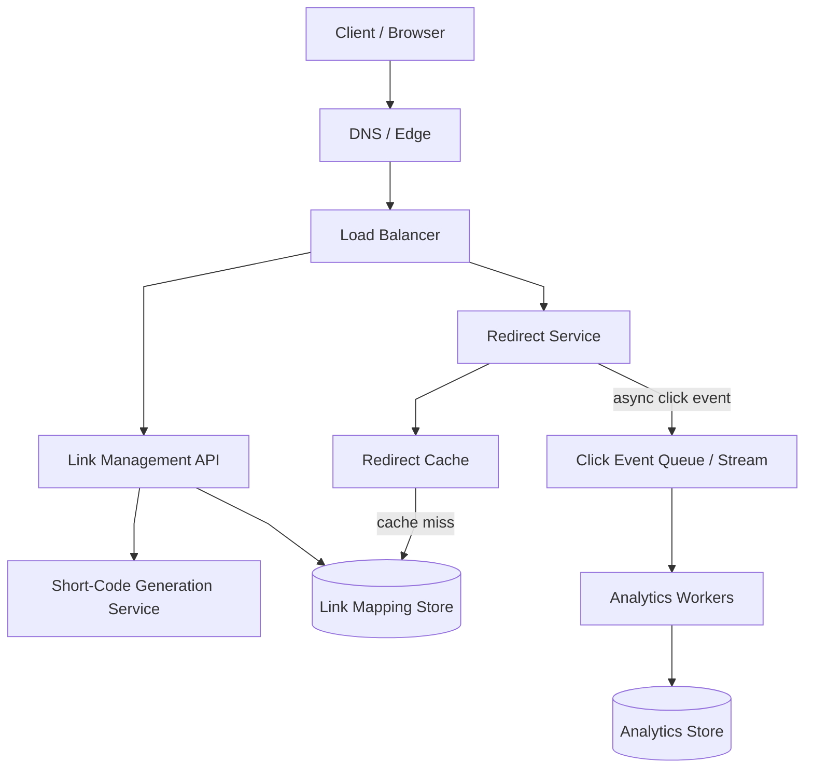
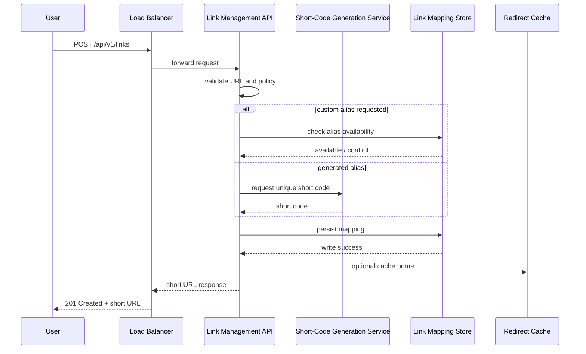
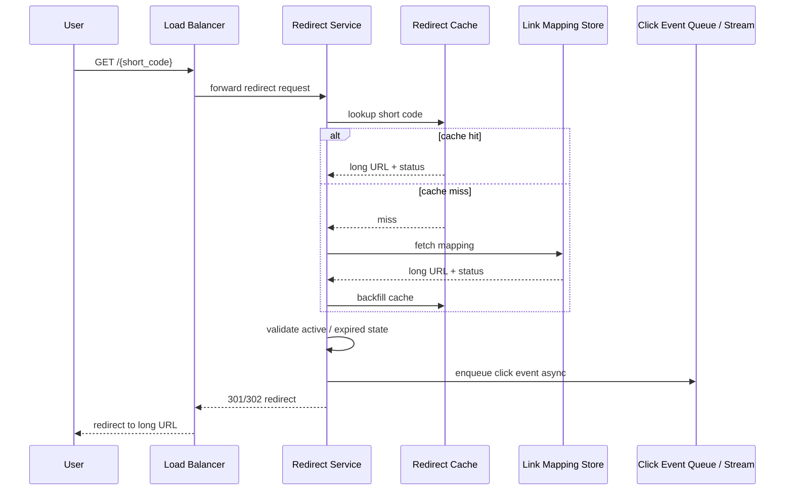
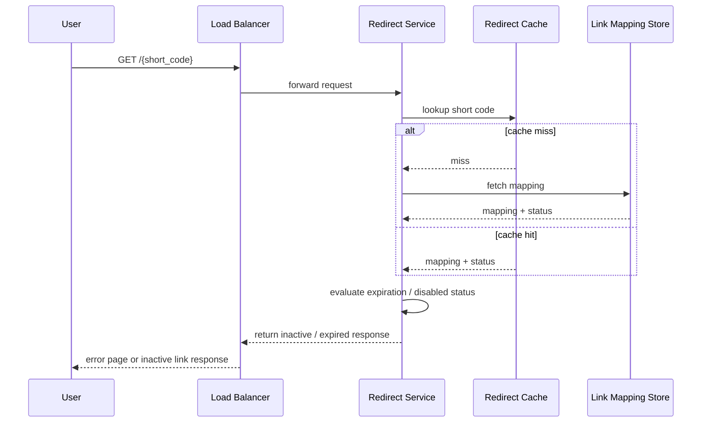
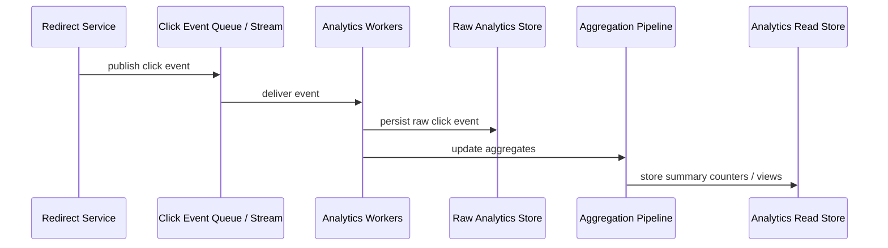

# TinyURL

## 1. Problem Statement

Design a URL shortening service similar to TinyURL or Bitly.

The system should let a user submit a long URL and receive a short alias that can be shared more easily. When another user visits the short link, the system should quickly redirect them to the original long URL.

At very small scale, this sounds like a toy problem:

- take a URL
- generate a short code
- store the mapping
- redirect later

At meaningful scale, it becomes much more interesting.

The system now has to deal with:

- enormous read-heavy traffic on redirects
- low-latency lookup requirements
- globally unique short-code generation
- storage efficiency for billions of links
- abuse and spam prevention
- expiration and deletion policy
- analytics and click tracking

A good URL shortener is therefore not just a key-value store with a nicer interface.

It is a read-heavy redirection platform with strict latency expectations and an unusual mix of product simplicity and infrastructure scale.

That makes it a strong case study because it forces several important design decisions:

- how IDs are generated
- what is cached
- how writes are validated
- how reads remain fast under heavy traffic
- how to separate the redirect path from optional analytics

## 2. Scope and Assumptions

To keep the design focused, assume the initial product supports:

- creating a short URL from a valid long URL
- redirecting users from the short URL to the original URL
- optional custom aliases for some users
- optional link expiration
- basic click counting and analytics

Out of scope for the first version:

- QR code generation
- advanced enterprise policy and branding controls
- content moderation pipeline details beyond basic abuse prevention hooks
- deep ad-tech or attribution integrations

Assume the system is designed for a large public internet service, not just a small internal tool.

Assume also that:

- redirects are far more frequent than creates
- most links are read many times, some only once
- redirects should feel nearly instantaneous

## 3. Functional Requirements

The system must support:

- creating a short URL for a long URL
- resolving a short URL into the original long URL
- redirecting users to the original URL
- optionally creating a custom alias if it is available
- optionally expiring a short URL after a configured time
- collecting basic click metadata such as timestamp and maybe coarse geo or device info

Secondary functional behaviors:

- prevent duplicate alias collisions
- reject malformed or obviously unsafe input URLs
- allow disabled or expired links to stop redirecting

## 4. Non-Functional Requirements

The most important non-functional requirements are:

- very low redirect latency
- high availability for reads
- very high read throughput
- durable link storage
- globally unique short-code generation
- protection against abuse and spam
- cost-efficient storage for a very large mapping table

Consistency requirements are asymmetric:

- link creation must be strongly correct for uniqueness and persistence
- click analytics can often be eventually consistent

This distinction matters because it lets us keep the redirect path lean while moving non-critical work off the synchronous request path.

## 5. Capacity and Scale Estimation

Assume:

- 100 million new short URLs created per month
- 3 billion redirects per month

That gives roughly:

- around 38 writes per second on average for new links
- around 1,157 reads per second on average for redirects

Those averages are not enough for design.

Assume peak traffic is 10x average.

Then:

- writes: about 400 per second peak
- reads: about 12,000 per second peak

This is still very manageable for a well-designed service, but public internet workloads are often bursty. A real production design should comfortably support much higher redirect rates over time.

Storage estimate:

Assume each mapping stores:

- short code
- long URL
- creation time
- expiration metadata
- user or ownership metadata
- flags for active/disabled status

Suppose average stored long URL plus metadata is around 500 bytes.

For 100 million links per month:

- about 50 GB of raw mapping data per month

Over 3 years:

- about 1.8 TB raw before replication and indexing overhead

This is not huge by modern standards, but enough that storage layout and indexing still matter.

Analytics estimate:

If every redirect produces a click event, then peak redirect load translates directly into peak analytics event load. That means analytics ingestion can easily dwarf create traffic and should not block the redirect path.

## 6. Core Data Model

The core entity is the link mapping.

Main fields:

- `short_code`
- `long_url`
- `created_at`
- `created_by` if user ownership exists
- `expires_at` if expiration is supported
- `status` such as active, disabled, expired
- `is_custom_alias`

The natural primary lookup is:

- `short_code -> long_url`

That means the short code itself is the dominant access key.

Optional secondary access patterns:

- all links by user
- link lookup by custom alias
- analytics by link ID

It is useful to conceptually separate:

1. canonical redirect mapping data
2. click analytics data

The redirect mapping is small, hot, and latency-sensitive.

The click analytics stream is large, append-heavy, and can tolerate eventual processing.

This separation keeps the core redirect system simple.

## 7. APIs or External Interfaces

### Create Short URL

`POST /api/v1/links`

Request:

- long URL
- optional custom alias
- optional expiration

Response:

- short URL
- short code
- metadata

### Resolve Redirect

`GET /{short_code}`

Behavior:

- lookup short code
- validate that the link is active and not expired
- return HTTP redirect to long URL

### Optional Link Metadata Lookup

`GET /api/v1/links/{short_code}`

Used for management or analytics views, not for normal redirect traffic.

### Optional Analytics Endpoint

`GET /api/v1/links/{short_code}/stats`

This should not sit on the redirect critical path.

## 8. High-Level Design

At a high level, the system can be divided into two paths:

1. write path for link creation
2. read path for redirect resolution

For interview discussion, the high-level diagram should emphasize only the critical production boundaries:

- client
- DNS and edge ingress
- load balancer
- link management API
- redirect service
- short-code generation service
- redirect cache
- link mapping store
- click event queue or stream
- analytics workers
- analytics store

What to notice:

- the system has two distinct hot paths: create and redirect
- the create path owns correctness: validation, alias generation, and persistence
- the redirect path owns latency: cache-first lookup with the mapping store as fallback
- analytics is asynchronous and should not delay HTTP redirect latency
- code generation belongs only on the create path, not on the redirect path

The important architectural separation here is that link creation and redirect serving have very different traffic shapes.

The create path is write-light but correctness-sensitive:

- validate URL
- generate or reserve alias
- persist mapping

The redirect path is read-heavy and latency-sensitive:

- decode short code
- resolve mapping
- return redirect quickly

That is why these two paths are better represented as separate logical paths even if they initially live in one deployable codebase.

### Why Separate Read and Write Fleets

At large scale, it is often useful to deploy redirect-serving instances separately from link-creation and management instances.

Why this helps:

- redirect traffic is much higher volume and far more latency-sensitive
- create traffic is lower volume but usually has more validation, auth, abuse checks, and business logic
- each path can scale independently
- deploy risk is reduced because changes to create or admin logic do not have to ride the hottest redirect fleet
- operational tuning becomes cleaner because the read path and write path care about different metrics

This does **not** mean the shared datastore stops being a possible bottleneck.

If both paths still hit the same backing store, the datastore can still become the limiting factor.

So the real scaling story is layered:

1. separate the service fleets for traffic and operational isolation  
2. make the redirect path terminate in cache as often as possible  
3. evolve the mapping store architecture if backing-store pressure still becomes too high  

In other words, separating read and write fleets is useful because it removes unnecessary application-layer coupling, even though it does not replace the need for good cache and datastore design.

## 9. Request Flows

### Create Flow

What to notice:

- correctness lives on the write path: validation, uniqueness, and persistence
- code generation is part of create, not redirect
- cache priming is optional optimization, not the source of truth

### Redirect Flow

What to notice:

- redirect latency should depend mainly on cache or a single key-value lookup
- analytics is emitted asynchronously and must not block the redirect response
- the redirect path still enforces link state such as disabled or expired

### Expired or Disabled Link Flow

What to notice:

- expiration must be enforced at read time, not only by background cleanup
- disabled-link handling belongs to the redirect decision logic

### Analytics Flow

What to notice:

- redirect correctness does not depend on analytics completion
- raw event persistence and aggregated read views can be separated
- analytics freshness can be eventual without harming redirect latency

This separation is important because the redirect path should stay fast even if analytics workers lag.

## 10. Deep Dive Areas

### 10.1 Short-Code Generation Strategy

This is one of the most important design choices.

A short-code generator needs to satisfy:

- uniqueness
- compact output
- high throughput
- predictable collision behavior

There are several approaches.

#### Sequential ID + Base62 Encoding

One common strategy is:

1. generate a unique numeric ID
2. encode it using Base62 (`a-z`, `A-Z`, `0-9`)

Why this works:

- uniqueness is easy if the numeric ID is unique
- the code stays short
- lookup remains straightforward

Example:

- numeric ID `125` becomes some Base62 short string

Strengths:

- simple
- deterministic
- compact

Costs:

- sequential IDs may expose creation order
- global ID generation must scale safely

#### Random Code Generation

Generate a random short string and retry on collision.

Strengths:

- no visible sequence
- simple conceptually

Costs:

- collision checking needed
- write path includes retry logic
- less efficient as code space fills

For internet-scale systems, this can work early but becomes less attractive than deterministic ID generation if traffic grows substantially.

#### Pre-Allocated ID Ranges

A scalable version of sequential generation is to allocate ID ranges to application nodes.

Example:

- one node gets IDs `1M-2M`
- another gets `2M-3M`

Strengths:

- reduces hot central ID service pressure
- still supports deterministic uniqueness

Costs:

- more allocator logic
- possible ID wastage if nodes die before consuming ranges

#### Why Base62

If we use lowercase + uppercase + digits, the alphabet size is 62.

That means short strings can represent a large space efficiently:

- `62^6` gives tens of billions of combinations
- `62^7` gives trillions

This is usually sufficient for a large URL shortener if code length is designed well.

For public-facing services, 6-8 characters is a reasonable design range depending on lifetime volume expectations.

**Recommendation**

For TinyURL, I would choose:

- globally unique numeric ID generation
- Base62 encoding on top of that ID
- range allocation or another horizontally scalable ID-allocation strategy once traffic grows

Why this is the best fit here:

- the system is read-heavy, so we want the write path to be simple and deterministic
- collisions on the create path add avoidable complexity
- the access pattern does not require cryptographic unpredictability by default

I would not start with random-code generation unless product requirements explicitly value non-sequential public codes more than operational simplicity.

#### How to Generate the Globally Unique Numeric ID

Once the design chooses:

- unique numeric ID
- then Base62 encoding

the next question is obvious:

How is that numeric ID generated safely in a distributed system?

There are a few common approaches.

##### Option 1: Single Central ID Generator

One service owns ID generation and hands out monotonically increasing numbers.

Strengths:

- simple mental model
- globally ordered IDs
- easy to reason about uniqueness

Costs:

- central bottleneck at higher write scale
- availability of the create path depends heavily on this service

This is acceptable for early stages if write volume is modest.

##### Option 2: Database Sequence

The mapping database itself provides an auto-increment or sequence value.

Strengths:

- easy to implement
- correctness is straightforward

Costs:

- ties ID generation tightly to one database
- becomes harder to scale across shards or regions
- makes the database responsible for more than persistence

This is often the simplest first version.

##### Option 3: Range Allocation

A central allocator hands out large ID blocks to each application node or create-service instance.

Example:

- instance A gets IDs `1,000,000` to `1,999,999`
- instance B gets IDs `2,000,000` to `2,999,999`

Then each instance generates IDs locally from its assigned range.

Strengths:

- removes per-request dependency on a central generator
- still keeps uniqueness simple
- fits low-to-moderate write systems very well

Costs:

- wasted IDs if an instance dies before consuming its range
- still requires a small central allocator

For TinyURL, this is often the cleanest scale-up path from a single sequence.

##### Option 4: Snowflake-Style ID Generation

Each node generates IDs locally using a structured bit layout, often combining:

- timestamp
- machine or worker ID
- sequence number

Typical shape:

- timestamp bits
- worker ID bits
- per-time-slice sequence bits

Strengths:

- no central call on every create
- globally unique if worker IDs are managed correctly
- high write scalability

Costs:

- more implementation complexity
- depends on careful worker-ID management
- sensitive to bad clock behavior if implemented carelessly

This is a strong fit once write scale is high enough that even range allocation starts feeling operationally awkward.

##### Recommendation for TinyURL

I would use a staged approach:

1. early stage: database sequence or simple central allocator  
2. growing scale: range allocation  
3. very large scale or highly distributed create path: Snowflake-style local generation  

Why this is the best progression:

- TinyURL is usually far more read-heavy than write-heavy
- the create path does not need prematurely complex ID machinery on day one
- range allocation gives most of the scalability benefit without the coordination complexity of a full Snowflake-style system

So the most practical recommendation for a large but not extreme TinyURL system is:

- generate globally unique numeric IDs through range allocation
- encode those numeric IDs using Base62 for the public short code

That gives:

- deterministic uniqueness
- short public aliases
- a simple read path
- a scalable create path without collision retries

### 10.2 Mapping Store Design

The core lookup is:

- `short_code -> long_url`

This is a key-value access pattern.

That makes the storage requirements relatively simple:

- very fast point lookups
- straightforward writes
- no heavy relational joins on the core path

A relational database can handle the system early if traffic is modest.

At larger scale, a distributed key-value store often becomes a better fit for the redirect path because:

- access pattern is simple
- reads dominate
- partitioning by short code is natural

Important design choices:

- make `short_code` the primary key
- store long URL and status in the same row
- avoid redirect-path joins

Optional metadata that is not needed during redirect should not bloat the hot path unnecessarily.

**Recommendation**

I would start with:

- a relational database for the first version
- `short_code` as the primary key
- a single hot-path table for redirect lookup

Then I would plan to evolve toward:

- a distributed key-value or heavily sharded key-based store

if redirect traffic or dataset scale grows enough.

Why:

- the access pattern is simple and key-based
- the operational simplicity of SQL is useful early on
- the eventual large-scale workload looks much more like a key-value lookup system than a relational query system

So the design recommendation is not "SQL forever" or "NoSQL from day one."

It is:

- start simple with a shape that preserves an easy migration path toward a key-value read model

### 10.3 Caching Strategy

Redirect traffic is read-heavy and highly cacheable.

Popular links may receive repeated lookups in short windows.

That makes caching one of the highest-leverage optimizations in the whole system.

The redirect flow should ideally be:

- cache hit -> immediate redirect

On cache miss:

- read from mapping store
- repopulate cache

Design considerations:

- cache key is the short code
- cache value is long URL plus status/expiration metadata needed for redirect decision
- TTL can be fairly generous if invalidation on disable/delete is supported

Potential issue:

- cache stampede on very hot links after eviction

Mitigations:

- request coalescing
- soft TTL plus refresh
- high cache retention for hot keys

**Recommendation**

For TinyURL, I would treat caching as mandatory for the mature redirect path, not optional optimization.

Recommended behavior:

- cache by `short_code`
- cache the full redirect decision payload needed on the hot path
- keep the redirect service stateless and let cache absorb repeat traffic
- backfill on miss

Why:

- redirect traffic is read-heavy and often highly repetitive
- the redirect path should be able to terminate in cache most of the time
- viral links can otherwise produce unnecessary pressure on the mapping store

For the first version, the system can still work without a large cache tier. But for anything resembling public scale, cache should be assumed as part of the architecture.

### 10.4 Analytics Decoupling

Click tracking is important and should not block redirection.

If the redirect path synchronously writes analytics to a database before returning, it introduces:

- extra latency
- more dependencies in the critical path
- failure coupling

Better approach:

- emit click event asynchronously to a queue or stream
- process analytics later

This lets the redirect path optimize for one thing:

- very fast lookup and redirect

Analytics can then support:

- total click counts
- per-day or per-hour aggregates
- coarse geo breakdown
- client/device stats

without making the redirect service slower.

**Recommendation**

I would keep analytics fully asynchronous from the beginning unless the product explicitly requires synchronous click accounting for some unusual reason.

Why:

- redirect latency matters far more than immediate analytics visibility
- analytics volume can become much larger than create volume
- making redirect correctness depend on analytics persistence is the wrong dependency direction

If I had to choose one principle to protect in TinyURL, it would be:

- never let analytics slow down redirect resolution

### 10.5 Expiration and Deletion Semantics

If links can expire, the redirect path must know whether a mapping is still valid.

There are two practical ways:

- keep expiration in mapping data and check at read time
- run background cleanup and also enforce at read time

The important point is that cleanup alone is insufficient because:

- background workers may lag

So the read path should treat expiration as part of redirect validation.

**Recommendation**

I would use a hybrid approach:

- enforce expiration and disablement on every redirect read
- also run background cleanup or archival asynchronously

Why:

- correctness belongs on the redirect path
- background cleanup is useful for storage hygiene and analytics consistency
- relying only on cleanup creates a correctness gap whenever cleanup is delayed

### 10.6 Rate Limiting and Abuse Control

A public URL shortener is an obvious abuse target.

Typical abuse patterns include:

- bulk link creation for spam campaigns
- phishing or malware distribution
- brute-force alias probing
- analytics scraping
- redirect flooding from bots

That means rate limiting is not an optional API polish feature here.

It is a core protection mechanism for:

- platform cost
- backend stability
- abuse containment
- reputation of the service domain

There are several places where rate limiting can sit.

#### Edge-Level Rate Limiting

At the edge or gateway layer, the system can enforce coarse controls such as:

- IP-based request limits
- bot heuristics
- burst caps
- geo-based restrictions

Strengths:

- cheap first line of defense
- protects backend capacity early
- good for unauthenticated traffic like public redirects

Costs:

- limited business context
- IP-based controls can be noisy for NATed traffic or shared networks

#### Application-Level Rate Limiting

Inside the application layer, the system can enforce more meaningful controls such as:

- links created per user per minute
- custom alias attempts per account
- analytics requests per API token
- link-management operations per tenant or plan

Strengths:

- aware of authenticated identity and product rules
- supports plan-based and per-user quotas

Costs:

- more application complexity
- backend still sees some traffic before rejection

#### Internal Dependency Protection

Some expensive downstream operations may also need their own limits.

Examples:

- safe-browsing URL checks
- abuse-scoring services
- analytics reads

This protects individual dependencies from becoming abuse amplifiers.

#### What Should Be Rate Limited in TinyURL

Not every endpoint should be treated the same way.

The highest-value limits are usually:

- create-link requests
- custom alias creation attempts
- analytics API requests
- admin or management operations

Redirect traffic is different.

For redirects, strict application-layer rate limiting can be tricky because:

- links may go legitimately viral
- most redirect traffic is unauthenticated

So for the redirect path, the stronger controls usually belong at the edge:

- DDoS protection
- coarse IP-based throttling
- abuse signatures
- bot detection

#### Recommendation

For TinyURL, I would use layered rate limiting:

1. edge-level protection for coarse traffic filtering and abuse bursts  
2. application-level rate limiting for create and management APIs  
3. internal limits for expensive dependency paths

Why this is the right design:

- the redirect path is public, hot, and mostly unauthenticated, so edge controls matter most there
- the create path is where spam and abuse directly create cost and reputation risk
- business-aware quotas belong in the application because only the application understands user, tenant, and plan semantics

If forced to choose only one place, I would still choose the edge first for public protection.

But for a real production system, relying only on the edge is not enough because abuse often needs identity-aware policy too.

## 11. Bottlenecks and Failure Modes

### Hot Short Codes

Some links may go viral and receive traffic far above the average.

This creates:

- cache hotspotting
- heavy repeated reads
- possible skew in downstream analytics

This is one reason caching and CDN-style edge behavior can matter even in a small conceptual product.

### Central ID Generator Bottleneck

If one centralized service generates all short codes, it can become a write-path bottleneck or single point of failure.

Mitigations:

- range allocation
- distributed ID generation
- careful HA design

### Cache Miss Storms

If cache nodes restart or hot entries are evicted, redirect traffic can slam the backing store.

Mitigations:

- protect hot keys
- use cache warm-up for popular entries
- ensure backing store can tolerate temporary miss spikes

### Analytics Backlog

If click event processing lags, analytics may become stale.

That is acceptable if:

- redirect correctness is unaffected

It becomes a problem only if analytics infrastructure shares too many resources with the redirect path.

### Abuse and Malicious URLs

Shorteners are often abused for:

- phishing
- spam
- malware links

This is not a peripheral issue. It can affect product reputation, browser trust, and infrastructure abuse handling.

The system should therefore leave room for:

- domain reputation checks
- rate limiting
- link disable workflows

### Redirect Loops or Broken Targets

Some targets may be invalid or later disappear.

The service should define what happens when:

- destination is malformed
- destination is blocked
- destination no longer exists

## 12. Scaling Strategy

### Stage 1: Simple Version

Start with:

- one API service
- one relational database
- one cache layer

This is enough for modest traffic and keeps the system simple.

### Stage 2: Read-Heavy Optimization

As redirect traffic grows:

- scale redirect service horizontally
- scale cache aggressively
- separate create path from redirect path operationally

This is usually the first important split because the traffic profiles differ sharply.

### Stage 3: Distributed Mapping Store

If the mapping table grows large or read/write scale increases:

- move to sharded relational storage or distributed KV storage
- partition by short code

The access pattern is simple enough that this can scale well.

### Stage 4: Async Analytics Platform

As analytics volume grows:

- move click events into a durable stream
- aggregate asynchronously
- separate raw event storage from summary views

### Stage 5: Global or Multi-Region Read Optimization

If the product serves global traffic:

- use edge caching or regional read paths
- keep redirect latency low near users

This is usually read-path driven. The write path is light enough that it can remain more centralized longer.

## 13. Tradeoffs and Alternatives

### SQL vs NoSQL for Mapping Store

SQL strengths:

- strong constraints
- easy operational familiarity
- good enough early on

NoSQL/KV strengths:

- natural fit for key-based lookup
- easier horizontal scale for simple access patterns

For TinyURL specifically, the main redirect workload is simple enough that a KV-oriented design becomes very attractive as scale grows.

### Random Code vs Sequential ID + Base62

Random code:

- simpler to explain
- no obvious sequence leakage

Sequential ID + Base62:

- deterministic uniqueness
- no collision retries
- easier to reason about under scale

In practice, sequential unique ID plus encoding is often the cleaner long-term design.

### Synchronous Analytics vs Async Analytics

Synchronous:

- simpler conceptually
- worse redirect latency

Asynchronous:

- better user-facing performance
- more infrastructure
- eventual consistency for stats

Given the redirect latency priority, asynchronous analytics is usually the right choice.

### Custom Aliases

Custom aliases improve product usefulness but complicate:

- uniqueness checks
- abuse handling
- branding policy

This is often worth supporting, but it should not complicate the default write path too much.

## 14. Real-World Considerations

### Abuse Prevention

A public shortener must be designed with abuse in mind.

Likely controls:

- per-user or per-IP rate limiting
- suspicious domain checks
- manual and automated disable pipeline
- safe browsing or reputation integration

### Observability

Important metrics:

- redirect latency
- cache hit ratio
- create success rate
- code-generation failures
- analytics lag
- disabled/expired link hits

### Cost

The system is read-heavy and cache-friendly, which is good for cost control.

But analytics storage can grow quickly if raw clicks are retained forever.

Retention policy matters.

### Security

The service should validate:

- URL format
- protocol safety
- custom alias rules

and avoid becoming an easy abuse vector.

### Product Evolution

Over time, the system may add:

- branded short domains
- enterprise analytics
- custom expiration policies
- preview pages

The architecture should leave room for this without bloating the redirect critical path.

## 15. Summary

TinyURL is a deceptively simple system with a very asymmetric workload:

- low to moderate write traffic
- high read traffic
- strict latency expectations on redirect

The right design centers around:

- a simple authoritative mapping store
- deterministic short-code generation
- aggressive caching for redirect lookup
- asynchronous analytics

The main architectural insight is that the system should optimize the redirect path first and keep everything else, especially analytics and abuse workflows, from polluting that hot path.

That makes TinyURL a strong example of a system where:

- the product seems simple
- the read path dominates
- careful separation of core lookup from secondary concerns is what keeps the service fast and scalable
