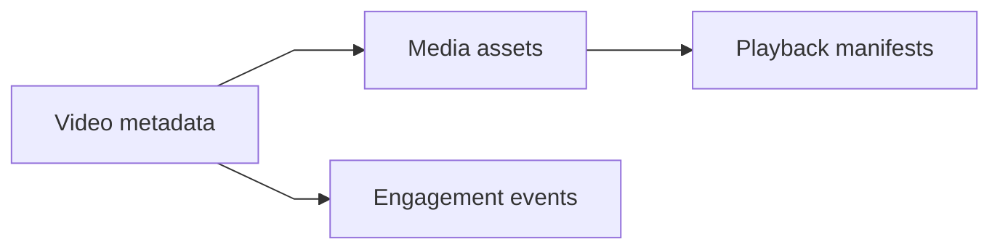
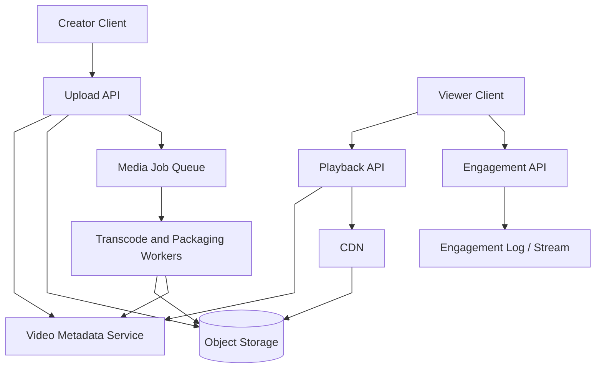
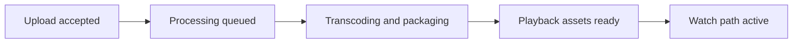
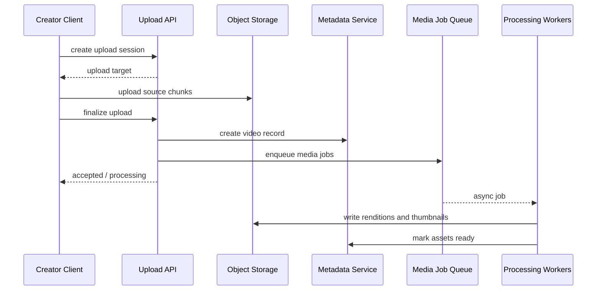
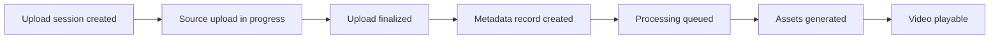
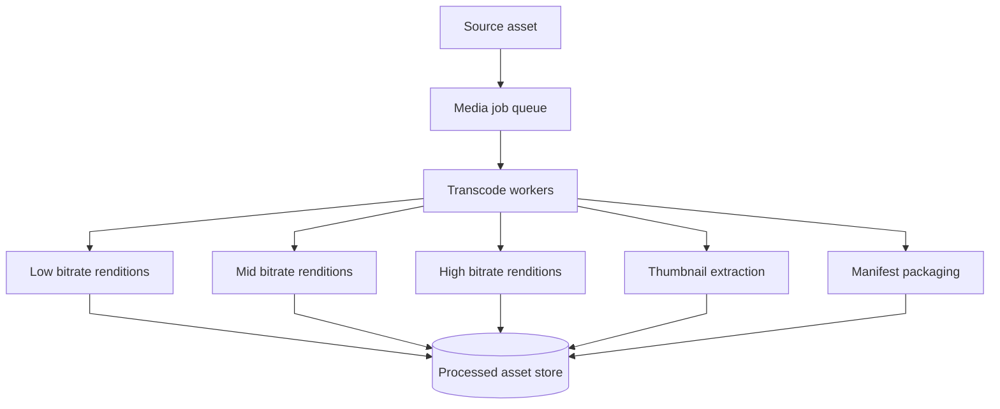
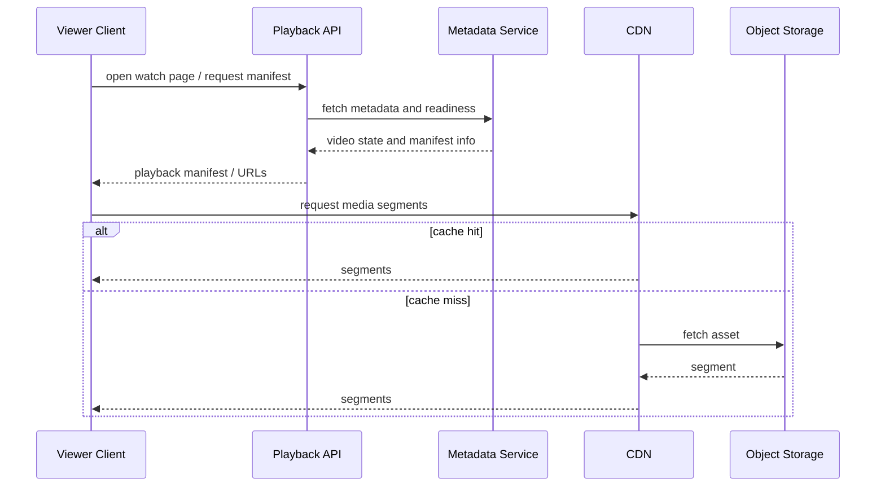
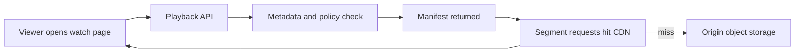
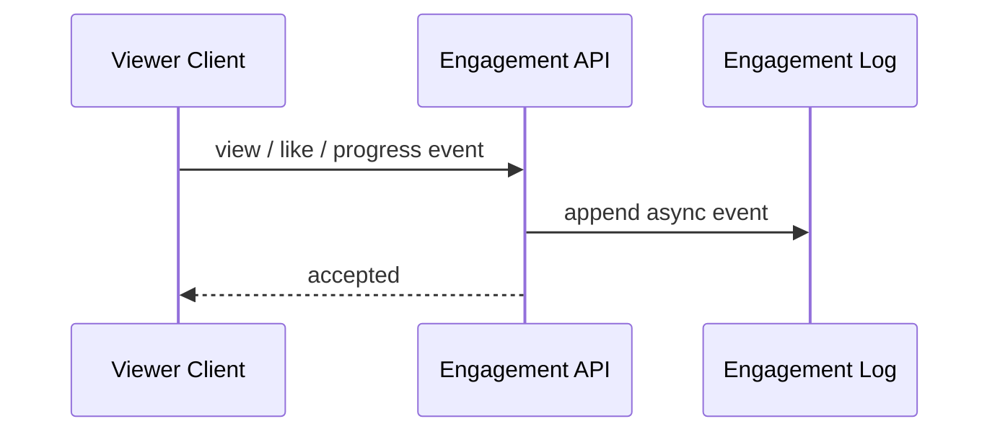
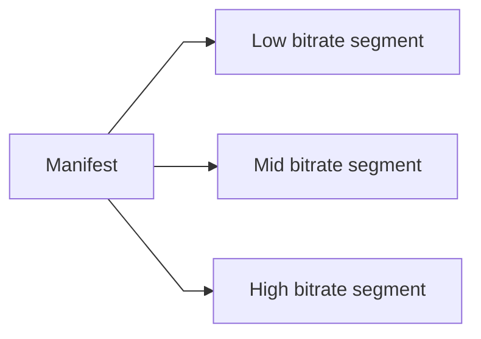

# Video Streaming Service

## 1. Problem Statement

Design a large-scale video streaming platform similar to YouTube.

The system should let creators:

- upload videos
- publish metadata such as title, description, tags, subtitles, and thumbnails
- manage visibility and lifecycle

And it should let viewers:

- open a watch page
- stream video smoothly on different devices and network conditions
- seek, pause, resume, and switch quality
- like, comment, and interact

At small scale, this can sound simple:

- upload a video file
- store it
- stream it later

At production scale, this is not one system.

It is several different pipelines coupled through metadata and media state.

Now the platform must handle:

- very large uploads
- resumable transfer
- transcoding into multiple formats and bitrates
- packaging for adaptive streaming
- hot-video global delivery
- metadata, search, and recommendation hooks
- moderation and policy gates

The hard part is not storing a blob.

The hard part is separating:

- upload durability
- processing completion
- playback readiness
- global read delivery

This is a strong case study because it forces tradeoffs across:

- synchronous product operations vs async media pipelines
- origin durability vs CDN delivery
- metadata consistency vs playback availability
- processing cost vs playback quality
- hot-content scale vs long-tail cost

## 2. Scope and Assumptions

In scope:

- upload ingestion
- metadata creation and update
- transcoding and packaging for adaptive streaming
- watch-page playback
- creator library management
- basic engagement such as views, likes, and comments

Out of scope for this version:

- recommendation model internals
- ads system
- livestreaming
- copyright fingerprinting implementation details
- search ranking internals

Assumptions:

- global read traffic dominates writes by a large margin
- uploads and processing can be asynchronous
- most videos are cold, but some become extremely hot
- playback should tolerate heterogeneous clients and network quality

## 3. Functional Requirements

The system must support:

- resumable upload
- durable source storage
- metadata creation and update
- transcoding to multiple renditions
- manifest generation for HLS or DASH
- watch-page playback
- creator-side delete, block, or visibility changes

Important secondary behaviors:

- subtitle and thumbnail support
- delayed publish until processing completes
- geo or policy restrictions
- reprocessing when codecs or packaging change

## 4. Non-Functional Requirements

The most important non-functional requirements are:

- low startup latency
- smooth playback with minimal buffering
- very high read scalability
- durable upload handling
- fault-tolerant processing
- cost-efficient long-tail storage
- clear metadata-to-playback state transitions

Consistency requirements are mixed.

The system should strongly preserve:

- accepted uploads
- creator ownership
- published video identity

The system can often allow eventual consistency for:

- views and analytics aggregates
- recommendation features
- delayed propagation of processed renditions to every region

The key architecture point is:

watch-path availability should not depend on synchronous completion of media processing or analytics work.

## 5. Capacity and Scale Estimation

Assume:

- 100 million daily active viewers
- 5 million daily active creators
- 2 million video uploads per day
- 2 billion video play starts per day

Average traffic:

- uploads: about 23 uploads/second
- play starts: about 23,000/second

Peak traffic is much more relevant.

Assume:

- 3x upload peak
- 10x playback peak for viral or event-driven traffic

Then:

- about 70 uploads/second peak
- more than 200,000 playback-related requests/second when manifests, segments, thumbnails, and page loads are counted

Storage assumptions:

- average source file: 500 MB
- processed renditions increase footprint substantially

If 2 million uploads/day average 500 MB source only:

- about 1 PB/day source ingest

That immediately implies:

- object storage as the primary media durability layer
- asynchronous processing
- lifecycle management for cold assets
- heavy CDN offload

## 6. Core Data Model

Main entities:

- `Video`
- `VideoAsset`
- `UploadSession`
- `TranscodeJob`
- `PlaybackManifest`
- `EngagementEvent`

### Video

Logical product-facing video object.

Fields:

- `video_id`
- `creator_id`
- title
- description
- tags
- visibility
- moderation state
- playback state
- created_at

### UploadSession

Tracks in-progress upload.

Fields:

- `upload_session_id`
- `creator_id`
- expected file metadata
- uploaded byte ranges
- state

### VideoAsset

Represents physical stored assets.

Fields:

- `video_id`
- asset type such as source, rendition, thumbnail, subtitle
- storage location
- codec
- bitrate
- resolution

### TranscodeJob

Represents asynchronous media work.

Fields:

- `job_id`
- `video_id`
- source asset reference
- job type
- state
- outputs

The key modeling distinction is:

- mutable product metadata
- large immutable media assets
- asynchronous processing state

Those should not share one storage model.

## 7. APIs or External Interfaces

### Create Upload Session

`POST /api/v1/videos/uploads`

Response:

- upload session ID
- chunk target or resumable upload target

### Finalize Upload

`POST /api/v1/videos/uploads/{session_id}/complete`

Response:

- `video_id`
- processing status

### Get Watch Metadata

`GET /api/v1/videos/{video_id}`

### Get Playback Manifest

`GET /api/v1/videos/{video_id}/manifest`

### Record Engagement

`POST /api/v1/videos/{video_id}/events`

## 8. High-Level Design

At a high level, the system can be divided into five concerns:

1. upload ingestion
2. metadata and publish state
3. asynchronous media processing
4. playback serving
5. async engagement and analytics

The high-level diagram should emphasize the critical production boundaries:

- upload API
- metadata service
- object storage
- media job queue
- processing workers
- playback API
- CDN

What to notice:

- upload acceptance and playback readiness are different states
- object storage is the durable home for source files and processed renditions
- playback should terminate mostly at the CDN, not at the origin
- metadata and playback control are separate from heavy transcode work
- engagement logging is asynchronous and must not block watch startup

The key architectural separation is this:

- offline media processing
- latency-sensitive playback serving

### Upload / Process / Watch Lifecycle

### Component Responsibilities

#### Upload API

Responsibilities:

- create resumable upload sessions
- validate creator permissions
- finalize upload
- enqueue downstream processing

#### Video Metadata Service

Responsibilities:

- store title, description, tags, visibility, and state
- track upload, processing, and publish lifecycle
- answer watch-page metadata queries

#### Object Storage

Responsibilities:

- durably store source media
- store transcoded renditions
- store thumbnails and subtitles

Typical ideal choice:

- object storage such as S3 or GCS

Why:

- cheap per byte relative to block databases
- high durability
- natural fit for immutable large objects

#### Media Job Queue

Responsibilities:

- buffer heavy processing jobs
- absorb bursts in upload completion
- provide retry and backpressure boundaries

#### Transcode and Packaging Workers

Responsibilities:

- transcode source media
- generate thumbnails
- package HLS or DASH manifests
- update readiness state

#### Playback API

Responsibilities:

- check video availability and policy
- serve watch metadata and manifest references
- decide which playback assets are eligible

#### CDN

Responsibilities:

- serve segments near viewers
- absorb hot-content bursts
- protect origin storage from read amplification

#### Engagement API and Log

Responsibilities:

- capture views, likes, watch progress, and related events
- decouple analytics from playback startup

## 9. Request Flows

### Upload and Publish Flow

### Upload State Progression

This state model matters because:

- upload accepted
- processing complete
- globally playable

are different realities.

### Media Processing Pipeline

### Watch Flow

### Watch Path Breakdown

### Engagement Flow

## 10. Deep Dive Areas

### Adaptive Bitrate Streaming

A production video platform should not serve one giant file for every client.

Instead it should:

- transcode multiple renditions
- split media into segments
- serve manifests that let the client adapt bitrate over time

Why this matters:

- startup latency improves
- buffering is reduced
- device compatibility improves

### Storage Choices

Different storage layers solve different problems.

#### Metadata Database

Ideal for:

- titles
- visibility
- publish state
- creator ownership

Good candidates:

- relational database
- document store with strong metadata semantics

This is not where large media blobs should live.

#### Object Storage

Ideal for:

- source video
- renditions
- thumbnails
- subtitle assets

Why:

- cheap durable storage for large immutable objects
- works naturally with CDN origin delivery

#### Cache and CDN

Ideal for:

- hot segment delivery
- shielding origin

The key point is:

- metadata, media assets, and hot delivery caching should not share one persistence model

### Edge Cases in Upload and Publish Semantics

This is where many designs stay too shallow.

Questions the system must answer:

- what if upload is complete but packaging fails
- what if only some renditions are ready
- is the video playable before every rendition exists
- what if moderation blocks a video after manifests were already generated
- what happens when the creator deletes a video while segments remain cached globally

A robust design must define:

- explicit state transitions
- invalidation behavior
- minimum ready criteria before publish

### Reprocessing and Codec Evolution

The platform will eventually need to:

- regenerate renditions
- add a new codec
- change packaging logic

That implies the source asset must remain durable long enough for:

- backfill
- re-encode
- thumbnail regeneration

This is one reason raw source retention decisions matter.

### Hot Video Behavior

Viral videos are not just more QPS.

They create:

- regional skew
- CDN burst pressure
- origin miss amplification if cacheability is poor

Mitigations:

- edge caching
- origin shielding
- cache-friendly segment naming
- prewarming or popularity-aware treatment

## 11. Bottlenecks and Failure Modes

### Processing Backlog

If uploads spike:

- videos remain stuck in processing

Mitigations:

- queue-based buffering
- autoscaling workers
- prioritization policies

### Origin Overload

If CDN miss rate spikes:

- object storage or origin gateway can become the bottleneck

Mitigations:

- strong cache headers
- origin shielding
- segment reuse

### Metadata and Asset State Drift

A video may be marked ready while assets are incomplete, or vice versa.

Mitigations:

- explicit readiness transitions
- idempotent worker updates
- asset existence verification before readiness flip

### Delete / Takedown Lag

A video may remain accessible briefly from caches after a takedown.

Mitigations:

- signed playback authorization when needed
- CDN invalidation
- short manifest TTL for restricted assets

## 12. Scaling Strategy

### Stage 1: Basic Upload and Playback

Start with:

- upload API
- metadata service
- object storage
- basic transcoding

### Stage 2: Async Media Processing and CDN

As volume grows:

- separate upload from processing
- queue heavy jobs
- serve playback via CDN

### Stage 3: Separate Watch Path and Engagement

As product complexity grows:

- split playback control from engagement and analytics
- protect startup latency

### Stage 4: Global Delivery and Lifecycle Cost Control

As the platform becomes global:

- regional playback APIs
- origin shielding
- cold asset lifecycle policies

## 13. Tradeoffs and Alternatives

### Direct File Serving vs Adaptive Streaming

Direct file serving is simpler.

Adaptive streaming is the correct production choice for heterogeneous clients and networks.

### Synchronous Processing vs Async Processing

Synchronous processing simplifies a toy system and destroys real upload latency.

Async processing is the right model for serious video platforms.

### One Store vs Metadata and Object Storage Split

One store for everything is conceptually simple and operationally wrong at scale.

## 14. Real-World Considerations

### Moderation and Policy

The platform must support:

- takedowns
- age restrictions
- regional blocks
- copyright response flows

### Observability

Important metrics:

- upload success rate
- processing lag
- playback startup latency
- rebuffer rate
- CDN hit ratio
- playback error rate

### Cost Control

The dominant costs are often:

- storage
- transcode compute
- CDN bandwidth

Lifecycle and caching strategy are first-class architecture concerns.

## 15. Summary

A video streaming platform is fundamentally a set of decoupled pipelines:

- upload ingest
- media processing
- metadata serving
- global playback delivery
- async engagement logging

The central architectural recommendation is:

- accept uploads durably
- process media asynchronously
- keep metadata and media storage separate
- serve playback through CDN-backed adaptive streaming
- keep analytics and engagement off the critical watch path

The key insight is that upload, processing, and playback are not one homogeneous service.

They are different systems with different latency, throughput, and storage requirements.
