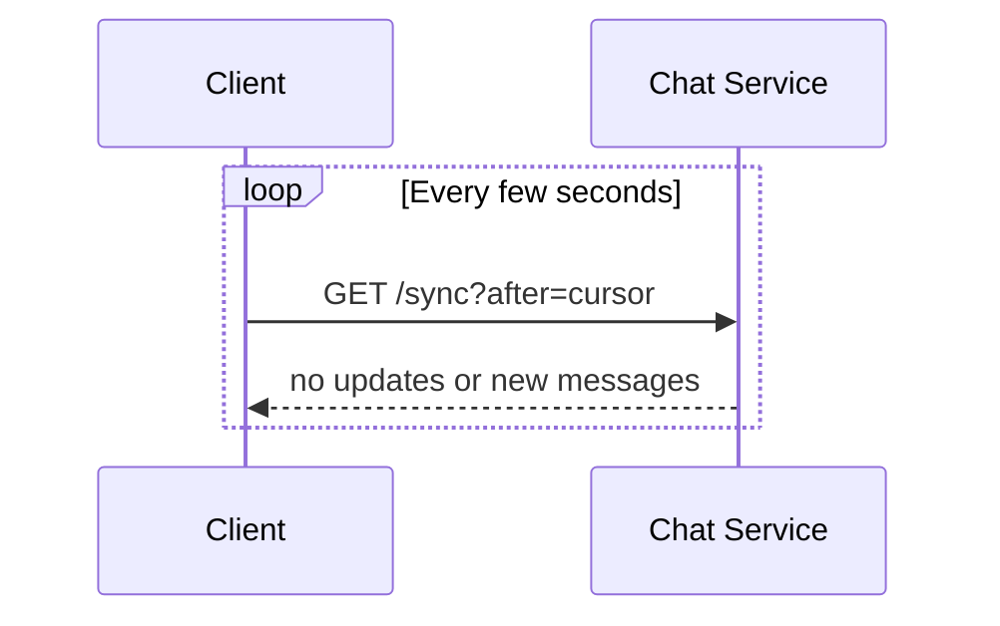
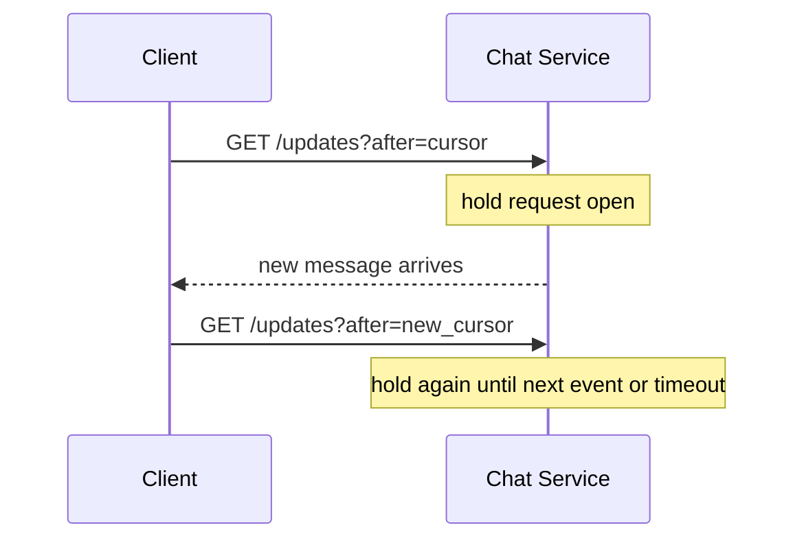
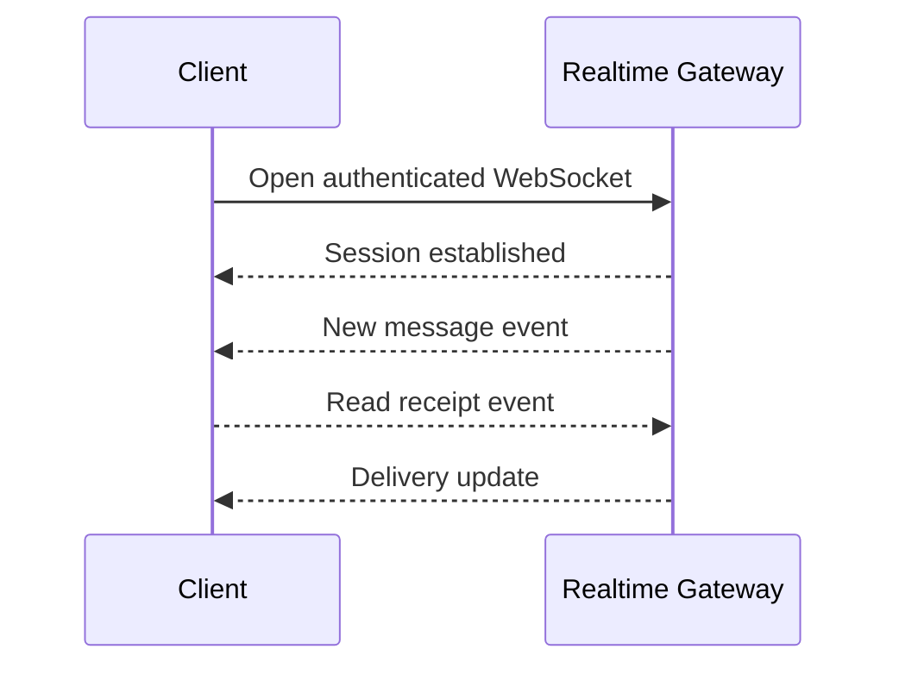
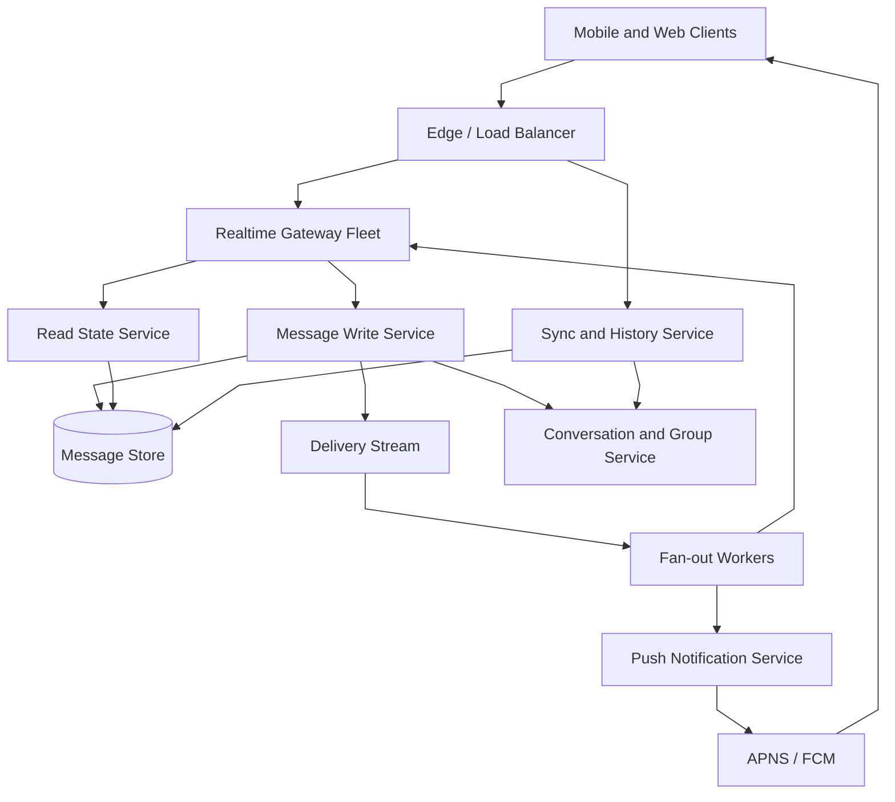
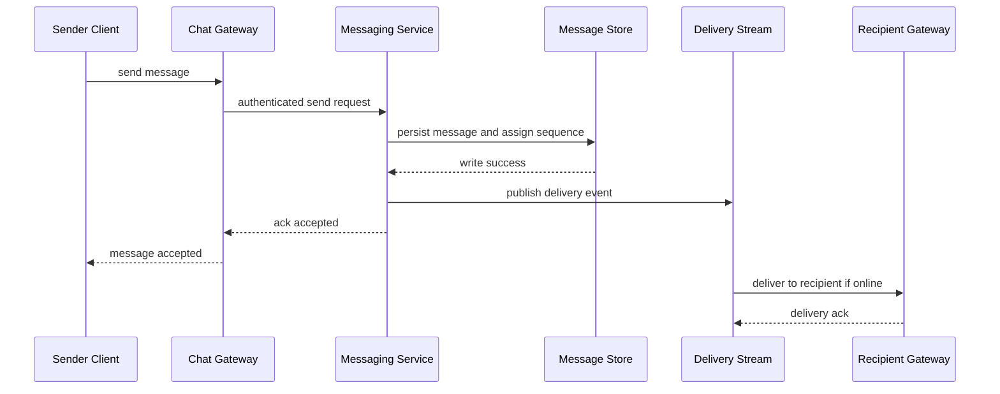
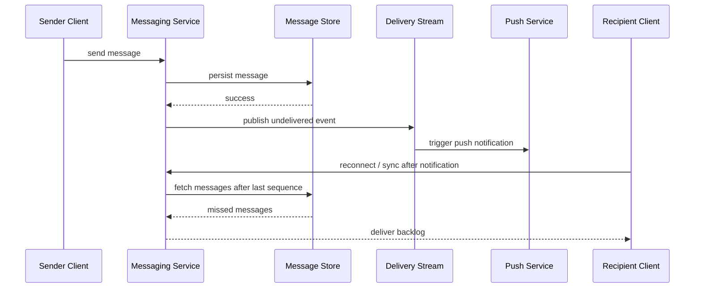
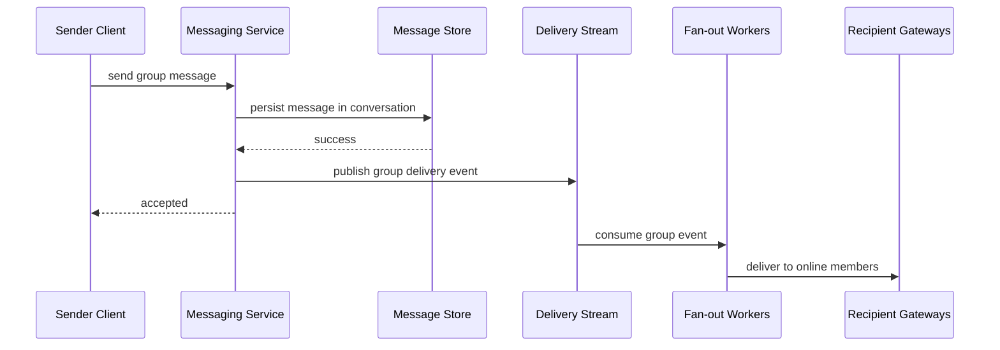
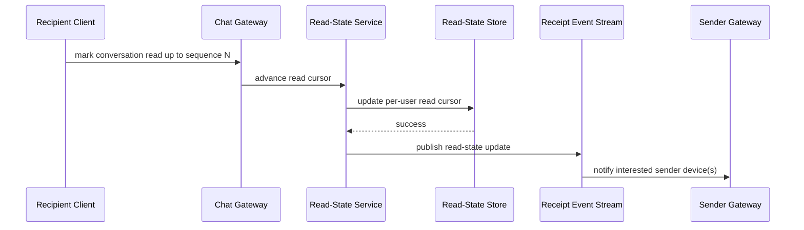

# WhatsApp Messenger

## 1. Problem Statement

Design a large-scale messaging application similar to WhatsApp, with primary focus on:

- one-to-one chat
- group chat
- message delivery states
- read receipts

At small scale, messaging looks deceptively simple:

- sender posts a message
- receiver gets a message
- UI shows the conversation

At large scale, the system becomes much more challenging because messaging combines several hard requirements at once:

- low-latency interactive delivery
- durability
- offline handling
- multi-device behavior
- ordering expectations
- massive fan-out for group chat
- privacy-sensitive metadata handling

The product expectations are also unusually strict.

Users expect:

- messages to appear quickly
- old messages to be available after reconnect
- read receipts to feel accurate enough
- group chats to behave sensibly even under high fan-out

This is why messaging systems are a strong system-design case study.

They force the architecture to handle both:

- real-time paths
- asynchronous recovery paths

without making the product feel inconsistent or fragile.

For this case study, the focus is intentionally not on voice/video calling or media pipelines. The focus is on the core messaging platform for:

- direct chats
- group chats
- read receipts

## 2. Scope and Assumptions

In scope:

- user-to-user text messaging
- group messaging
- message persistence
- delivery to online and offline users
- read receipts
- message ordering within a conversation
- basic sync across reconnects

Out of scope for this version:

- end-to-end encryption protocol details
- voice and video calling
- media upload and CDN pipelines
- ephemeral stories/status features
- advanced anti-spam models

Assumptions:

- most users are mobile users
- the system is internet-scale
- users may be online on multiple devices
- read receipts are important but do not need database-transaction-level global synchrony
- message history is durable

We will assume the design is for a mature production system, not an MVP.

## 3. Functional Requirements

The system must support:

- sending a direct message from one user to another
- receiving direct messages in order within a conversation
- creating a group
- sending messages to a group
- receiving group messages as group members
- showing message delivery state
- showing read receipts
- syncing missed messages when a user reconnects
- fetching conversation history

Secondary functional behaviors:

- group membership changes
- muted or archived conversations are out of scope at the core architecture level but would fit on top
- presence and typing indicators are optional and not central here

## 4. Non-Functional Requirements

Important non-functional requirements:

- low latency for live message delivery
- very high availability
- durable message storage
- conversation-level ordering that is good enough for user expectations
- scalability for hot groups
- tolerance of offline recipients
- efficient fan-out for group delivery
- secure handling of sensitive user communication metadata

Consistency expectations:

- sending a message should not require all recipients to be online
- message history should be durable once accepted
- read receipts can be eventually consistent but should converge quickly
- ordering should be preserved within a conversation as much as possible

The system should prefer:

- availability and durable queued delivery

over:

- strict global synchronization across all devices at send time

## 5. Capacity and Scale Estimation

Assume:

- 500 million daily active users
- 100 billion messages per day across all chats and groups

Average messages per second:

- about 1.16 million messages per second globally

Peak traffic may be 3x to 5x average depending on geography and time-of-day concentration.

Assume peak:

- 4 million to 5 million messages per second globally

Storage estimate:

Suppose average text message payload plus metadata is around 300 bytes to 1 KB depending on message metadata richness.

Using 500 bytes as a rough average:

- 100 billion messages/day -> about 50 TB/day raw logical data

This is before:

- replication
- indexing
- delivery state
- read receipt state

So this is clearly a system where:

- append-heavy storage
- sharding
- cold vs hot retention strategy

all matter.

Connection estimate:

Not every user is online simultaneously.

Assume:

- 50 million to 100 million concurrent connected users at high scale

This implies:

- a very large persistent-connection layer
- gateway fan-out and regional partitioning

Group chat scale:

Most groups are small.

Some groups can be large and hot.

The long tail matters because fan-out cost in group messaging is one of the main scaling pressures.

## 6. Core Data Model

The main entities:

- `User`
- `Conversation`
- `ConversationMember`
- `Message`
- `DeliveryState`
- `ReadState`
- `DeviceSession`

Useful modeling choice:

Treat direct chats and group chats under a shared conversation abstraction.

That means:

- direct chat = conversation with 2 members
- group chat = conversation with N members

Main fields:

### Conversation

- `conversation_id`
- `conversation_type` (`direct`, `group`)
- `created_at`
- group metadata if applicable

### ConversationMember

- `conversation_id`
- `user_id`
- membership role
- joined_at
- left_at if historical membership is retained

### Message

- `message_id`
- `conversation_id`
- `sender_id`
- `server_sequence` or conversation sequence
- `client_message_id` for dedupe
- payload
- created_at

### Delivery State

At minimum, some systems model:

- accepted by server
- delivered to recipient device(s)
- read by recipient(s)

For groups, delivery and read state may need aggregation semantics rather than one row per member on the hot path unless the product explicitly requires per-member receipts.

### Read State

Instead of storing a separate read receipt row for every message per user on the hot path, a common strategy is to store:

- per-user per-conversation read cursor

This is far more scalable than modeling every read as a fully independent record.

That design choice matters a lot and will be discussed in the deep dive.

## 7. APIs or External Interfaces

Core interfaces:

### Send Message

`POST /conversations/{conversation_id}/messages`

Input:

- sender auth
- message payload
- optional client-generated dedupe ID

Output:

- accepted message ID
- server timestamp
- initial delivery state

### Sync Messages

`GET /conversations/{conversation_id}/messages?after_sequence=X`

Used after reconnect or app resume.

### Create Group

`POST /groups`

Input:

- creator
- member list
- group metadata

### Update Read Cursor

`POST /conversations/{conversation_id}/read`

Input:

- last_seen_message_sequence or message ID

Output:

- acknowledgement that read state advanced

### Persistent Connection Channel

In practice, message delivery is usually driven over:

- WebSocket-like persistent connection
- or mobile push + sync fallback

The HTTP endpoints are useful to describe the contract, but the live system will often depend on a persistent session layer for real-time delivery.

#### Polling vs Long Polling vs WebSocket

These approaches are often grouped together, but they create very different system behavior.

#### Polling

In polling, the client asks the server on a schedule:

- "Do you have anything new?"

For example, every few seconds the client issues an HTTP request for updates.

Strengths:

- simple to implement
- easy to explain
- works in almost every environment

Costs:

- high request overhead
- worse battery behavior on mobile
- latency depends on poll interval
- most requests are wasted when no new event exists

Polling is usually acceptable for simple dashboards or low-frequency admin systems. It is a poor fit for high-scale realtime chat.

#### Long Polling

In long polling, the client sends a request and the server holds it open until:

- a new event arrives
- or the request times out

Then the client immediately opens another request.

Strengths:

- better latency than naive polling
- fewer empty responses than fixed-interval polling

Costs:

- still behaves like repeated HTTP request cycling
- still pays repeated request setup cost
- harder to run cleanly at massive concurrent connection counts
- still not a natural bidirectional session model

Long polling is often a transitional design when the system wants push-like behavior without a true persistent session layer.

#### WebSocket-Style Persistent Connection

With WebSocket-style transport, the client opens one authenticated long-lived connection and both sides can send frames over it.

Strengths:

- low overhead per event
- natural server push
- natural client-to-server event flow
- good fit for chat, read receipts, typing, and presence
- easier to associate connection state with a specific logged-in device session

Costs:

- requires a large persistent-connection tier
- needs heartbeat handling, reconnect handling, and session routing
- still requires a durable sync path after reconnect

#### Recommendation

For a WhatsApp-style system, WebSocket-style persistent sessions are the best fit for the live path.

Why:

- chat is fundamentally push-driven
- the server needs to push events as soon as they are available
- the client also needs to emit events such as acknowledgements and reads without paying full HTTP setup cost each time

That does not mean HTTP disappears.

A practical system uses:

- WebSocket-style sessions for realtime delivery
- HTTP or RPC sync APIs for reconnect and history catch-up
- push notifications when the app is backgrounded, disconnected, or the socket is unavailable

So the recommendation is not:

- "replace everything with WebSocket"

It is:

- use WebSocket for the hot realtime path
- use sync APIs for correctness and recovery
- use push notifications as a wake-up mechanism, not as the source of truth

## 8. High-Level Design

At a large scale, the system should separate:

- connection handling
- message ingestion
- message persistence
- fan-out and delivery
- read state updates

For interview discussion, the high-level diagram should stay focused on the primary end-to-end path:

- clients
- edge and load balancer layer
- realtime gateway fleet
- message write service
- message store
- conversation and group service
- delivery stream / queue
- fan-out workers
- read-state service
- sync service
- push notification service
- mobile push provider

What to notice:

- the realtime ingress path is different from the sync and history path
- connection handling, message writes, read updates, and offline recovery are not one service
- the sender write path ends after durable persistence and event publication, not after delivery to all recipients
- fan-out workers sit behind a durable stream because delivery is asynchronous and retriable
- push notifications are downstream of delivery logic, not the primary channel for message correctness

This diagram is intentionally simplified for system-design interviews.

It omits lower-level helpers such as:

- session directory
- token validation internals
- metadata caches

Those are real production components, but they are not the main architectural story.

At smaller scale, several of these responsibilities can live in one logical service. At large scale, separating them makes throughput shaping and operational isolation much easier.

### Why Separate Connection Gateways from Messaging Services

Persistent connection handling is a very different workload from message persistence and fan-out.

The gateway tier cares about:

- connection count
- heartbeats
- routing connected users to the right backend

The messaging service tier cares about:

- persistence
- dedupe
- sequence assignment
- conversation authorization

Keeping them separate helps because:

- connection load scales with online users
- write load scales with messages
- deploy risk is isolated
- the system can evolve fan-out logic without rebuilding the connection layer every time

### Service Responsibilities

The diagram is only useful if each component has a clear boundary.

#### Realtime Gateway Fleet

Responsibilities:

- terminate and maintain WebSocket-style sessions
- authenticate the device at connect time
- track heartbeats and connection liveness
- forward send-message and read-receipt commands to backend services
- deliver events to currently connected devices

This tier should be optimized for:

- very high concurrent connections
- low per-message overhead
- minimal business logic

It should not become the place where message durability decisions are made.

#### Session Directory

Responsibilities:

- map `user_id` or `device_id` to the currently connected gateway instance
- answer "is this user online on any active device?"
- help fan-out workers route delivery events to the right gateway

This lookup is often implemented through a session directory behind the scenes, even though the simplified HLD does not show that box explicitly.

#### Authentication and Token Validation

Responsibilities:

- validate access tokens or session credentials
- bind a connection to a user and device identity
- reject expired, revoked, or malformed sessions

At very large scale this may rely on:

- signed tokens validated locally
- plus occasional checks against revocation or device state

#### Conversation and Group Service

Responsibilities:

- validate that a conversation exists
- determine whether the sender is allowed to post in that conversation
- expose metadata such as conversation type and participant model
- answer which users should receive a group message at a given membership version

This service owns conversation-level rules and recipient resolution, not raw message persistence.

#### Message Write Service

Responsibilities:

- validate the send request
- dedupe client retries using client message IDs
- assign canonical server ordering within the conversation
- durably persist the message
- publish a delivery event after persistence succeeds

This is the core write authority for messages.

#### Message and Conversation Store

Responsibilities:

- persist canonical conversation history
- support sync reads by conversation and sequence
- store durable message records and receipt state

This is the source of truth.

Delivery queues and push systems help with timeliness, but this store defines correctness.

#### Delivery Stream

Responsibilities:

- buffer and durably hand off post-persistence delivery work
- decouple message acceptance from recipient delivery
- allow retries if downstream fan-out or notification work fails

This is one of the most important boundaries in the system because it protects the sender path from delivery fan-out cost.

#### Fan-out Worker Fleet

Responsibilities:

- consume delivery events from the stream
- resolve recipient targets for direct chats or groups
- check session directory to find online devices
- send realtime delivery requests to the right gateways
- fall back to push-notification workflow when the recipient is offline

This tier turns one canonical message write into many recipient-specific delivery actions.

#### Read State Service

Responsibilities:

- accept read-cursor advancement from clients
- persist the latest read position per conversation and user
- publish receipt update events so sender devices can update UI state

Read state is related to messaging, but it evolves independently enough that separating it is useful.

#### Sync and History Service

Responsibilities:

- return missed messages after reconnect
- paginate message history
- return updated receipt state and membership changes when needed

This service is critical because realtime sockets are an optimization for latency, not a replacement for durable sync.

#### Push Notification Service

Responsibilities:

- decide when a recipient should receive mobile push
- build provider-specific payloads
- send notifications to APNS, FCM, or equivalent providers
- enforce notification throttling and dedupe rules

It should not be treated as the storage of record for messages.

### How Fan-out Workers Work

Fan-out workers exist because the expensive part of messaging is usually not accepting one message from the sender.

The expensive part is:

- determining who should receive it
- routing it to all currently connected devices
- retrying when some of those devices are offline or temporarily unreachable

For a direct message, the worker typically does this:

1. consume delivery event for message `M`
2. resolve recipient user and active device sessions
3. check session directory for online gateways
4. send delivery commands to those gateways
5. if no live session exists, mark the message as pending offline delivery and trigger push workflow

For a group message, the worker usually does more:

1. consume one group delivery event
2. fetch or read cached membership snapshot
3. expand the message into recipient-specific delivery tasks
4. route online members through gateways
5. queue notification work for offline members

This is intentionally asynchronous because:

- large groups can create sudden delivery bursts
- downstream devices may be slow or offline
- send latency should not depend on completing every recipient delivery

### How Push Notification Service Works

Push notification is often misunderstood in chat systems.

The notification service is not the durable message transport.

Instead, it acts as a wake-up path when the recipient is not connected through the realtime channel.

Typical behavior:

1. fan-out worker determines the target device is offline or backgrounded
2. notification service builds a compact notification payload
3. it sends that payload to APNS, FCM, or the platform provider
4. the mobile OS wakes or alerts the app
5. the client reconnects or calls sync APIs
6. the actual message content is fetched from the message store

This design matters because push delivery is not guaranteed to be:

- immediate
- durable
- ordered
- complete

So push should be treated as:

- a best-effort signal to prompt reconnect or attention

not as:

- the canonical delivery pipeline

## 9. Request Flows

### Direct Message Send Flow

What to notice:

- durable persistence happens before the sender sees success
- fan-out is decoupled from message acceptance
- online delivery is fast but not required for send success

### Offline Recipient Flow

What to notice:

- offline delivery is durability plus later synchronization
- push notification is a hint, not the message transport of record
- sync is essential because push delivery is not a durable messaging layer

### Group Message Flow

What to notice:

- the sender path should not synchronously wait for delivery to every member
- group fan-out is one of the main scaling pressure points
- persistence and fan-out are intentionally separated

### Read Receipt Flow

What to notice:

- read receipts are best modeled as read cursor advancement, not one independent hot write per message
- sender UI updates can be event-driven
- durable read state and visible receipt propagation can be decoupled

## 10. Deep Dive Areas

### 10.1 Conversation Partitioning and Message Ordering

A messaging system needs some ordering guarantee or the product feels broken quickly.

The strongest useful guarantee is usually:

- preserve ordering within one conversation

Trying to preserve one global order across the whole system is unnecessary and expensive.

The most practical design is to shard by:

- `conversation_id`

That gives the system a clean unit for:

- sequencing
- storage placement
- read and sync access

If each conversation is routed consistently, then assigning a monotonically increasing server sequence within that conversation becomes straightforward.

Potential approaches:

#### Server-Assigned Per-Conversation Sequence

Each persisted message gets a sequence number inside the conversation.

Strengths:

- simple client sync semantics
- easy read-cursor model
- good fit for history retrieval

Costs:

- the write path for one conversation must serialize enough to maintain ordering

#### Client Timestamps

Use sender timestamps as message order.

Strengths:

- very simple conceptually

Costs:

- clocks are unreliable
- retries and reordering make this fragile

This is not sufficient as the canonical order.

**Recommendation**

I would use:

- `conversation_id` as the primary partition key
- server-assigned per-conversation sequence numbers as the canonical order

Why:

- direct chats and groups are naturally conversation-centric
- sync and read receipts become simpler
- user expectation is conversation order, not global order

For very large groups, hot-partition pressure still needs more thought, but this is the clean baseline model.

### 10.2 Message Persistence Model

The system must decide what "message sent successfully" means.

For a mature messaging system, the sender should not see success unless the message is durably persisted by the service.

That means the write path should be:

1. authenticate and authorize sender
2. persist message
3. acknowledge sender
4. asynchronously fan out to recipients

This is better than:

- accept in memory
- try delivery first
- persist later

because crashes would lose messages after the UI already showed success.

Storage considerations:

- append-heavy write path
- conversation-based retrieval
- long retention horizon

Potential storage layout:

- partition by conversation
- sort by conversation sequence
- separate conversation metadata from message body rows

**Recommendation**

I would treat persistence as the acceptance boundary:

- sender ack only after durable write

Why:

- it keeps the user model honest
- it simplifies reconnect sync
- it decouples delivery from correctness

### 10.3 Group Chat Fan-Out Strategy

Group chat is where messaging systems become much harder.

A direct message targets one receiver.

A group message may target:

- tens
- hundreds
- thousands

of members.

There are two broad strategies.

#### Fan-Out on Write

When a group message arrives, the system creates recipient-specific delivery work for group members immediately.

Strengths:

- faster per-recipient retrieval later
- easy push to online members

Costs:

- expensive write amplification
- very hot groups become painful

#### Fan-Out on Read

Persist one canonical group message and let recipients pull or sync from shared conversation history.

Strengths:

- write path stays lighter
- better for very large groups

Costs:

- recipient sync path does more work
- online push delivery still needs recipient targeting

In practice, mature systems often use a hybrid:

- one canonical stored message
- per-recipient delivery work only as needed for online sessions, push notifications, or unread state

**Recommendation**

For WhatsApp-style group chat, I would use:

- canonical message persisted once per conversation
- asynchronous fan-out for online delivery and notifications
- conversation history sync for durability and offline catch-up

Why:

- it avoids storing full message copies for every group member
- it keeps the source of truth clean
- it scales better for larger groups

### 10.4 Read Receipts Modeling

Read receipts can look simple in the UI:

- one check mark
- two check marks
- blue check marks

Internally, there are multiple possible models.

#### Per-Message Per-Recipient Read Rows

For every delivered message, store a read record when each recipient reads it.

Strengths:

- precise

Costs:

- huge write amplification
- especially bad in group chats

#### Per-Conversation Read Cursor

Store, for each user in a conversation:

- highest sequence number read

Strengths:

- compact
- easy to advance
- natural fit for conversation-ordered systems

Costs:

- UI derivation may need logic to map cursor position into message read states

For groups, product semantics matter:

- show read by everyone?
- show some members?
- show only aggregate state?

Those choices drastically affect storage cost.

**Recommendation**

I would model read receipts primarily as:

- per-user per-conversation read cursor

and derive UI receipt states from that.

Why:

- it scales much better
- it fits conversation-sequence ordering
- it makes "mark all up to here as read" a natural operation

For very detailed per-member group read views, I would expose them only if the product truly requires them, because they increase write and storage pressure significantly.

### 10.5 Multi-Device and Offline Sync

Messaging users expect reconnect and device continuity.

That means the system must not rely only on live push over sockets.

Each client should track:

- last synced sequence per conversation

and use sync APIs to fetch:

- missed messages
- updated receipt state

This is also why the system should maintain:

- durable canonical message history

instead of treating delivery queues as the source of truth.

**Recommendation**

I would treat:

- persistent history store
- plus last-seen per-device or per-user sync position

as the foundation of reconnect behavior.

Live sockets improve latency. They do not replace durable sync.

## 11. Bottlenecks and Failure Modes

### Hot Conversations

Some conversations or groups can become extremely hot.

This creates:

- partition hotspots
- fan-out pressure
- gateway delivery bursts

Mitigations:

- partition by conversation but monitor hot-key skew
- isolate very large groups if needed
- use asynchronous fan-out workers

### Gateway Connection Pressure

Persistent connection fleets can be stressed by:

- huge concurrent user counts
- reconnect storms after network outages
- heartbeats and session churn

Mitigations:

- regional connection sharding
- graceful reconnect backoff
- stateless gateways with external session mapping

### Delivery Backlog

If delivery workers or push integrations lag:

- online delivery gets delayed
- offline push may fall behind

Durable message storage keeps correctness intact, but user experience degrades.

### Duplicate Delivery

Retries or reconnect logic can cause duplicate message presentation if the client and server do not agree on idempotent message identity.

Mitigations:

- client-generated message IDs
- server dedupe on resend

### Read Receipt Lag

Receipts are secondary to message durability.

If receipt propagation lags:

- messages are still delivered
- UI state may look temporarily stale

This is acceptable if the system converges quickly and receipts do not block core messaging.

### Membership Churn in Groups

Group membership changes can race with fan-out.

Questions include:

- should a just-removed member receive messages already in flight
- how is group membership snapshotted for fan-out

This needs explicit semantics.

## 12. Scaling Strategy

### Stage 1: Single Region, Simple Chat Service

Start with:

- one messaging service
- one datastore
- one WebSocket gateway layer

This works at moderate scale and helps establish conversation and receipt semantics clearly.

### Stage 2: Separate Gateways, Messaging Core, and Async Fan-Out

As traffic grows:

- split connection handling from persistence
- move delivery to queues and workers
- add dedicated read-state handling

This is usually the first major architectural step.

### Stage 3: Conversation Sharding

Shard message storage by conversation ID.

This gives a scalable routing and retrieval model for most chat workloads.

### Stage 4: Regionalization

As users become global:

- route clients to nearby gateway regions
- keep messaging storage sharded regionally or globally depending product semantics
- replicate enough metadata for routing and continuity

### Stage 5: Large Group Optimizations

If very large groups become important:

- treat large groups as special fan-out workloads
- optimize push and sync behavior separately
- consider specialized pipelines for group delivery rather than treating them like normal 1:1 chats

## 13. Tradeoffs and Alternatives

### Strong Ordering vs Availability

Stronger per-conversation ordering is valuable.

Global ordering is unnecessary and too expensive.

### Write-Time Fan-Out vs Read-Time Reconstruction

Write-time fan-out improves live delivery convenience but increases write amplification.

Canonical store plus async fan-out is usually the more scalable balance.

### Per-Message Read Records vs Read Cursor

Per-message receipts are precise and expensive.

Read cursors are compact and practical.

For large-scale messaging, cursors are usually the better default.

### One Service vs Several Services

A smaller system can combine:

- gateway
- persistence
- fan-out

At large scale, separating them helps with:

- connection scaling
- deployment safety
- queue-based decoupling

## 14. Real-World Considerations

### Abuse and Spam

Messaging systems need controls for:

- spam bursts
- bot behavior
- invite abuse
- large-group abuse

### Privacy and Security

Even without going deep into encryption design, the system must treat messaging metadata carefully:

- who talks to whom
- when messages are read
- device and session information

### Observability

Important metrics:

- send latency
- durable write latency
- fan-out lag
- offline sync latency
- push notification success
- read receipt lag
- reconnect storm impact

### Product Semantics

Messaging systems are highly sensitive to user-visible semantics.

The system must define:

- what "sent" means
- what "delivered" means
- what "read" means
- what happens if a user has multiple devices

If these are vague internally, the product experience becomes inconsistent.

## 15. Summary

A WhatsApp-style messenger is fundamentally a conversation-centric distributed system with two dominant pressures:

- low-latency live delivery
- durable asynchronous recovery

The architecture should therefore center around:

- persistent connection gateways
- durable message persistence before sender acknowledgment
- conversation-based partitioning
- asynchronous fan-out
- compact read-state modeling through read cursors

The hardest parts are not only sending a message.

They are:

- scaling group delivery
- preserving ordering where it matters
- syncing offline users
- modeling read receipts efficiently

That is why a good messaging design is less about one "chat service" box and more about explicitly separating:

- connection handling
- persistence
- fan-out
- read-state propagation

while keeping the user experience coherent.
