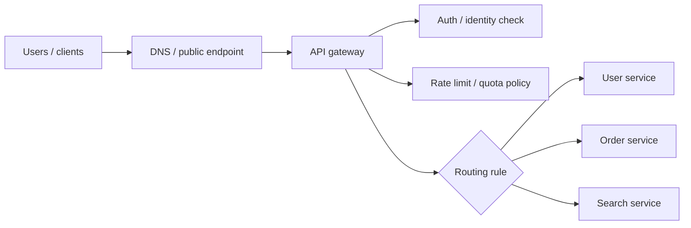

# API Gateways

## 1. Overview

An API gateway is a control layer at the edge of a system that accepts incoming client traffic, applies shared policy, routes requests to the right backend, and returns a response through a stable client-facing contract.

At a superficial level, that sounds like "one URL in front of many services." That description is incomplete.

A gateway is not valuable because it exists in front of services. It is valuable because it centralizes edge concerns that would otherwise be duplicated, drift out of sync, or leak internal topology into clients.

In practice, an API gateway often becomes responsible for some combination of:

- request routing
- authentication and coarse authorization checks
- rate limiting and quotas
- request and response transformation
- TLS termination
- API version handling
- observability at the ingress boundary
- traffic shaping and protection against abusive clients

That combination makes the gateway one of the most visible parts of a production system. It is also one of the easiest places to make a mess.

When designed well, a gateway simplifies clients, protects backend services, and gives the platform a clean policy enforcement point. When designed poorly, it becomes a brittle monolith at the edge that hides bad service boundaries, accumulates business logic, and becomes a bottleneck for every team.

## 2. The Core Problem

As systems grow, they tend to accumulate multiple clients and multiple backend services.

The clients may include:

- browser applications
- mobile applications
- third-party partners
- internal tools
- machine-to-machine callers

The backend may include:

- user service
- catalog service
- order service
- payment service
- search service
- recommendation service

Without a gateway, clients often need to know too much:

- which service owns which capability
- how to authenticate to each service
- which hostname or path maps to which backend
- which requests are rate-limited differently
- how to handle inconsistent error formats
- which versioning rules apply to which surface

At the same time, every backend team starts re-implementing similar concerns:

- token validation
- quotas
- request logging
- CORS handling
- threat filtering
- client-specific shaping

This produces two forms of complexity at once.

The first is client complexity. The second is platform inconsistency.

The gateway exists because many systems need a stable, policy-aware ingress surface that separates client-facing contracts from internal service topology.

The key word there is "many," not "all."

Some systems are small enough that direct service exposure is simpler. Some systems are so specialized that multiple dedicated gateways or backend-for-frontend layers are better than one shared global edge. The gateway is a tool for managing edge complexity, not a mandatory architectural badge.

## 3. Visual Model

What to notice:

- the gateway is not just forwarding packets; it is applying edge policy before backend execution
- clients interact with one controlled entry point instead of the raw internal service map
- the gateway's job is partly traffic mediation and partly contract management

## 4. Formal Statement

An API gateway is a request mediation layer that exposes a unified or controlled ingress surface to clients while applying routing, security, policy, protocol, and operational controls before forwarding traffic to backend services.

A real gateway design has to define at least the following:

- how requests are identified and routed
- which policies are enforced at the edge
- what the gateway knows about client identity
- what the gateway must not know about domain-specific business decisions
- how failures are surfaced when the gateway itself, or the services behind it, degrade
- whether the gateway only forwards traffic or also aggregates responses

The important distinction is this:

The gateway is an infrastructure and platform boundary, not the owner of core domain behavior.

That distinction sounds obvious until systems start putting too much product logic into the edge because it feels convenient.

## 5. Key Terms

### 5.1 Edge Routing

Edge routing is the decision process by which an incoming request is mapped to a backend service or backend route.

The route may depend on:

- host
- path
- method
- version
- headers
- tenant
- region

### 5.2 Policy Enforcement

Policy enforcement means the gateway applies rules before the request reaches application services.

Examples:

- rejecting missing or invalid tokens
- applying tenant or partner quotas
- blocking oversized payloads
- enforcing allowed methods

### 5.3 Protocol Translation

Protocol translation means the gateway accepts traffic in one client-facing form and forwards it in another backend-facing form.

Examples:

- REST externally, gRPC internally
- HTTP/1.1 from clients, HTTP/2 to services
- WebSocket termination with internal event forwarding

### 5.4 Aggregation

Aggregation means the gateway calls multiple backend services and combines the result into one response.

This is useful in some cases, but it also increases coupling and failure sensitivity.

### 5.5 Backend-for-Frontend

A backend-for-frontend, often abbreviated BFF, is a gateway layer specialized for one client type such as mobile or web.

This exists because different clients often need different response shapes, pagination behavior, or orchestration logic.

### 5.6 Edge Auth vs Service Authorization

Gateways often handle authentication and coarse policy checks at the edge.

That is not the same as full business authorization inside services.

The gateway may verify that a token is valid and that a caller can access an API family, while the backend still decides whether that caller can access a particular resource or perform a particular action.

## 6. Why the Constraint Exists

A gateway is usually introduced because direct client-to-service interaction stopped being manageable.

Consider a consumer product with web and mobile clients.

Those clients need:

- login
- user profile data
- product listings
- search
- cart operations
- order history
- recommendations

Without a gateway, the clients may call many separate services directly.

That creates several problems:

1. Every client needs embedded knowledge of backend topology.
2. Every service becomes internet-facing or at least client-facing.
3. Auth and quota logic get duplicated across many services.
4. Error handling becomes inconsistent.
5. Internal service refactors become much harder because clients are coupled to the old shape.

Now add another dimension: partners.

External integrators often need:

- a stable versioned contract
- predictable rate limits
- signed or token-based auth
- auditability
- non-breaking rollout behavior

That pressure pushes systems toward a more deliberate edge boundary.

The gateway exists because internal service decomposition and external API stability are usually different problems. Clients want a stable product-facing interface. Internal platforms want freedom to evolve service topology. The gateway is one way to decouple those pressures.

But the constraint exists in the other direction too:

Once the gateway becomes the edge contract, it also becomes a critical dependency. Every request flows through it. Every policy bug affects many services. Every performance problem there amplifies across the platform.

So the gateway solves coordination problems at the edge by introducing a new coordination point in the architecture.

## 7. Main Variants or Modes

### 7.1 Single Shared Edge Gateway

This is the most common first model.

One gateway tier serves as the main ingress point for many clients and routes to multiple services.

Strengths:

- one policy surface
- consistent auth and quota handling
- simpler platform entry point

Costs:

- easy to overload with too many responsibilities
- one gateway team can become a bottleneck
- failure blast radius can become large

### 7.2 Backend-for-Frontend

A BFF layer exists when different client types need different contracts or orchestration logic.

For example:

- web may prefer larger denormalized responses
- mobile may prefer smaller payloads and client-specific shaping
- partner APIs may require stricter stability than internal clients

Strengths:

- client-specific optimization
- less one-size-fits-all API design
- clearer ownership by consumer surface

Costs:

- more layers to operate
- potential duplication across BFFs
- risk of fragmented policy if shared concerns are not centralized properly

### 7.3 Internal Platform Gateway

Not every gateway is internet-facing.

Some organizations place gateways in front of internal platform APIs so internal teams consume:

- identity APIs
- billing APIs
- deployment APIs
- metadata APIs

through a unified internal platform surface.

Strengths:

- consistent internal API consumption
- centralized internal auth and audit policy
- easier service discovery for teams

Costs:

- can hide poor service boundaries
- may become too generic if not scoped carefully

### 7.4 Gateway with Aggregation

Some gateways only route. Others orchestrate several backend calls and combine results.

This is common when the client wants one page-level response assembled from many services.

Strengths:

- fewer round trips from client
- better control over payload shape
- easier product-specific response contracts

Costs:

- higher gateway latency
- fan-out failure complexity
- potential duplication of business orchestration logic

Aggregation is one of the clearest places where teams need discipline. Light response shaping is often reasonable. Deep domain orchestration at the gateway usually means the gateway is becoming application logic.

### 7.5 Protocol Gateway

Some gateways are adopted mainly to shield clients from protocol diversity.

Examples:

- REST at the edge with gRPC internally
- GraphQL at the edge over many internal services
- TLS termination with internal service mesh routing

This is useful when backend protocols are optimized for internal efficiency while external clients need a simpler standard contract.

## 8. Supporting Mechanisms and Related Ideas

API gateways do not operate in isolation. They are usually effective only when tied to a broader platform model.

### 8.1 Service Discovery

The gateway needs a reliable way to find healthy backends.

Static routing can work early on, but dynamic systems usually require service discovery or a load-balancing layer that keeps backend membership current.

### 8.2 Rate Limiting and Quotas

One of the most practical gateway responsibilities is protecting backend capacity from abusive or accidental overload.

This can happen by:

- per-IP rate limits
- per-token quotas
- per-tenant budgets
- differentiated limits for free vs paid plans

### 8.3 Authentication and Identity

Gateways often terminate the first layer of trust by validating:

- JWTs
- OAuth tokens
- session cookies
- API keys
- mTLS identity

But the gateway is rarely the whole security model. Services still need authorization logic aligned with business resources.

### 8.4 Observability

Gateways are one of the best places to capture:

- request volume
- latency percentiles
- auth failures
- quota rejections
- route-level health
- client segmentation

This makes the gateway a valuable operational boundary because it sees traffic before backend behavior fragments into many services.

### 8.5 Caching

Some gateways also cache:

- static responses
- metadata
- safe idempotent GET responses

This can reduce latency and backend load, but it also adds cache invalidation and freshness semantics to the edge.

### 8.6 Circuit Breaking and Retry Policy

Gateways often sit at a place where backend instability becomes visible.

They may apply:

- timeout budgets
- circuit breakers
- bounded retries
- degraded fallback responses

These policies matter because otherwise the edge can amplify backend failure instead of containing it.

## 9. Real-World Examples

### Mobile and Web Product APIs

Consumer products often do not want mobile apps to know about dozens of internal services.

The gateway provides:

- one entry point
- stable auth behavior
- consistent error formats
- client-oriented payload shaping

That allows backend services to evolve more independently while client contracts remain relatively stable.

### Partner and Public APIs

Public APIs typically need stronger guarantees than internal service interfaces.

They often require:

- explicit versioning
- stricter backward compatibility
- request signing or token validation
- usage quotas
- audit trails

A gateway is a natural place to enforce those concerns consistently without pushing public-API-specific behavior into every internal service.

### Internal Platform APIs

Large organizations often build internal platforms for:

- identity
- secrets
- provisioning
- service metadata
- billing

Instead of every team memorizing service locations and policy differences, a gateway can present a unified internal platform surface.

This is especially useful when internal platform usage needs:

- central auth
- audit logging
- traffic shaping
- route discoverability

### Multi-Tenant SaaS

A multi-tenant SaaS product often needs tenant-aware controls at the edge:

- tenant-specific quotas
- partner allowlists
- region-aware routing
- request tagging for billing or analytics

A gateway can apply those coarse policies early, before requests consume deeper backend resources.

### API Monetization

If an organization sells or meters API usage, the gateway often becomes part of the business infrastructure:

- enforce plans
- meter requests
- protect premium operations
- apply per-customer budgets

That is a case where edge policy is not just operational. It directly supports the product model.

## 10. Common Misconceptions

### "Every Microservice System Needs a Gateway"

Wrong.

Small systems often do better with simpler ingress and direct service exposure behind a load balancer. A gateway becomes justified when policy duplication, client complexity, or contract management problems are real enough to outweigh the extra layer.

### "The Gateway Should Own All Authorization"

Wrong.

The gateway can often perform:

- authentication
- coarse route-level authorization
- plan enforcement

But fine-grained authorization usually belongs in the domain service that actually understands the resource and business rules.

If the gateway tries to own every access rule, it becomes a policy brain without the right business context.

### "Putting Logic in the Gateway Keeps Services Thin"

Usually this is a warning sign.

Cross-cutting concerns belong at the gateway.

Examples:

- routing
- auth validation
- quotas
- schema shaping
- request normalization

But product logic such as:

- cart rules
- discount eligibility
- refund policy
- order state transitions

usually belongs in domain services.

When that logic moves into the gateway, teams often get a distributed monolith with an especially dangerous center of gravity.

### "A Gateway Solves Service Discovery, Security, and Versioning Automatically"

Wrong.

It provides a place to implement these concerns. It does not eliminate the need to design them well.

### "One Gateway Means Simplicity"

Not always.

One global gateway can become organizationally simpler at first and architecturally worse later if every use case is forced through the same abstraction. Sometimes separate BFFs or multiple bounded gateways are the cleaner design.

### "Gateways Only Matter for External APIs"

Wrong.

Internal platform APIs and service platforms often benefit from gateway patterns too, especially when identity, policy, and discoverability matter.

## 11. Design Guidance

The right question is not "Should we use an API gateway?"

The right question is:

Which edge concerns are worth centralizing, and which responsibilities should stay with the owning services?

That question forces a better design discussion.

### Use a Gateway When

- many clients need a stable front door
- shared auth and quota policies are becoming repetitive
- backend topology changes too often to expose directly
- partner or public APIs need stronger contract control
- traffic needs centralized observability and protection

### Be Careful When

- the team is using the gateway to hide poor service boundaries
- too much response orchestration is moving into the edge
- the gateway team is becoming a release bottleneck
- every change requires central routing or policy edits
- latency is dominated by gateway fan-out and aggregation

### Keep in the Gateway

- TLS termination
- request authentication
- coarse route authorization
- quotas and budgets
- request normalization
- version dispatch
- edge observability
- traffic protection

### Usually Keep Out of the Gateway

- domain-specific business rules
- stateful workflow coordination
- resource-level authorization decisions
- ownership of core data semantics

### Operational Questions Worth Asking

- what is the gateway's latency budget
- what happens when one route becomes hot
- how are bad configs rolled back
- can route or policy changes be deployed safely
- how is the gateway scaled independently of backend services
- what is the blast radius of an edge misconfiguration

### A Useful Design Heuristic

If removing the gateway would force every service to duplicate cross-cutting edge behavior, the gateway is probably earning its keep.

If removing the gateway would mostly move product-specific orchestration back to the services that already own that logic, the gateway may be doing too much.

## 12. Reusable Takeaways

- API gateways are edge control layers, not domain brains.
- Their main value is centralizing shared client-facing concerns without exposing internal topology.
- Authentication at the gateway does not replace fine-grained authorization in backend services.
- Aggregation is useful, but heavy orchestration at the edge is often a design smell.
- A gateway simplifies clients while creating a critical dependency that must be highly reliable and observable.
- The best gateway designs are opinionated about what belongs there and what does not.
- One gateway for everything is not always simpler than several bounded entry layers.
- Gateway adoption should be justified by real edge complexity, not by fashion.

## 13. Summary

An API gateway gives a system a controlled ingress layer where routing, security, quotas, and other edge concerns can be managed consistently.

That is the upside: simpler clients, stronger policy control, and a cleaner separation between external contracts and internal service topology.

The tradeoff is that the gateway itself becomes a critical piece of platform infrastructure. If it stays focused on edge concerns, it is a major asset. If it accumulates product logic and orchestration, it becomes a fragile monolith in front of everything else.
