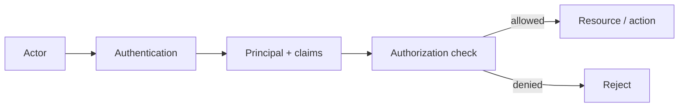

# Authentication vs Authorization

## 1. Overview

Authentication and authorization are closely related concepts that solve different problems.

Authentication answers:

Who is this actor?

Authorization answers:

What is this actor allowed to do?

Many systems speak about them in the same breath, and many production incidents come from treating them as if they were interchangeable.

That confusion is dangerous because these controls fail in different ways.

A system can:

- authenticate a user correctly and still expose another tenant's data
- authenticate a service correctly and still let it call the wrong backend
- authenticate an admin correctly and still grant broader privileges than intended

So this topic is not about terminology hygiene.

It is about separating two fundamentally different trust decisions:

- identity proof
- permission evaluation

That distinction becomes even more important in distributed systems because requests may pass through:

- gateways
- BFFs
- internal services
- background workers
- control planes

Each hop may rely on identity and permission information differently.

Good systems model that difference explicitly. Weak systems blur it until access control becomes hard to reason about.

## 2. The Core Problem

A distributed system has many kinds of actors:

- end users
- service accounts
- operators
- third-party clients
- background jobs

Each actor can be validly identified and still require very different permissions.

Examples:

- a logged-in user may read only their own tenant's records
- a support operator may view billing metadata but not raw secrets
- a payment service may call billing APIs but not admin APIs
- a batch job may write reports but not alter account configuration

If the system collapses authentication and authorization into one loose idea of "trusted caller," it will usually over-grant access somewhere.

This happens because identity says nothing by itself about:

- tenant ownership
- resource ownership
- action scope
- environment restrictions
- privilege level

The real problem is:

How does a system carry verified identity and then turn that identity into safe, context-aware permission decisions across many services and resources?

That is the heart of access control design.

## 3. Visual Model

What to notice:

- authentication produces an identity context, not an automatic grant of access
- authorization depends on both the actor and the requested action or resource
- a valid principal can still be denied safely

## 4. Formal Statement

Authentication is the process of verifying the identity of an actor through credentials or proof of possession.

Authorization is the process of evaluating whether that authenticated actor may perform a specific action on a specific resource under current policy.

A serious access-control design must define:

- identity proof mechanisms
- how identity is represented after authentication
- which claims or attributes are propagated downstream
- where authorization is enforced
- how permission models are expressed and audited

The design implication is important:

Authentication usually happens first in time.

Authorization usually happens many times afterward across different scopes.

## 5. Key Terms

### 5.1 Principal

The principal is the authenticated identity that the system recognizes.

Examples:

- user ID
- service identity
- operator identity

### 5.2 Credential

A credential is the proof used for authentication.

Examples:

- password
- OAuth token
- API key
- client certificate
- workload identity token

### 5.3 Claim

A claim is a piece of identity-related information carried after authentication.

Examples:

- subject ID
- tenant ID
- role
- issuer
- token expiry

Claims can inform authorization, but claims alone are not authorization policy.

### 5.4 Scope

A scope is a bounded statement of permitted action, often coarse-grained.

Examples:

- `read:orders`
- `write:billing`

### 5.5 Role

A role is a named collection of permissions.

Examples:

- admin
- support
- billing-reader

Roles simplify management, but they are not always sufficient for fine-grained decisions.

### 5.6 Policy Decision Point

The component or service that evaluates whether access should be allowed.

### 5.7 Policy Enforcement Point

The place where the allow or deny decision is actually applied.

In real systems, these may be separated.

## 6. Why the Constraint Exists

Knowing who called is necessary and insufficient.

Suppose a user is correctly authenticated as `user-123`.

That still does not tell the system:

- which tenant they belong to
- whether they can edit billing details
- whether they can access another tenant's order history
- whether they are allowed to export sensitive data

Now consider service-to-service traffic.

Suppose an internal reporting service is properly authenticated.

That still does not imply it should be allowed to:

- charge cards
- rotate secrets
- read admin audit logs

The distinction exists because identity and permission are different categories of truth.

Identity is about proof.

Authorization is about policy.

In distributed systems, the gap between those two becomes larger because one authenticated request may fan out across several services, and each downstream service may need to decide:

- whether to trust upstream claims
- whether to re-check policy
- whether to apply resource-specific rules locally

This is why access control design cannot stop after issuing a valid token.

## 7. Main Variants or Modes

### 7.1 User Authentication

This is the classic case:

- passwords
- SSO
- MFA
- federated login

Strengths:

- establishes user identity for product access

Costs:

- session lifecycle
- phishing resistance
- device and browser behavior

### 7.2 Service Authentication

Services also need identities.

Common mechanisms include:

- mTLS
- signed service tokens
- workload identity

Strengths:

- enables service-to-service trust
- improves auditability of machine actors

Costs:

- credential distribution and rotation complexity

### 7.3 Role-Based Authorization

Permissions are grouped into roles.

Strengths:

- easy to understand
- easy to administer at moderate scale

Costs:

- role explosion
- often too coarse for tenant- or resource-level decisions

### 7.4 Attribute-Based Authorization

Access decisions depend on attributes such as:

- tenant
- resource owner
- environment
- action type
- data sensitivity

Strengths:

- more expressive
- fits multi-tenant and resource-centric systems well

Costs:

- more complex policy evaluation
- harder debugging if poorly instrumented

### 7.5 Centralized vs Distributed Authorization

Some systems centralize most authorization decisions.

Others let domain services enforce their own resource-level rules.

Centralization improves consistency.

Local enforcement improves domain accuracy.

Strong systems usually combine both:

- coarse authorization at shared layers
- resource-specific authorization in owning services

## 8. Supporting Mechanisms and Related Ideas

### 8.1 Sessions and Tokens

Authentication usually produces a session or token that carries identity forward across requests.

This is where many teams accidentally over-encode permission assumptions into tokens without designing revocation or freshness well.

### 8.2 API Gateways

Gateways commonly perform:

- authentication
- coarse access validation
- plan or quota enforcement

But gateways rarely have enough business context for every fine-grained resource authorization decision.

### 8.3 Audit Logging

Access control without auditability is difficult to operate.

You need to know:

- which principal accessed which resource
- which permission change happened
- who granted elevated roles

### 8.4 Multi-Tenancy

Multi-tenant systems make authorization much more important because valid authentication does not prevent cross-tenant access by itself.

### 8.5 Least Privilege

Least privilege is where authorization becomes practical architecture instead of abstract security advice.

It forces the system to ask what each actor truly needs.

## 9. Real-World Examples

### SaaS Tenant Access

A user logs in successfully.

Authentication proves who they are.

Authorization must still verify:

- which tenant they belong to
- what role they hold within that tenant
- whether the requested resource belongs to that tenant

This is one of the clearest examples of why valid login is not sufficient for safe access.

### Service-to-Service Billing Calls

An internal service may authenticate with a valid workload identity.

That still should not grant broad access to all finance or admin APIs.

Instead, the service should receive narrowly scoped authorization to only the endpoints it actually needs.

### Admin Interfaces

Operators may authenticate through SSO and MFA.

That is only the first step.

Authorization should then distinguish between:

- read-only support tasks
- account management actions
- destructive infrastructure actions

The consequences of getting this wrong are much larger than in ordinary product flows.

### Background Jobs

A nightly worker may authenticate as a trusted internal job identity.

It should still be authorized only for:

- the dataset it processes
- the write path it owns
- the environment it is allowed to operate in

Machine actors need authorization as much as human actors do.

## 10. Common Misconceptions

### "If the User Logged In, They Are Authorized"

Wrong.

Login proves identity. It does not prove entitlement to every action or resource.

### "Authorization Is Just Roles"

Roles are useful, but many real decisions also depend on:

- tenant
- resource ownership
- action type
- environment
- sensitivity level

### "Internal Services Do Not Need Authorization"

Wrong.

Service authentication without scoped authorization creates broad implicit trust and large blast radius.

### "Putting Claims in a Token Solves Authorization"

Not by itself.

Claims are inputs to authorization, not a substitute for policy design and enforcement.

### "Authorization Should Happen Only at the Edge"

Usually wrong.

The edge can perform coarse checks, but domain services often need to enforce resource-specific rules they alone understand.

## 11. Design Guidance

Good access-control design starts by separating these questions cleanly:

1. How do we know who this actor is?
2. What can this actor do here?

If the architecture cannot answer those separately, access control usually becomes fragile.

### Prefer

- clear principal representation after authentication
- scoped permissions rather than broad trust labels
- coarse checks at shared layers and fine checks in owning services
- audit trails for privileged access and permission changes
- denial by default for sensitive operations

### Be Careful About

- overloading roles with too many meanings
- relying on gateway-only authorization
- treating machine identities as inherently trusted
- embedding stale permission assumptions into long-lived tokens

### Questions Worth Asking

- which service owns the authorization truth for this resource
- how is tenant context propagated safely
- how are permission changes reflected in active sessions or tokens
- can support and admin access be audited separately from normal product usage

### A Useful Heuristic

If a principal can be described only as "trusted" instead of with explicit scopes and boundaries, the authorization model is probably too vague.

## 12. Reusable Takeaways

- Authentication proves identity; authorization evaluates permission.
- A valid principal can still be denied safely and correctly.
- User and service identities both need scoped authorization.
- Roles are useful abstractions but are not enough for every access pattern.
- Multi-tenant systems demand especially careful resource-level authorization.
- Gateways can help with coarse access control, but owning services usually need final say on resource access.
- Auditability is part of a good authorization model, not an add-on.

## 13. Summary

Authentication and authorization are different layers of trust.

Authentication establishes who the actor is.

Authorization determines what that actor can do in the current context.

The benefit of modeling them separately is that access control becomes clearer, safer, and easier to reason about across users, services, and operators.

The cost is that the system must carry identity and policy explicitly instead of relying on vague notions of trusted callers.
