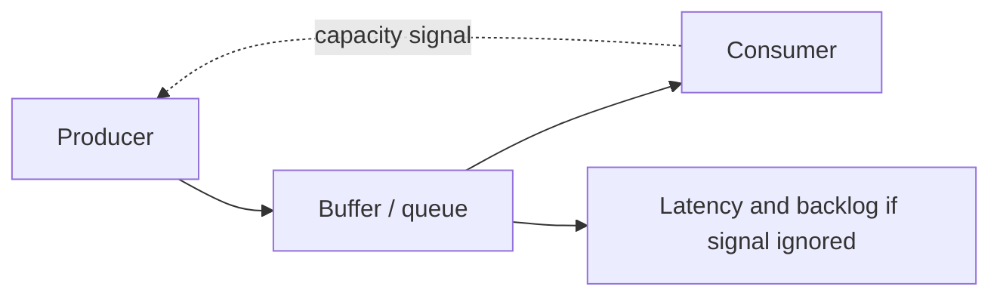

# Backpressure

## 1. Overview

Backpressure is the mechanism by which slower or saturated parts of a system push capacity constraints upstream so producers stop generating work at a rate the downstream path cannot safely handle.

The intuition is simple:

if one part of the pipeline cannot keep up, the rest of the pipeline must know.

That idea is foundational because distributed systems often contain mismatched stages:

- API layer
- queue
- workers
- database
- downstream service

These stages rarely have identical throughput or latency characteristics.

Without backpressure, a fast producer can overwhelm a slower consumer while the system appears healthy for a while:

- requests are accepted
- queue depth rises
- memory use grows
- latency stretches

Eventually the hidden backlog becomes a visible incident.

Backpressure exists to make that mismatch explicit early enough that the system can slow down, reject work, or reshape demand before failure becomes systemic.

This is why backpressure is not merely a streaming concept.

It is a general control principle for keeping production and consumption rates from diverging without bound.

## 2. The Core Problem

Different parts of a distributed system run at different speeds.

Examples:

- an API can accept requests faster than workers can process them
- workers can generate DB writes faster than storage can commit them
- one service can produce messages faster than another can consume them

If the faster side continues producing unchecked, the system pays the difference as backlog.

Backlog can show up as:

- queue growth
- request buffering
- memory pressure
- connection saturation
- higher tail latency

So the real backpressure problem is:

How does the system make downstream capacity limits visible early enough that upstream producers reduce or shape work instead of silently converting mismatch into unbounded backlog?

That is the operational heart of the concept.

## 3. Visual Model

What to notice:

- the buffer temporarily absorbs mismatch
- it does not eliminate the mismatch
- backpressure is what prevents the buffer from becoming a hidden failure accumulator

## 4. Formal Statement

Backpressure is a flow-control mechanism that propagates downstream capacity constraints upstream so that the rate of work production is reduced, shaped, or bounded before overload becomes destructive.

A serious backpressure design has to define:

- how saturation is detected
- how the pressure signal is represented
- how producers react
- what happens if demand still exceeds safe capacity

The key design point is that backpressure is about controlling the system before buffering turns mismatch into instability.

## 5. Key Terms

### 5.1 Producer

The component generating work.

### 5.2 Consumer

The component processing work.

### 5.3 Buffer

A temporary holding area that absorbs short-term mismatch between production and consumption.

### 5.4 Saturation

The point at which a component, pool, or queue is near or beyond safe operating capacity.

### 5.5 Flow Control

The rules that govern how much work moves through the system over time.

### 5.6 Concurrency Limit

A cap on in-flight work, often used as a practical backpressure mechanism.

### 5.7 Queue Depth

The amount of work waiting but not yet processed.

### 5.8 Queue Age

How long the oldest buffered work has been waiting.

Often this is a stronger overload signal than count alone.

## 6. Why the Constraint Exists

The constraint exists because buffering can hide overload temporarily while making eventual failure worse.

Suppose an API can accept 50,000 jobs per second.

Workers can process only 10,000 per second.

For a short period, the system seems fine:

- requests are accepted
- no hard errors yet

But the difference becomes backlog.

If nothing changes:

- queue grows rapidly
- latency becomes huge
- recovery gets harder because the system is now behind by a large amount

This is why "we have a queue" is not the same as "we have backpressure."

A queue buys time.

Backpressure determines what the system does with that time.

The constraint exists because no finite system can absorb an unlimited mismatch forever.

Eventually:

- memory runs out
- disks fill
- users wait too long
- downstream dependencies collapse

Backpressure is what turns that truth into explicit control instead of delayed failure.

## 7. Main Variants or Modes

### 7.1 Demand-Driven or Credit-Based Flow

Consumers explicitly tell producers how much more work they can accept.

Strengths:

- tight control
- very clear capacity signaling

Costs:

- more protocol complexity
- less common in ordinary request-response systems

### 7.2 Queue-Depth-Based Backpressure

Producers slow down or reject work when queue depth crosses thresholds.

Strengths:

- practical and common
- easy to reason about

Costs:

- may react after backlog already formed
- queue depth alone may hide work age problems

### 7.3 Concurrency-Limit Backpressure

The system caps in-flight work rather than relying only on queue sizes.

Strengths:

- simple and effective
- often prevents downstream overload early

Costs:

- may reduce throughput if tuned too conservatively

### 7.4 Pull-Based Consumption

Consumers pull work when ready instead of having work pushed aggressively.

Strengths:

- natural flow control
- good fit for queue consumers

Costs:

- producer-side burst handling may still need separate controls

### 7.5 Rate-Limit-Based Shaping

The system enforces rate ceilings on producers when downstream capacity is constrained.

Strengths:

- straightforward operational control

Costs:

- can be coarse
- may not adapt fast enough alone

## 8. Supporting Mechanisms and Related Ideas

### 8.1 Queues

Queues and backpressure are related and not identical.

Queues absorb temporary imbalance.

Backpressure is what keeps that imbalance from growing without bound.

### 8.2 Load Shedding

Backpressure tries to slow or shape production.

Load shedding rejects or drops work when shaping alone is not enough or would arrive too late.

### 8.3 Timeouts and Deadlines

Work that waits too long in a buffered system may no longer be useful.

Timeouts help prevent the system from wasting effort on stale backlog forever.

### 8.4 Autoscaling

Autoscaling can increase capacity, but it usually reacts more slowly than a good backpressure signal.

Backpressure is still needed while scaling catches up or when some bottlenecks do not scale linearly.

### 8.5 Observability

Good backpressure signals include:

- queue depth
- queue age
- in-flight concurrency
- saturation count
- reject rate

Without these, teams often notice overload only after user latency is already bad.

## 9. Real-World Examples

### API to Worker Queue

An API accepts jobs and enqueues them for workers.

If workers are saturated and the API keeps accepting at full speed, queue latency grows until users effectively stop getting timely results.

Backpressure lets the API:

- throttle intake
- defer low-priority jobs
- reject when the system is no longer safe

### Event Processing Pipelines

One stage enriches messages and sends them to a slower storage stage.

Backpressure prevents the enrichers from flooding storage with more work than it can commit safely.

### Database Write Pipelines

An application can generate writes faster than the database can sustain.

Concurrency limits or request throttling can push pressure back before the database becomes unstable.

### Stream Consumers

Consumers may reduce fetch demand or intake when processing or downstream sinks fall behind.

This is one of the most explicit examples of backpressure as a protocol-level control.

## 10. Common Misconceptions

### "A Queue Solves Backpressure Automatically"

Wrong.

A queue stores mismatch.

It does not solve persistent mismatch.

### "More Buffer Always Helps"

Only up to a point.

More buffering can hide overload and increase latency or recovery cost.

### "Backpressure Means the System Is Failing"

Not necessarily.

It often means the system is protecting itself correctly.

### "Only Streaming Systems Need Backpressure"

Wrong.

Any distributed pipeline with producers and slower consumers can need it.

### "If We Autoscale, We Do Not Need Backpressure"

Wrong.

Autoscaling reacts after conditions are observed and cannot always rescue an already exploding backlog.

## 11. Design Guidance

The best design question is:

Where can the system accumulate work faster than it can finish it, and what signal should force upstream behavior to change?

### Prefer

- explicit saturation signals
- bounded queues or bounded concurrency
- queue age monitoring, not only queue count
- pressure responses that happen before global collapse

### Be Careful About

- unbounded buffers
- hidden internal queues
- accepting work that has no chance of being completed in time
- relying only on autoscaling to absorb mismatch

### Questions Worth Asking

- where does backlog form
- how quickly can that backlog become harmful
- what should producers do when downstream is full
- what work should be delayed versus rejected

### Practical Heuristic

If the system can accept work much faster than it can finish it, it almost certainly needs explicit backpressure and not just "more queue."

## 12. Reusable Takeaways

- Backpressure makes downstream capacity limits visible upstream.
- Buffers buy time; backpressure decides what to do with that time.
- Queue depth and queue age are both critical overload signals.
- Backpressure is broader than streaming and applies to many distributed pipelines.
- It works best when combined with bounded concurrency, load shedding, and clear overload policy.

## 13. Summary

Backpressure is the mechanism that prevents fast producers from silently overwhelming slower consumers.

The benefit is a more stable system that reacts to real capacity instead of letting backlog grow blindly.

The tradeoff is that the system must now make explicit decisions about:

- when to slow down
- when to reject work
- how much buffering is safe

Those decisions are essential because capacity mismatch is not an edge case in distributed systems. It is a normal operating condition.
