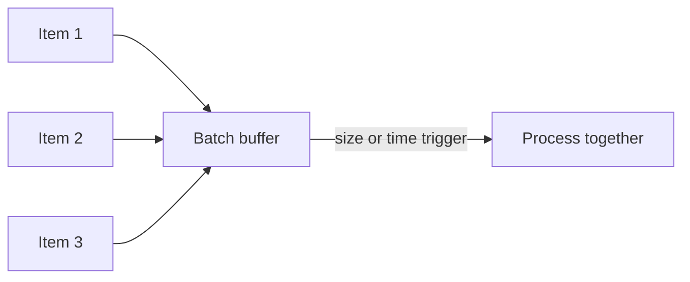

# Batching

## 1. Overview

Batching is the practice of grouping multiple units of work so they can be processed together instead of one at a time.

At first glance, batching is a straightforward efficiency trick:

- amortize fixed overhead

That is true and incomplete.

Batching changes the system in at least three important ways:

- it can increase throughput
- it can increase latency for individual items
- it can change failure and retry semantics

That is why batching appears in many places:

- database writes
- queue processing
- remote API calls
- analytics pipelines
- disk flush behavior

The core appeal is that many operations have fixed per-call cost:

- network round trip
- serialization
- transaction setup
- disk flush
- TLS or protocol framing

If the system pays that cost once for a group instead of once per item, efficiency improves.

But batching is never free.

To build a batch, the system often waits:

- for enough items
- or for a timer

That means at least some items are delayed.

When designed well, batching improves throughput or cost efficiency where some waiting is acceptable.

When designed poorly, it becomes hidden queueing that quietly damages latency-sensitive paths.

## 2. The Core Problem

Many systems spend more work on setup than on the unit itself.

Examples:

- inserting one row at a time into a database
- calling a downstream API once per item
- flushing disk after every tiny mutation

If the fixed overhead per operation is large, the system wastes capacity by processing everything individually.

So the real batching problem is:

How can the system combine work to amortize fixed overhead without increasing waiting time or failure complexity so much that the overall system gets worse?

That is the tradeoff at the center of batching:

- throughput and efficiency versus immediacy

## 3. Visual Model

What to notice:

- items accumulate before work occurs
- the system pays fixed overhead once for the batch instead of once per item
- the first item in the batch waits the longest

## 4. Formal Statement

Batching is a processing strategy in which multiple individual units of work are accumulated and then executed together in one larger operation to improve throughput, amortize fixed cost, or reduce per-item overhead.

A serious batching design has to define:

- what items are grouped together
- how batching is triggered
- how long items may wait
- what maximum batch size is allowed
- how partial failure is handled

The key design point is that batching changes both performance and semantics.

It is not only a speed optimization.

## 5. Key Terms

### 5.1 Batch Size

The number of items grouped into one execution unit.

### 5.2 Batch Window

The amount of time items may wait while a batch is being formed.

### 5.3 Flush Trigger

The condition that causes the batch to execute.

Common triggers:

- batch full
- timer expired
- memory threshold reached

### 5.4 Amortization

Spreading fixed per-operation cost across many items.

### 5.5 Partial Failure

The case where some items in the batch succeed and others fail.

### 5.6 Batch Age

How long the oldest item has been waiting in the current batch.

This is often a critical operational metric.

## 6. Why the Constraint Exists

The constraint exists because fixed overhead is real.

Suppose writing one event to storage involves:

- connection use
- transaction setup
- disk flush

If the system writes each event separately, most of the work may be setup rather than useful payload handling.

Batching improves efficiency by letting several events share that overhead.

But the first event in a batch cannot complete until:

- enough peers arrive
- or the flush timer fires

So batching cannot improve throughput without introducing some waiting unless the system already had that waiting elsewhere implicitly.

That is why batching must be evaluated in context:

- how latency-sensitive is the path
- how heavy is the fixed overhead
- how bursty is the arrival pattern

## 7. Main Variants or Modes

### 7.1 Size-Based Batching

Execute when the batch reaches a configured number of items.

Strengths:

- good efficiency under high traffic

Costs:

- under low traffic, items may wait too long

### 7.2 Time-Based Batching

Execute after a configured time window.

Strengths:

- gives a bound on wait time

Costs:

- may flush small batches and reduce efficiency

### 7.3 Hybrid Batching

Execute when either:

- enough items arrive
- or enough time passes

Strengths:

- balances efficiency and latency

Costs:

- more tuning needed

This is often the most practical real-world approach.

### 7.4 Adaptive Batching

The system adjusts batch size or timing based on current load.

Strengths:

- can perform well across varied traffic patterns

Costs:

- more complex behavior
- harder predictability

### 7.5 Batch-at-Transport vs Batch-at-Business-Layer

Some batching happens:

- in protocol or client libraries
- in business workers or application logic

The semantics differ.

Transport batching may be invisible to business logic.

Business batching often changes failure and retry behavior explicitly.

## 8. Supporting Mechanisms and Related Ideas

### 8.1 Latency vs Throughput

Batching is one of the clearest examples of trading some latency for better throughput or lower cost.

### 8.2 Queues

Queues often provide the staging area from which batches are formed.

This means queue age and batch age can combine into surprising latency if not watched.

### 8.3 Idempotency

If a batch is retried after partial success, the system needs a way to avoid duplicating already-applied items.

### 8.4 Backpressure

Batching can improve efficiency and still fail under overload if backlog grows faster than batches can drain.

Backpressure may still be needed.

### 8.5 Observability

Useful batch metrics include:

- average batch size
- max batch age
- flush reason
- per-batch latency
- partial-failure rate

Without these, teams often do not know whether batching is helping or only delaying work.

## 9. Real-World Examples

### Bulk Database Writes

Analytics pipelines often insert rows in groups instead of one by one.

This is a strong batching case because:

- transaction overhead is significant
- per-item latency is less important than total throughput

### External API Calls

If a downstream service supports one request containing many items, a caller can dramatically reduce network overhead and handshake cost by batching requests.

### Queue Worker Processing

Workers may pull a set of jobs, process them together, and acknowledge them as a group.

This can improve efficiency, but partial success must be carefully handled.

### Storage Engine Flush Behavior

Many storage engines effectively batch internal writes or commits through mechanisms such as group commit, even when the external API looks single-item oriented.

This is a reminder that batching can exist below the application layer too.

## 10. Common Misconceptions

### "Bigger Batches Are Always Better"

Wrong.

Past some point, bigger batches increase:

- latency
- memory pressure
- retry cost
- partial-failure blast radius

### "Batching Is Only for Offline Systems"

Wrong.

Many online systems batch internally while still exposing interactive APIs.

### "Time-Based Flushing Wastes Efficiency"

Sometimes it reduces maximum efficiency.

It also prevents low-traffic items from waiting forever.

### "Batching Solves Throughput Problems by Itself"

Not necessarily.

If the downstream system is fundamentally overloaded, batching may only delay the visible symptom.

### "One Failed Item Means the Whole Batch Model Is Wrong"

Not always.

It means partial failure semantics need to be designed intentionally.

## 11. Design Guidance

The best design question is:

Which fixed overhead are we amortizing, and how much extra waiting or retry complexity is acceptable to do it?

### Strong Fits

- high-throughput ingestion
- background jobs
- reporting pipelines
- APIs with meaningful per-call fixed cost

### Weak Fits

- highly latency-sensitive interactive operations
- workflows where one delayed item is unacceptable
- systems without a clear partial-failure strategy

### Prefer

- hybrid size-plus-time flush policies
- visibility into batch size and age
- clear partial-success semantics
- idempotent retries where possible

### Questions Worth Asking

- what overhead is actually being amortized
- what is the maximum acceptable wait time
- what happens if half a batch succeeds
- can the downstream system handle the batch size safely

### Practical Heuristic

If fixed per-operation overhead is dominating and slight delay is acceptable, batching is usually worth evaluating.

If latency and per-item correctness are paramount, batching should be introduced carefully and explicitly.

## 12. Reusable Takeaways

- Batching improves efficiency by sharing fixed cost across many items.
- The first cost of batching is waiting time.
- Hybrid size-plus-time flushing is often the most practical production approach.
- Partial failure and retry semantics are central to safe batching.
- Good batching requires observability into both batch size and batch age.

## 13. Summary

Batching groups work so the system can do more useful output per unit of overhead.

The benefit is better throughput and lower per-item cost.

The tradeoff is that the system introduces:

- waiting
- bigger failure units
- more retry complexity

That is why batching should be treated as a deliberate systems tradeoff, not just an optimization checkbox.
