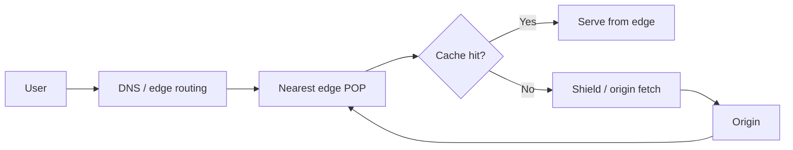

# CDN Design

## 1. Overview

A content delivery network, or CDN, is a globally distributed edge layer that serves content, proxies requests, applies policy, and absorbs traffic closer to users than the origin infrastructure can.

The phrase "CDN" still makes many engineers think primarily about static assets:

- images
- CSS
- JavaScript
- video chunks
- downloads

That is still important, but it is only part of the story.

Modern CDN design sits at the intersection of:

- caching
- global routing
- transport optimization
- TLS termination
- edge security
- traffic absorption

The real value of a CDN is not just that it stores bytes near users.

The real value is that it changes where work happens and how often the origin has to do it.

When designed well, a CDN can:

- reduce user latency
- reduce origin compute and bandwidth load
- absorb spikes
- improve resilience under traffic bursts
- provide edge enforcement for security and abuse controls

When designed poorly, it can:

- cache the wrong content
- serve stale or personalized data incorrectly
- hide origin inefficiencies instead of solving them
- create confusing invalidation behavior
- give the team a false sense of resilience while cache misses still overwhelm the origin

## 2. The Core Problem

If every request goes all the way back to the origin, several structural costs remain permanently high:

- network distance to the user
- origin CPU for repeated work
- origin bandwidth for repeated delivery
- peak load during spikes
- failure sensitivity concentrated around one origin path

Many requests are highly repetitive.

Examples:

- the same product image viewed by millions of users
- the same JavaScript bundle loaded by every browser
- the same app shell HTML for a release
- the same downloadable artifact

Even some API traffic can be partially repetitive:

- metadata responses
- public configuration
- cacheable catalog pages
- safe lookup responses

Without a CDN, the system keeps paying the full path cost for work that could often be done earlier and nearer to the user.

So the problem a CDN solves is not just "how to cache."

The deeper problem is:

How can a system reduce repeated origin work and long-haul network cost without breaking correctness, freshness, or personalized behavior?

That question is much more architectural than it first appears.

## 3. Visual Model

What to notice:

- the CDN is a decision layer, not just a storage layer
- origin traffic depends heavily on hit ratio and cache key design
- an origin shield or intermediate layer can prevent many edges from stampeding the origin independently

## 4. Formal Statement

A CDN is a geographically distributed edge delivery layer that serves or proxies requests from points of presence close to users, often using caching, connection reuse, policy enforcement, and routing optimization to reduce latency and offload origins.

An effective CDN design has to define:

- what can be cached
- how cache keys are constructed
- how freshness is determined
- how invalidation works
- what happens on misses
- how the origin is protected from burst miss traffic
- which security and traffic policies are enforced at the edge

The crucial point is that CDN design is not one setting. It is the combined behavior of:

- edge locations
- cache policy
- origin topology
- request classification
- invalidation strategy

## 5. Key Terms

### 5.1 Edge POP

A point of presence where the CDN receives user traffic and makes local serving or forwarding decisions.

### 5.2 Cache Hit

A request served directly from the CDN edge without contacting the origin.

This is where most of the CDN's value is realized.

### 5.3 Cache Miss

A request that the edge cannot satisfy from local cached state and must forward toward the origin or another upstream cache layer.

### 5.4 TTL

Time to live. The configured period during which cached content is considered fresh enough to serve without revalidation.

### 5.5 Cache Key

The identity of a cached object.

It may include:

- URL path
- query parameters
- headers
- host
- device hints
- encoding

### 5.6 Origin Shield

An intermediate cache layer or selected regional fetch layer that reduces duplicated origin fetches from many edge POPs.

### 5.7 Revalidation

A process where the CDN checks whether cached content is still valid instead of fully refetching it blindly.

### 5.8 Purge or Invalidation

Removing or marking cached content stale before TTL expiry because content changed or was published incorrectly.

## 6. Why the Constraint Exists

Latency is physical and traffic is bursty.

A user in Europe requesting content from an origin in one U.S. region will always pay more round-trip latency than if the response is served from a nearby edge. No software abstraction eliminates that.

At the same time, repeated content creates avoidable origin work.

If a file is requested a million times and never changes, asking the origin a million times is an architectural failure, not just an inefficiency.

But the opposing constraint is correctness.

Not every response should be cached.

Examples of dangerous caching:

- personalized account data
- tenant-specific admin pages
- shopping cart contents
- signed download URLs with short expiry
- authorization-sensitive API responses

This is why CDN design is harder than "put a cache in front."

The system must separate:

- shared content from personalized content
- safe caching from unsafe caching
- long-lived assets from frequently changing objects
- high-value edge protection from origin-only logic

The constraint exists because the CDN is trading correctness risk for performance and origin protection, and that tradeoff must be explicit.

## 7. Main Variants or Modes

### 7.1 Static Asset CDN

This is the classic model.

The CDN serves:

- JavaScript bundles
- CSS
- images
- fonts
- downloadable files

Strengths:

- very high hit rates
- strong latency reduction
- major origin offload

Costs:

- cache invalidation still matters during deployments
- bad asset versioning can create stale-client issues

This model works especially well when assets are content-addressed or versioned by hash.

### 7.2 HTML or Page CDN

The CDN caches full documents or rendered pages.

Strengths:

- large latency wins for content-heavy sites
- reduced origin rendering cost

Costs:

- dynamic personalization becomes harder
- cache variation rules become more complex
- invalidation strategy becomes more operationally significant

This is common in content sites, documentation, and some commerce read paths.

### 7.3 API Edge Layer

Some APIs benefit from a CDN or edge proxy even when responses are not broadly cacheable.

Reasons include:

- TLS termination
- bot filtering
- DDoS absorption
- connection reuse
- regional traffic steering
- selective caching of safe endpoints

Strengths:

- better edge protection
- lower handshake cost to origin
- operational visibility

Costs:

- not every API benefits equally from caching
- teams may wrongly assume the CDN fixes poorly designed APIs

### 7.4 Dynamic Acceleration

Even when responses are mostly uncacheable, a CDN can still help by:

- using better edge-to-origin paths
- reusing warm transport connections
- terminating TLS near the user
- reducing connection setup cost on the origin path

This is useful when payloads are dynamic but global users still suffer from transport latency.

### 7.5 Edge Compute

Modern CDNs increasingly run lightweight logic at the edge:

- header rewriting
- redirects
- geo-based behavior
- bot or abuse checks
- feature gates
- request normalization

Strengths:

- policy executes closer to the user
- some origin work disappears entirely

Costs:

- easy to create hidden logic sprawl at the edge
- debugging becomes harder if edge behavior is opaque

## 8. Supporting Mechanisms and Related Ideas

### 8.1 Cache Key Design

Cache effectiveness depends heavily on whether logically identical requests map to the same cache entry.

Bad cache keys destroy hit ratio.

Examples:

- varying on irrelevant query params
- including unstable headers unnecessarily
- fragmenting content by too many device or locale distinctions

### 8.2 Asset Versioning

For static assets, versioned filenames or content hashes are one of the cleanest invalidation strategies.

Instead of purging aggressively, the system serves a new object name on deploy and lets old content expire naturally.

### 8.3 Origin Shielding

Without shielding, many edges missing the same object can all hit the origin separately.

Shielding reduces:

- duplicate origin fetches
- thundering herd risk
- burst amplification after cache purge

### 8.4 Security at the Edge

CDNs often enforce:

- TLS termination
- bot detection
- DDoS protection
- rate limiting
- request filtering
- geographic restrictions

This is one reason a CDN is often part of the security design, not only the performance design.

### 8.5 Observability

Mature CDN usage tracks:

- cache hit ratio
- miss ratio by route
- edge latency
- origin latency
- origin fetch volume
- purge frequency
- shield effectiveness

Without route-level visibility, teams often know that "the CDN is in front" but not whether it is actually helping.

### 8.6 Personalized Content Boundaries

The most common CDN mistakes happen when a team fails to separate:

- public cacheable responses
- private user-specific responses

This boundary must be explicit in headers, cookies, and route design.

## 9. Real-World Examples

### Global Static Asset Delivery

A browser-based product serves hashed JavaScript bundles, CSS, images, and fonts from a CDN.

This is one of the cleanest CDN use cases because:

- assets are heavily reused
- they are usually safe to cache publicly
- versioned asset names make invalidation manageable

The result is lower page load time and far lower origin bandwidth demand.

### E-Commerce Media and Catalog Traffic

Commerce platforms often serve:

- product images
- category pages
- public product metadata

through CDN layers.

This works well because read traffic is often far higher than write traffic, and a large percentage of catalog browsing is shared across users.

The challenge is keeping personalized sections such as carts, recommendations, and account state from being cached incorrectly.

### Product Launch or Viral Event Protection

When traffic spikes suddenly, the CDN can absorb:

- repeated asset requests
- common landing page traffic
- repeated safe GET requests

This can be the difference between a survivable launch and an origin outage.

However, if the CDN hit ratio is poor or personalized pages bypass caching, the origin may still melt under miss traffic. That is why CDN design has to include miss-path planning, not just hit-path optimism.

### API Edge Protection

An API may not be broadly cacheable, but the CDN still provides:

- TLS termination
- edge routing
- connection reuse
- bot filtering
- coarse rate limiting

This makes sense when the origin API must be protected from internet-scale traffic even if the actual application responses remain dynamic.

## 10. Common Misconceptions

### "A CDN Is Just for Static Files"

Wrong.

Static assets are the classic use case, but modern CDN layers also provide:

- routing
- edge security
- dynamic acceleration
- edge compute
- abuse protection

### "Putting a CDN in Front Automatically Makes the System Fast"

Wrong.

If:

- cache keys are fragmented
- TTLs are too short
- purges are constant
- responses are mostly personalized
- origin latency is still poor

then the CDN may provide much less value than expected.

### "Cache Misses Are Fine Because Only Hits Matter"

Wrong.

Miss behavior is one of the most important parts of CDN design.

During deploys, purges, or hot-object churn, miss traffic can overwhelm the origin if the miss path is not carefully controlled.

### "Personalized Responses Can Usually Be Cached with a Few Tweaks"

Sometimes, but this is where many serious correctness bugs happen.

Caching user-specific or authorization-sensitive data without clear boundaries can leak data across users or tenants.

### "A CDN Replaces Good Origin Architecture"

No.

A CDN can offload and protect the origin, but it does not eliminate the need for:

- scalable origin services
- good asset strategy
- healthy miss-path behavior
- proper database and service performance

## 11. Design Guidance

The right way to approach CDN design is to ask:

Which traffic should never reach the origin unless it truly has to?

That question is more useful than asking whether a CDN should be added.

### Good Candidates for CDN Optimization

- static versioned assets
- public media
- safe shared GET responses
- content with clear freshness rules
- routes that dominate traffic volume

### Areas Requiring Extra Care

- personalized HTML
- authenticated API responses
- tenant-specific data
- frequently mutated objects
- signed URLs and short-lived entitlements

### Operational Questions Worth Asking

- what is the hit ratio by route, not just globally
- how are hot objects handled after purge
- how does origin shielding work
- what is the fallback if a POP or edge region has issues
- how is stale content invalidated quickly when correctness matters
- what traffic bypasses the CDN entirely

### A Useful Practical Rule

If the origin sees the same response shape repeatedly from many users, the CDN should probably own more of that traffic.

If the origin response is user-specific, security-sensitive, or rapidly mutating, treat CDN caching as a deliberate design decision, not a default optimization.

### Where Teams Often Go Wrong

- they optimize hit traffic and ignore miss storms
- they measure global hit rate and miss route-level problems
- they conflate edge compute convenience with good service design
- they assume a CDN makes origin resilience optional

## 12. Reusable Takeaways

- A CDN is an edge control and delivery layer, not just a static file cache.
- Its biggest wins come from reducing repeated origin work and long-haul latency.
- Cache key design and invalidation policy are as important as having a CDN at all.
- Miss-path behavior is a first-class design concern, especially during bursts and purges.
- Personalized and authorization-sensitive content must have explicit caching boundaries.
- Edge security and transport optimization are often as valuable as raw caching.
- A CDN improves the system only if the origin, routes, and cache policies are designed to cooperate.

## 13. Summary

CDN design is the practice of moving the right work toward the edge so users get faster responses and origins do less repeated work.

The benefit is lower latency, lower origin load, and better resilience under spikes.

The tradeoff is that the team now has to reason carefully about:

- what can be cached
- how freshness is controlled
- how the miss path behaves
- where personalized or security-sensitive responses must stay out of shared caches

When those choices are explicit, a CDN becomes one of the most leverage-rich parts of the platform. When they are implicit, the CDN becomes a source of stale content, confusing behavior, and misplaced confidence.
