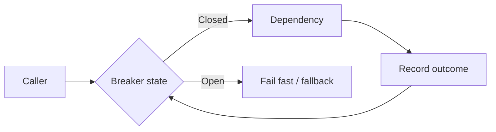

# Circuit Breakers

## 1. Overview

Circuit breakers are resilience mechanisms that stop or sharply limit calls to a dependency once failure becomes likely enough that continuing to call it is mostly harmful.

The basic idea is simple:

if a dependency is already failing, sending more traffic into it can make the whole system worse.

That matters because in distributed systems, failure is often contagious through shared resources:

- thread pools
- connection pools
- retries
- request queues

A slow or failing dependency can pull healthy callers down with it if they keep waiting, retrying, and consuming capacity on doomed calls.

The circuit breaker exists to turn that uncontrolled failure propagation into an explicit decision:

- stop calling for now
- fail fast
- use a fallback if one exists
- probe carefully for recovery later

When designed well, circuit breakers reduce blast radius and give systems a disciplined way to say:

not now

instead of learning the same dependency failure the hard way on every request.

When designed poorly, they can:

- flap open and closed too often
- mask real incidents
- reject too aggressively
- degrade healthy traffic through bad thresholds

So a circuit breaker is not simply a timeout wrapper.

It is a policy engine for dependency failure.

## 2. The Core Problem

Suppose a service depends on:

- a payment API
- a recommendation service
- a user-profile backend

One dependency becomes slow or error-prone.

Without any protective mechanism:

- requests keep flowing
- callers wait on long timeouts
- retries amplify load
- worker pools fill
- healthy requests begin failing because capacity is exhausted

This is how one dependency outage becomes a broader service outage.

The real circuit-breaker problem is:

How does a caller recognize that continued attempts are low-value or harmful and then stop sending normal traffic until the dependency appears healthy again?

That is a much more specific goal than generic "resilience."

## 3. Visual Model

What to notice:

- the breaker sits in the call path and learns from outcomes over time
- once enough failure evidence accumulates, the caller stops paying full dependency cost on every request
- the breaker is a stateful decision mechanism, not just one timeout rule

## 4. Formal Statement

A circuit breaker is a stateful resilience mechanism that monitors outcomes of calls to a dependency and transitions between states that allow, block, or cautiously probe calls based on observed failure or latency thresholds.

A serious circuit-breaker design has to define:

- what counts as failure
- which measurement window is used
- when the breaker opens
- how long it stays open
- how recovery probes are allowed
- what behavior occurs while open

The critical design point is that the breaker is trying to protect the caller and the broader system from cascading dependency failure, not merely detect that one call went wrong.

## 5. Key Terms

### 5.1 Closed State

Normal operation.

Calls flow through to the dependency and outcomes are monitored.

### 5.2 Open State

The breaker blocks or short-circuits calls because the dependency is currently considered unhealthy enough that normal traffic should stop.

### 5.3 Half-Open State

The breaker allows a limited number of test calls to determine whether the dependency has recovered.

### 5.4 Failure Threshold

The configured condition that causes the breaker to open.

This may be based on:

- error rate
- timeout rate
- latency
- consecutive failures

### 5.5 Cooldown Window

The time the breaker remains open before probing again.

### 5.6 Fallback

A degraded alternate behavior used when the dependency is not being called normally.

### 5.7 Failure Window

The rolling time or sample window over which the breaker evaluates dependency health.

## 6. Why the Constraint Exists

Dependency failure rarely harms only the dependency.

Imagine a payment integration that starts timing out at five seconds.

If the caller handles this naively:

- every request waits too long
- retries multiply load
- threads remain occupied
- connection pools stay tied up
- unrelated requests begin suffering

The system is not failing just because the dependency is bad.

It is failing because the caller continues paying full cost for calls that are unlikely to succeed.

The constraint exists because distributed systems share resources, and repeated low-value dependency calls can consume those shared resources faster than the dependency can recover.

The breaker exists to preserve caller health under those conditions.

## 7. Main Variants or Modes

### 7.1 Error-Rate-Based Breakers

The breaker opens when the dependency exceeds an allowed error rate over some window.

Strengths:

- intuitive for obvious failure cases

Costs:

- may react too late if calls are slow rather than failing outright

### 7.2 Consecutive-Failure Breakers

The breaker opens after some number of consecutive failures.

Strengths:

- simple
- fast to react in clear failure cases

Costs:

- sensitive to burst patterns
- may be noisy if transient failures are common

### 7.3 Latency-Based Breakers

The breaker reacts when latency becomes too high, even if some calls still succeed technically.

Strengths:

- better for protecting callers from slow dependency meltdown

Costs:

- harder threshold tuning

### 7.4 Hybrid Breakers

Use a combination of:

- error rate
- timeout rate
- latency

Strengths:

- more realistic dependency health evaluation

Costs:

- more tuning complexity

### 7.5 Fallback-Oriented Breakers

These are paired closely with degraded alternate behavior such as:

- cached data
- static defaults
- partial response

Strengths:

- better user experience when the dependency is non-critical

Costs:

- fallback quality becomes part of product behavior

## 8. Supporting Mechanisms and Related Ideas

### 8.1 Timeouts

Breakers need sensible timeouts.

If calls wait too long before being declared failures, the breaker learns too slowly and the caller burns capacity first.

### 8.2 Retries and Backoff

Retries without circuit breaking can magnify failure.

Retries with badly configured breakers can also create probe storms.

These systems must be tuned together.

### 8.3 Bulkheads and Pool Isolation

Breakers are more effective when dependencies already have isolated resource pools so one bad dependency cannot consume every shared worker.

### 8.4 Load Shedding

Load shedding protects the system from overall overload.

Circuit breakers specifically protect against unhealthy dependencies.

### 8.5 Observability

Good breaker metrics include:

- open rate
- half-open success rate
- short-circuited request count
- dependency latency and error trends

Without this, teams may misread breaker behavior as either instability or success.

## 9. Real-World Examples

### Payment Gateway Protection

A checkout service calls an external payment provider.

If the provider starts timing out, a circuit breaker can stop the checkout service from waiting five seconds on every doomed call and exhausting the entire request fleet.

### Recommendations or Personalization

If a non-critical recommendations backend is unhealthy, the breaker can open and the caller can serve:

- cached recommendations
- popular items
- no module at all

This is a good case where breaker plus fallback preserves the main page experience.

### Internal Microservice Meshes

If one internal service starts failing under load, every caller may otherwise discover that failure independently through timeouts and retries.

Circuit breakers reduce that coordinated blast radius.

### Third-Party APIs with Variable Reliability

External vendors often have weaker latency and availability characteristics than internal services. Breakers are especially useful when external dependency behavior is not fully under your control.

## 10. Common Misconceptions

### "Circuit Breakers Are Just Fancy Timeouts"

Wrong.

Timeouts control when one call stops waiting.

Breakers control when the system stops sending many similar calls normally.

### "Open Means the Dependency Is Definitely Down"

Not always.

It means the dependency is unhealthy enough that continued traffic is not worth the cost right now.

### "Every Dependency Needs a Breaker"

Not automatically.

Breakers add policy and state. They are most valuable where dependency failure can spread broadly.

### "A Breaker Solves the Dependency Problem"

No.

It protects the caller. It does not repair the dependency itself.

### "If There Is a Breaker, Retries Are Safe"

Not necessarily.

Poor retry policy can still create storms or poor user experience even when a breaker exists.

## 11. Design Guidance

The key question is:

Will repeated low-value calls to this dependency damage the caller or the wider system enough that controlled refusal is better?

If yes, a breaker is worth serious consideration.

### Strong Fits

- slow or failure-prone remote dependencies
- third-party APIs
- internal services that can trigger cascading pool exhaustion
- non-critical features with meaningful fallbacks

### Weak Fits

- trivial in-process calls
- dependencies where no fallback or fail-fast path makes sense and the caller truly must wait
- tiny systems where operational cost outweighs benefit

### Prefer

- sensible timeouts first
- explicit breaker metrics
- fallback behavior only where the product semantics tolerate it
- controlled half-open probing rather than sudden full traffic restoration

### Questions Worth Asking

- what defines failure here
- what latency is unacceptable
- what happens while open
- what is the risk of false-open behavior
- can the caller still provide value with fallback

### Practical Heuristic

If dependency failure tends to consume lots of caller capacity before surfacing clearly, a circuit breaker is often one of the most effective control mechanisms available.

## 12. Reusable Takeaways

- Circuit breakers protect callers from repeatedly paying full cost for failing dependencies.
- They are stateful policies, not just timeout wrappers.
- Timeouts, retries, and breakers must be designed together.
- Breakers are especially valuable where dependency failure can cascade through shared resources.
- Fallback behavior can turn circuit breaking from pure protection into graceful degradation.

## 13. Summary

Circuit breakers are mechanisms for failing fast when a dependency is unhealthy enough that normal calling behavior would mostly amplify damage.

The benefit is reduced blast radius and better caller stability.

The tradeoff is policy complexity:

- what counts as failure
- when to open
- when to probe
- what to do while open

When those policies are designed intentionally, circuit breakers become one of the clearest ways a distributed system protects itself from cascading dependency collapse.
