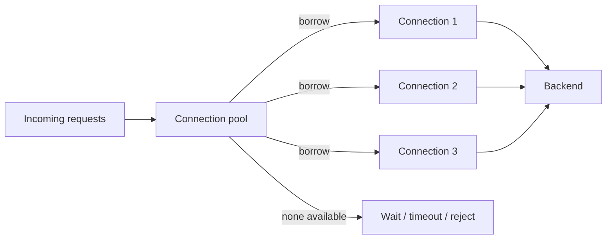

# Connection Pooling

## 1. Overview

Connection pooling is the practice of reusing a bounded set of already established network connections instead of creating a fresh connection for every request or operation.

That sounds like a straightforward performance optimization.

It is one, but it is also more than that.

A connection pool is a capacity-control mechanism between a caller and a backend.

It affects:

- latency
- backend load
- queueing behavior
- failure amplification
- overload protection

The reason is simple.

Connections are not free.

Opening one usually involves some combination of:

- TCP handshake
- TLS negotiation
- authentication
- socket allocation
- backend session state

If a high-throughput service creates and destroys connections constantly, it wastes work on both sides and can overwhelm the backend long before actual business work becomes the bottleneck.

When designed well, connection pooling:

- reduces per-request overhead
- smooths backend demand
- prevents connection storms
- makes client throughput more stable

When designed poorly, it creates:

- hidden queueing
- overloaded databases
- saturation under burst traffic
- stale broken connections after failover
- latency spikes that look mysterious until you inspect the pool

This is why connection pooling deserves to be treated as a system behavior topic, not a driver default.

## 2. The Core Problem

A service making backend calls at scale faces a structural choice:

- create a new connection each time
- reuse a controlled set of existing connections

Creating a new connection per request has obvious costs:

- repeated handshake latency
- repeated CPU cost
- backend connection churn
- risk of hitting connection limits

But pooling creates its own tension.

If the pool is too small:

- requests wait
- queueing grows
- throughput suffers

If the pool is too large:

- the backend sees too many concurrent sessions
- contention grows
- overload becomes worse, not better

So the real problem is:

How does a client system reuse connections efficiently while still keeping backend concurrency within safe limits and remaining stable during failures?

That is a much more interesting question than "should we turn pooling on."

## 3. Visual Model

What to notice:

- the pool is a bounded shared resource
- when the pool is saturated, requests do not disappear; they wait, fail, or trigger higher-level controls
- pool behavior therefore directly shapes latency and overload behavior

## 4. Formal Statement

Connection pooling is a resource-management strategy in which a client, runtime, or proxy maintains a reusable bounded set of open connections to a backend and allocates them to work according to configured lifecycle and concurrency rules.

A real pooling design has to define:

- maximum pool size
- minimum idle or warm connections
- acquisition timeout
- idle timeout
- connection lifetime or recycle rules
- health checking and stale connection handling
- behavior under saturation

The most important architectural point is this:

The pool is not only a performance cache.

It is part of the system's concurrency and backpressure model.

## 5. Key Terms

### 5.1 Pool Size

The maximum number of live connections the pool is allowed to maintain.

This is often the most visible tuning parameter and one of the most misunderstood.

### 5.2 Acquisition

The act of borrowing a connection from the pool for one unit of work.

### 5.3 Acquisition Timeout

How long work waits for a connection before failing.

This is a crucial latency and overload control.

### 5.4 Idle Timeout

How long an unused connection remains open before it is closed.

### 5.5 Connection Lifetime

The maximum age after which a connection is proactively recycled, even if it still appears healthy.

### 5.6 Saturation

The state where all pool connections are busy and new work must wait, fail, or back off.

### 5.7 Multiplexing

A protocol behavior where multiple logical requests can share one physical connection.

This changes pool design significantly for protocols such as HTTP/2 or some proxies.

### 5.8 Stale Connection

A connection that still exists in the pool but is no longer truly usable because the backend changed, failed over, or silently closed it.

## 6. Why the Constraint Exists

Backends have finite capacity not only for queries or requests, but for connections themselves.

Each connection may consume:

- memory
- file descriptors
- backend worker state
- transaction context
- TLS state

Now imagine a fleet of application servers.

If each instance is allowed to open very large pools independently, total connection count can explode.

For example:

- 100 app instances
- each with 100 DB connections
- suddenly 10,000 potential open backend connections

That may be catastrophic for the database even if request volume itself is not extreme.

This is why connection pooling is inseparable from capacity planning.

The constraint exists because connection reuse reduces setup cost, but unconstrained reuse turns into backend pressure. The pool must therefore sit at a disciplined point between:

- efficient reuse
- safe backend concurrency

## 7. Main Variants or Modes

### 7.1 Application-Side Pools

Each service instance maintains its own pool to the backend.

Strengths:

- simple deployment model
- low extra infrastructure
- direct control by the application

Costs:

- total connections scale with instance count
- backend limits can be exceeded during autoscaling
- every instance handles stale-connection issues independently

This is the most common model and often the first one teams encounter.

### 7.2 Shared Pooling Proxies

A proxy or pooler sits between clients and the backend, reusing fewer backend connections across many client connections.

Examples include database connection poolers and smart proxies.

Strengths:

- better backend connection control
- shields backend from client fan-out
- can smooth client burstiness

Costs:

- extra infrastructure
- another failure point
- different transaction or session semantics depending on proxy behavior

### 7.3 Multiplexed Protocol Pools

Some protocols allow many logical streams over fewer physical connections.

Examples:

- HTTP/2
- some RPC transports

Strengths:

- lower connection count
- more efficient transport usage

Costs:

- one hot or broken connection may affect many streams
- capacity reasoning shifts from "connections" to "streams plus backend concurrency"

### 7.4 Transaction-Scoped vs Session-Scoped Pooling

In database environments, one pool may preserve connection affinity for longer-lived session behavior, while another may recycle connections at transaction boundaries.

Strengths and costs depend heavily on:

- session state use
- prepared statements
- transaction semantics
- proxy capabilities

This is an area where teams often discover hidden assumptions only after introducing poolers.

## 8. Supporting Mechanisms and Related Ideas

### 8.1 Backpressure

A saturated connection pool is a form of pressure signal.

If acquisition waits grow, the caller may need to:

- reduce concurrency
- reject work
- shed load

Ignoring pool saturation often means hidden queue growth.

### 8.2 Timeouts

Timeouts matter at multiple levels:

- request timeout
- connection acquisition timeout
- socket timeout
- backend statement timeout

Poor timeout alignment creates confusing behavior where work piles up behind pools long before the system reports failure clearly.

### 8.3 Failover Handling

After backend failover, pools often hold stale connections.

Good designs need to consider:

- connection invalidation
- aggressive retry storms
- DNS or endpoint changes
- warm-up behavior against the new primary

This is one of the most common real-world failure cases.

### 8.4 Load Shedding and Concurrency Control

Pool size effectively caps how much concurrent backend work the caller can push through that path.

This can be protective.

It can also be dangerous if request queues above the pool grow without control.

### 8.5 Observability

Good pool metrics include:

- active connections
- idle connections
- acquisition wait time
- timeout count
- pool saturation frequency
- connection error rate

Without these, teams often blame the backend when the real problem is pool pressure in the caller.

## 9. Real-World Examples

### Web API to Relational Database

An API server receives many concurrent requests and uses a database pool so each request does not pay full connection setup cost.

This makes sense because:

- database connections are expensive
- repeated setup wastes latency
- the database needs bounded connection count

The tradeoff is that the application now needs to size the pool relative to database capacity, not only application demand.

### Service-to-Service HTTP Clients

An internal service calling another internal service often uses keep-alive client pools.

This reduces:

- TCP churn
- TLS handshake cost
- repeated latency spikes

It also means stale connection handling becomes important during deployments and failovers.

### Database Pooler in Front of a Large Fleet

A large fleet of short-lived app instances may use a connection pooler so the database sees a smaller stable number of backend sessions.

This is useful when client elasticity is high but backend connection capacity is limited.

### Burst Traffic During Autoscaling

A service autoscaling event can increase the number of app instances rapidly.

If each instance opens a full pool immediately, the backend can get hit by a connection storm even before ordinary request load stabilizes.

This is a classic example of why connection pooling is a capacity-control topic, not merely an efficiency topic.

## 10. Common Misconceptions

### "Larger Pools Are Always Better"

Wrong.

Larger pools may reduce local waiting and simultaneously overload the backend.

### "Connection Pooling Is Just a Performance Optimization"

Wrong.

It is also:

- a concurrency limiter
- a backend protection mechanism
- a failure amplifier if configured badly

### "If the Pool Is Saturated, Add More Connections"

Not automatically.

The correct fix may be:

- reduce concurrency
- optimize backend work
- shard traffic
- add backend capacity

Blindly increasing pool size often pushes the pain downstream.

### "Persistent Connections Mean No Failure Risk"

Wrong.

Persistent pooled connections frequently become stale during:

- backend restart
- failover
- network change
- proxy rebalance

### "Pool Defaults Are Fine"

Defaults are often generic, not workload-aware.

They may be completely inappropriate for:

- database capacity
- autoscaled fleets
- high tail-latency workloads

## 11. Design Guidance

Pool design should start from backend capacity and workload concurrency, not from application enthusiasm.

### Prefer

- explicit pool sizing
- acquisition timeout metrics
- bounded waiting behavior
- connection recycling policies that fit backend behavior
- load tests that include autoscaling and failover scenarios

### Be Careful About

- multiplying pool size by fleet size without checking backend limits
- letting requests queue indefinitely for pooled connections
- aligning all instances to reconnect at once after failure
- ignoring stale-connection behavior during deploys and primary switches

### Questions Worth Asking

- what is the total possible connection count across the whole fleet
- how many concurrent backend sessions can the backend actually handle
- what happens when the pool is full
- what happens after backend failover
- are acquisition waits visible in dashboards and alerts

### Practical Heuristic

If pool pressure is rising, first ask whether the backend can safely do more concurrent work before increasing the pool.

### Another Practical Heuristic

A pool should protect the backend from the application fleet, not expose the backend to every burst the fleet can generate.

## 12. Reusable Takeaways

- Connection pools are bounded shared resources, not just caches of open sockets.
- Pool size should be derived from backend capacity and fleet shape, not chosen in isolation.
- Acquisition wait time is one of the most important pool health signals.
- Large pools can hide queueing locally while overwhelming the backend globally.
- Failover and stale-connection handling are part of pool design, not edge cases.
- Pooling improves efficiency only when it also respects backend concurrency limits.

## 13. Summary

Connection pooling reuses established connections so a system can avoid repeated setup cost and keep backend interaction more stable.

The benefit is lower latency and better resource efficiency.

The tradeoff is that the pool becomes part of the system's concurrency, overload, and failure behavior.

That means good pooling is not about maximizing open connections. It is about controlling them deliberately so the caller and the backend remain stable together.
