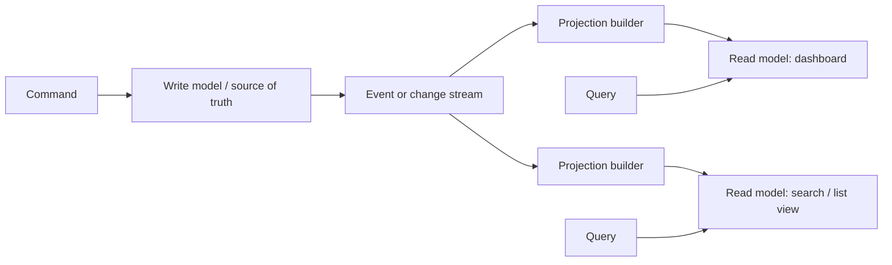

# CQRS

## 1. Overview

CQRS stands for Command Query Responsibility Segregation.

At its core, CQRS separates the part of the system responsible for changing state from the part of the system responsible for serving reads.

That sounds simple enough that teams sometimes dismiss it as just:

- different endpoints for reads and writes
- or two tables
- or two databases

Those descriptions are incomplete.

CQRS becomes relevant when the shape, constraints, and performance needs of writing data are materially different from the shape, constraints, and performance needs of reading it.

The write side usually cares about:

- invariants
- validation
- transactional correctness
- ownership of canonical state

The read side often cares about:

- denormalized views
- low latency
- filtering and search
- fan-out to many UI shapes
- precomputed summaries

If one model is forced to satisfy both perfectly, the system often ends up pleasing neither side.

That is where CQRS becomes useful.

It is not a mandatory architectural level-up.

It is a deliberate acknowledgement that:

- write correctness and read convenience are different jobs

and one model is no longer the best place to do both.

When applied well, CQRS gives systems cleaner ownership boundaries and simpler read models for complex products.

When applied badly, it adds projections, lag, synchronization burden, and operational overhead where a simpler design would have worked better.

This is why CQRS is worth understanding deeply rather than adopting by slogan.

## 2. The Core Problem

Many systems start with one data model doing everything.

That one model has to:

- validate writes
- enforce business invariants
- support complex dashboards
- serve list views
- power search and filtering
- provide analytics-adjacent read paths

This often works at first.

Then the product grows.

The read patterns become more demanding:

- customer order history with rich joins
- operational dashboards with summaries
- user feeds
- search pages
- administrative reporting

At the same time, the write path becomes more sensitive:

- must reject invalid state transitions
- must preserve transactional integrity
- must remain clear to reason about

The more the system evolves, the more one unified model may feel stretched.

Symptoms often include:

- write tables overloaded with denormalized columns just for reads
- reads doing expensive joins or aggregations for every request
- APIs shaped awkwardly around storage instead of product needs
- transactional logic tangled with reporting or search concerns

The CQRS problem is therefore:

How can the system keep a clean, correctness-focused write model while also supporting read paths that need a different shape, different performance profile, or different storage strategy?

That is the real design question.

## 3. Visual Model

What to notice:

- the write model owns canonical state transitions
- read models are derived views, not necessarily the place where truth is decided
- once projections exist, consistency lag and rebuildability become core design concerns

## 4. Formal Statement

CQRS is an architectural pattern in which the command side responsible for validating and applying state changes is separated from the query side responsible for serving read-optimized views, often through distinct models, storage layouts, or synchronization paths.

A serious CQRS design has to define:

- what the write-side source of truth is
- what commands are allowed to change state
- which read models exist
- how read models are built and updated
- what consistency lag is acceptable
- how projections are repaired or rebuilt

The most important idea in that definition is this:

the read model is usually derivative, while the write model is authoritative.

Once that is true, the system must be able to tolerate a temporary difference between:

- what just committed on the write side
- what is currently visible on one or more read sides

## 5. Key Terms

### 5.1 Command

A command is an intent to change system state.

Examples:

- create order
- cancel subscription
- approve refund

A command is not the same thing as an event.

A command asks the system to try something.

### 5.2 Query

A query is a request to read state without changing it.

The main job of a query path is to return useful data efficiently, not to enforce write invariants.

### 5.3 Write Model

The write model is the authoritative model responsible for:

- enforcing invariants
- validating transitions
- storing canonical state

### 5.4 Read Model

A read model is a query-optimized representation derived from canonical state or change streams.

It may be:

- denormalized
- aggregated
- indexed differently
- stored in another datastore

### 5.5 Projection

A projection is the process or result of transforming write-side changes into read-side views.

Projections are often where CQRS systems either become elegant or operationally painful.

### 5.6 Projection Lag

Projection lag is the delay between a write being committed and the corresponding read model reflecting it.

This is one of the most important practical tradeoffs in CQRS.

### 5.7 Logical CQRS

Logical CQRS separates command and query code paths without necessarily requiring completely different physical datastores.

### 5.8 Physical CQRS

Physical CQRS uses different storage representations, and sometimes different datastores, for read and write models.

## 6. Why the Constraint Exists

The constraint exists because write correctness and read efficiency often pull the system in different directions.

Consider an order system.

The write side may need:

- normalized order state
- explicit transitions
- transactional updates to payment and order status
- clear invariant enforcement

The read side may need:

- customer-facing order history
- seller-facing fulfillment queue
- admin search by email, date, and status
- dashboard aggregates

Trying to make one model serve all of these equally well often leads to compromises such as:

- read-specific fields leaking into transactional tables
- write logic coupled to report-friendly structure
- overly expensive query joins
- duplicated indexing pressure on the source-of-truth store

CQRS exists because one model can become too overloaded with mixed responsibilities.

The catch is that once you separate the models, you introduce a new system behavior:

derived views need to be updated and kept sufficiently fresh.

That means CQRS trades one kind of complexity:

- mixed responsibility in one model

for another:

- synchronization and eventual consistency across models

## 7. Main Variants or Modes

### 7.1 Logical CQRS

The system separates command-handling code from query-handling code, but still uses one underlying database or one primary source of truth.

Strengths:

- clearer design without too much infrastructure
- easier incremental adoption

Costs:

- less physical performance isolation
- read and write storage concerns may still leak into each other

This is often the most practical first step and is frequently enough.

### 7.2 Physical CQRS

The write model and read models are stored differently, sometimes in entirely different datastores.

Examples:

- relational database for writes
- search index for reads
- document view store for dashboards

Strengths:

- each side can optimize for its real workload
- clearer isolation of concerns

Costs:

- more synchronization machinery
- more operational complexity
- explicit consistency lag

### 7.3 Event-Driven CQRS

The write side emits events or changes that projection builders consume to build read models.

Strengths:

- projections can be decoupled and scalable
- good fit for multiple derived views

Costs:

- event contracts become critical
- replay and idempotency matter
- operational debugging becomes more distributed

### 7.4 Event-Sourced CQRS

In some systems, the write-side source of truth is itself an event log, and read models are projections from that log.

Strengths:

- replayable system history
- clean alignment between change history and projections

Costs:

- higher conceptual and operational complexity
- not necessary for most CQRS use cases

### 7.5 Partial CQRS

Some systems use CQRS only for specific parts of the domain where read/write divergence is strong.

Strengths:

- avoids over-architecting the whole system
- keeps complexity local to where it earns value

Costs:

- mixed patterns across the system
- architectural discipline required to keep boundaries clear

## 8. Supporting Mechanisms and Related Ideas

### 8.1 Event-Driven Architecture

CQRS often pairs naturally with event-driven systems because projection updates are frequently driven from events or change streams.

### 8.2 Outbox Pattern

If projections or downstream read models depend on emitted events, the outbox pattern often ensures those events are published reliably after write-side commit.

### 8.3 Materialized Views

Some read models are essentially materialized views over canonical state, maintained eagerly or incrementally.

### 8.4 Search and Indexing Systems

CQRS often appears when transactional writes need to feed:

- search indexes
- denormalized list views
- reporting stores

### 8.5 Rebuildability

A projection is far more operationally safe if it can be rebuilt from source-of-truth data or a durable change history.

This is one of the most important maturity markers in CQRS designs.

### 8.6 Consistency Expectations

CQRS makes consistency visible to product behavior.

Teams need to know:

- where read-after-write matters
- which pages tolerate lag
- which flows must query the write side directly after mutation

## 9. Real-World Examples

### Dashboard-Heavy Internal Products

Operational dashboards often need:

- summary counts
- filtered views
- denormalized records
- search-like behavior

Those are usually poor fits for the canonical write model, especially when the write model is optimized for correctness and transactions.

### Commerce Systems

An order service may use a write model to manage:

- order state transitions
- payment status changes
- inventory commitments

while separate read models support:

- customer order history
- seller fulfillment dashboards
- support agent search

This is a strong fit because these read surfaces have different shapes and latency expectations than the transactional core.

### Collaboration or Feed Products

Actions such as:

- comment created
- post liked
- user followed

may update canonical write models while separate read models power:

- activity feeds
- notification streams
- aggregate counters

### Searchable Administrative Interfaces

Admin users often need flexible lookups by multiple dimensions that do not align with the write-side transactional storage design. CQRS allows those read surfaces to be optimized separately.

## 10. Common Misconceptions

### "CQRS Means Two Databases"

Wrong.

It may, but it does not have to.

The deeper concept is separation of responsibilities, not mandatory infrastructure duplication.

### "Every System Needs CQRS"

Wrong.

If one model still serves both reads and writes well enough, CQRS may be unnecessary complexity.

### "CQRS Solves Performance Automatically"

Wrong.

It can improve performance by specialization, but it also introduces:

- projection pipelines
- lag
- more storage
- more operational burden

### "Read Models Are Always Eventually Consistent"

Often true in practice, not always universally required.

Some systems selectively route consistency-sensitive reads to the write side or use tighter update mechanisms for certain read paths.

### "Once a Projection Exists, It Is the New Truth"

Usually wrong.

Read models are usually derivative views. Treating them as canonical often creates debugging and ownership confusion.

## 11. Design Guidance

The right first question is:

Are the read and write concerns genuinely diverging enough that one model is creating real pain?

If the answer is no, CQRS is probably premature.

### Strong Fits

- read surfaces are much more varied than write surfaces
- denormalized or aggregated reads dominate product experience
- write invariants are becoming harder to reason about because of read-driven modeling compromises
- separate scaling characteristics matter

### Weak Fits

- CRUD-style applications with simple reads and writes
- teams without strong observability around projections
- systems where even small consistency lag is unacceptable everywhere

### Prefer

- starting with logical separation before physical separation
- keeping authoritative ownership on the write side
- making read models rebuildable
- documenting which read paths tolerate lag

### Questions Worth Asking

- what is the source of truth
- which views are derived
- how will projections be rebuilt after bugs
- what lag is acceptable to users and operators
- which queries truly justify separate read models

### Practical Heuristic

If you are adding read-specific shape and complexity into your transactional write model mainly to satisfy dashboards, search, and denormalized views, CQRS is likely worth evaluating.

## 12. Reusable Takeaways

- CQRS separates write correctness from read convenience.
- The write model is usually authoritative; read models are usually derived.
- Logical CQRS is often a good first step before physical separation.
- Projection lag and rebuildability are core operational concerns.
- CQRS is valuable when read and write needs diverge materially, not as a default architecture upgrade.
- Specialized read models can simplify product development and complicate operations at the same time.

## 13. Summary

CQRS is a pattern for separating the command side that changes canonical state from the query side that serves read-optimized views.

The gain is cleaner modeling and better fit for systems where reads and writes want fundamentally different shapes.

The tradeoff is that the system now has to manage:

- projection pipelines
- read/write consistency boundaries
- more storage and operational machinery

Used deliberately, CQRS is a powerful way to keep write-side correctness clean while letting read-side products become much easier to build.
