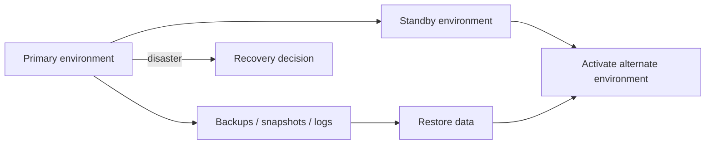

# Disaster Recovery Basics

## 1. Overview

Disaster recovery, usually shortened to DR, is the discipline of restoring service and trustworthy data after failures severe enough that ordinary failover and local redundancy are no longer sufficient.

This is an important distinction.

High availability is about staying up through common failures.

Disaster recovery is about getting back after uncommon but severe failures.

Examples include:

- regional loss
- destructive operator error
- ransomware
- widespread data corruption
- failed deployments with irreversible state damage

A lot of teams assume that:

- replication
- multi-AZ deployment
- a standby region

automatically means disaster recovery is solved.

That is usually false.

Disaster recovery is not just "having a backup" or "having another region."

It is a full operational and technical capability involving:

- backup correctness
- restore speed
- data integrity
- recovery procedures
- decision-making under crisis

When designed well, DR gives the organization a credible answer to:

- how much data can we lose
- how long can we be down
- how do we prove restored systems are trustworthy

When designed poorly, DR exists mainly as optimism in documentation.

## 2. The Core Problem

Ordinary high-availability mechanisms handle many failures well:

- one node dies
- one zone is impaired
- one instance becomes unhealthy

But there are failures those mechanisms do not solve cleanly:

- corrupted data replicated everywhere
- accidental mass deletion
- compromised credentials wiping live environments
- region-wide infrastructure loss
- backups that exist but cannot be restored quickly or correctly

So the real disaster-recovery problem is:

How does a system restore both service and confidence in its data after a failure that has already escaped normal fault-tolerance assumptions?

That is a different class of problem from failover.

Failover assumes some healthy live path still exists.

Disaster recovery often assumes:

- the healthy live path may not exist
- the wrong state may have spread
- the team may need to rebuild and validate from preserved recovery assets

## 3. Visual Model

What to notice:

- disaster recovery depends on assets prepared before the incident
- a standby environment and a clean restore source solve different parts of the problem
- restoration is not complete until both service and trustworthy data are available

## 4. Formal Statement

Disaster recovery is the set of technical and operational practices used to restore required service capability and trustworthy data after severe failure scenarios that cannot be handled by ordinary high-availability mechanisms alone.

A serious DR design has to define:

- recovery point objective
- recovery time objective
- backup and snapshot strategy
- alternate environment readiness
- restore validation procedure
- declaration and activation process

The crucial word here is "trustworthy."

Bringing a system back online quickly is not sufficient if the data is corrupted, incomplete, or semantically unsafe.

## 5. Key Terms

### 5.1 Recovery Point Objective (RPO)

RPO is the maximum acceptable amount of data loss measured backward from the incident point.

If the RPO is 15 minutes, the business is saying:

we can lose at most 15 minutes of data.

### 5.2 Recovery Time Objective (RTO)

RTO is the maximum acceptable time to restore required service capability.

If the RTO is two hours, the system must be operational again within that window.

### 5.3 Backup

A backup is a preserved copy of data intended for recovery.

Backups are useful only if they are:

- recent enough
- valid
- restorable

### 5.4 Snapshot

A snapshot is a point-in-time copy of data or volume state that can often be restored more quickly than reconstructing everything from raw exports.

### 5.5 Hot, Warm, and Cold Standby

Hot standby:

- highly ready
- low recovery time
- high cost

Warm standby:

- partially prepared
- moderate recovery time

Cold standby:

- minimal live cost
- slower recovery

### 5.6 Restore Validation

Restore validation is the proof that recovered data and systems are actually correct and usable.

This is often the missing part of immature DR strategies.

### 5.7 Isolated Recovery Asset

A recovery asset is isolated if it is protected from the same failure that damaged the primary environment.

This matters for ransomware, credential compromise, and destructive automation.

## 6. Why the Constraint Exists

Disaster recovery exists because replication and redundancy can propagate bad state just as efficiently as good state.

If an operator accidentally deletes critical data and that deletion replicates everywhere, live redundancy does not help much.

If ransomware encrypts production and backup credentials are also compromised, nominal backup existence does not guarantee recoverability.

If a region fails completely, multi-AZ architecture inside that region is irrelevant.

The constraint exists because disaster scenarios are exactly the cases where:

- assumptions about local redundancy fail
- recovery may depend on assets not currently in the request path
- the team has to reconstruct a safe state under uncertainty

This is why DR must be designed against real failure modes rather than aspirational architecture diagrams.

## 7. Main Variants or Modes

### 7.1 Backup-and-Restore

The system restores data and infrastructure from backups after the incident.

Strengths:

- lower steady-state cost
- straightforward conceptual model

Costs:

- slower recovery
- higher dependence on restore automation and validation

### 7.2 Warm Standby

An alternate environment exists in partially ready form.

Strengths:

- faster activation than cold restore
- often good balance of cost and readiness

Costs:

- still requires data restoration or synchronization checks
- more ongoing operational overhead than cold backup-only recovery

### 7.3 Hot Standby

A more fully prepared alternate environment is ready to serve sooner.

Strengths:

- lower RTO
- better fit for critical systems

Costs:

- higher cost
- can create false confidence if data validation and failover discipline are weak

### 7.4 Point-in-Time Recovery

The system restores to a specific point before corruption or deletion.

Strengths:

- useful against operator error and logical corruption

Costs:

- requires log retention and careful restore tooling
- requires choosing a correct recovery point under pressure

### 7.5 Isolated Recovery Environment

Some systems maintain more isolated recovery paths or recovery accounts specifically to survive credential compromise or malicious destruction.

Strengths:

- stronger resilience to control-plane or account compromise

Costs:

- more operational setup
- stricter process requirements

## 8. Supporting Mechanisms and Related Ideas

### 8.1 Backups and Snapshot Policy

DR starts with what is actually preserved:

- how often
- how long
- where
- under what access controls

### 8.2 Replication

Replication may support DR, but it is not the same thing as DR.

It can:

- reduce data loss
- help with standby readiness

and still be insufficient against corruption or malicious change.

### 8.3 Restore Testing

Untested restore paths are one of the most common DR weaknesses.

The backup may exist and the organization may still fail to recover in time.

### 8.4 Infrastructure as Code

The faster the environment can be reconstructed reproducibly, the better the DR posture usually is.

### 8.5 Runbooks and Decision Authority

During a disaster, the team needs to know:

- who declares DR mode
- which runbook applies
- which system of truth determines the chosen recovery point

### 8.6 Integrity Validation

Recovery should validate:

- data completeness
- service functionality
- critical business invariants

before declaring success.

## 9. Real-World Examples

### Region Loss

A primary region becomes unavailable for a prolonged period.

The organization restores or activates service in another region using:

- infrastructure templates
- replicated or restored data
- traffic steering changes

This is a classic DR scenario because ordinary local failover is no longer enough.

### Ransomware or Credential Compromise

Live systems and ordinary replicas may all be affected.

Recovery depends on isolated backups, clean credentials, and a trustworthy alternate recovery path.

This is exactly the kind of scenario that exposes the difference between:

- having backups
- and having recoverable backups

### Accidental Data Deletion

A destructive application bug or operator mistake removes important records.

Point-in-time recovery or restored snapshots may be the only way to recover cleanly without keeping the corrupted state.

### Compliance- or Revenue-Critical Systems

For systems where long downtime or data loss is unacceptable, DR planning often includes:

- tested standby environments
- frequent drills
- explicit RPO/RTO commitments

because business impact is too large to rely on untested restore paths.

## 10. Common Misconceptions

### "Replication Is Disaster Recovery"

Wrong.

Replication is excellent for some availability problems and can replicate corruption just as effectively as healthy data.

### "Backups Mean We Are Safe"

Only if they are:

- isolated enough
- recent enough
- restorable fast enough
- validated

### "DR Is Mainly an Infrastructure Topic"

Wrong.

Data integrity, business validation, and operator decision-making are just as important.

### "Hot Standby Eliminates the Need for Restore Planning"

Wrong.

Some incidents require data rollback, point-in-time restore, or integrity validation even when alternate infrastructure is live.

### "If We Have RPO and RTO Numbers, We Have DR"

Not by themselves.

Those numbers matter only if the system and the team can actually meet them.

## 11. Design Guidance

The best DR design begins with explicit business impact questions:

- how much data loss is acceptable
- how long can the system be unavailable
- which capabilities must return first

### Prefer

- clear RPO and RTO targets
- tested restore procedures
- isolated backup and recovery assets
- regular DR drills
- validation steps that prove business correctness after recovery

### Be Careful About

- assuming replication solves corruption
- keeping backups in the same trust domain as production destruction paths
- documenting DR without rehearsing it
- measuring only infrastructure recovery while ignoring application correctness

### Questions Worth Asking

- can we restore to a known-good point
- how long does full restore actually take
- what data validation proves the restored system is safe
- who decides when to trigger DR
- can one compromised credential destroy both production and recovery assets

### Practical Heuristic

If a DR plan has never been exercised under realistic conditions, it should be treated as partially unproven regardless of how complete it looks on paper.

## 12. Reusable Takeaways

- Disaster recovery begins before the incident, not during it.
- RPO and RTO are business constraints expressed as technical recovery design.
- Replication and backup solve different problems.
- Restore validation is just as important as restore mechanics.
- Isolated recovery assets matter for corruption and compromise scenarios.
- Untested DR plans are usually much weaker than teams assume.

## 13. Summary

Disaster recovery is the discipline of restoring service and trustworthy data after severe failures beyond the reach of ordinary high-availability mechanisms.

The benefit is survivability under the incidents that matter most.

The tradeoff is ongoing investment in:

- backup design
- restore tooling
- alternate environment readiness
- operational rehearsal

That investment is worth making because the hardest incidents are exactly the ones where untested assumptions fail fastest.
