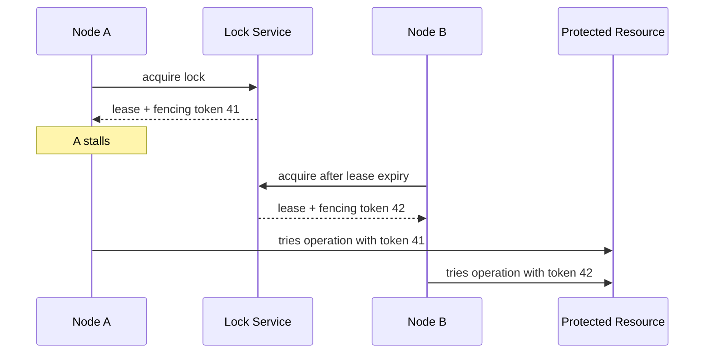

# Distributed Locks

## 1. Overview

Distributed locks are coordination mechanisms used to ensure that only one participant at a time performs some protected action across multiple processes or machines.

That sounds similar to a local mutex and is one reason teams often underestimate the topic.

A local mutex solves exclusivity inside one process with:

- one memory space
- one kernel
- one timing domain

A distributed lock has none of those advantages.

It must work across:

- separate machines
- network delay
- crash recovery
- partitions
- uncertain timing

That means a distributed lock is not just "a mutex over the network."

It is really an attempt to create temporary exclusive authority in an environment where participants can become slow, stale, partitioned, or confused about whether they still own that authority.

This matters for tasks such as:

- singleton schedulers
- once-only maintenance jobs
- exclusive access to shared external resources
- short-term ownership of a coordination responsibility

When designed well, distributed locks are a practical coordination tool.

When designed poorly, they create a dangerous illusion of safety while stale holders continue acting after the lock should have moved.

That illusion is one of the main reasons this topic needs careful treatment.

## 2. The Core Problem

Suppose two independent workers can both run the same job.

The job must happen only once.

Without coordination:

- both workers may run it

In one process, you would use a mutex.

In a distributed system, that is not enough because:

- one node may acquire the lock and then pause
- the network may partition
- the lock service may think the lease expired
- another node may acquire a new lease
- the old node may still continue acting

So the real problem is not only:

How do we grant exclusivity?

It is:

How do we grant exclusivity in a way that remains safe when the old holder may still exist and still try to act?

That distinction is what makes distributed locks hard.

## 3. Visual Model

What to notice:

- the real risk is stale authority, not just simultaneous acquisition
- lease expiry by itself does not stop an old holder from acting
- downstream protection often needs fencing or version checks

## 4. Formal Statement

A distributed lock is a coordination protocol or service that grants temporary exclusive access or authority over a resource, workflow, or critical section to one distributed participant at a time.

A serious distributed lock design has to define:

- how ownership is acquired
- how ownership is identified
- how ownership expires or is renewed
- how stale ownership is detected or fenced
- what guarantees exist under crash and partition

The critical design point is that distributed locks are usually really leases.

They are time-bounded and uncertainty-bounded claims, not perfect indefinite ownership.

## 5. Key Terms

### 5.1 Lock Holder

The current participant that believes it owns the lock.

### 5.2 Lease

A lease is a time-bounded lock grant that expires unless renewed.

Most distributed locks are lease-based in practice.

### 5.3 Fencing Token

A fencing token is a monotonically increasing token issued on lock acquisition.

It lets downstream systems reject stale actors even if those actors still believe they own the lock.

### 5.4 Expiry

The moment at which the lock lease is no longer considered valid unless it has been renewed.

### 5.5 Renewal

The act of extending the lock lease before expiry.

### 5.6 Stale Holder

A stale holder is an old lock owner that continues operating after its valid authority has already expired or been superseded.

### 5.7 Reentrancy

Reentrancy means the same holder can reacquire or reuse its lock safely.

This matters less often than in local mutex design, but can still be relevant.

## 6. Why the Constraint Exists

Distributed systems cannot instantly stop a participant from acting the moment its authority becomes invalid.

Suppose node A acquires a lock for a critical job.

Then:

- node A pauses due to GC or scheduler stall
- its lease expires
- node B acquires the lock

If node A resumes later and still performs the job, both A and B may act as if they validly own the critical section.

This is the central reason distributed locking is harder than local locking.

The lock service may know the truth.

The old lock holder may not.

The constraint exists because coordination state and local participant state can diverge under timing and failure.

That means a safe distributed lock must often involve not only:

- lock acquisition

but also:

- stale-owner rejection at the resource being protected

## 7. Main Variants or Modes

### 7.1 Coordination-Service Locks

Locks are managed by a coordination system such as etcd or ZooKeeper.

Strengths:

- stronger safety foundations
- well-suited for correctness-sensitive coordination

Costs:

- extra infrastructure
- coordination latency
- still requires application discipline around stale holders

### 7.2 Database-Based Locks

Some systems use:

- row locks
- advisory locks
- lock tables

Strengths:

- operational simplicity if a strong database already exists
- often easier to reason about than ad hoc cache-based locks

Costs:

- can create contention on the database
- semantics depend on database and transaction behavior

### 7.3 Cache or Key-Store Locks

Some systems use Redis-like key stores for lock-like behavior.

Strengths:

- simple and fast

Costs:

- correctness depends heavily on precise failure assumptions
- can be unsafe if used casually for high-correctness coordination

### 7.4 Leader-Like Locking

Sometimes the "lock" is really temporary ownership of a broader responsibility:

- active scheduler
- compaction owner
- cleanup leader

This often behaves more like lightweight leadership than a tiny critical section.

### 7.5 Fenced Locking

This pattern pairs lock acquisition with a fencing token checked by the protected resource.

Strengths:

- much stronger protection against stale holders

Costs:

- downstream resource must participate in token validation

## 8. Supporting Mechanisms and Related Ideas

### 8.1 Fencing Tokens

This is one of the most important supporting ideas in safe distributed locking.

Without fencing, the system may detect lease expiry and still be unable to stop a stale holder from acting.

### 8.2 Leader Election

Leader election often resembles lock acquisition, but leadership usually has broader semantics than a narrow critical section.

### 8.3 Idempotency

If the protected action can be made idempotent, the damage from lock failure is reduced.

This is not a substitute for good locking. It is valuable additional safety.

### 8.4 Time and Clock Assumptions

Lease-based designs rely on time.

That makes them sensitive to:

- pause behavior
- clock drift assumptions
- renewal timing margins

### 8.5 Observability

Good lock systems expose:

- acquisition latency
- renewal success
- expiry rate
- fencing violations
- holder identity

Without this, lock-related failures are often very hard to diagnose.

## 9. Real-World Examples

### Cron Job Ownership

Multiple service instances may be capable of running the same scheduled task.

A distributed lock ensures only one instance performs:

- billing run
- report generation
- cleanup pass

This is a good fit because the action is logically singleton in the cluster.

### Exclusive Access to a Shared External Resource

If two workers must not concurrently issue a state-changing operation to:

- a payment settlement endpoint
- a third-party admin API
- a scarce hardware device

a distributed lock can serialize access.

### Temporary Ownership of a Coordination Role

A node may hold the lock for:

- compaction coordination
- partition cleanup
- cache warming ownership

This shows how distributed locks often evolve into "temporary authority" patterns.

### Migration or Schema Change Control

Some teams use distributed locks so only one rollout controller performs a migration step at a time.

This can work, but only if the migration semantics tolerate lease and stale-holder realities.

## 10. Common Misconceptions

### "A Distributed Lock Is Just a Mutex Over the Network"

Wrong.

Failure, timing, and stale ownership make it much harder.

### "If the Lock Service Granted It, Safety Is Solved"

Not necessarily.

The protected resource may still need fencing or version checks.

### "Lease Expiry Alone Prevents Duplicate Action"

Wrong.

An expired holder may still run if nothing downstream rejects it.

### "Fast Lock Acquisition Means Good Lock Design"

Not for correctness-sensitive use cases.

Safety under failure matters more than happy-path speed.

### "Any Shared Store Can Be a Lock Service"

Only if its failure and consistency behavior actually match the coordination guarantees you need.

## 11. Design Guidance

The best question is:

What damage happens if a stale holder continues acting after the system believes ownership changed?

If the answer is severe, the lock design must include stale-holder defenses, not only acquisition logic.

### Strong Fits

- singleton scheduled work
- exclusive coordination ownership
- access to a resource that truly must not be used concurrently

### Weak Fits

- workflows that could be designed idempotently instead
- correctness-critical systems using weak lock implementations without fencing
- cases where the lock becomes a substitute for better data-model design

### Prefer

- leases, not indefinite ownership assumptions
- fencing tokens for sensitive actions
- explicit visibility into holder identity and renewal state
- idempotent protected actions where possible

### Questions Worth Asking

- what proves the lock is still valid
- how are stale holders rejected
- what happens if the holder pauses or partitions
- does the protected resource understand fencing

### Practical Heuristic

If stale ownership would be catastrophic, prefer coordination systems and downstream fencing over lightweight lock shortcuts.

## 12. Reusable Takeaways

- Distributed locks are temporary authority systems, not just remote mutexes.
- Lease expiry alone does not stop stale holders from acting.
- Fencing is often the difference between apparent exclusivity and real safety.
- Lock implementation choice must match the failure model of the protected action.
- Idempotency and observability make distributed lock usage far safer.

## 13. Summary

Distributed locks are a way to grant one participant exclusive temporary authority over a shared action or resource across machines.

The benefit is controlled exclusivity in a distributed environment.

The tradeoff is that correctness now depends on:

- lease handling
- stale-holder protection
- failure semantics

That is why good distributed locking is mostly about what happens after ownership becomes uncertain, not just how fast the lock is acquired.
