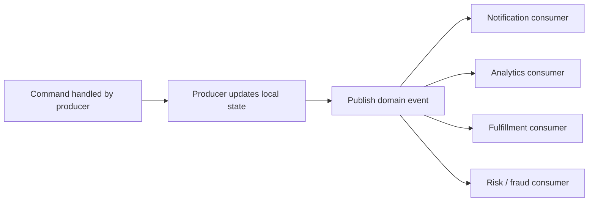

# Event-Driven Architecture

## 1. Overview

Event-driven architecture is a design style in which components react to events instead of coordinating every interaction through direct synchronous calls.

The phrase is used often and loosely, so it helps to be precise.

An event-driven system is not merely a system that has a queue somewhere.

It is a system where important changes are represented as events and downstream behavior is allowed to emerge from those events asynchronously.

That has major consequences for:

- coupling
- latency
- failure propagation
- scalability
- observability
- data consistency

At its best, event-driven architecture lets a producer focus on its own responsibility while many consumers react independently without creating a web of tightly coupled direct integrations.

At its worst, it becomes a vague slogan under which systems publish too many events, lose track of ownership, and turn debugging into archaeology.

This is why event-driven architecture is powerful and dangerous at the same time.

It is powerful because it decouples time and execution.

The producer can say:

This happened.

And it does not need to synchronously coordinate every consequence in the same request path.

It is dangerous because once consequences are asynchronous, they become less immediately visible:

- lag matters
- ordering matters
- retries matter
- duplicates matter
- contracts matter

That means the architecture shifts complexity away from immediate runtime coupling and toward:

- messaging guarantees
- consumer correctness
- event evolution
- operational discipline

Engineers often like the first part and underestimate the second.

## 2. The Core Problem

Many systems begin with direct request-response interactions.

A service receives a command and then directly calls the other services it needs.

For small workflows, that can be entirely reasonable.

But the model degrades when one action starts triggering many downstream reactions.

Suppose an order is created.

Now several things may need to happen:

- reserve inventory
- authorize payment
- send confirmation email
- update analytics
- notify fraud systems
- trigger recommendation updates

If the order service calls all of those dependencies synchronously, several problems appear:

- the request path becomes long
- failure in one downstream system can block the whole operation
- the producer becomes coupled to every consumer
- adding a new reaction means editing the original service
- traffic spikes propagate immediately into every dependency

The problem event-driven architecture solves is not simply fan-out.

The deeper problem is:

How can a system represent business facts in a way that lets independent components react without forcing the original producer to become the orchestrator of all downstream behavior?

That matters because large systems often need both:

- independent team ownership
- many side effects per important business action

Without a better communication model, direct integration turns those needs into a distributed monolith.

## 3. Visual Model

What to notice:

- the producer commits its own responsibility first and publishes a fact about what happened
- consumers own their own reactions instead of being directly orchestrated by the producer
- system behavior becomes more extensible, but also more asynchronous and operationally distributed

## 4. Formal Statement

Event-driven architecture is an architectural model in which components communicate and coordinate primarily through events that represent completed state changes, domain facts, or significant system transitions, with downstream components reacting asynchronously based on subscription, routing, or workflow logic.

A real event-driven design has to define:

- what counts as an event
- who owns event publication
- which consumers subscribe or react
- what delivery guarantees exist
- how ordering is handled
- how duplicates are tolerated
- how events evolve over time
- how failures and lag are observed

The phrase "primarily through events" matters here.

Most real systems are hybrid.

They still use synchronous APIs where immediate response semantics are required.

Event-driven architecture becomes important when asynchronous facts, not just synchronous calls, become a primary coordination mechanism in the system.

## 5. Key Terms

### 5.1 Event

An event is a record that something has already happened.

Good events usually describe facts, not requests.

Examples:

- `order_created`
- `payment_authorized`
- `subscription_renewed`

Bad event designs often look like remote procedure calls disguised as events, such as:

- `send_email_now`
- `run_recommendation_job`

The distinction matters because facts are stable. Imperative instructions create tighter semantic coupling.

### 5.2 Producer

The producer is the component that emits the event.

It owns the business context that makes the event true.

### 5.3 Consumer

A consumer reacts to the event.

Different consumers may interpret the same event for different purposes:

- notification
- analytics
- enrichment
- workflow progression

### 5.4 Event Contract

The event contract defines:

- schema
- field meaning
- semantic guarantees
- versioning expectations

In mature systems, event contracts are treated with the same seriousness as APIs.

### 5.5 Broker or Event Bus

The broker or bus transports events from producers to consumers.

Its role may include:

- persistence
- fan-out
- ordering within partitions
- replay
- subscription management

### 5.6 At-Least-Once Delivery

Many event-driven systems deliver events at least once, which means consumers may see duplicates.

This makes idempotency central.

### 5.7 Eventual Convergence

Different consumers may observe and apply effects at different times.

The system converges over time rather than through one globally synchronous commit.

### 5.8 Event Lag

Lag is the delay between event publication and consumer handling.

Lag is one of the most important operational signals in event-driven systems.

## 6. Why the Constraint Exists

The constraint exists because synchronous coordination does not scale cleanly across many independent responsibilities.

Suppose a user signs up.

Many downstream reactions may follow:

- create CRM record
- send welcome email
- provision trial account
- trigger analytics
- schedule onboarding tasks

If the signup request waits for all of that:

- user-facing latency increases
- one slow system delays the whole operation
- every downstream dependency becomes part of the critical path

Now imagine the business keeps growing.

New consumers are added:

- fraud heuristics
- A/B experiment enrollment
- recommendation cold start
- marketing attribution

At some point, the signup service is no longer mainly a signup service.

It becomes a central coordinator for many unrelated concerns.

Event-driven architecture exists because systems need a way to let one important fact generate many consequences without forcing those consequences into the same synchronous execution model.

But the counter-pressure is correctness.

Once things become asynchronous:

- not every consumer runs immediately
- some consumers may fail and retry
- some views become temporarily stale
- event ordering may vary across keys or partitions

So the constraint is unavoidable:

event-driven architecture reduces direct runtime coupling by accepting delayed coordination and more distributed operational complexity.

## 7. Main Variants or Modes

### 7.1 Domain Events

These describe meaningful business facts inside or across services.

Examples:

- `invoice_paid`
- `order_cancelled`
- `shipment_delivered`

Strengths:

- good alignment with business language
- useful for multiple consumers
- often durable and reusable

Costs:

- require semantic discipline
- easily overproduced if every state mutation becomes an event without purpose

### 7.2 Integration Events

These are events shaped specifically for inter-service or external consumption.

They may differ from internal domain events because they are designed for:

- compatibility
- stable contracts
- limited consumer assumptions

Strengths:

- cleaner external contracts
- less leakage of internal models

Costs:

- extra translation work
- possible duplication between internal and external event forms

### 7.3 Event Notification

The event says something changed, and consumers fetch additional details separately.

Strengths:

- smaller event payloads
- simpler schema evolution

Costs:

- extra round trips
- more dependency on read APIs during processing

### 7.4 Event-Carried State Transfer

The event contains enough data for consumers to act without immediate follow-up reads.

Strengths:

- lower consumer dependency on the producer
- faster downstream processing

Costs:

- larger contracts
- more field evolution risk
- more chance of semantic drift

### 7.5 Choreographed Event Flows

Consumers react to events and emit new events, creating a chain of behavior without one central controller.

Strengths:

- high autonomy
- loose coupling

Costs:

- harder workflow visibility
- harder debugging
- more risk of hidden distributed process complexity

### 7.6 Event-Driven with Explicit Orchestration

Some systems still use events, but workflow progression is coordinated explicitly by one orchestrator.

Strengths:

- better visibility
- easier workflow control

Costs:

- more central coordination logic
- less autonomy for each participant

This is a useful reminder that event-driven architecture and choreography are not the same thing.

## 8. Supporting Mechanisms and Related Ideas

### 8.1 Pub/Sub

Pub/sub is a common transport or distribution pattern for event-driven architecture, especially when one event should reach multiple consumers.

But event-driven architecture is broader than pub/sub.

It includes the modeling of:

- facts
- ownership
- eventual effects
- contract evolution

### 8.2 Outbox Pattern

If a service writes local state and also publishes an event, the outbox pattern is often needed to avoid dual-write inconsistency.

This is one of the most important production-grade mechanisms in event-driven systems.

### 8.3 Idempotent Consumers

Because duplicates and retries are normal, consumers must be designed to process safely more than once or detect already-processed work.

### 8.4 Dead Letter Handling

Some events will repeatedly fail consumer handling due to:

- bad payloads
- invalid assumptions
- poison records

Dead letter queues or equivalent isolation mechanisms keep one bad event from blocking everything indefinitely.

### 8.5 Event Schema Evolution

Consumers and producers often evolve independently.

That means:

- events need compatibility discipline
- field semantics matter
- deprecation strategy matters

### 8.6 Observability

Event-driven systems need different observability than synchronous RPC systems.

Important signals include:

- publication failures
- consumer lag
- retry counts
- dead-letter rate
- end-to-end workflow latency

Without these, the system appears to work until it silently stops converging in time.

## 9. Real-World Examples

### E-Commerce Order Processing

When an order is created, several consumers may react independently:

- email confirmation
- fulfillment initiation
- analytics recording
- fraud review
- customer timeline update

This is a strong fit for event-driven architecture because the order service should not directly own every downstream responsibility.

The tradeoff is that the platform must now reason about:

- which effects are critical
- which are eventually consistent
- which consumers can lag without harming the user experience

### User Activity Pipelines

User behavior events such as:

- signed up
- watched video
- started trial
- clicked promotion

often feed many downstream systems:

- personalization
- analytics
- lifecycle marketing
- experimentation

This is one of the most natural event-driven workloads because fan-out is large and many consumers are independent.

### Internal Platform Automation

Infrastructure or platform events can trigger:

- audit recording
- policy checks
- notifications
- inventory updates
- provisioning workflows

This is useful when the platform wants extensibility without coupling the initiating service to every operational reaction.

### Billing and Entitlement Updates

Subscription state changes may need to update:

- access entitlements
- invoicing
- customer messaging
- revenue analytics

This is a good example where event-driven architecture helps, but only if the system is very clear about which effect must be visible immediately and which can converge later.

## 10. Common Misconceptions

### "Event-Driven Means No Synchronous Calls"

Wrong.

Most healthy systems use both.

Synchronous calls are still appropriate when:

- the caller needs immediate result semantics
- the operation is interactive and user-facing
- the dependency truly belongs in the critical path

### "Publishing an Event Removes Coupling"

Only partly.

It removes direct runtime coupling between producer and consumer.

It does not remove:

- schema coupling
- semantic coupling
- operational dependency on the broker or event platform

### "Asynchronous Means More Reliable"

Not automatically.

It changes the failure model.

Instead of immediate RPC failures, the system gets:

- lag
- duplicates
- poison messages
- replay issues
- delayed inconsistency

### "Everything Should Be Event-Driven"

No.

Some workflows are clearer and safer as direct synchronous operations.

Event-driven design should be used where decoupling and asynchronous reaction are actually valuable.

### "Events Should Just Mirror Database Changes"

Usually this is too naive.

Good events represent meaningful facts, not arbitrary storage mutations without business context.

## 11. Design Guidance

The first design question should be:

What business facts deserve independent downstream reaction?

That question is much better than asking whether the system should "be event-driven."

### Strong Fits

- one action triggers many downstream consumers
- downstream reactions do not all need to finish in the request path
- new consumers are added over time
- decoupled team ownership matters
- eventual consistency is acceptable for some effects

### Weak Fits

- strict global ordering is required across all effects
- the caller needs immediate transactional confirmation of every consequence
- the team lacks observability and operational maturity for asynchronous systems
- consumers are so tightly coupled that the event model becomes performative rather than useful

### Questions Worth Asking

- what event represents the business fact cleanly
- who owns that event contract
- what delivery guarantee is assumed
- which consumers require idempotency
- what lag is acceptable
- how will the system know when consumers are silently falling behind

### A Useful Heuristic

If the producer is mainly trying to avoid directly calling a growing list of unrelated downstream responsibilities, event-driven architecture is probably worth serious consideration.

If the producer still needs synchronous knowledge of every effect before returning success, events may not be the right primary coordination model.

## 12. Reusable Takeaways

- Event-driven architecture is about reacting to facts asynchronously, not just adding a queue to the design.
- It reduces direct runtime coupling while increasing contract and operational complexity.
- Good events describe what happened, not what some other service should do.
- Outbox, idempotency, and consumer lag visibility are central to production-grade event-driven systems.
- Choreography and orchestration are different workflow styles that can both exist in event-driven architectures.
- Event-driven systems are strongest where fan-out and decoupled ownership matter more than immediate global consistency.

## 13. Summary

Event-driven architecture lets systems communicate through durable facts rather than coordinating every downstream effect through direct synchronous calls.

The gain is extensibility, loose coupling, and scalable asynchronous fan-out.

The tradeoff is that the system must now manage:

- delivery guarantees
- event contracts
- duplicates
- lag
- eventual convergence

When those concerns are designed explicitly, event-driven architecture becomes a powerful way to let systems evolve without turning one service into the owner of everything that happens next.
