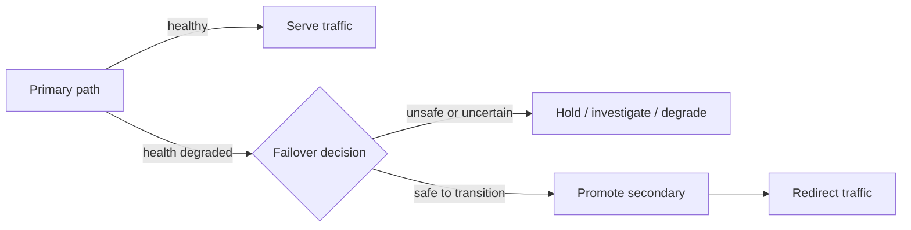

# Failover Strategies

## 1. Overview

Failover is the process of moving traffic, leadership, or workload ownership away from an unhealthy primary path to a healthy alternate path.

That sounds straightforward until the system has to decide:

- when the primary is truly unhealthy
- who is allowed to make that decision
- whether the standby is actually safe to promote
- how to avoid having two primaries at once

This is why failover is not the same thing as redundancy.

Redundancy means extra capacity or extra components exist.

Failover means the system can transition to those alternatives under uncertainty.

That uncertainty is what makes failover one of the most important and one of the most subtle topics in distributed systems.

When designed well, failover reduces outage duration and limits blast radius.

When designed poorly, failover can turn a partial incident into:

- split brain
- stale data exposure
- conflicting writers
- traffic flapping
- repeated promotion and demotion cycles

In other words, the wrong failover can be worse than the original failure.

## 2. The Core Problem

Systems rarely fail in a perfectly clean way.

Possible states include:

- hard crash
- process alive but unresponsive
- network partition
- slow I/O
- stale replica
- overloaded but not dead

From the perspective of another component, several of these can look similar.

For example:

- a node may be down
- a node may be unreachable only from one subnet
- a node may be alive but too slow to be useful
- a node may have accepted writes that replicas have not caught up to

The failover problem therefore has two parts:

1. Detecting when the current primary path should stop being trusted.
2. Transitioning to an alternate path without violating correctness.

This is why failover design is not mostly about "which machine takes over."

It is mostly about:

- failure detection quality
- authority to transition
- state freshness
- routing safety

## 3. Visual Model

What to notice:

- failover is a decision pipeline, not a binary toggle
- "primary unhealthy" does not automatically imply "secondary safe"
- safe routing change depends on both health and state confidence

## 4. Formal Statement

A failover strategy is the policy and mechanism by which a system detects degradation or failure in a primary path and transitions service, traffic, or control to an alternate path while preserving the required availability and safety guarantees.

A serious failover design has to define:

- health and failure signals
- who declares failover
- which alternate path is eligible
- how stale state is handled
- how traffic is switched
- how split brain is prevented
- how recovery and failback are managed

The key phrase is "required availability and safety guarantees."

Different systems make different tradeoffs.

A stateless frontend may fail over quickly with little correctness risk.

A stateful primary database cannot.

## 5. Key Terms

### 5.1 Active-Passive

One path is serving live traffic while another is prepared to take over.

This is the simplest mental model for many failover systems.

### 5.2 Active-Active

Multiple paths serve live traffic at the same time.

This reduces some failover friction, but it also changes the consistency and coordination model.

### 5.3 Promotion

The act of making a secondary eligible to become the new primary.

### 5.4 Fencing

A mechanism that prevents the old primary from continuing to act as authoritative after failover.

This is essential in stateful systems.

### 5.5 Split Brain

A condition where two components both believe they are the valid primary and both accept traffic or writes.

### 5.6 Failback

The controlled return of traffic or authority to the preferred original path after recovery.

### 5.7 RTO and Safety Budget

Recovery time objective affects how quickly the system should recover.

Safety budget is the degree of correctness risk the system is willing to tolerate during transition.

Many failover strategies are really attempts to balance those two forces.

## 6. Why the Constraint Exists

The system never observes failure from an all-knowing perspective.

It observes through:

- heartbeats
- health checks
- replication lag
- request timeouts
- network paths
- control-plane signals

All of those can be misleading.

Suppose a primary database becomes unreachable from the orchestrator but is still reachable from some clients.

If the orchestrator promotes a replica immediately and the old primary continues accepting writes, the system may create divergent histories.

Now consider the opposite mistake.

Suppose the primary really is dead, but the system is too conservative and never promotes a healthy replica.

Then redundancy existed but availability was still lost.

This is the central failover tension:

- fail too early and risk wrong transition
- fail too late and prolong outage

That tension cannot be eliminated. It can only be managed with better signals, stronger fencing, and a design appropriate to the workload.

## 7. Main Variants or Modes

### 7.1 Manual Failover

An operator reviews the situation and triggers the transition.

Strengths:

- lower risk of false promotion in sensitive systems
- human judgment can incorporate context automation does not yet understand

Costs:

- slower recovery
- operational dependence on people and runbooks
- more variability under pressure

Manual failover is more common in systems where a wrong failover is very expensive.

### 7.2 Automatic Failover

The platform promotes an alternate automatically based on predefined rules.

Strengths:

- faster recovery
- consistent execution
- less dependence on operator reaction time

Costs:

- sensitive to bad health signals
- harder to tune across all incident shapes
- more dangerous without strong fencing and eligibility checks

Automatic failover is attractive, but it is only safe if the state and authority model are well-defined.

### 7.3 Stateless Traffic Failover

This applies to components such as:

- web servers
- API instances
- read-only services

Traffic is removed from unhealthy nodes and shifted to healthy ones.

Strengths:

- relatively low correctness risk
- simple to automate

Costs:

- still vulnerable to bad health checks or cascading overload

### 7.4 Stateful Primary Failover

This applies to:

- primary databases
- message partition leaders
- metadata stores
- coordination services

Strengths:

- restores progress after primary loss

Costs:

- correctness risk is much higher
- replica freshness matters
- fencing matters
- write divergence matters

### 7.5 Regional Failover

Entire traffic classes move from one region to another.

Strengths:

- protects against large blast-radius failures

Costs:

- DNS or traffic propagation delay
- capacity planning in alternate region
- cross-region data freshness questions

## 8. Supporting Mechanisms and Related Ideas

### 8.1 Health Checks

A failover system is only as good as its health signals.

Common checks include:

- process liveness
- readiness
- dependency health
- synthetic request success
- replication lag thresholds

Liveness alone is usually insufficient for stateful failover decisions.

### 8.2 Quorum and Leases

Many stateful systems rely on quorum or leases to ensure that only one component can validly act as leader at a time.

This is one of the strongest defenses against split brain.

### 8.3 Replication Lag Awareness

Promoting a stale secondary may restore availability while losing acknowledged or expected data.

Failover logic therefore often needs freshness gates:

- maximum replication lag
- applied log position
- commit index
- durable checkpoint state

### 8.4 Routing Control

Failover is incomplete unless traffic actually moves.

That movement may happen through:

- load balancer configuration
- service discovery changes
- DNS changes
- client failover logic

Each mechanism has different speed and safety tradeoffs.

### 8.5 Runbooks and Drills

Many failover strategies fail not because the theory is wrong, but because the path was never exercised.

If the team has never:

- promoted the standby
- reverted traffic
- validated stale-state protections

then the failover design is still mostly hypothetical.

## 9. Real-World Examples

### Database Primary Promotion

A primary database fails or becomes unreachable.

The platform evaluates:

- whether a replica is caught up enough
- whether the old primary can be fenced
- whether clients can be redirected safely

This is a classic failover scenario because availability and correctness are both at stake.

### Load Balancer Backend Removal

An unhealthy stateless backend is removed from the traffic pool.

This is still failover, but the risk is lower because:

- instances do not own unique authoritative state
- another instance can usually serve requests immediately

This difference is important. Not every failover topic should be reasoned about like database promotion.

### Cross-Region Service Recovery

A primary region becomes degraded due to network or infrastructure failure.

Traffic shifts to a secondary region.

This may involve:

- DNS update
- global load balancer steering
- read/write topology switch
- regional capacity activation

The challenge is not only getting traffic there. It is getting traffic there safely with an acceptable view of data.

### Messaging Partition Leadership

A message log or broker cluster may fail over leadership for one partition to another node.

This is a good example of failover at smaller scope: the system is not failing over the entire cluster, only the ownership of one coordinated unit.

## 10. Common Misconceptions

### "Failover Is the Same as Having a Backup"

Wrong.

A backup component is only useful if the system knows when and how to use it safely.

### "Automatic Failover Is Always Better"

Wrong.

Fast automation is good only when the signals and eligibility checks are trustworthy enough.

For some systems, a slightly slower but safer transition is a better design.

### "If the Secondary Exists, It Can Take Over"

Not necessarily.

It may be:

- stale
- underprovisioned
- misconfigured
- missing required routes

### "Failover Solves the Incident"

Often it only changes the shape of the incident.

The system may still be in reduced capacity, degraded correctness confidence, or unstable recovery mode afterward.

### "Failback Is Easy"

Usually it is not.

After the incident:

- state may have diverged
- preferred topology may need re-establishment
- routing changes may need coordination

Failback deserves explicit design, not hope.

## 11. Design Guidance

Failover strategy should be chosen from the business cost of:

- downtime
- wrong data
- stale data
- operational complexity

### For Stateless Paths

Bias toward:

- aggressive automated removal of unhealthy nodes
- strong readiness checks
- clear overload controls

Because the correctness risk is lower, faster automatic failover is often justified.

### For Stateful Paths

Bias toward:

- stronger authority model
- freshness gating
- fencing
- conservative promotion logic
- explicit operator visibility

Because a wrong failover can corrupt or fork system state, safety often matters more than raw transition speed.

### Questions Worth Asking

- who is allowed to decide the primary is gone
- what evidence is required
- how stale can the secondary be
- what fences the old primary
- how quickly can traffic be redirected
- how will the team detect flapping transitions
- what is the failback plan

### A Practical Design Rule

The more unique authoritative state the primary owns, the more cautious the failover strategy should be.

### Another Practical Rule

If the system has never rehearsed failover under controlled conditions, it does not really have a failover strategy yet. It has documentation.

## 12. Reusable Takeaways

- Redundancy provides options; failover decides when and how to use them.
- Failure detection is fundamentally uncertain, so failover is always a tradeoff between speed and safety.
- Stateless failover and stateful failover should not be treated as the same problem.
- Fencing and freshness checks are essential in stateful transitions.
- Routing change is part of failover, not an afterthought.
- Automatic failover is only as safe as the underlying authority and health model.
- Failback deserves explicit design and rehearsal.

## 13. Summary

Failover strategies define how systems transition away from degraded primary paths toward healthy alternatives under uncertain failure conditions.

The benefit is reduced downtime and better resilience.

The cost is that the system must make hard decisions about:

- when a primary is no longer trustworthy
- whether the alternate is truly safe
- how to move traffic or leadership without creating a worse problem than the original failure

That is why good failover design is less about having a standby and more about having a disciplined transition model.
