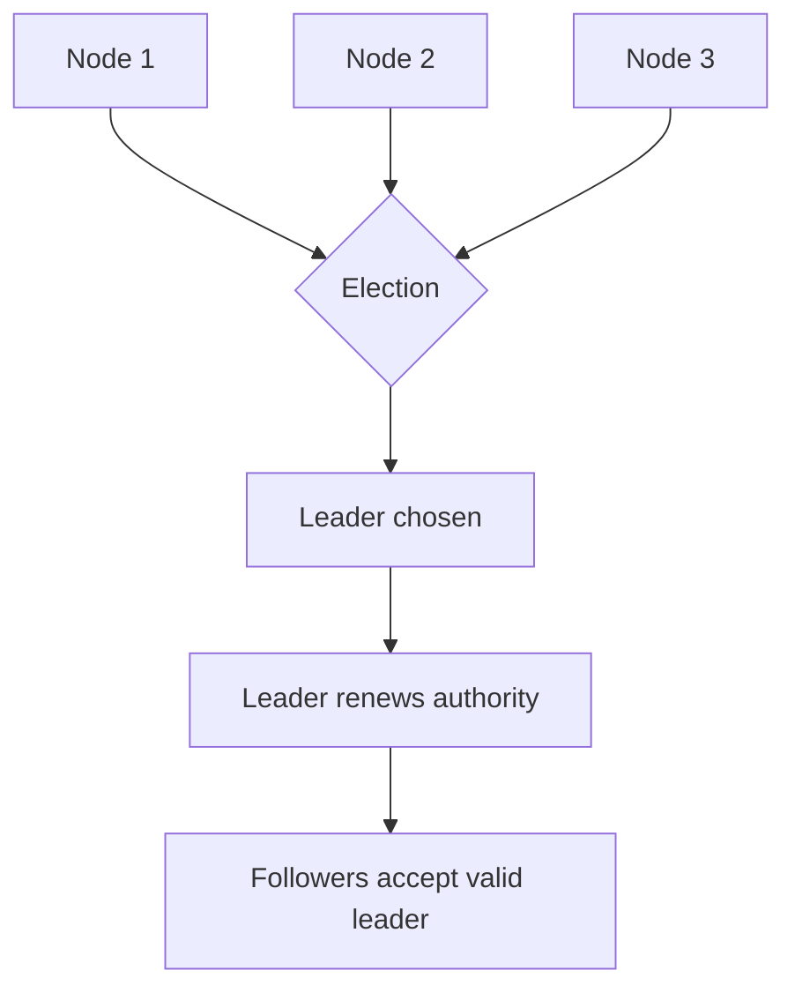

# Leader Election

## 1. Overview

Leader election is the process by which a distributed system determines which node is currently authorized to act as the leader for some shared responsibility.

That responsibility might be:

- ordering writes
- assigning work
- maintaining membership state
- coordinating metadata
- owning a control-plane role

The value of a leader is not prestige. It is simplification.

Many distributed problems become much easier to reason about when exactly one node is allowed to act as the authority for a particular function at a given time.

But that simplicity at the application level comes at a cost in the coordination layer.

The system must now decide:

- how the leader is chosen
- how other nodes recognize its authority
- when leadership has expired
- how to avoid two leaders acting at once

Leader election is therefore not just about picking a node.

It is about establishing exclusive authority under uncertain failure conditions.

When designed well, leader election makes write ordering, scheduling, and control-plane logic much easier to manage.

When designed poorly, it creates one of the most dangerous failure modes in distributed systems:

- split brain

That is why leader election deserves to be understood as a correctness mechanism, not just a cluster startup ritual.

## 2. The Core Problem

Many tasks become safer with one active coordinator.

Examples:

- one primary database ordering updates
- one scheduler assigning jobs
- one metadata leader deciding current cluster state

Without a leader, several bad things can happen:

- duplicate work assignment
- conflicting writes
- inconsistent cluster view
- racing ownership claims

So it is tempting to say:

- just choose one node

The hard part is what comes next.

What if the leader crashes?

What if the leader becomes partitioned and some nodes can still see it while others cannot?

What if a follower incorrectly suspects failure too early?

The real problem is:

How can the system maintain one valid authority over time without allowing stale or isolated nodes to continue acting as leader after they should have lost that role?

That is the actual leader election problem.

## 3. Visual Model

What to notice:

- choosing a leader once is not enough
- leadership must be maintained, observed, and invalidated safely over time
- authority is the core issue, not merely node selection

## 4. Formal Statement

Leader election is the protocol or mechanism by which distributed participants determine which node is currently authorized to act as leader for a specific role, resource set, or coordination function.

A serious leader-election design has to define:

- how candidacy starts
- how a node wins leadership
- how leadership is renewed or maintained
- how loss of leadership is detected
- how stale leaders are rejected
- how split brain is prevented

The key word is "authorized."

A node being alive is not enough.

It must also be recognized by the system as the valid current authority.

## 5. Key Terms

### 5.1 Candidate

A candidate is a node attempting to become leader.

### 5.2 Follower

A follower is a node that is not currently leader and defers to the valid elected leader.

### 5.3 Term or Epoch

A term or epoch is a monotonically increasing logical generation of leadership.

It helps the system distinguish newer leadership from stale claims.

### 5.4 Lease

A lease is a time-bounded leadership claim that must be renewed.

### 5.5 Heartbeat

A heartbeat is a periodic signal proving that the current leader is still alive and still claiming authority.

### 5.6 Split Brain

Split brain occurs when multiple nodes simultaneously believe they are valid leaders and act on that belief.

### 5.7 Fencing

Fencing is a mechanism that prevents stale leaders from continuing to act after they have lost authority.

## 6. Why the Constraint Exists

Failure detection in distributed systems is never perfect.

A node may appear dead because:

- it crashed
- it is slow
- the network path is broken
- one part of the cluster can reach it and another cannot

That uncertainty is why leader election is hard.

Suppose a leader is partitioned away from most of the cluster.

The majority elects a new leader.

If the old leader still believes it is valid and continues serving writes, the system now has two authorities.

This is why leader election is not just about choosing a replacement quickly.

It is about ensuring that a previous leader becomes invalid in practice, not only in theory.

The constraint exists because:

- authority is valuable
- authority must be exclusive
- exclusivity is difficult under partitions and timing uncertainty

## 7. Main Variants or Modes

### 7.1 Majority-Based Election

The leader must obtain support from a majority of the voting set.

Strengths:

- strong safety intuition
- helps prevent conflicting leaders

Costs:

- minority partitions cannot elect a leader
- depends on quorum availability

This is one of the most common safe patterns.

### 7.2 Lease-Based Leadership

Leadership is valid only for a bounded time unless renewed.

Strengths:

- explicit expiration model
- practical for many coordination systems

Costs:

- time and renewal behavior must be handled carefully
- stale-holder risk remains if downstream systems do not fence properly

### 7.3 External Coordination Service

Applications delegate election to a coordination system such as etcd or ZooKeeper.

Strengths:

- centralizes election mechanics
- simplifies application nodes

Costs:

- adds another critical dependency
- application correctness still depends on respecting coordination outcomes

### 7.4 Per-Partition Leadership

Some systems elect a separate leader per shard or partition instead of one global leader.

Strengths:

- better parallelism and scaling
- leadership scoped to smaller units

Costs:

- many elections to manage
- more operational complexity

### 7.5 Manual or Assisted Leadership Transition

In especially sensitive systems, humans may supervise some leadership changes.

Strengths:

- lower risk of wrong promotion

Costs:

- slower recovery
- more operational dependency

## 8. Supporting Mechanisms and Related Ideas

### 8.1 Quorum

Leader election often relies on quorum so only one sufficiently supported leader can exist.

### 8.2 Heartbeats and Failure Detection

Most election systems react to missing heartbeats or missed lease renewals.

This is useful and imperfect.

### 8.3 Terms and Epochs

Logical terms help nodes reject stale leaders and stale messages from older leadership generations.

### 8.4 Fencing Tokens

Even after leadership shifts, stale leaders may still try to act.

Fencing tokens help downstream systems reject those stale actions.

### 8.5 Replication and Commit Rules

In some systems, leadership matters only if the leader can also safely commit state with quorum support.

Leadership alone is not enough.

## 9. Real-World Examples

### Database Primary Election

A replicated database may promote one replica to primary after leader failure.

This is a strong example because:

- there must be one authoritative write path
- stale leaders are extremely dangerous
- promotion must account for freshness and fencing

### Cluster Metadata Management

A distributed system may elect one leader to own cluster membership or configuration decisions.

This makes cluster state reasoning simpler, but only if all nodes agree on who currently holds authority.

### Job Scheduling

A scheduler cluster may elect one leader to assign work so jobs are not assigned twice.

This is a useful example because the resource being coordinated is not database writes but task ownership.

### Partitioned Messaging Systems

Messaging systems often elect one leader per partition.

That shows leader election is frequently repeated at smaller scopes, not only once at the whole-cluster level.

## 10. Common Misconceptions

### "Leader Election Just Picks the Best Node"

Wrong.

It is about safe authority, not ranking speed or hardware.

### "If the Leader Is Alive, It Is Fine"

Wrong.

A leader can be:

- alive but isolated
- alive but stale
- alive but no longer authorized

### "Leader Election Is a Startup Problem"

Wrong.

The hard part is maintaining valid leadership over time and through failure.

### "Once Elected, a Leader Is Safe Forever"

Wrong.

Leadership must be renewed, observed, and invalidated safely.

### "Leader Election and Distributed Locking Are the Same"

Related, not identical.

Leadership usually carries broader coordination semantics than simply holding an exclusive lock.

## 11. Design Guidance

The key design question is:

What makes leadership valid in this system, and how does every other component know when that validity ends?

### Prefer

- majority-supported authority for correctness-sensitive systems
- explicit leadership terms
- fencing or stale-leader rejection
- good visibility into election churn and leadership changes

### Be Careful About

- relying only on liveness checks
- assuming a leader that cannot reach quorum is still safe
- promoting a new leader without ensuring the old one is fenced

### Questions Worth Asking

- who decides a leader is no longer valid
- how quickly should elections happen
- what prevents stale leaders from writing
- does every follower understand term or epoch changes
- what is the blast radius of election flapping

### Practical Heuristic

If the consequences of two simultaneous leaders are severe, the election design should bias toward safety and stale-leader rejection even at the cost of slower transitions.

## 12. Reusable Takeaways

- Leader election is about maintaining one valid authority, not just choosing a node.
- Failure detection uncertainty is the core difficulty.
- Terms, quorum, and fencing are what make leader election safe in practice.
- Leadership must be continuously justified, not assumed forever.
- A stale leader is often more dangerous than no leader for a short time.

## 13. Summary

Leader election is how a distributed system establishes and maintains one valid authority for a shared coordination task.

The benefit is simpler reasoning about writes, scheduling, or cluster state.

The tradeoff is that the system must handle:

- uncertain failure detection
- authority renewal
- stale leader rejection

That is why good leader election is less about speed of selection and more about safety of authority over time.
