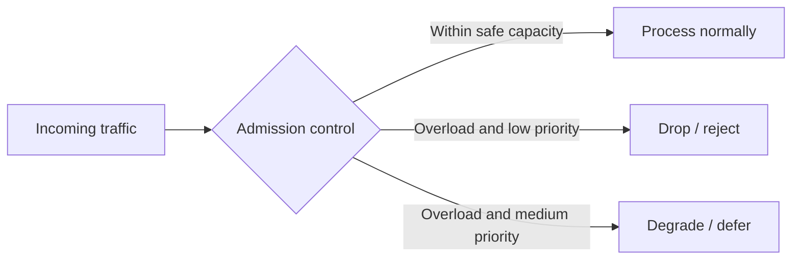

# Load Shedding

## 1. Overview

Load shedding is the deliberate rejection, dropping, or degradation of some work so that the rest of the system can continue operating safely under overload.

This is one of the clearest signs of mature engineering because it accepts an uncomfortable reality:

when the system cannot serve everything, it must choose what not to serve before failure makes that choice chaotically.

Without load shedding, overload often looks like:

- growing queues
- exploding latency
- thread-pool exhaustion
- timeout storms
- retries that worsen pressure

Eventually everyone suffers.

Load shedding attempts something more disciplined:

- protect the most important traffic
- reject lower-value work first
- preserve core system behavior

This is why load shedding is not an admission of defeat.

It is an overload-control strategy.

When designed well, load shedding keeps the core path alive under stress.

When designed poorly, it becomes arbitrary refusal or brittle thresholding that hides deeper capacity problems.

So the subject is not merely "drop requests."

It is:

How does the system fail selectively enough that the most important behavior survives when capacity is insufficient for everything?

## 2. The Core Problem

Every system has finite capacity.

During spikes or degraded conditions, incoming work may exceed that capacity.

If the system continues accepting all work anyway, several bad effects stack:

- queues deepen
- latency increases everywhere
- clients retry
- resource pools saturate
- even high-priority work begins failing

At that point, the system is being "fair" in the worst possible way:

everyone gets a degraded experience.

The real load-shedding problem is:

How can the system intentionally reject or degrade the right work early enough that the important work still has a path through?

That is fundamentally a prioritization and admission-control problem, not only a capacity problem.

## 3. Visual Model

What to notice:

- load shedding happens at admission time, not only after the system is already drowning
- different traffic classes can receive different treatment
- overload control is often really about preserving value, not maximizing request count

## 4. Formal Statement

Load shedding is an overload-management strategy in which a system intentionally rejects, drops, defers, or degrades some incoming work when capacity is insufficient to safely serve all work.

A serious load-shedding design has to define:

- what signals indicate overload
- which traffic classes are higher or lower priority
- what gets rejected first
- what user or caller response is returned
- how degraded behavior is triggered

The design point is that load shedding protects system stability and business-critical behavior by choosing controlled selective failure over uncontrolled universal failure.

## 5. Key Terms

### 5.1 Overload

The state where incoming demand exceeds safe processing capacity.

### 5.2 Admission Control

The decision point where the system determines whether new work should be accepted at all.

### 5.3 Priority Class

A categorization of work by importance.

Examples:

- checkout
- product browse
- admin report
- background sync

### 5.4 Graceful Degradation

Reducing optional functionality so the core path can survive.

### 5.5 Hard Rejection

The system explicitly refuses work instead of queueing it.

### 5.6 Deferred Work

Some work is not rejected forever, but pushed later or into a lower-priority path.

## 6. Why the Constraint Exists

The constraint exists because overloaded systems get worse nonlinearly.

At low load, extra demand may be tolerable.

At high load, one more burst can push the system into:

- queue explosion
- timeouts everywhere
- cascading dependency failure

This is why "accept everything and try our best" is usually the wrong overload policy.

Suppose an e-commerce site is under extreme traffic.

If it accepts:

- checkout
- browse
- recommendations
- expensive search filters
- low-value admin dashboards

with equal eagerness, the most valuable path may collapse alongside everything else.

Load shedding exists because under overload, the system must decide which work deserves scarce capacity first.

## 7. Main Variants or Modes

### 7.1 Queue-Length-Based Shedding

The system begins rejecting new work once queue depth exceeds a threshold.

Strengths:

- simple operational signal

Costs:

- may react late, after backlog is already harmful

### 7.2 Concurrency-Based Shedding

The system rejects new work when in-flight work exceeds a safe limit.

Strengths:

- often reacts earlier than queue-based methods
- aligns well with protecting finite worker pools

Costs:

- requires realistic capacity tuning

### 7.3 Priority-Based Shedding

Lower-value traffic is dropped before higher-value traffic.

Strengths:

- preserves business-critical behavior

Costs:

- requires explicit classification
- easy to get wrong if priorities are vague

### 7.4 Feature Degradation

Instead of rejecting the whole request, the system disables optional work.

Examples:

- skip recommendations
- disable deep search filters
- return simplified page composition

Strengths:

- better user experience than hard failure

Costs:

- requires product-aware fallback design

### 7.5 Tenant or Plan-Aware Shedding

Some systems differentiate by:

- paid tier
- internal vs external traffic
- batch vs interactive flows

Strengths:

- can align overload behavior with business priorities

Costs:

- fairness and transparency questions

## 8. Supporting Mechanisms and Related Ideas

### 8.1 Backpressure

Backpressure slows or shapes incoming work.

Load shedding rejects or degrades work when shaping alone is insufficient.

### 8.2 Circuit Breakers

Circuit breakers protect against failing dependencies.

Load shedding protects the local system from too much work overall.

### 8.3 Rate Limiting

Rate limits are often policy-based and may be constant.

Load shedding is often dynamic and overload-driven.

### 8.4 Autoscaling

Autoscaling can add capacity, but load shedding is still needed because:

- scaling reacts after the fact
- some bottlenecks do not scale instantly
- overload may be too sudden

### 8.5 Observability

Useful signals include:

- rejection rate
- degraded-path activation
- queue age
- critical-path latency
- per-priority traffic drop behavior

Without these, teams may not know whether shedding is protecting the right work.

## 9. Real-World Examples

### Checkout Over Browse

During peak traffic, an e-commerce platform may choose to protect:

- checkout
- payment confirmation
- order history

while degrading:

- recommendations
- expensive browse filters
- non-essential widgets

This is a classic case where selective failure preserves business value.

### Search Under Surge

A search system may temporarily disable:

- deep pagination
- expensive sorts
- low-value facets

instead of letting the entire search path collapse.

### Internal Control Plane Protection

An operational platform may prioritize:

- user-facing request paths

over:

- reporting
- background reconciliation
- non-urgent admin actions

when shared resources are saturated.

### Multi-Tenant Overload Management

Some platforms shed:

- low-priority batch tenants
- free-tier traffic

before impacting premium interactive traffic.

This is a product and platform choice at the same time.

## 10. Common Misconceptions

### "Dropping Requests Means the System Is Broken"

Not necessarily.

Sometimes rejection is the healthiest thing the system can do.

### "Load Shedding Should Be Invisible to Users"

Not always.

Under serious overload, some impact is unavoidable.

The goal is controlled selective impact, not fantasy.

### "All Requests Should Be Treated Equally"

Not under overload.

Critical and optional traffic should rarely be treated identically when capacity is scarce.

### "Autoscaling Removes the Need for Load Shedding"

Wrong.

Scaling is not instantaneous and does not solve every bottleneck.

### "Load Shedding Is Just Rate Limiting"

Wrong.

Rate limiting is usually static or policy-oriented.

Load shedding is usually dynamic and overload-oriented.

## 11. Design Guidance

The best design question is:

If the system can serve only a fraction of incoming work safely, which work should survive first?

### Prefer

- explicit priority classes
- early overload detection
- graceful degradation where product semantics permit
- observable rejection and degradation behavior

### Be Careful About

- waiting until queues are already huge
- treating all traffic equally by default
- shedding without clear caller semantics
- protecting low-value features at the expense of core transactions

### Questions Worth Asking

- what traffic is most valuable
- what can be degraded rather than rejected
- what signal means "unsafe to admit more"
- what should the client or user see when rejected

### Practical Heuristic

If overload would otherwise degrade all traffic equally, load shedding should be designed to protect the paths that matter most to the business and the user.

## 12. Reusable Takeaways

- Load shedding is controlled selective failure under overload.
- Its purpose is to preserve core behavior when the system cannot safely serve everything.
- Admission control and priority classification are central to good shedding design.
- Graceful degradation is often better than universal collapse.
- Systems that never plan what to drop eventually let overload choose for them.

## 13. Summary

Load shedding is how a system protects itself under overload by intentionally rejecting or degrading some work so the most important work survives.

The benefit is system stability and preservation of core behavior.

The tradeoff is that the system must decide:

- what is most valuable
- what can wait
- what can be dropped

That is a hard decision, but it is far better to make it deliberately than to let overload make it randomly.
