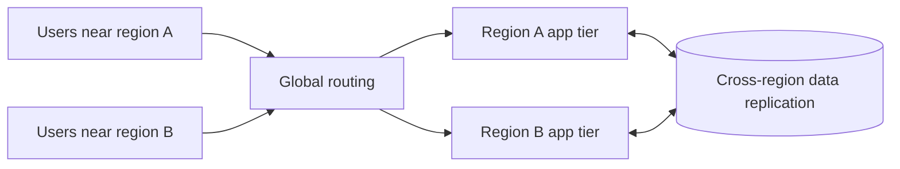

# Multi-Region Design

## 1. Overview

Multi-region design is the practice of deploying application components, data, or both across more than one geographic region so the system can better serve globally distributed users, satisfy resilience goals, or meet geographic policy constraints.

This topic attracts a lot of architectural ambition because the upside sounds compelling:

- lower latency for more users
- better regional resilience
- disaster survivability
- geographic expansion
- compliance support

All of that is real.

The problem is that multi-region design is often discussed as if it were only an availability upgrade.

It is not.

It is a system-wide change to:

- traffic routing
- write paths
- replication
- failure handling
- data ownership
- operational complexity

A single-region architecture can often pretend that coordination is local and cheap.

A multi-region architecture cannot.

Cross-region distance introduces latency, weaker failure assumptions, and more expensive correctness.

That is why multi-region design is one of the clearest examples of a topic where business goals and distributed systems realities collide directly.

## 2. The Core Problem

Regions are separated by real geographic distance and independent failure domains.

That creates two competing pressures.

The first pressure is user proximity.

Users far from the serving region experience:

- higher round-trip latency
- slower page loads
- slower API calls
- worse interactive experience

The second pressure is distributed coordination.

When data or control must span regions, the system pays:

- higher replication latency
- more difficult failover
- more expensive consensus or coordination
- more chance of regional divergence or stale reads

So the core multi-region question is not:

Should we have more than one region?

The real question is:

Which parts of the system need to be near users, and which parts of the system need centralized coordination badly enough that cross-region cost is acceptable?

That question forces the architecture to become explicit about traffic and data ownership.

## 3. Visual Model

What to notice:

- global routing and global data are different problems
- user locality can be improved without making every write globally local
- replication topology becomes a first-class architectural choice

## 4. Formal Statement

Multi-region design is an architectural model in which service execution, data placement, or both are distributed across geographically distinct regions with explicit policies for routing, replication, failover, and consistency.

A serious multi-region design must define:

- which regions serve live traffic
- which region owns writes for each dataset
- how reads are routed
- how data is replicated
- which consistency guarantees are preserved across regions
- what happens during regional degradation or total regional loss

The most important word in that definition is "explicit."

If region ownership, traffic steering, or data consistency are left implicit, the system usually ends up with hidden assumptions that break during failure.

## 5. Key Terms

### 5.1 Active-Passive Region Topology

One region is the main serving or write-owning region while another remains ready for failover or partial read service.

### 5.2 Active-Active Region Topology

More than one region serves live traffic at the same time.

This may apply to reads only, or to both reads and writes.

### 5.3 Data Residency

A requirement that certain data remain within specific geographic boundaries.

This is often a business or legal driver for multi-region architecture.

### 5.4 Cross-Region Replication Lag

The delay between a write being committed in one region and becoming visible or durable in another region.

### 5.5 Regional Failover

The process of moving traffic or ownership from one region to another after regional degradation or outage.

### 5.6 Locality

How close computation or data is to the users or systems that need it.

### 5.7 Multi-Home vs Global Single Source

Some systems partition ownership so each region owns certain users or data.

Others keep one primary global write source and replicate outward.

These are fundamentally different models.

## 6. Why the Constraint Exists

The underlying constraint is physics combined with independent failure domains.

A write acknowledged across regions will usually be slower than a write acknowledged within one region.

A decision requiring majority agreement across continents will be slower and more failure-sensitive than a decision inside one datacenter cluster.

That is unavoidable.

Now layer in product expectations.

A global application may want:

- low read latency everywhere
- low write latency everywhere
- no data loss
- automatic regional failover
- strong consistency
- simple operations

No architecture gives all of that cheaply.

This is why multi-region design is often misunderstood. Teams sometimes decide to "go multi-region" without deciding which of those goals matter most.

The constraint exists because:

- users want locality
- the business wants resilience
- the system still has to coordinate shared truth

The more shared truth the system requires globally, the more expensive multi-region becomes.

## 7. Main Variants or Modes

### 7.1 Active-Passive Regional Architecture

One region is primary for writes and most reads. Another region is warm or hot standby.

Strengths:

- simpler correctness model
- easier operational reasoning
- cleaner failover ownership

Costs:

- one region carries most active responsibility
- some users still pay distance to the primary
- standby capacity may be underused

This is often the best first multi-region design because it captures resilience benefits without forcing global write coordination everywhere.

### 7.2 Active-Active Reads with Centralized Writes

Multiple regions serve read traffic, but writes still go to one designated region or one region per dataset.

Strengths:

- lower read latency globally
- simpler write conflict model than full multi-master

Costs:

- write latency is still centralized
- read-after-write semantics may vary by region
- application behavior must account for replication lag

This model is common because many products are read-heavy.

### 7.3 Partitioned Regional Ownership

Different users, tenants, or datasets are owned by different regions.

For example:

- European tenants write primarily in Europe
- U.S. tenants write primarily in the U.S.

Strengths:

- better locality for owned data
- easier compliance boundaries
- avoids some globally shared write coordination

Costs:

- cross-region access patterns become more complex
- user movement or global reporting may still require aggregation
- operational tooling must understand regional ownership

### 7.4 Full Multi-Write or Multi-Master

Multiple regions accept writes for the same logical data domain.

Strengths:

- lower local write latency in multiple geographies
- no single central write region

Costs:

- conflict resolution
- ordering ambiguity
- difficult correctness semantics
- more expensive coordination if strong consistency is desired

This model is often proposed early and regretted later unless the data model is specifically designed to tolerate it.

### 7.5 Control Plane vs Data Plane Separation

Some systems keep:

- a globally coordinated control plane
- region-local data plane execution

This is common when the system needs globally consistent configuration but region-local request handling.

It is a useful design because not every part of the system needs the same regional topology.

## 8. Supporting Mechanisms and Related Ideas

### 8.1 Global Traffic Management

The system needs a way to decide which region should serve which client.

This may depend on:

- latency
- health
- geography
- tenant
- legal constraints

Traffic management can happen through:

- DNS
- anycast
- global load balancing
- application-aware routing

### 8.2 Replication Strategy

Replication is where many multi-region ambitions become concrete.

Questions include:

- synchronous or asynchronous replication
- full copy or partial copy
- per-dataset or per-tenant replication
- write-through to multiple regions or delayed propagation

### 8.3 Consistency Model

The system must decide whether cross-region views need to be:

- strongly consistent
- causally consistent
- eventually consistent
- locally consistent with delayed global convergence

This is usually driven by business semantics, not technical elegance.

### 8.4 Failover Strategy

Regional failover is part of multi-region design, not a separate afterthought.

The architecture must define:

- when a region is considered degraded enough to stop taking traffic
- what region takes over
- what happens to writes in flight
- whether stale reads are acceptable during transition

### 8.5 Data Residency and Compliance Boundaries

For some systems, multi-region is not optional performance optimization. It is a legal or contractual requirement.

That changes the design from "replicate for convenience" to "partition and govern intentionally."

## 9. Real-World Examples

### Global Consumer Applications

Consumer products with worldwide users often place stateless app tiers in several regions and use CDN or regional edge routing for low-latency reads.

This is a strong fit when:

- user traffic is geographically broad
- much of the experience is read-heavy
- central write ownership is still acceptable

### Multi-Tenant SaaS with Regional Ownership

A SaaS platform may keep each tenant's primary data in a designated home region.

That supports:

- locality
- compliance
- operational isolation

while avoiding the complexity of full active-active writes for the same tenant data.

### Financial or Operational Control Planes

These systems often choose active-passive regional designs rather than full global writes.

Why?

Because:

- correctness matters more than local write latency everywhere
- split-brain risk is expensive
- controlled failover is preferable to constant global coordination

### Media and Content Platforms

These may use highly distributed read serving with limited central write coordination because most content access is read-heavy and replication delay is acceptable for many workflows.

This is a good reminder that not every multi-region system needs the same data semantics across all features.

## 10. Common Misconceptions

### "Multi-Region Automatically Means Higher Availability"

Wrong.

If:

- failover is poor
- routing is inconsistent
- data ownership is unclear
- replication lags too far

then more regions can create more failure modes instead of better resilience.

### "Just Replicate Everything Everywhere"

This is rarely a serious design.

It ignores:

- cost
- latency
- conflict resolution
- compliance constraints
- operational control

### "Active-Active Is the Mature Architecture"

Not necessarily.

It is often the most complex architecture, not the most mature one.

For many systems, active-passive or read-local/write-central designs are better engineering choices.

### "If Reads Are Local, Writes Can Be Treated the Same Way"

Wrong.

Read distribution is usually much easier than write distribution.

The moment multiple regions need authoritative writes on the same data, the system enters a much harder design space.

### "Multi-Region Is a Purely Infrastructure Decision"

Wrong.

It affects:

- product behavior
- consistency promises
- incident response
- data model design
- operational staffing

## 11. Design Guidance

The right way to design multi-region systems is to start from business drivers, then map those into data and traffic decisions.

### Start with the Why

Choose the driver explicitly:

- lower global read latency
- regional resilience
- compliance
- customer-location requirements
- disaster recovery

If the driver is vague, the architecture usually becomes overbuilt.

### Then Define Data Ownership

Ask:

- which datasets must be globally shared
- which datasets can be region-owned
- which writes must be local
- which reads can tolerate lag

This step is often more important than choosing the routing technology.

### Prefer Simpler Regional Models First

Bias toward:

- active-passive
- read-local/write-central
- region-owned tenants

before attempting full active-active writes across shared mutable data.

### Questions Worth Asking

- what is the cross-region latency budget
- which operations require strong consistency
- what is the regional failover plan
- how will stale data appear in user flows
- what capacity exists if one region takes over another's load
- how are operational tools scoped by region

### Practical Design Heuristic

Push reads outward first. Push writes outward only when there is a strong business case and the conflict model is explicitly designed.

### Another Useful Heuristic

If the team cannot explain data ownership and failover behavior in one page, the multi-region design is probably still too implicit.

## 12. Reusable Takeaways

- Multi-region design is not just an availability feature; it changes routing, data ownership, and consistency.
- Cross-region latency is a hard constraint, not a tuning issue.
- Read distribution is much easier than write distribution.
- Active-passive and region-owned designs are often better first choices than full active-active writes.
- The business driver for multi-region should be explicit before the topology is chosen.
- Replication, failover, and traffic management must be designed together.
- Compliance and locality often matter as much as pure resilience.

## 13. Summary

Multi-region design spreads a system across geographic regions to improve locality, resilience, or compliance posture.

The benefit is that the system can serve more users well and survive broader failures.

The tradeoff is that distributed coordination becomes more expensive and more visible:

- writes get harder
- failover gets more consequential
- data ownership must be explicit

The best multi-region architectures are not the most globally distributed ones. They are the ones that make clear, disciplined choices about which parts of the system need to be global and which should remain regional.
