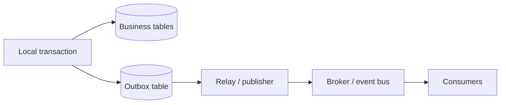

# Outbox Pattern

## 1. Overview

The outbox pattern is a reliability pattern used to keep database state changes and event publication aligned when both must happen as part of one logical business action.

Its goal is simple and extremely important:

Do not let the system commit the business data and lose the event, or publish the event for business data that never actually committed.

This sounds narrow. It is not.

The outbox pattern addresses one of the most common correctness failures in event-driven systems: the dual-write problem.

A service often needs to do two things:

- update its source-of-truth database
- publish an event or message to another system

Those two destinations usually do not share one atomic commit.

That means the service is one crash, timeout, or network error away from ending up in one of two broken states:

- database committed, event missing
- event published, database change missing

The outbox pattern exists because systems often need both the local state and the downstream event to be reliably aligned, and naive code is not enough to guarantee that.

When designed well, the outbox pattern makes event publication much safer and turns a subtle correctness bug into a more explicit operational pipeline.

When designed poorly, it creates:

- outbox table growth
- lagging relays
- duplicate publication
- ordering confusion

So this is not just about "put the event in a table."

It is about shifting event publication into a disciplined producer-side delivery model.

## 2. The Core Problem

Suppose an order service handles order creation.

It needs to:

- write the order row
- publish `order_created`

The intuitive implementation often looks like:

1. insert order into database
2. publish event to broker

That implementation has a fatal gap.

What if the database write succeeds and the process crashes before the publish completes?

Then:

- the order exists
- downstream consumers never hear about it

Now imagine the reverse order:

1. publish event
2. write order row

If the publish succeeds and the database write fails, downstream consumers react to an order that never actually committed.

This is the dual-write problem:

one logical action requires changes in two independent systems without one shared atomic transaction.

The real problem outbox solves is:

How can a producer make local state and outbound publication converge reliably enough that downstream consumers are not missing or fabricating business events?

## 3. Visual Model

What to notice:

- the business row and outbox row are committed together in one local transaction
- publication happens later from durable state instead of directly from volatile application memory
- the relay becomes part of the producer-side delivery system

## 4. Formal Statement

The outbox pattern is a reliability pattern in which a service writes both its business state change and a corresponding outbound event record to the same local transactional store, then asynchronously relays the outbox record to external messaging infrastructure.

A serious outbox design has to define:

- outbox schema
- event identity and ordering keys
- relay mechanism
- retry behavior
- publication marking semantics
- cleanup and retention
- replay and reprocessing behavior

The key design point is that the producer does not try to atomically commit its database and the broker together.

Instead, it makes the event durable locally first and treats external publication as a reliable follow-up process.

## 5. Key Terms

### 5.1 Dual Write

A dual write is one logical action that writes to two independent systems separately.

Examples:

- database plus broker
- database plus webhook
- database plus search index

### 5.2 Outbox Record

A durable record representing an outbound event that must be published.

Typical fields may include:

- event ID
- aggregate or entity ID
- event type
- payload
- creation timestamp
- publication state

### 5.3 Relay

The relay is the component that reads pending outbox records and publishes them externally.

This can be:

- polling worker
- CDC-based forwarder
- log-based replicator

### 5.4 Publication State

The tracking state that indicates whether an outbox record is:

- pending
- in progress
- published
- failed

depending on implementation.

### 5.5 Producer-Side At-Least-Once Delivery

The outbox pattern usually guarantees that the producer will keep trying to publish a committed event until successful or terminally failed.

This generally implies duplicates are possible.

### 5.6 Ordering Key

If ordering matters, the system often needs a per-aggregate key such as:

- order ID
- account ID
- subscription ID

so events for one entity can be published in a predictable sequence.

### 5.7 Cleanup or Retention

Outbox rows cannot usually live forever in the hot path without operational cost.

Retention strategy matters.

## 6. Why the Constraint Exists

The constraint exists because modern service architectures usually separate:

- the database
- the broker

and those systems do not participate in one local commit.

Even if some heavyweight distributed transaction mechanism exists, teams often avoid it because it introduces:

- higher latency
- tighter coupling
- operational fragility
- participant compatibility requirements

So the business still needs the database state and the downstream event to align, but the infrastructure cannot make that alignment atomic across both systems cheaply.

That means a service cannot safely rely on:

- "publish right after commit"
- "publish then write"
- "just retry if publish fails"

Those approaches all break under some crash or ambiguity scenario.

The outbox pattern exists because the producer needs one place where both truths can become durable together:

- the local state changed
- an outbound event must be delivered

Once both are committed locally, the system can survive process crashes and continue trying publication later.

## 7. Main Variants or Modes

### 7.1 Polling Relay

A worker periodically scans the outbox table for unpublished rows and sends them to the broker.

Strengths:

- simple conceptual model
- straightforward to implement
- works with ordinary relational stores

Costs:

- polling overhead
- publication latency depends on poll interval
- contention if scanning is inefficient

This is often the first practical implementation.

### 7.2 Log-Based or CDC Relay

Instead of polling the table directly, the system reads the database change log and forwards outbox inserts.

Strengths:

- lower query overhead on the main database
- often lower latency and better streaming behavior

Costs:

- more infrastructure
- more moving pieces
- CDC correctness and replay complexity

This is common in more mature event platforms.

### 7.3 Inline State Marking

The relay publishes and then marks rows as sent or advances a state field.

Strengths:

- explicit delivery bookkeeping
- easier operator visibility

Costs:

- state transitions can create write pressure on the outbox
- must still handle relay crash between publish and mark

### 7.4 Per-Aggregate Ordered Outbox

Some systems require events for the same entity to leave in a stable order.

Strengths:

- cleaner downstream reasoning for entity timelines

Costs:

- concurrency restrictions
- harder sharding and relay parallelism

### 7.5 Transactional Outbox to Webhooks or Other Sinks

The outbox concept is not limited to broker publication.

It can also drive:

- webhook delivery
- search indexing
- audit export

The common feature is producer-side dual-write risk.

## 8. Supporting Mechanisms and Related Ideas

### 8.1 Idempotent Consumers

Because relay publication is usually at-least-once, downstream consumers must tolerate duplicate events safely.

The outbox pattern reduces missing events. It does not eliminate duplicates.

### 8.2 Event Schema Evolution

Outbox records often persist serialized event payloads. That means payload shape and semantics must evolve carefully.

### 8.3 Relay Observability

A mature outbox system tracks:

- pending row count
- oldest unpublished event age
- publication error rate
- per-topic relay throughput
- stuck or poison records

Without this, outbox lag can silently delay business behavior downstream.

### 8.4 Cleanup and Retention

Outbox tables grow continuously.

The system needs a policy for:

- deleting published rows
- archiving history
- retaining failure records for debugging

### 8.5 Sagas and Workflow Progression

Sagas often depend on reliable event publication after local state changes.

Outbox is frequently the producer-side reliability mechanism that makes that possible.

### 8.6 Broker Ordering and Partitioning

If the outbox publishes to partitioned topics, event key choice affects downstream ordering and consistency expectations.

## 9. Real-World Examples

### Order Service Publishing `order_created`

The order service commits:

- the order row
- an outbox row describing `order_created`

in one transaction.

Later, the relay publishes the event so fulfillment, analytics, and notification consumers see it.

This is a strong fit because losing the event would create missing downstream business behavior.

### Billing State Changes

A billing system may need to emit:

- invoice issued
- payment succeeded
- subscription renewed

These are high-value events where downstream systems such as entitlements, notifications, and reporting need reliable publication aligned with committed billing state.

### Internal Audit Export

Some systems use an outbox to ensure that important changes are exported into an audit or compliance stream reliably instead of relying on best-effort application logging.

### Webhook Delivery Pipelines

A service may commit a business action and an outbox row indicating that a webhook should be delivered.

The webhook sender then operates as a relay layer with retries and delivery tracking.

This is the same pattern applied to a different sink.

## 10. Common Misconceptions

### "The Outbox Gives Exactly-Once Delivery"

Wrong.

It usually gives:

- reliable producer-side persistence
- at-least-once publication

Consumers still need idempotency.

### "The Outbox Replaces Consumer Correctness"

Wrong.

The outbox helps the producer avoid lost events due to dual writes.

It does not solve:

- consumer duplicates
- poison records
- consumer lag

### "This Is Only for Kafka or Streaming Systems"

Wrong.

Any sink with dual-write risk can benefit:

- brokers
- webhooks
- search indexes
- audit pipelines

### "Just Publish in the Same Transaction"

Usually this is not truly possible across the database and the external system without much heavier infrastructure and tradeoffs.

### "Once Published, the Outbox Row Can Be Forgotten"

Not entirely.

Retention, replay, debugging, and cleanup strategy still matter.

## 11. Design Guidance

Use the outbox pattern when local state changes must reliably drive external publication and losing that publication is unacceptable.

### Strong Fits

- business events after database commit
- workflows depending on downstream consumers
- producer-side event durability requirements
- webhook or integration delivery backed by committed local truth

### Weak Fits

- ephemeral low-value notifications
- systems where missing one event is acceptable
- cases where the sink can be updated transactionally within the same local store anyway

### Prefer

- clear event IDs
- explicit publication state
- strong observability on lag and failures
- per-aggregate ordering strategy where needed
- cleanup and replay strategy from day one

### Questions Worth Asking

- what identifies duplicates downstream
- how old can the oldest unpublished row become before it is an incident
- how is publication retried
- how are poison rows isolated
- does ordering matter per entity

### Practical Heuristic

If a business action updates a database and must also inform the rest of the system, do not trust process memory and immediate follow-up code alone. Make the outbound event durable locally first.

## 12. Reusable Takeaways

- The outbox pattern is a producer-side fix for dual-write inconsistency.
- The database transaction makes both the local change and the pending publication durable together.
- Publication usually remains at-least-once, so consumer idempotency is still required.
- The relay is part of the architecture, not glue code to ignore.
- Lag, cleanup, ordering, and replay strategy are all part of a production-grade outbox design.
- Outbox is useful anywhere local truth must drive reliable external publication.

## 13. Summary

The outbox pattern keeps local business state and outbound publication aligned by making both durable in one local transaction before external delivery occurs.

The gain is much safer event production and fewer missing downstream effects.

The tradeoff is that the system now owns an explicit publication pipeline with:

- relay logic
- duplicate handling
- lag monitoring
- cleanup

That is a worthwhile trade in many event-driven systems because subtle dual-write bugs are much harder to live with than an explicit relay layer.
